# GitHub Actions Workflows

This directory contains the CI/CD workflows for the Octocode-MCP monorepo. Each workflow automates a specific part of the development and release process.

## 📋 Overview

| Workflow | Trigger | Purpose | Duration |
|----------|---------|---------|----------|
| [PR Validation](#pr-validation-pr-validationyml) | Pull Requests | Quality checks before merge | ~3-5 min |
| [Alpha Publishing](#alpha-publishing-publish-alphayml) | Push to `main`/`master` | Auto-publish alpha versions | ~5-8 min |
| [Production Publishing](#production-publishing-publish-mcpyml) | Version tags (e.g., `v7.0.8`) | Official releases to npm & MCP Registry | ~4-6 min |

## Workflows

### PR Validation (`pr-validation.yml`)

**Trigger:** When a Pull Request is opened, synchronized, or reopened against `main` or `master` branches.

**Purpose:** Ensures code quality and prevents broken code from being merged into the main branches.

**What it does:**
1. ✅ **Lint Check** - Runs ESLint to enforce code style and quality standards
2. ✅ **Build Validation** - Compiles all packages to catch TypeScript errors
3. ✅ **Test Suite** - Runs the complete test suite with coverage
4. ✅ **Package Integrity** - Validates all `package.json` files in the monorepo
5. 📊 **Summary Report** - Posts a validation summary to the PR

**Concurrency:** Cancels in-progress runs for the same PR when new commits are pushed (saves CI resources).

**Requirements to merge:**
- All linting rules must pass
- All packages must build successfully
- All tests must pass
- All package.json files must be valid JSON with name and version

**Example Output:**
```
✅ All validation checks passed!
🚀 This PR is ready for review and merge.
```

---

### Alpha Publishing (`publish-alpha.yml`)

**Trigger:** Every push to `main` or `master` branches (typically after a PR is merged).

**Purpose:** Automatically publishes alpha/development versions of all packages to npm for testing and early adoption.

**What it does:**

#### Phase 1: Verification
- Runs full quality checks (lint, build, test)

#### Phase 2: Package Discovery
- Scans the `packages/` directory for all publishable packages
- Filters out private packages (packages with `"private": true`)
- Outputs a list of packages to publish

#### Phase 3: Multi-Package Publishing
For each package found:
1. 🔍 **Find Latest Alpha** - Checks npm for existing alpha versions (e.g., `7.0.7-alpha.1`, `7.0.7-alpha.2`, etc.)
2. 🔢 **Increment Alpha Number** - Calculates the next alpha version number
3. 🏷️ **Update Version** - Temporarily updates `package.json` to the new alpha version
4. 🚀 **Publish to npm** - Publishes with the `alpha` tag (NOT `latest`)
5. ⏮️ **Revert Version** - Restores original version in `package.json`
6. ✅ **Confirm** - Verifies successful publication

#### Phase 4: Discord Notification (Optional)
- Sends a notification to Discord webhook if configured
- Includes commit info, package count, and status
- Gracefully skips if webhook is not configured

**Important Notes:**
- ⚠️ Alpha versions are **NOT** published to the `latest` npm tag
- ⚠️ Users must explicitly install alpha versions: `npm install octocode-mcp@alpha`
- ⚠️ Alpha versions are auto-incremented (e.g., `7.0.7-alpha.1`, `7.0.7-alpha.2`)
- ⚠️ The workflow **fails** if the version in `package.json` already contains `-alpha` suffix

**Version Pattern:**
```
Base version in package.json: 7.0.7
Published alpha versions:
  - 7.0.7-alpha.1
  - 7.0.7-alpha.2
  - 7.0.7-alpha.3
  ... (auto-incremented on each push)
```

**Required Secrets:**
- `NPM_TOKEN` - npm authentication token with publish permissions
- `DISCORD_WEBHOOK` (optional) - Discord webhook URL for notifications

**Example Output:**
```
🚀 Processing package: octocode-mcp@7.0.7
📊 Latest alpha number: 2
🆕 New alpha number: 3
🏷️ New alpha version: 7.0.7-alpha.3
✅ Successfully published octocode-mcp@7.0.7-alpha.3 to npm with 'alpha' tag
```

---

### Production Publishing (`publish-mcp.yml`)

**Trigger:** When a version tag is pushed (e.g., `git tag v7.0.8 && git push --tags`).

**Purpose:** Official production releases to both npm and the MCP (Model Context Protocol) Registry.

**What it does:**

1. ✅ **Quality Checks** - Full validation suite (lint, build, test)
2. 📝 **Sync Versions** - Updates `server.json` to match the git tag version
3. 📦 **Publish to npm** - Publishes the main package with the `latest` tag
4. 🔧 **Download MCP Publisher** - Fetches the latest MCP Registry publisher tool
5. 🚀 **Publish to MCP Registry** - Registers the package in the MCP Registry using GitHub OIDC authentication

**Version Syncing:**
```bash
# If you push tag v7.0.8
server.json version: "7.0.8"
server.json packages[0].version: "7.0.8"
npm publish: octocode-mcp@7.0.8 (tag: latest)
```

**Publishing Targets:**
- **npm Registry:** `https://registry.npmjs.org/octocode-mcp`
- **MCP Registry:** Discoverable in MCP-compatible AI assistants

**Authentication:**
- **npm:** Uses `NPM_TOKEN` secret
- **MCP Registry:** Uses GitHub OIDC (no manual token needed)

**Required Secrets:**
- `NPM_TOKEN` - npm authentication token with publish permissions

**Required Permissions:**
- `id-token: write` - For GitHub OIDC authentication with MCP Registry
- `contents: read` - To read repository contents

**How to Release:**
```bash
# 1. Update version in package.json
cd packages/octocode-mcp
yarn version 7.0.8

# 2. Commit the version change
git add .
git commit -m "chore(release): bump to v7.0.8"

# 3. Create and push the tag
git tag v7.0.8
git push origin main --tags

# 4. GitHub Actions will automatically:
#    - Run all tests
#    - Publish to npm with 'latest' tag
#    - Publish to MCP Registry
```

**Example Output:**
```
📝 Syncing server.json version to 7.0.8
🚀 Publishing octocode-mcp to npm...
✅ Successfully published to npm
🚀 Publishing to MCP Registry...
✅ Successfully published to MCP Registry
```

---

## Workflow Dependencies

```mermaid
graph TD
    A[Developer] -->|Opens PR| B[pr-validation.yml]
    B -->|✅ Passes| C[Merge to main]
    C -->|Auto-trigger| D[publish-alpha.yml]
    D -->|Publishes| E[npm: octocode-mcp@alpha]
    
    A -->|Creates tag| F[publish-mcp.yml]
    F -->|Publishes| G[npm: octocode-mcp@latest]
    F -->|Publishes| H[MCP Registry]
```



## Environment Setup

### Required Secrets

Configure these in **Settings → Secrets and variables → Actions**:

| Secret | Required For | How to Get |
|--------|--------------|------------|
| `NPM_TOKEN` | Alpha & Production publishing | [npm Access Tokens](https://www.npmjs.com/settings/YOUR_USERNAME/tokens) - Create "Automation" token |
| `DISCORD_WEBHOOK` | Discord notifications (optional) | Discord Server Settings → Integrations → Webhooks |

### Required Permissions

The workflows use the following GitHub token permissions:

- `id-token: write` - For OIDC authentication with MCP Registry (production publishing)
- `contents: read` - To read repository contents (all workflows)

## Monitoring & Debugging

### View Workflow Runs
- Navigate to **Actions** tab in GitHub
- Click on a specific workflow run to see detailed logs

### Common Issues

#### Alpha Publishing Fails
```
❌ ERROR: package.json version already contains '-alpha' suffix!
```
**Solution:** Ensure `package.json` version is a clean base version (e.g., `7.0.7`, not `7.0.7-alpha.1`)

#### npm Publishing Unauthorized
```
❌ npm ERR! code E401
❌ npm ERR! Unable to authenticate
```
**Solution:** Verify `NPM_TOKEN` secret is valid and has publish permissions

#### MCP Publishing Fails
```
❌ ERROR: OIDC token exchange failed
```
**Solution:** Ensure `id-token: write` permission is set in the workflow

#### PR Validation Fails
```
❌ Validation checks failed!
```
**Solution:** Check the specific step that failed:
- Lint errors: Run `yarn lint:fix` locally
- Build errors: Run `yarn build` locally
- Test failures: Run `yarn test` locally
- Package integrity: Validate `package.json` syntax

### Testing Workflows Locally

```bash
# Run the same checks that PR validation runs
yarn lint        # Lint check
yarn build       # Build validation
yarn test        # Test suite

# Validate package integrity
node -e "console.log(require('./packages/octocode-mcp/package.json'))"
```

## Best Practices

### When to Use Each Workflow

- **PR Validation** - Automatic, runs on every PR
- **Alpha Publishing** - Automatic, runs after merging to main
- **Production Publishing** - Manual, only when creating a release tag

### Release Workflow

1. 🔧 **Development** - Make changes on feature branch
2. 🔍 **PR Review** - Open PR → `pr-validation.yml` runs
3. ✅ **Merge** - After approval → `publish-alpha.yml` publishes alpha version
4. 🧪 **Testing** - Test alpha version: `npm install octocode-mcp@alpha`
5. 🏷️ **Tag Release** - Create version tag → `publish-mcp.yml` publishes production
6. 🎉 **Done** - Package available on npm and MCP Registry

### Version Numbering

```
Development:  7.0.7-alpha.1, 7.0.7-alpha.2, ...
Production:   7.0.8 (when ready to release)
Next Dev:     7.0.8-alpha.1, 7.0.8-alpha.2, ...
```

---

## 📚 Additional Resources

- [GitHub Actions Documentation](https://docs.github.com/en/actions)
- [npm Publishing Guide](https://docs.npmjs.com/cli/v10/commands/npm-publish)
- [MCP Registry](https://github.com/modelcontextprotocol/registry)
- [Semantic Versioning](https://semver.org/)

---

**Last Updated:** November 2025  
**Maintainer:** Octocode-MCP Team

