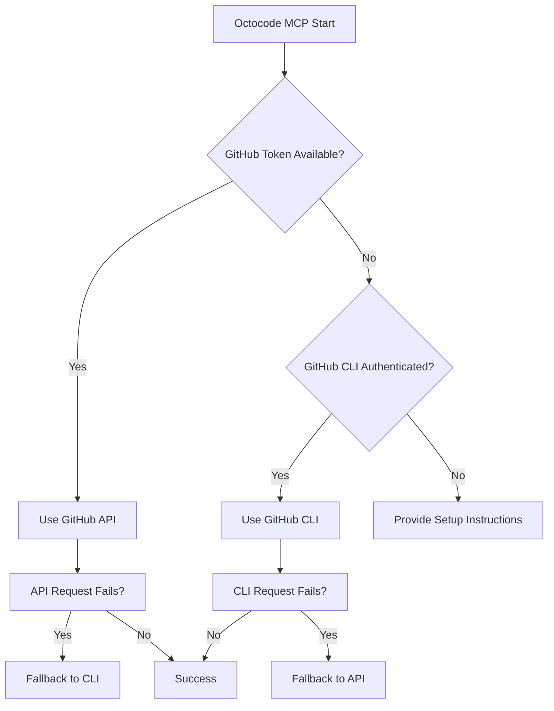

# Octocode MCP

**The Perfect AI Code Assistant - Advanced Search & Discovery Across GitHub**

<div>
  
  
  [](./package.json)
  [](./package.json)
  [](https://modelcontextprotocol.io/)
  [](https://discord.gg/beTNk8at)
    [](https://buymeacoffee.com/bgauryy)

</div>

## 🌐 For More Details - [octocode.ai](https://octocode.ai)
## 📚 For Technical Details - [Technical Summary](./docs/summary.md)
## 🐳 For Docker Setup - [Docker Guide](./docker/README.Docker.md)
## 💬 Discord Channel - [Discord](https://discord.gg/beTNk8at) - Updates and discussions

**The perfect AI code assistant for understanding anything in any codebase.** Transform your AI assistant into an expert code researcher with instant access to millions of repositories and packages across GitHub and npm ecosystems.
 Discover code through natural language descriptions and intelligent context generation. Perfect for AI-assisted development workflows.

**Ask natural questions and let AI guide discovery:**
- *"How did React implement concurrent rendering?"*
- *"Show me authentication patterns in Next.js applications"*
- *"Find examples of how to use this specific API"*
- *"Generate documentation for this architecture pattern"*
- *"Help me implement similar patterns in my current project"*
- *"What security vulnerabilities should I watch for in this approach?"*

## 🌟 Featured On

### modelcontextprotocol/servers - Official Community MCP Server 
[](https://github.com/modelcontextprotocol/servers)

### Community Collections
#### punkpeye/awesome-mcp-servers
[](https://github.com/punkpeye/awesome-mcp-servers)

#### appcypher/awesome-mcp-servers
[](https://github.com/appcypher/awesome-mcp-servers)

#### Puliczek/awesome-mcp-security
[](https://github.com/Puliczek/awesome-mcp-security)

### MCP Directories & Tools
[](https://mcp.so/server/octocode/bgauryy)
[](https://www.pulsemcp.com/servers/bgauryy-octocode)
[](https://devtool.io/tool/octocode-mcp)

## 🎯 Who Is This For?

### For Developers
Navigate complex multi-repo architectures, understand organizational issues at scale, and generate custom documentation on-demand from real code examples. Create contextual documentation directly in your IDE, or ask OctoCode to learn from any repository and implement similar patterns in your current project.

### For Product & Engineering Managers
Gain unprecedented visibility into application behavior through semantic code search, track development progress across teams, and understand the real implementation behind product features.

### For Security Researchers
Discover security patterns, vulnerabilities, and compliance issues across both public and private repositories with advanced pattern matching and cross-codebase analysis.

### For Large Organizations
Dramatically increase development velocity by enabling teams to instantly learn from existing codebases, understand cross-team implementations, and replicate proven patterns—transforming institutional knowledge into actionable development acceleration.

## 🧠 For Beginners & Advanced Vibe Coders

### For Beginners
Take code from anywhere and understand it deeply. Learn from production codebases, discover proven patterns, and build confidence by seeing how experienced developers solve problems. Transform learning into doing with real-world examples.

### For Advanced Vibe Coders
Leverage quality context for superior code generation. Use comprehensive understanding from issues, PRs, and documentation to generate production-ready code that follows established patterns and handles real-world scenarios.

## 🚀 Key Benefits

**🔄 Dual GitHub Integration** - Works with both GitHub CLI (`gh`) and API tokens (`GITHUB_TOKEN`) for maximum reliability and flexibility

**🧠 Vibe Coding Ready** - Perfect for AI-assisted development with intelligent context generation and progressive code discovery

**🛡️ Enterprise-Ready Security** - Automatic secret detection, content sanitization, and organizational permission respect

**⚡ AI Token Optimization** - Advanced minification and smart processing reduces AI costs by up to 70% while preserving code context

**🌐 Hosted or Local** - Run locally with GitHub CLI or deploy hosted with GitHub tokens - your choice

**🖥️ Cross-Platform Excellence** - Native Windows PowerShell support with automatic executable detection

**🔓 Universal Access** - Seamlessly works with public, private, and organization repositories

## Quick Start 🚀

### 1️⃣ Local Setup (Developer Machine)

**Prerequisites**
- **Node.js**: v20 or higher
- **NPM (Optional)**: For npm package research support
- **GitHub Authentication**: Token or GitHub CLI

#### Option A: Using GitHub Token (preferred)

**1. Create GitHub Token**
- Go to [GitHub Settings > Developer settings > Personal access tokens](https://github.com/settings/tokens)
- Create a **Fine-grained personal access token** or **Classic token**
- Required scopes: `repo` (for private repos), `public_repo`, `read:org`

**2. Add to Claude Desktop**
```bash
# For Claude Desktop users
claude mcp add octocode npx 'octocode-mcp@latest'
```

**Or Add to MCP Configuration Manually:**

```json
"octocode": {
  "command": "npx",
  "args": ["octocode-mcp"],
  "env": {
    "GITHUB_TOKEN": "ghp_YOUR_TOKEN"
  }
}
```

#### Option B: Using GitHub CLI

**1. Install Prerequisites**

**macOS/Linux:**
```bash
# Install Node.js 20+
brew install node

# Install GitHub CLI
brew install gh
```

**Windows:**
```powershell
# Install using WinGet (recommended)
winget install Microsoft.PowerShell  # PowerShell 7+ for better security
winget install GitHub.cli
winget install OpenJS.NodeJS

# Or using Chocolatey
choco install powershell-core nodejs github-cli
```

**2. Authenticate with GitHub**
```bash
# Login to GitHub (opens browser for OAuth)
gh auth login

# Verify authentication
gh auth status

# Optional: Login to NPM for package research
npm login
```

**3. Update mcp.json (no token needed):**
```json
"octocode": {
  "command": "npx",
  "args": ["octocode-mcp"]
}
```


### 🔄 How Dual Authentication Works

**Automatic Detection:** Octocode intelligently chooses the best authentication method:
- **Token Found** → Uses GitHub API (octokit) for maximum reliability and rate limits
- **No Token + GitHub CLI** → Uses `gh` commands with your authenticated session  
- **Fallback Strategy** → If one method fails, automatically tries the other

**Benefits of Each Method:**

| Feature | GitHub CLI (`gh`) | GitHub Token API |
|---------|-------------------|------------------|
| **Setup Complexity** | Simple OAuth flow | Token management |
| **Rate Limits** | 5,000/hour | 5,000/hour (authenticated) |
| **Private Repos** | ✅ Full access | ✅ Full access |
| **Organization Repos** | ✅ Based on membership | ✅ Based on token scope |
| **Hosted Deployment** | ❌ Requires interactive login | ✅ Perfect for containers |
| **Local Development** | ✅ Seamless experience | ✅ Works great |

**That's it!** Octocode automatically works with your organization's private repositories using either method.

## ✨ What Makes Octocode MCP Unique

### 🔄 **Dual Authentication Reliability**
The only MCP with intelligent fallback between GitHub CLI and API tokens - ensuring maximum uptime and access across any environment.

### 🧠 **AI-Optimized Design**
Built specifically for AI assistants with:
- **Token-efficient responses** (up to 70% reduction in AI costs)
- **Progressive discovery workflows** that guide exploration
- **Intelligent context generation** for better AI understanding
- **Smart hint system** for next-step recommendations

### 🛡️ **Production-Ready Security**
- **Automatic secret detection** and redaction in all content
- **Content sanitization** prevents malicious code exposure  
- **Input validation** across all parameters and commands
- **Enterprise compliance** with organizational permission respect

### 🎯 **Vibe Coding Excellence**
Perfect for modern AI-assisted development:
- **Natural language code discovery** - describe what you need, find implementations
- **Contextual documentation generation** from live codebases
- **Pattern recognition** across different projects and languages
- **Research workflow optimization** from broad discovery to specific implementation

### 🌐 **Universal Compatibility**
- **Cross-platform native support** (Windows, macOS, Linux)
- **Multiple deployment options** (local, hosted, containerized)
- **Organization repository access** with proper permission handling
- **Package ecosystem bridge** connecting NPM/PyPI to GitHub repositories

## 🐳 Docker Support

Run Octocode MCP in a Docker container while maintaining full GitHub authentication. Perfect for consistent environments and deployment.

[**See Docker Setup Guide →**](./docker/README.Docker.md)

## 🛠️ What You Can Do

### 🧠 AI-Powered Vibe Coding & Context Generation
- **Natural Language Code Discovery**: Describe what you're looking for in plain English and let AI find relevant implementations
- **Intelligent Context Generation**: Automatically generate comprehensive documentation and examples from any codebase
- **Progressive Code Exploration**: Start with broad concepts and intelligently narrow down to specific implementations
- **Pattern Recognition**: Discover and understand architectural patterns across different projects and languages

### 🔍 Deep Project Research & Analysis
- **Issue Search & Analysis**: Understand project challenges, feature requests, and bug patterns with AI-assisted insights
- **Commit History Research**: Trace feature implementations and bug fixes across time with automatic diff analysis
- **Pull Request & Code Review Analysis**: Access actual code diffs, comments, and understand development workflows
- **Project Progress Tracking**: Monitor development velocity and team collaboration patterns with intelligent metrics

### 🏗️ Advanced GitHub Research Tools
- **Repository Discovery**: Find repositories by topic, language, activity, and complex criteria with smart ranking
- **Semantic Code Search**: Find patterns and implementations using both technical terms and natural language descriptions  
- **Cross-Repository Flow Understanding**: Connect related changes across multiple repositories with dependency tracking
- **Repository Architecture**: Navigate and understand project structures with intelligent filtering and exploration

### 📦 Package Ecosystem Intelligence
- **NPM Package Discovery**: Analyze Node.js packages with comprehensive metadata, dependency graphs, and repository connections
- **Python Package Integration**: Explore PyPI packages with cross-ecosystem comparison and compatibility analysis
- **Package Evolution Tracking**: Monitor how packages change over time and understand their development patterns
- **Dependency Analysis**: Deep-dive into versions, dependencies, vulnerabilities, and repository connections

### 🔬 Advanced Research & Security Capabilities
- **Code Pattern Discovery**: Identify implementation patterns, best practices, and anti-patterns across codebases
- **Security & Compliance Research**: Search for security vulnerabilities, patterns, and compliance issues with automatic secret detection
- **Team Collaboration Analysis**: Understand code review processes, team dynamics, and contribution patterns
- **Real-time Documentation**: Generate custom documentation from live code for any topic with AI assistance
- **Architectural Analysis**: Understand system design decisions and their evolution over time

## 🏗️ Architecture & Deployment Options

### Local Development (Recommended)
**Perfect for:** Personal projects, local AI assistants, development workflows

- **Authentication:** GitHub CLI OAuth (browser-based, no token management)
- **Rate Limits:** 5,000 requests/hour per authenticated user
- **Access:** Full access to your personal and organization repositories
- **Setup:** Simple `gh auth login` - that's it!

### Hosted/Production Deployment
**Perfect for:** Team environments, Docker containers, CI/CD, hosted AI services

- **Authentication:** GitHub Personal Access Tokens or GitHub App tokens
- **Rate Limits:** 5,000 requests/hour (can be higher with GitHub Apps)
- **Access:** Controlled by token scope and permissions
- **Setup:** Set `GITHUB_TOKEN` environment variable

### Hybrid Reliability
Octocode automatically detects your environment and chooses the optimal approach:



> **📚 For detailed technical architecture, tool specifications, and implementation details, see [Technical Summary](./docs/summary.md)**

## DXT Extension 📦

This project is available as a **Desktop Extension (DXT)** for easy installation in AI applications like Claude Desktop.

### Quick DXT Setup

```bash
# Install dependencies
yarn install

# Build the DXT package
yarn dxt:pack
```

The generated `octocode-mcp.dxt` file can be installed in Claude Desktop by simply clicking on it.

**DXT Scripts:**
- `yarn dxt:validate` - Validate the manifest.json file
- `yarn dxt:pack` - Build and package the extension
- `yarn dxt:release` - Full release pipeline (build → pack → sign → verify)

## Best Practices 💡

### 🧠 Vibe Coding with AI
**Let natural language drive your code discovery:**
- "How does authentication work in this project?"
- "Show me patterns for handling async errors gracefully"
- "Find examples of clean architecture in TypeScript projects"
- "What's the best way to implement real-time features?"
- "Generate documentation for this API endpoint pattern"

### 🔍 Progressive Discovery Strategy
**Start broad, then narrow down intelligently:**
1. **Repository Discovery** → Find relevant projects by topic/language
2. **Code Pattern Search** → Identify specific implementation approaches  
3. **Deep Analysis** → Examine commits, PRs, and issues for context
4. **Context Generation** → Use findings to generate documentation or implementations

### 🤖 AI-Assisted Workflows
**Let the system guide your exploration:**
- **Trust Smart Hints** → Follow suggested next steps for deeper insights
- **Build Context Progressively** → Each search adds to your understanding
- **Use Fallback Strategies** → Automatic retry with alternatives when searches don't yield results
- **Cross-Reference Results** → Connect package searches with repository analysis

### 🎯 Targeted Research Techniques
**For specific use cases:**
- **Security Research** → Search for vulnerability patterns, then analyze fixes in commit history
- **Architecture Understanding** → Start with repository structure, then dive into key implementation files
- **Package Evaluation** → Begin with NPM/PyPI search, then explore source repositories
- **Feature Implementation** → Find examples in issues/PRs, then examine the actual code changes

### 🌐 Cross-Platform & Team Usage
**Works everywhere:**
- **Personal Development** → GitHub CLI for seamless local experience
- **Team Environments** → GitHub tokens for consistent hosted deployment
- **Enterprise** → Organization repositories with proper permission respect
- **CI/CD Integration** → Token-based authentication for automated workflows

## Troubleshooting 🔧

**Cross-Platform Commands:**
```bash
# Check GitHub CLI status
gh auth status

# Re-authenticate if needed
gh auth logout && gh auth login

# Check NPM access
npm whoami
```

**Windows-Specific:**
```powershell
# Check PowerShell version (7+ recommended)
$PSVersionTable.PSVersion

# Test executable detection
where.exe gh
where.exe npm
```

**Common Solutions:**

**Authentication Issues:**
- No results? Try broader search terms or check authentication status
- Private repos not accessible? Verify `gh auth status` shows organization membership
- API rate limits? Switch between CLI and token methods: `export GITHUB_TOKEN="your_token"`

**Platform-Specific:**
- **Windows:** Install PowerShell 7+ for better security and performance
- **Linux/macOS:** Ensure GitHub CLI is in PATH: `which gh`
- **Docker:** Use token-based authentication with proper environment variables

**Performance & Results:**
- **Slow responses?** Check network connectivity and GitHub API status
- **Permission errors?** Verify executable permissions and PATH configuration
- **Empty results?** Try alternative search terms or broaden your query scope
- **Token issues?** Verify token scopes include `repo`, `public_repo`, `read:org`

## Security & Privacy 🛡️

### Enterprise Security
- **🛡️ Advanced Content Protection** - Multi-layer input validation and intelligent content sanitization
- **🔐 Comprehensive Secret Detection** - Automatic detection and redaction of API keys, tokens, credentials, and sensitive patterns
- **⚪ Safe Commands Only** - Pre-approved GitHub CLI and NPM commands with parameter validation
- **🧹 Malicious Content Filtering** - Automatic detection and sanitization of potentially harmful code patterns
- **🔍 Security Pattern Analysis** - Built-in tools for identifying security vulnerabilities and compliance issues

> **📚 For comprehensive security architecture details, see [Technical Summary](./docs/summary.md)**

## License 📄

MIT License - See [LICENSE](./LICENSE.md) for details.

---