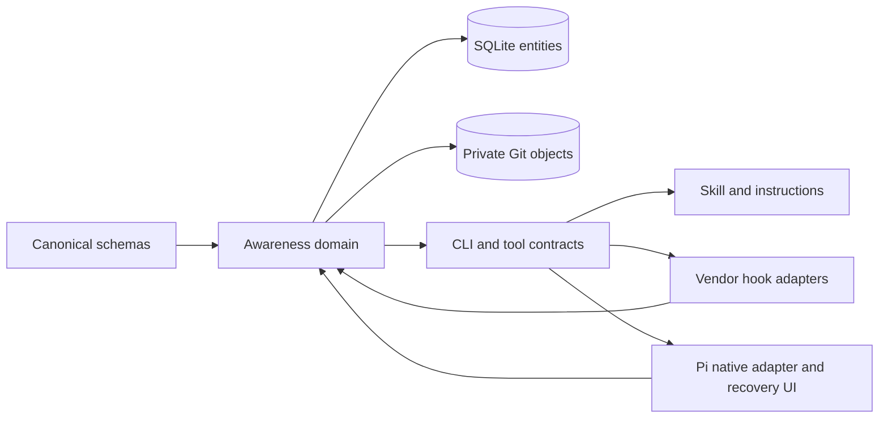

# RFC: Awareness v2 — canonical coordination and recoverable execution

Status: Core and the scoped token-economy/cooperation implementation are delivered. The broad token/quality acceptance target and live cross-vendor activation remain unproven; see the explicit ledger below.
Updated: 2026-09-07. RFC ID: awareness-v2.

Architecture follow-up: Pi now fences in-flight peer delivery at session
transitions, retains one active consumer and refreshes prompt source text on
session initialization while preserving stable per-session prompts. Awareness
owns shared delivery defaults, DDL-derived entity discovery and runtime Git
backend metadata. The updated [assessment](docs/AWARENESS_ASSESSMENT.md#architecture-and-cleanup-follow-up)
records 1,255 Awareness and 1,940 Pi passing tests, Sonnet review corrections and
the failed no-wake communication attempt. Canonical schema, entities and SQLite
remain core; only verified duplicate declarations were removed in this pass.

## Remaining-work implementation plan — 2026-09-07

This dated plan supersedes treating the previous core validation as completion of
all v2 work. Implement in dependency order and replace pending claims only with
observed receipts. Preserve existing user changes, canonical schemas/entities and
the separate Awareness database; no compatibility or backup layer is introduced.

### Shared cooperation principle

Every agent using Awareness should receive this operating principle through the
canonical prompt/skill/host surfaces: work as an organized cooperative community
serving the user's objective. Communicate useful evidence, divide work clearly,
help blocked peers, share verified learning and respect ownership. Coordinate
scarce resources with bounded leases and fair scheduling; do not compete for
them or duplicate another agent's work. Choose the smallest context and number of
agent/tool turns that preserve correctness, useful communication and verifiable
outcomes. Token savings never justify hidden uncertainty, skipped checks or
invented success. Peer messages remain attributed data, not authority.

### Execution and acceptance

| Order | Deliverable | Owning boundary | Acceptance |
|---|---|---|---|
| 1 | Canonical compact operating instructions, cooperation principle, small generated capability map, full guide/schema detail on demand | Awareness policy/CLI/skill; Pi consumes the public contract | At least 50% fewer standing instruction bytes versus 17,323-byte baseline; exact mandatory invariants retained; all commands still discoverable; no separate host policy copy. |
| 2 | Scoped changes-only attend with an opaque revision token and bounded full fallback | Awareness schema/domain/CLI | Actor/store/workspace/filter/version binding; invalid or foreign tokens cannot suppress output; time/lease changes, changed blockers/debt and unknown state remain visible; actual lock admission always reads current state. |
| 3 | Dependency-validated evidence reuse through existing memory/reference machinery | Awareness reference owner | Reuse only exact current content/dependency fingerprints; changed, missing, inaccessible or foreign evidence is stale/unknown; retained Git bytes alone never imply current verification. |
| 4 | Selective host wake and coalescing of actionable peer messages | Pi lifecycle adapter; canonical Awareness delivery state | Bounded, deduplicated, policy-aware wake; informational noise cannot create unlimited turns; no early acknowledgement; shutdown/session fencing; no second message DB or scheduler. |
| 5 | Final worker-tree inspection after the last artifact/terminal transition | Pi orchestrator consuming Awareness audit | Expose native worker IDs and real pending debt after final writes; no SUCCESS from exit/handback/ack; thread completion remains explicit; unrelated debt unchanged. |
| 6 | Awareness context/token attribution using existing context accounting | Pi context/observability | Separate estimates from provider totals/cache usage; bounded state; expose instruction, peer and relevant context costs without copying payloads into prompts. |
| 7 | Integrate, freeze candidates, evaluate and clean | Root | TDD for behavior, package suites, dependency-ordered builds, root lint, real bundled Pi and Sonnet communication, paired total-token/quality checks; update owning docs and this matrix; inspect owned worker debt and generated staging. |

### Implementation results

| Deliverable | Observed result | Boundary |
|---|---|---|
| Compact shared policy | 17,323 → 4,397 UTF-8 bytes, 74.6% less; all export formats and Pi consume one owner. Skill is 6,379 bytes. | Full guide/schema detail stays on demand. |
| Attend revision | Implemented through canonical schema/CLI; invalid scope, races, partial views, expiry and rank transitions tested. A stable empty fixture drops 910 → 630 output bytes. | Fresh database reads still run; no cached admission. |
| Evidence reuse | Capture/check flags use existing references and fingerprints; fresh/stale/unknown survives lean output. | Only declared source/dependency bytes and modes, not dependency closure or claim truth. |
| Pi wake | Installed Pi SDK delivered two exact directed challenges in one extra provider turn. | One automatic turn budget per external input; lifecycle opportunity required, no arrival watcher. |
| Final worker inspection | Native worker IDs, pending and stale-active counts/IDs and audit continuation survive terminal transitions. | Covers the current facade-owned set; never invents successful checks or other-host ancestry. |
| Attribution | Assembly estimates expose canonical policy/bindings and context kinds; latest peer delivery is a bounded scalar observation. | Character estimates remain separate from actual provider/cache usage and retained history. |
| Live Sonnet coordination | Built extension coordinator and worker exchanged exact in-thread nonces using native identities and the shared store; worker stopped. | Explicit facade wake, not automatic cross-vendor push. |
| Paired policy eval | Six successful Sonnet calls: total provider tokens 13,756 → 4,676 (66.01% less). | Frozen strict JSON gate failed 0/3 in both arms because responses used fences. Post-hoc semantic guards passed 14/14 per arm; primary verdict stays NOT_ACCEPTED. |

Validation: 90 shared-contract, 1,282 Awareness and 1,951 Pi tests passed, including
real installed-SDK transport coverage. TDD caught missing compact exports, evidence
freshness errors, hidden rank-score churn, stale-active audit omissions and omitted
instruction accounting. See the [dated assessment](docs/AWARENESS_ASSESSMENT.md#token-economy-and-cooperation-delivery)
for evidence and limits. The 25% total-token target per completed verified workflow
is not established by a policy-decision experiment. It remains an explicit eval
gate, not an implementation success claim.

### Alternatives and boundaries

Keep the existing full guide as explicit reference output, not a repeated default
prompt. Keep existing schemas/Zod as the contract owner and render smaller views;
short cryptic keys or a second schema would increase discovery mistakes. Reuse
existing outbox/cursors for delivery, memory references for evidence and context
segments for accounting. A delta is a read optimization, never cached permission.

The quality objective is total tokens per verified workflow, including discovery,
repair and communication, rather than the smallest individual response. Target
25% fewer total tokens on matched workflows only if correctness, exact challenge
delivery, conflict/debt detection, executable pagination and authority boundaries
are unchanged. Small-sample or synthetic evidence must stay labelled as such.

### Remaining v2 acceptance ledger

| Area beyond these deliverables | Disposition and proof needed |
|---|---|
| Live Codex/Claude/Cursor and other vendor hooks | Contract coverage is not installed/activated runtime proof. Exercise available hosts explicitly; do not claim a live application was tested from a vendor label. |
| Prospective interoception, cognitive yield, autonomous escalation and concurrency regulation | Retain as uncalibrated research work; any future controller begins with observation-only estimates and held-out outcome/false-blocking tests. No guessed confidence or budget may authorize actions. |
| Private Git retention/GC and hard decompression-memory limits | Explicit storage-scale follow-up; current bounded capture/read contracts and documented inflation limitation remain visible. Destructive retention requires an owned policy and reachability proof. |
| Filesystem-wide atomic multi-file restore | Unsupported guarantee; retain per-file journal, conflicts and undo evidence. A claim of atomicity needs a different filesystem transaction primitive. |
| Adaptive decomposition and semantic evidence coverage | Existing plans and source-reference trust support these; effectiveness requires task-outcome evidence, not a newly named score. |

## Core architecture

**Canonical Zod schemas → entities/domain → CLI/tools and hooks → skill instructions and host adapters.**

Awareness owns one exact SQLite contract. Private Git stores recoverable file bytes. Pi consumes Awareness through the same CLI/skill contracts and native adapters. No mixed schema admission, compatibility aliases, automatic old-schema conversion or duplicate Pi history writer belongs in this core.

| Owner | Responsibilities |
|---|---|
| Awareness | Plans, tasks, work declarations, leases, messages, delivery, verification debt, memory/reference trust, reflection, hooks, history, deterministic assessment, CLI discovery and instructions. |
| Private Git | Immutable blobs, trees, commits and per-operation refs; no task ledger or coordination policy. |
| Pi extension | Actual execution, native sensing, session transitions, compaction, worker processes, UI, canonical advice delivery and explicit recovery interaction. |
| Agent contracts | Portable protocol/type fragments and discriminated native/Pi observations; no Awareness tables or threshold policy. |
| Tools-core/engine | Local and remote research, AST/LSP and dependency graphs. |
| Model | Deliberative judgment, evidence interpretation and authorized strategy selection. |



All cooperating participants use the same physical database and canonical workspace with distinct stable identities. Agent runtime databases remain separate. Exact canonical DDL and the `OCT1` application identity determine admission; opening a store never upgrades it.

Use the host-provided `OCTOCODE_AGENT_ID` for extension workers. Display names and vendor labels are metadata, not proof of identity or live vendor execution. Pi's effective storage policy also matters: `storage.mode=memory` disables its durable Awareness bindings even if Awareness's independent hooks and notifications flags are enabled. An explicit CLI call to a physical ledger does not prove native automatic delivery.

## Schemas and important agentic boundaries

- Each history route has its own strict Zod request schema. Before and after capture are separate discriminated branches; after requires correlation and an observed outcome.
- Route descriptors drive discovery, allowed/required flags and focused help. Package validation checks each union branch independently.
- Operation, version and restore entities use inferred types and validated nested metadata. Backend object IDs cannot be supplied as capture input.
- Physiology observations distinguish native and Pi sources. Trusted runtime context travels separately from model arguments. Unknown measurements remain absent.
- Schemas validate trust boundaries; internal operations use typed values. Hosts do not duplicate Awareness policy.
- Completion, captured bytes and restored files cannot create successful verification receipts.

Sources: [history schemas](packages/octocode-awareness/src/schema/definitions-history.ts), [entities](packages/octocode-awareness/src/schema/entities.ts), [physiology contract](packages/octocode-agent-contracts/src/physiology.ts).

## Local Git decision

Bundle pinned `isomorphic-git@1.41.9` in Awareness. Pi receives it through Awareness, with no separate Git executable installer.

| Option | Fit |
|---|---|
| Bundled JavaScript object backend | Selected: fits self-contained Node packaging and explicit private object operations. |
| System Git | Adds ambient executable/configuration dependencies. |
| Bundled native Git | Adds platform distribution and maintenance work; consider only if measured scale requires it. |
| SQLite-only bytes | Requires another content-addressing/tree implementation or a larger coordination ledger. |

The library supplies explicit `gitdir` and direct object APIs: [writeBlob](https://isomorphic-git.org/docs/en/writeBlob), [writeTree](https://isomorphic-git.org/docs/en/writeTree), [writeCommit](https://isomorphic-git.org/docs/en/writeCommit). This is an architecture-fit decision, not evidence of speed superiority over native Git.

```text
<awareness-db>.history/awareness-v1/<sha256(real-workspace)>/repo.git
```

The private store never uses project Git configuration, index, branches, remotes, hooks, filters or alternates. Objects deduplicate by content; operation refs are immutable. Status does not initialize storage. Memory-only databases cannot create a sidecar.

Defaults: 200 explicit files, 2 MiB per file, 16 MiB per batch. Excluded secret-file patterns, generated paths, symlinks and unstable reads produce typed omissions. Missing files are explicit states. Raw bytes and executable mode are preserved.

Limits: no automatic Git GC; blob size is checked after inflation, not under a hard decompression-memory ceiling. Multi-file restore is journaled, not filesystem-wide atomic. Writers that ignore coordination can still race filesystem operations.

## Flows

| Flow | Contract |
|---|---|
| Session entry | Bind workspace, physical DB and actor; register presence and inspect relevant deltas. A loaded skill does not prove hook installation. |
| Read/search communication | Deliver bounded relevant context; do not invent writes, captures or verification debt. |
| Mutation admission | Capability and peer-lock guards retain authority. Denied work does not start history capture. |
| Before capture | Resolve explicit paths, journal the operation, capture preimages and publish private objects before execution. |
| Terminal tool event | Capture postimages and actual success/failure/interruption/timeout with identical store/actor/session/run/host correlation. Missing correlation skips observational capture without overriding a guard. |
| Retry | Identical operation/payload is idempotent. Conflicting identity, scope, paths or terminal outcomes fail. |
| Inspection | Bounded status/timeline/read use canonical routes and executable continuations. Path filtering cannot leak unrelated operations. |
| Restore preview | Record selection plus current bytes, existence and mode without changing workspace files; verify blobs and show create/update/delete/unchanged. |
| Restore apply | Acquire a dedicated exclusive work lease, claim preview, repeat all-file state checks, capture/verify undo, then check and renew the complete lease before each write. |
| Restore failure | Preserve failed/conflict/partial state and file progress; release only the dedicated run. Crashes retain the journal and lease expiry. |
| Restore completion | Return `verification_run_id` with work `PENDING`; Pi displays verification pending. Actual checks settle it. |
| Compaction/session transition | Invalidate stale measurements and fence session correlation; durable coordination remains independent of conversation state. |
| Work completion | End owned work, run applicable checks, record observed outcomes, audit owned debt and preserve peer debt. |
| Memory/reflection | Recall bounded leads with reference trust warnings; record reusable learning after verification. Neither grants authority. |
| Maintenance | Canonical SQLite-only consolidation can create a new file. It rejects history-bearing sources because OIDs without sidecar bytes dangle. |

Seven routes: `history status`, `capture`, `checkpoint`, `timeline`, `read`, `restore-preview`, `restore-apply`. Discover exact flags with `schema command history <action> --compact`.

## Hooks are first-class

Awareness owns lifecycle normalization, tool classification, correlation, policy and communication. Vendor adapters translate protocol shapes without introducing a second authority.

| Host | Boundary |
|---|---|
| Codex | Supported pre/post events and `tool_use_id`; preserve its denial/context fields, without invented failure events or post-execution vetoes. |
| Claude Code | Distinct pre/post/failure events, event-specific output and bounded stop behavior. |
| Cursor | Generic pre/post/failure events with their actual output capabilities. Deferred communication is not delivered context. |
| Pi | Native `tool_call` admission and terminal execution events correlate by `toolCallId`; generation fences stale completions. |

The installer also exposes Copilot, Gemini, and OpenCode surfaces; see the [hook reference](packages/octocode-awareness/docs/HOOKS.md) for the owning capability matrix. A supported adapter, a ready definition, installed configuration, activation, and observed runtime receipts are distinct evidence levels. Inspect `hooks check` health even when the process exits successfully. Pi uses native events rather than a shell-hook installation target.

Common classes: read/search/navigation, explicit file write/edit/delete, shell, MCP and unknown. Known file mutations capture exact targets. Shell strings and unknown MCP payloads remain communication/observation unless explicit file effects are available. Notifications and stop events never manufacture verification.

References: [Codex](https://learn.chatgpt.com/docs/hooks), [Claude](https://code.claude.com/docs/en/hooks), [Cursor](https://cursor.com/docs/hooks), [Pi](https://github.com/badlogic/pi-mono/blob/v0.84.4/packages/coding-agent/docs/extensions.md). Fixtures do not establish execution inside every live application. User hook settings are not installed by this implementation.

## Agent Physiology: all concepts

The thesis is to regulate the conditions for effective reasoning. It implies neither emotions nor demonstrated intelligence improvement.

| Concept | Current implementation | Remaining work/evidence |
|---|---|---|
| Synthetic interoception | Bounded workspace facts plus trusted native/Pi context, tool outcomes and compaction receipts. | Budget, semantic evidence coverage and forecasts remain unknown. |
| Operational body | Typed projections of separately owned runtime/workspace state. | A joined read model must preserve scope and authority. |
| Homeostasis | Deterministic advice, unchanged-pressure suppression, rearming after fresh healthy observations. | Calibrated actuator/feedback loops and task-quality evaluation. |
| Reflexes | Capability admission, mutation guards, restore fencing and resource bounds. | General repetition/API prerequisite rules need reliable evidence and false-positive tests. |
| Three-speed cognition | Guards, advice and deliberation have separate owners. | Preserve priority ordering in future controllers. |
| Harness-owned conditions | Host owns compaction, retries, limits and execution; Awareness observes/advises. | No second scheduler or retry loop. |
| Cognitive metabolism | Bounded runtime counts and tool outcomes are measurable. | Useful information/verified progress per resource needs a benchmark. |
| Error pressure | Explainable failure, context and coordination signals. | No uncalibrated scalar may grant denial authority. |
| Prospective interoception | Not implemented. | Shadow-mode action-cost estimates, calibrated before controls. |
| Micro-tasking | Plans, dependencies, scopes and receipts support bounded tasks. | Comparative evidence for adaptive decomposition. |
| Physiological parallelism | Host capacity admission and scoped contention evidence. | Dynamic regulation needs headroom, fairness and merge-cost measurements. |
| Full regulating architecture | Real Pi exercises sensing → canonical advice → provider-visible context. | Stronger regulation needs an authorized actuator and held-out checks. |
| Terminology | Engineering responsibilities: body, interoception, regulation, reflexes. | Naming is not implementation or research novelty. |

Pi retains at most 32 terminal outcomes, deduplicates correlation and excludes Awareness self-inspection. Advice uses the existing 128-token segment budget, suppresses unchanged pressure and cannot rearm on unavailable measurements. Raw payloads and compaction summaries are not retained in this projection. See [Agent Physiology](packages/octocode-awareness/docs/AGENT_PHYSIOLOGY.md).

## Efficiency contract

Primary metrics: operation wall time, peak process RSS and serialized agent-output bytes. Cold CLI startup is separate from warm in-process execution; standing instructions are separate from per-call output. Bytes are not exact model tokens.

Guardrails: no lost conflicts, debt or file content; executable pagination; unchanged authority/session fences; unchanged coverage floors. An optimization is accepted only on comparable measurements with guardrails intact.

Existing controls: explicit bounded targets, content-addressed deduplication, immutable refs, short SQLite transactions without awaited I/O, keyset timeline pagination, bounded binary reads, lazy storage initialization, pure runtime assessment without SQLite, fixed sensor windows, bounded correlation and deduplicated advice. There is no prompt-time whole-workspace snapshot.

The [frozen baseline runner](.octocode/octocode-eval-benchmark/awareness-core/run-benchmark.mjs), [KPI contract](.octocode/octocode-eval-benchmark/awareness-core/kpi-contract.json) and [raw report](.octocode/octocode-eval-benchmark/awareness-core/report.json) record seven samples plus warmup on Node 26.4.0, macOS arm64, with an isolated database, empty PATH and a 32 KiB file.

| Initial baseline | Measurement |
|---|---|
| Unchanged compact attend | 812 output bytes; 125.39 ms cold p95 |
| Status / capture-before / timeline / read | 119.43 / 149.18 / 117.75 / 124.69 ms cold p95 |
| Cold median peak RSS | 72,848–81,568 KiB across measured routes |
| Warm domain status / timeline / read | 0.123 / 0.704 / 2.854 ms p95 |
| Standing guide / skill | 17,324 / 6,399 bytes, measured separately from per-call output |

All baseline correctness guards passed. Cold timing includes startup, imports, DB opening and serialization; warm timing shares a process. These are different execution paths, not a claimed optimization speedup. Native Git throughput, long-session storage growth, decompression memory and cognitive yield remain separate evaluations.

The [second frozen measurement](.octocode/octocode-eval-benchmark/awareness-core/v2/report.json) tests the actual in-process `execHistoryCli` path with a 24-byte file: status p95 7.20 ms and capture p95 17.24 ms. Timeline p95 is 7.81 ms at 100 operations and 15.24 ms at 1,000 operations; every sample returns exactly 20 rows, explicit partial state and executable continuation. Seven samples per route passed all guards. The shared process reached 181,216 KiB peak RSS after seeding 1,000 operations; this lifetime high-water mark is not per-read memory or proof of a leak. Prompt wiring contains one canonical instruction interpolation and an explicit worker duplication guard. Frozen report SHA-256: `9dff8374bb905b2611d467e6df722e070f2739c695ed57ea3769acf2b6f0f829`.

The [breadth measurement](.octocode/octocode-eval-benchmark/awareness-core/v3/report.json) uses five cold root-CLI samples per flow. Work start/end/verify p95 is 119.64/118.36/117.60 ms; signal publish/list is 118.73/118.74 ms; memory record/recall is 120.39/131.49 ms. At 100/1,000 stored signals, attend p95 is 129.20/141.41 ms, output is 1,224/1,228 bytes, and median process peak RSS is 74,624/79,552 KiB. Exact fixture bytes were checked before successful verification; signal and memory visibility guards passed. This covers representative coordination flows, not every route. Live vendor-hook latency remains unmeasured. Frozen report SHA-256: `1ab2302b53072aa911064c0f08bd4c3853355058a8c5d74968b63a85f355f9c7`.

## Validation and cleanup

The package counts below are receipts from the core implementation validation, not tests rerun by each documentation review. Live model execution and per-host activation are recorded separately in the [Awareness assessment](docs/AWARENESS_ASSESSMENT.md).

| Validation | Receipt |
|---|---|
| Awareness package suite | 170 files, 1,255 tests passed. |
| Coverage | Statements 89.70%, branches 81.71%, functions 95.50%, lines 93.81%; ratchets raised to 89.7/81.7/95.5/93.8 respectively. The same-run V8 results satisfy the raised floors. |
| Isolated package | 278-file artifact passed zero-installed-runtime-dependency checks, including strict union schemas. |
| Pi package and real SDK | 146 files, 1,938 tests passed with two workers, including the built-extension real Pi SDK test. |
| Root lint and diff checks | Repository-wide `yarn lint` and `git diff --check` passed. |

Build verification order is Awareness build/tests → isolated package verification → Pi build/tests. Package verification invokes prepack and rebuilds Awareness; running it while Pi imports the bundle can remove chunks in use. The final runs respected that order. Pi used two test workers after an earlier contended run exited 137.

The real Pi test uses the built extension and pinned SDK with a deterministic local provider. It exercises bundled skill/CLI, tool failure and advice, native capture with pre/post objects and exact bytes, and compaction observation. It is not a paid-model quality benchmark or live cross-editor installation test.

Cleanup removes the duplicate Pi history writer, obsolete conversation-checkpoint artifacts and ignored compatibility parameters. The live ledger was explicitly converted before compatibility removal; all 36 existing tables and 87 rows were checked for preservation. The temporary upgrade backup was removed as requested.

## Next evaluated increments

1. Measure sustained time/RSS/context costs across representative workspaces; optimize identified costs.
2. Define explicit retention and recoverable history export with sidecar integrity and crash-safe publication.
3. Make effective storage, native actor binding and hook activation diagnosable together; exercise installed Codex, Claude and Cursor hooks against supported host releases.
4. Add task-scoped evidence-reference freshness and verification coverage without presenting semantic confidence as measurement.
5. Evaluate repetition detection, prospective sensing and adaptive worker admission in shadow mode before controls.

Completion acceptance must inspect verification debt for every owned worker, not only the parent. Ending a worker or receiving a handback cannot turn PENDING work into SUCCESS. Acknowledgement records handling; resolution records completion. Preserve earlier peer debt and disclose it separately from this run's owned work.

The dated [Awareness assessment](docs/AWARENESS_ASSESSMENT.md) owns feature ratings and live deployment findings. It distinguishes the implemented foundation from automatic cross-vendor readiness; neither architecture fit nor passing fixtures establishes activation inside every vendor.
