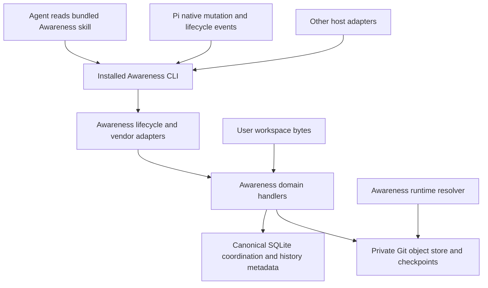

# RFC: Awareness v2 — hooks, shared lifecycle, and recoverable work

Status: **Draft — research complete for architecture selection; implementation and live-host acceptance pending.** RFC ID: `awareness-v2`. Updated: 2026-09-06. Owners: Awareness runtime/storage/packaging maintainers; Pi maintainer for the native adapter and bundled consumption. Reviewers: maintainers of the four host adapters and tools-core contracts. Roles identify required ownership; no individual assignment or approval is implied.

### Audit Reasoning — 2026-09-06 reassessment

**Finding: partially present foundations; v2 itself is not implemented. Recommendation: revise and keep this RFC.** The current tree already contains coordination state, hook runners, a versioned continuity envelope, a transactional outbox, consumer cursors, Pi event delivery, and private Pi checkpoints. It does not yet establish the proposed shared generic lifecycle, cross-host communication conformance, or shared recoverable-history protocol. Reuse those foundations rather than introduce another event framework or Pi-specific storage authority.

This reassessment adds source comparisons with Entire, Git AI, Mentu Hooks, and agent-hooks; explicit delivery/acknowledgement semantics; requirement traceability; and failure/rollback gates. The current working tree is actively edited and contains unrelated user work. Findings describe inspected source and recorded test runs, not a clean release. This is the authoritative RFC at the user's requested `awarenessv2.md` path; no competing implementation plan is required. This document does not implement, install, or enable v2.

## Problem, goals, and non-goals

Awareness can coordinate work today, but execution evidence, host communication, and Pi's recoverable bytes do not yet share one reliable lifecycle. An agent needs to know whether its assumptions changed before a tool runs, distinguish a launched operation from a completed one, and recover a selected edit without disturbing a peer or the user's Git workflow.

| Requirement | Goal and user story |
|---|---|
| R1: shared lifecycle | As an agent in Codex, Cursor, Claude Code, or Pi, receive the same relevant Awareness state through the host's actual supported execution boundaries. |
| R2: useful communication | As an agent, receive a compact new peer/conflict/handoff delta before or after relevant tools, without repeated unchanged context or premature work completion. |
| R3: ownership and truth | As a collaborating agent, have exclusive conflicts denied where the host supports gating, with correct identity, correlation, outcome, and explicit coverage gaps. |
| R4: independent recovery | As a developer, inspect and recover retained file versions locally while my real Git repository remains untouched. |
| R5: one packaged implementation | As a Pi user, obtain Awareness CLI, full skill, and supported private-history runtime together; other hosts use the same domain implementation. |
| R6: affordable operation | As a user, keep routine hooks quiet and bounded, with measured latency, storage growth, publication lag, and backpressure. |
| R7: continuity and evidence | As an agent resuming or receiving work, connect verification, memory, and handoff evidence to exact versions and durable delivery state. |
| R8: safe rollout | As a maintainer, migrate explicitly, diagnose capability failures, and disable a faulty subscriber without losing coordination or overwriting unrelated configuration. |

Non-goals: replacing the user's Git; distributed SQLite or cloud synchronization; a new general agent orchestrator; full transcript archival/replay; universal interception of human, remote, or arbitrary shell effects; automatic external messaging, merging, or rollback; rebuilding every existing Awareness command. File recovery cannot reverse external side effects. The first milestone is hooks with Git disabled.

## Decision

Build this in **Octocode Awareness**. Keep SQLite authoritative for agents, plans, tasks, runs, advisory presence, exclusive locks, signals, verification, memory, and handoffs. Add a private, local Git object store for recoverable file versions and checkpoint trees. Pi consumes Awareness through the **installed CLI and bundled Awareness skill**; its native events remain thin adapters for actual execution boundaries.

**Hooks are a first-class Awareness interface and the first implementation milestone.** Awareness owns the lifecycle, tool classification, communication policy, correlation, and outcomes. Codex, Cursor, Claude Code, and Pi translate their native protocols into that lifecycle. History is one subscriber to it; communication, ownership, verification, and handoff must work with Git disabled. The skill guides agent decisions; hooks supply deterministic awareness at execution boundaries.

Use **raw Git blobs per changed file, small SQLite event records, and batched checkpoint publication**. Do not commit or scan the whole workspace on every edit. Do not use the user's Git index, branches, commits, remotes, hooks, or lockfiles for Awareness operations.

Bundle the history implementation and a supported, pinned Git runtime through Awareness's distribution. Pi should receive that capability transitively with Awareness and its complete skill. Create each user's private history repository locally on demand; a repository containing user data is never a package asset. The current Pi package already bundles Awareness integration, but its checkpoint code invokes `git` from the environment; a managed Git executable is a **new packaging deliverable**, not an existing guarantee.

The highest-value first release starts with cross-host lifecycle and before/after-tool communication, then adds exact file history, reliable attribution boundaries, safe selective restore, verification tied to file versions, and shared CLI access. Richer learning and investigation features follow once these foundations survive concurrency and crash tests.

## Hooks as the primary runtime interface

Follow-up audit: 2026-09-06. Local Codex reports `codex-cli 0.153.4`; the Pi package pins `@earendil-works/pi-coding-agent` `0.84.4`. Official host documentation and Pi's matching release were checked alongside the current Awareness source. These are researched contracts, not proof that installed hooks executed in each live application.

### What must change in the current implementation

| Observed implementation | Consequence | Planned correction |
|---|---|---|
| [Installer matchers](packages/octocode-awareness/src/hooks-install-specs.ts) primarily select writes; Codex matches `apply_patch\|Write\|Edit`. | Shell, reads/searches, MCP, and communication often miss the lifecycle. | Register a general tool lifecycle; classify effects inside Awareness. Keep mutation admission selective. |
| [Runner](packages/octocode-awareness/bin/hook-runner.ts) returns early for pre/post events without extracted files. | Non-writing tool calls cannot participate in general communication checks. | Normalize and route every supported tool event before choosing relevant subscribers. |
| [File extraction](packages/octocode-awareness/bin/hook-payload.ts) uses `assumeWrite: true` for these events. | Simply changing matchers to all tools would misclassify read paths as writes. | Introduce a typed tool/effect registry before widening subscriptions. |
| [Notification delivery](packages/octocode-awareness/bin/hook-lifecycle.ts) also finalizes fallback HOOK runs. | Reusing it before every tool could prematurely end work. | Separate read/deliver-inbox behavior from end-of-turn settlement. Only explicit lifecycle boundaries settle aggregates. |
| [Context envelopes](packages/octocode-awareness/bin/hook-payload.ts) use a broad Cursor `permission: allow, agent_message` fallback. | The documented allowed-tool context route is different; current tests do not establish model delivery. | Encode responses per host **and event**, with queued delivery when that event cannot carry context. |
| [Failure classifier](packages/octocode-awareness/bin/hook-payload.ts) recognizes named failure events/error booleans. | General shell support additionally needs vendor result/exit-status decoding and deferred completion handling. | Normalize success, failure, denial, interruption, timeout, partial, and unknown outcomes from validated payloads. |
| [Installer event specs](packages/octocode-awareness/src/hooks-install-health.ts) omit Codex `PostCompact` and `Interrupt`, and Cursor `beforeSubmitPrompt`. | Current installed lifecycle coverage is narrower than the researched host capabilities. | Generate event manifests from a versioned capability table; keep unsupported events out. |
| Pi has native gates and a [persistent peer event consumer](packages/octocode-pi-extension/src/tools/awareness-event-consumer.ts), outside the shell-host type. | A unified lifecycle must include Pi without installing duplicate shell hooks or losing persistence-before-ack. | Add Pi as an explicit native adapter to the same Awareness protocol, exposed through the packaged CLI. |

Do not equate host with model vendor: Cursor running an OpenAI model still speaks Cursor's hook protocol; Pi running an Anthropic model still speaks Pi's protocol. Store `host`, `host_version`, and self-reported `model_provider` separately. Missing provider labels remain unknown.

### Protocol alignment and support boundaries

**Codex:** use `PreToolUse`/`PostToolUse`, `tool_use_id`, and `tool_input.command` for Bash/patch calls. `exec_command` is exposed as `Bash`; `write_stdin` can deliver its later completion without another pre-hook. Local functions/MCP are covered, hosted web search is not. Pre-tool context uses `hookSpecificOutput.additionalContext`; denial uses `permissionDecision: deny`. Do not emit unsupported pre-tool `ask`/`continue` fields or invent `PostToolUseFailure`. Decode nonzero shell results. Matching handlers may run concurrently; background hooks cannot gate. Post-tool blocking cannot undo execution. Pin fixtures to the supported release. [Official Codex hooks](https://learn.chatgpt.com/docs/hooks).

**Cursor:** use generic `preToolUse`, `postToolUse`, and `postToolUseFailure`. Pre-tool `agent_message` is documented for denied actions; successful post-tool context uses `additional_context`. The failure event currently has no output fields, so queue its advisory for the next supported boundary. Prefer generic events; specialized shell/MCP/file events are fallbacks with deduplication. Preserve conversation/generation/tool IDs and multiroot scope. [Official Cursor hooks](https://cursor.com/docs/hooks).

**Claude Code:** use `PreToolUse`, `PostToolUse`, and `PostToolUseFailure`, with event-specific `hookSpecificOutput`. A failure event is not interchangeable with a permission denial or validation rejection. `Notification` is a host notification, not an Awareness peer-message bus. Keep stop continuation bounded and install lifecycle hooks independently of whether the model has loaded a skill. [Official Claude Code hooks](https://code.claude.com/docs/en/hooks).

**Pi:** map `tool_call` and `tool_result` to pre/post processing; correlate using `toolCallId`. Return blocking decisions only through the appropriate native gate; preserve original result/error fields when attaching context. Native execution updates are observations, not terminal outcomes. Parallel completions can interleave. The package's pinned release supports these contracts; use its native lifecycle and custom-message persistence, routed through Awareness CLI handlers. [Pi 0.84.4 extension protocol](https://github.com/badlogic/pi-mono/blob/v0.84.4/packages/coding-agent/docs/extensions.md).

Codex is the compatibility reference for the external event envelope, not a universal capability ceiling. Each adapter explicitly maps fields, responses, event ordering, and supported controls. Keep existing Copilot, Gemini, and OpenCode integrations as regression targets; their current source support does not imply all newly planned capabilities are verified for them.

### Awareness-owned lifecycle

Proposed canonical events below are internal/public Awareness protocol names, not names to copy verbatim into vendor configuration. Normalize once, then invoke ordered domain handlers. Track execution state separately from delivery state and work/run state.

| Awareness event | Awareness responsibility | Native event mappings to fixture-test |
|---|---|---|
| `session.open` / `session.resume` | Bind store/workspace/identity, reconcile unfinished operations, load cursors; no automatic task claim. | Codex/Claude `SessionStart`; Cursor `sessionStart`; Pi `session_start` with reason. |
| `turn.input` | Refresh relevant inbox and scope before new work; do not close live work as a side effect of reading. | Codex/Claude `UserPromptSubmit`; Cursor `beforeSubmitPrompt`; Pi `input` and `before_agent_start`, deduplicated by turn. |
| `agent.open` / `agent.close` | Register child identity and parent linkage; handoff/debt on completion. | Codex/Claude `SubagentStart`/`SubagentStop`; Cursor lowercase equivalents; Pi worker adapter where observed. |
| `tool.pre` | Classify tool, check relevant peer changes, admit mutations, prepare capture, return supported decision/context. | Codex/Claude `PreToolUse`; Cursor `preToolUse`; Pi `tool_call`. |
| `tool.progress` | Refresh a live operation when real progress is observed; bound telemetry. | Native transport/host progress where available; no synthesized periodic success. |
| `tool.post` | Correlate terminal result, record actual effects/check outcomes, deliver relevant deltas. | Codex/Claude `PostToolUse`; Cursor `postToolUse`; Pi `tool_result`. |
| `tool.failed` / `tool.denied` / `tool.interrupted` | Preserve outcome distinctions, reconcile partial effects, release only operation-owned provisional state. | Decode host result/failure/interrupt evidence; missing events become unknown, not success. |
| `context.before_compact` / `context.after_compact` | Save and rehydrate continuity pointers; keep session reusable. | Codex/Claude `PreCompact`/`PostCompact`; Cursor `preCompact` plus next observed rehydration boundary; Pi `session_before_compact`/`session_compact`. |
| `turn.settle` | Finalize fallback work once, audit debt, publish bounded history milestone. | Codex/Claude `Stop`; Cursor `stop`; Pi confirmed settled execution boundary. A model/tool-loop turn end alone need not mean settled. |
| `session.close` | Bounded flush, end presence, preserve debt and recovery records. | Codex/Claude `SessionEnd`; Cursor `sessionEnd`; Pi `session_shutdown`, retaining its reason. |
| `communication.pending` / `communication.delivered` / `communication.acknowledged` | Manage relevant Awareness signals and transport receipts. | Awareness events, delivered at available host boundaries; never fabricated vendor hook names. |

An adapter publishes separate capabilities for observation, context injection, denial, result modification, continuation, interruption, and durable delivery receipts. `supported`, `configured`, `trusted/enabled`, and `observed` are different states. Parent/child identifiers must not collapse into one agent merely because a host shares session metadata. Late results belong to their original operation/session, not whichever session is currently foreground.

### Communication before and after tools

This is the default coordination flow for all supported tool categories, including tools with no file paths:

1. **Before:** inspect a cheap, scoped change sequence. When it changed, read relevant pending signals, peer ownership changes, handoff pointers, or stale-read evidence. Read-only inspection does not create a WORK/HOOK run or take a file lock.
2. **Decide:** emit a compact advisory through the host's supported context channel. A model may already have selected the pending tool; added context does not promise replanning before that call executes. A real mutation conflict therefore requires a synchronous denial, not a warning disguised as enforcement.
3. **Execute:** retain the pending operation/correlation. Do not hold a DB write transaction while the tool runs. A launched shell process is running until terminal evidence arrives.
4. **After:** record the actual result and effects first, then recheck the change sequence for signals that arrived during execution. Add a small, typed advisory alongside the original result or defer it to the next valid model-context boundary. A post-hook warning must not change a successful write into a reported tool failure.
5. **Acknowledge:** keep `pending → offered → transport-confirmed → handled/resolved` distinct. Producing stdout is only an offer when the host exposes no consumption receipt. Keep at-least-once delivery, idempotent event IDs, and bounded resend/backoff; acknowledge semantic handling through existing signal commands. Pi's persisted custom-message receipt can establish transport confirmation, not that the model obeyed the message.

Example: another agent updates a file while this agent searches. The next supported pre/post boundary emits a pointer saying the file changed under run X and the prior read may be stale. The agent can inspect the diff through the CLI. If a peer instead holds exclusive protection on the next write target, the pre-hook rejects that mutation. An unrelated peer note neither blocks a read nor creates a new task.

Priority: current conflict or invalidated execution assumption → direct reply/handoff → relevant verification change → ordinary status. Scope by recipient, canonical workspace, artifact, run, and relevant paths. Coalesce duplicates across prompt/pre/post boundaries; omit unchanged updates. Default output is IDs, counts, short trusted status, and an executable detail query. Peer-authored bodies and tool output remain untrusted data; do not insert them as privileged instructions. Do not send peer messages merely because a hook observed an action.

Separate delivery from bookkeeping: a hook's inbox inspection must not mark messages handled, resolve threads, finish work, or clear verification. Avoid self-triggering loops when an agent runs `signal list`, `attend`, or the hook CLI itself: tag internal protocol operations, suppress duplicate briefing, and retain relevant normal admission checks. No remote/model call, full memory search, Git scan, or large diff belongs in the no-change path.

### Common tool coverage: registry before matchers

The priorities below reflect workflow importance and known tool families, **not measured market-share rankings**. Match actual host payload names; visible UI/tool labels and shell command names may differ. Generate matchers, extractors, outcome decoders, docs, and fixtures from one Awareness registry. Test namespaced/custom tools through declared capabilities instead of guessing from the presence of a `path` field.

| Priority / category | Representative names to cover | Before / after behavior |
|---|---|---|
| P0: file mutation | Codex `apply_patch`; Claude `Write`, `Edit`, `NotebookEdit`; Cursor `Write`, `StrReplace`, `Delete`, supported patch/edit aliases; Pi `file` with per-query operations, native `write`/`edit` when active. | Parse all actual targets, including move source/destination; admit and capture; record per-path success/partial/failure. Support notebook paths and binary/mode policy. |
| P0: shell/process | Codex hook name `Bash`; Claude `Bash`; Cursor `Shell`; Pi `bash` and explicit user-shell adapter. | Communication for every invocation; mutation/check handling only from declared or observed effects. Persist deferred process IDs; terminal status settles the operation. |
| P0: read/search/navigation | Claude `Read`, `Grep`, `Glob`; Cursor `Read`/`Grep`; Pi active Octocode research tools and native read/search tools when enabled. | Relevant peer/inbox delta and stale-read hints. No write presence, capture, or pending verification merely for reading. |
| P0: MCP/custom tools | Codex/Claude `mcp__…`; Cursor `MCP:<tool_name>`; Pi's registered MCP bridge. | Observe outer/nested operation IDs as available; explicit tool capability maps to read/write/communication/check/unknown. Unknown is not read-only or permission to write. |
| P0: communication and delegation | Awareness signal/handoff CLI commands; observed agent spawn/send/wait tools; Claude/Cursor agent/task tools; Pi workers. | Check recipient/session correlation, preserve parent/child ownership, queue replies, avoid echo loops. Never infer success or authority from a message body. |
| P1: verification/plan/skill | Test/build/typecheck commands, host plan tools, Pi `plan`/`skill`, Awareness task/work/verify commands. | Correlate declared checks and revisions; do not execute tests because a hook noticed a command label. Skill loading is not activation proof. |
| P1: bulk/external effects | Formatters, generators, package managers, browser/custom automation. | Bounded declared-scope capture/reconciliation; unknown effects and incomplete coverage stay visible. |
| Capability-dependent | Hosted search, specialized transports, human edits, completions, remote/cloud hosts. | Record support gaps and use later reconciliation or explicit CLI actions. Never advertise universal interception. |

The shared `file` tool must be classified **per query operation**: a batch can contain reads and writes. Shell parsing is advisory extraction, not a complete shell interpreter. Test redirection, pipelines, heredocs, nested scripts, async processes, and commands with no obvious targets; avoid broad regular expressions that pretend to cover arbitrary side effects. Remote/cloud runtimes cannot share this machine's SQLite just because they use the same vendor name.

### Canonical hook contract and ordering

Extend the existing `hook run` route rather than create a separate Pi hook service. Adapter input retains Codex-style event fields where applicable—`hook_event_name`, `session_id`, `turn_id`, `tool_use_id`, `tool_name`, `tool_input`, `tool_response`. Normalize into the existing `AgentEventEnvelopeV1`, using a separately versioned hook payload for host/version, parent/child identities, timing, effects, and native correlation. Do not introduce a competing top-level envelope. Preserve absent fields as absent; do not synthesize tool IDs from timestamps and claim exact correlation.

Result contract: typed outcome, optional denial with reason, bounded context items, UI notices, delivery offers, capture/work receipts, and diagnostics. The adapter serializes only fields valid for its native event. Mutation of tool input, permission approval, and result replacement are separate capabilities, disabled for ordinary awareness notifications. Awareness does not auto-approve host permission requests merely to keep the lifecycle moving.

Within one Awareness invocation use deterministic phases: **decode/validate → identity/scope → classify → synchronous policy/admission → capture preparation → scoped communication → persist receipt → encode**. Post-event order is **decode/correlate → record terminal/partial effects → finish capture/check receipts → delivery → diagnostics**. Git history is invoked only for selected mutation effects. Other independently installed vendor hooks can run concurrently, so our ordering is internal and does not claim to order all hooks on the host.

Deduplicate by store, host session/child, tool call, phase, and delivery ID; maintain a schema/versioned fallback only when exact host correlation is unavailable. Buffer out-of-order events within bounds. Timeout/restart leaves an interrupted operation with recoverable presence; retry is idempotent. A read event never becomes write ownership, and a tool failure never proves the filesystem is unchanged.

### Reuse the outbox; make delivery semantics explicit

The [existing envelope at line 25](packages/octocode-awareness/src/continuity-contracts.ts#L25) already carries event ID, workspace, session/correlation, aggregate, actor, provenance, timestamps, and payload. [Outbox insertion at line 10](packages/octocode-awareness/src/event-outbox.ts#L10) is designed to commit with its domain transaction, deduplicates identical events, and rejects conflicting reuse of an event ID. This is the durable event transport foundation. An in-process dispatcher may order handlers, but is not the source of truth after a restart. Do not event-source all existing canonical tables as part of this work.

The [ordered acknowledgement transaction at line 81](packages/octocode-awareness/src/coordination/coordination-continuity.ts#L81) advances the consumer cursor for **accept, hold, and refuse**. A later acknowledgement cannot change that decision. Therefore `hold` currently means a recorded disposition, not “retry delivery later.” Preserve that contract. For a host boundary that cannot carry context, either leave the event unacknowledged, or atomically persist a pending delivery keyed by consumer/event before advancing the ingestion cursor. Prefer the latter for independent advisories so one unsupported event does not stall the entire stream. A later delivery receipt resolves that pending record; it does not rewrite the original acknowledgement. Map proposal resolution to existing interaction/signal semantics.

The [current consumer at line 177](packages/octocode-awareness/src/event-consumer.ts#L177) awaits delivery, marks an accepted peer message read, then acknowledges it. Its in-flight promise serializes one consumer instance; this alone does not establish exclusive delivery across two processes. Extend the existing store with short consumer claims/fencing and durable idempotent delivery IDs before enabling concurrent native/shell consumption under the same identity. Test crashes after transport persistence, before message-read, and before cursor advancement. Exactly-once model consumption is not promised; retries must remain safe.

Keep three records conceptually distinct: domain disposition (`accept/hold/refuse`), transport progress (`pending/offered/confirmed`), and semantic handling (`handled/resolved`). Map the existing read flag explicitly; never infer handling from it. Preserve the existing pending-interaction and authority contracts instead of adding a separate question/approval queue. Peer content remains attributed data even when delivered by a trusted hook.

Prefer a testable core that computes typed effects from a normalized event and current scoped state, with bounded adapters executing those effects. Synchronous admission runs before the tool; durable asynchronous subscribers handle suitable follow-up work. No SQLite transaction remains open across host callbacks or subprocesses. Child launch acceptance is not child completion. Shell success requires validated terminal evidence from the supported host/version; plain output or missing exit metadata remains unknown, rather than guessing an exit status.

### Packaging, lifecycle profiles, and health

Awareness ships the runner, protocol schemas, vendor capability manifests, tool registry, skill guidance, and fixture suite. Pi bundles these through its Awareness dependency and forwards native events via the CLI; no shell-hook installation inside Pi. Codex/Claude/Cursor installers generate only owned entries, preserving unrelated hook configuration. Installation and trust/activation remain distinct host steps; this research does not install or change users' hook settings.

Preserve the existing profile names. `guard` selects admission only; `coordination` includes the shared lifecycle and cheap pre/post communication; `full` adds configured memory/reflection/history subscribers. Enabling hooks must not silently enable disk history, expensive memory retrieval, or automatic messages. Missing Git affects history alone. Existing Copilot/Gemini/OpenCode profiles keep their behavior until their new adapter contracts pass equivalent tests.

Health reports a matrix by host, surface, version, event, and category: configured/trusted/observed time, last outcome, missing correlations, offered/confirmed deliveries, unsupported responses, and measured latency. Fixtures validate shape; a live smoke test must demonstrate that the model received an advisory and an actual mutation was denied. Neither an installed JSON entry nor exit zero proves either behavior.

### Hook-first delivery gates

| Gate | Required proof before the dependent history work |
|---|---|
| H0: contract registry | Pin Codex protocol fixtures and Pi 0.84.4; version Cursor/Claude fixtures. Distinguish host/vendor, event capabilities, and actual tool names. |
| H1: lifecycle and communication | Read/search/shell/MCP/write/communication calls all traverse the applicable pre/post path. An idle inbox produces no repeated context. Inbox checks do not finalize work. |
| H2: outcome and concurrency | Nonzero exit, denial, timeout, cancellation, partial write, duplicate callback, nested call, child-agent identity, and delayed shell completion have distinct, idempotent outcomes. |
| H3: vendor conformance | Correct context/deny response for each event; Cursor allow/failure paths defer unsupported messaging; unsupported Codex fields rejected in fixtures; Pi keeps result fields and confirms persistence before transport acknowledgment. |
| H4: real host smoke | For Codex, Cursor, Claude, and Pi: start/resume → receive communication around a read and a write → block exclusive conflict → preserve failed/partial outcome → settle debt → compact/resume → close. Unsupported edges explicitly marked. |
| H5: efficiency and packaging | Measure actual hook/CLI transport p50/p95/p99 for unchanged and changed inboxes under concurrent tools. Packed artifacts work without Git; later add the private-history subscriber without duplicate callbacks. |

Freeze the no-change and changed-inbox latency budgets after measuring the **hook runner** separately from the earlier `status` CLI benchmark; that 101.580 ms result does not measure hook overhead. Limit context per delivery and per turn, with executable continuations and priority-aware coalescing. No always-on polling is needed: native event boundaries trigger reads, with optional host-supported wakeups kept separate.

Focused follow-up validation: **10 hook suites / 54 tests passed** (`hook-host-payload-adapters`, `hooks-install-cross-editor`, `host-hook-safety`, `hook-runner-correlation`, `full-loop-hook-contracts`, `hook-agent-identity`, `hook-change-state`, `hook-receipts`, `extract-hook-files`, `skill-frontmatter-hooks`). This validates existing local contracts only; it does not prove the newly proposed generic communication flow or live vendor delivery. No runtime/skill source was edited or rebuilt for this document update.

## Scope, evidence, and current work

This audit covers the complete live CLI catalog—**90 routes across 25 command families**—the documented Awareness lifecycle, canonical storage rules, host hooks, Pi's current CLI/skill transition, mutation boundaries, checkpoint engine, plan integration, and relevant tests. It is a source/contract audit plus local execution, not a claim that every supported editor was manually exercised.

The working tree contains substantial staged and unstaged Awareness and Pi work, including new CLI interoperability tests, signal/work pagination changes, agent identity work, and removal of model-facing Pi coordination/memory tool implementations. Preserve this direction. Do not resurrect a separate Pi Awareness tool surface or fork the skill to implement history. Repository files can change during this audit; the results below describe the observed baseline, not a clean release build.

Primary local evidence:

- [Awareness architecture](packages/octocode-awareness/ARCHITECTURE.md), [lifecycle](packages/octocode-awareness/docs/HOW_IT_WORKS.md), [feature sweep](packages/octocode-awareness/docs/FEATURE_SWEEP.md), [command catalog](packages/octocode-awareness/src/schema/command-catalog.ts).
- [Database contract](packages/octocode-awareness/docs/DB.md), [initializer](packages/octocode-awareness/src/db-init.ts), [DDL](packages/octocode-awareness/src/db-schema.ts), [workspace normalization](packages/octocode-awareness/src/git.ts), [physical file scope](packages/octocode-awareness/src/repo-scope.ts).
- [Locks and work](packages/octocode-awareness/docs/LOCKS.md), [hooks](packages/octocode-awareness/docs/HOOKS.md), [reflection](packages/octocode-awareness/docs/REFLECTION.md), [operational sensors](packages/octocode-awareness/docs/AGENT_PHYSIOLOGY.md).
- [Pi agent flow](packages/octocode-pi-extension/docs/AWARENESS_AGENT_FLOW.md), [CLI environment](packages/octocode-pi-extension/src/tools/awareness-cli-context.ts), [CLI resolution](packages/octocode-pi-extension/src/assets.ts), [skill packaging](packages/octocode-pi-extension/scripts/build.mjs).
- [Pi checkpoint engine](packages/octocode-pi-extension/src/tools/checkpoints.ts), [checkpoint input hook](packages/octocode-pi-extension/src/tools/rewind-command.ts), [integration](packages/octocode-pi-extension/src/index.ts), [mutation gate](packages/octocode-pi-extension/src/tools/awareness-mutation-gate.ts), [edit commit boundary](packages/octocode-pi-extension/src/tools/edit-tool.ts), [write tool](packages/octocode-pi-extension/src/tools/write-tool.ts), [batch file tool](packages/octocode-pi-extension/src/tools/file-tool.ts).

## Existing features and how v2 extends each flow

The existing lifecycle remains: enter → orient → choose work → claim/declare → execute → end/submit → verify → learn/handoff → clean up. History supplies evidence for these steps; it does not create another work lifecycle.

| Current feature/flow | Current behavior and invariant | v2 integration |
|---|---|---|
| Activation/configuration | Shared config/home resolution; explicit DB selection; hooks require valid activation. | Discover history capability, runtime provenance, store health, policy, and capture coverage independently of core DB health. |
| Orientation | `attend`, `status`, and query views expose peers, ready work, debt, signals, and operational state. Attend does not claim or verify work. | Add a bounded “changed since your cursor” summary; return pointers to versions and checkpoint details only when requested. |
| Identity/presence | Agents use stable IDs and shared normalized scope. Display labels are not identity. | Correlate host session, tool call, run, and file event; retain unknown attribution for unobserved external writes. Preserve the current cross-vendor identity work. |
| Plans | Create/list/show/join/document/status; lifecycle includes draft, active, paused, completed, cancelled. | Link plan milestones to checkpoint manifests. A plan status change alone cannot certify a tree or test result. |
| Tasks | Dependencies, readiness, claim lease, heartbeat, submit, release, retry, and verification. | Attach each attempt to its own edit events, baseline, output manifest, and verification evidence. Retry creates a distinct attempt history. |
| Explicit work | `WORK` runs plus mandatory advisory `run_files`; ordinary overlap is allowed. | Group history by the existing run and show overlapping versions. Do not create one run per edit. |
| Hook fallback | `HOOK` aggregates cover writes without an applicable TASK/WORK run; scoped by agent/session/workspace/artifact. | Capture against the same aggregate. Stop/compact/end publishes a milestone and existing pending debt, not a synthetic success. |
| Exclusive locks | Optional exclusion; another live presence blocks exclusive acquisition; a live exclusive lock blocks advisory admission. | Restore and other content mutations obey these rules. Git's internal lockfiles only protect Git internals. |
| Lease recovery | Presence, lock TTL, and task claim leases have different effects. Expiry is not proof of completion. | Recovery can flag interrupted captures and pin their objects; it cannot steal live ownership or clear verification debt. |
| Verification | `verify audit/mark`; explicit results settle runs and linked tasks. Pi can correlate declared commands with execution receipts. | Bind evidence to the bytes checked, command, environment fingerprint, and outcome; later relevant edits make its applicability stale. |
| Signals/messages | Publish/reply, bounded inbox, delivery/acknowledgment, resolution, age-gated pruning. | Link a change/conflict/checkpoint ID; retain existing delivery and acknowledgment semantics. Avoid broadcasting a message per edit. |
| Memory | Record/recall, archive/restore/forget, verified evidence, lexical retrieval, optional semantic indexing/evaluation/pruning. | Connect source digests to retained file versions and validity intervals. Existing verified-memory support is extended, not re-created. |
| Reflection/refinements | Outcomes and failure signatures feed lessons, explicit follow-up, harness proposals, and developer review; receipts close work. | Link before/after evidence and exact failing versions. A historical diff is evidence, not permission to change harnesses. |
| Handoff/session capture | Continuity notes and coordination snapshots preserve intent and debt. They do not rewind a host transcript. | Include a pinned checkpoint, changed-file manifest, outstanding conflicts, and version-specific verification in a compact handoff capsule. |
| Documentation awareness | Docs catalog and staleness signals; generated/read-only views are projections. | Distinguish “code changed since this document was checked” from an actual semantic documentation defect. |
| Host hooks | Shell/editor adapters implement before/after/failure, prompt, stop, compact, and session events where supported; runtime receipts report coverage. | Share the capture protocol across hosts; distinguish configured, observed, degraded, and unavailable capture. Pi continues with native events, not duplicate shell hooks. |
| Operational sensors | Observed context/tool/retry state supports bounded guidance; unavailable sensors remain unknown. | Add measured capture lag, unverified changed bytes, conflict age, retention headroom, and recovery backlog. Do not invent a health score from missing data. |
| Storage/maintenance | Canonical SQLite ownership/fingerprint guards, FTS fallback, busy retries, explicit consolidation, digest and cleanup. | Add explicit history schema conversion, crash reconciliation, pin accounting, bounded GC, and restore diagnostics. Preserve DB refusal behavior for unrelated stores. |
| Pi plans/UI | Session/shared/auto plan scopes, reconciliation of the reviewed plan revision, native execution receipts, inbox acknowledgment after local persistence. | Render history/restore previews from CLI results; maintain plan revision checks and persistence-before-ack. No Pi-owned history authority. |
| Pi storage modes | Durable mode binds CLI/database/workspace; memory mode omits durable bindings. | Disabled/nonpersistent mode must not quietly create disk history. History availability is explicit in both the CLI and Pi context. |

### Concrete gaps in today's checkpoint path

1. `checkpoints.ts` already uses a separate Git directory, index, and workspace binding under `$OCTOCODE_HOME/extension/checkpoints/<path-hash>/`. This is useful prior work. Ownership is currently Pi-specific and separate from Awareness's canonical workspace identity and event model.
2. Snapshots run `git add -A` and commit through a process-local promise queue. The input hook initiates work without awaiting a guaranteed pre-mutation capture boundary. A prompt snapshot therefore cannot promise exact before/after versions for every successful write.
3. Prepared edits already retain raw before content and final content; commit re-reads and rejects stale content before writing. Capture belongs at that boundary. Write/delete and each successful item in a batch need equivalent receipts; a single tool-level success boolean is insufficient for partially successful batches.
4. The edit audit wiring observed in Pi records agent/file/workspace/artifact, without the complete session/run/tool-call/content-version correlation needed for exact authorship and reconstruction.
5. The checkpoint restore helper does not provide Awareness lock checks or expected-current-content checks. The file named `rewind-command.ts` contains input handling and formatting helpers; the inspected source does not establish a completed end-user rewind command. Do not advertise full session rewind based on that filename.
6. History listing is bounded without the executable continuation contract required elsewhere in this repository. Diff parsing and exclusions need unusual-path and linked-worktree coverage; `.git` can be a file.
7. Retention uses aggressive Git pruning. A checkpoint tree retaining only each file's latest version does not retain intermediate versions. A process-local queue cannot coordinate independent hosts or maintenance processes.
8. Missing Git/initialization/capture failures need typed capability and recovery states instead of appearing as an empty history. Prompt-derived checkpoint labels also need replacement with opaque event IDs and short, explicitly supplied labels.

These are source observations and design gaps, not claims that every listed hazard was reproduced in a live Pi session.

## Research: alternatives and measured fit

| Option | Strength | Cost/limitation | Decision |
|---|---|---|---|
| User's existing Git repository | Familiar graph and tooling. | Interferes with user workflow; misses non-repository folders; couples coordination to branch/index state. | Excluded by the requirement. |
| Private native Git, whole snapshot per event | Closest to today's Pi engine; mature diff/tree/object facilities. | Repository scans and several subprocesses on the edit path; weaker attribution if unrelated writes join a snapshot. | Keep explicit baseline/reconciliation use only. |
| Private Git, commit each changed file/event | Avoids some scanning. | Still pays tree/commit/ref publication per edit; experiments show limited latency relief. | Not the default capture path. |
| SQLite metadata and content BLOBs | Fastest isolated insertion measured; one storage transaction for content and metadata. | Large history shares the coordination writer/storage lifecycle; would require our own comparable packing/tree/diff layer or another implementation. Contention was not measured. | Valid simpler alternative if future scale tests overturn the hybrid choice. |
| Native Git blobs + SQLite events + milestone commits | Reuses existing native Git; separates content from coordination; mature content addressing and diff. | Requires a cross-store recovery protocol and version pins; Git/runtime packaging has ongoing cost. | **Recommended fit.** |
| [isomorphic-git](https://isomorphic-git.org/docs/en/quickstart) | JavaScript deployment without a separately managed Git executable. | New dependency/behavior surface and an engine replacement. Not benchmarked here. | Reconsider only if runtime distribution fails its release gate. |
| [libgit2/native binding](https://libgit2.org/) | Potentially avoids Git subprocess costs. | New native ABI/build matrix and another Git implementation; not benchmarked here. | Defer until measured transport/command cost justifies it. |
| Persistent `git fast-import` | Streaming can amortize import overhead. | Visibility/checkpoint and crash lifecycle are more complex. | Later optimization, not the first writer implementation. |

Native Git's `hash-object` supports byte-oriented blob storage, including bypassing transformations. `update-ref` supports expected-old checks and transactional ref updates; it does not make SQLite and Git one atomic transaction. [Git object documentation](https://git-scm.com/docs/git-hash-object), [reference updates](https://git-scm.com/docs/git-update-ref).

SQLite WAL still has one writer; separating larger content from coordination is an architectural rationale, not measured proof of a contention improvement. Preserve Awareness's actual SQLite-version-dependent journal policy. [SQLite WAL](https://www.sqlite.org/wal.html).

Private checkpoint stores are established prior art, including [Gemini CLI checkpointing](https://geminicli.com/docs/cli/checkpointing/) and [Roo checkpointing](https://roocodeinc.github.io/Roo-Code/features/checkpoints/). Our differentiator is connecting recoverable versions to existing shared work, ownership, verification, and learning. Do not infer that these products solve our concurrency or authority requirements.

### Measurements already completed

The [full experiment report](.octocode/octocode-eval-benchmark/local-history-20260906/report.md) preserves methodology, raw data, failed initialization, and limitations. There were 540 completed measured samples on synthetic fixtures on Darwin arm64, Git 2.55.0, Python SQLite 3.53.3, with warm caches and sequential writers.

| Capture strategy, p95 milliseconds | 2,000 × 1 KiB | 12,000 × 1 KiB | 2,000 × 32 KiB |
|---|---:|---:|---:|
| Whole snapshot | 40.208 | 86.571 | 45.949 |
| Targeted add + commit | 40.948 | 61.535 | 43.123 |
| Plumbing + commit per edit | 42.603 | 50.176 | 44.289 |
| Blob + SQLite, milestone commits | 7.690 | 8.563 | 7.719 |
| SQLite content reference | 0.210 | 0.219 | 0.622 |

With explicit object/reference syncing, the wide fixture measured p95 **113.282 ms** for whole snapshots, **15.924 ms** for the hybrid with a known preimage ID, and **23.090 ms** when recomputing that ID. Hybrid mean work including deferred publication was **30.013/35.955 ms per edit**. All 70 before/after version checks in each validation case survived the tested immediate-GC sequence after every intermediate version was pinned.

These figures exclude adapter/CLI overhead and preimage file reads. Recomputed preimages already existed in the seeded object store; genuinely new external preimages remain unmeasured. The test was single-writer, used compressible text, and does not establish power-loss durability or safe concurrent GC. Initial whole imports took roughly 1–6 seconds with platform defaults; the first fully synced large import timed out at 60 seconds. Bootstrap cannot be an unbounded first-edit requirement. [Git durability configuration](https://git-scm.com/docs/git-config#Documentation/git-config.txt-corefsync).

A separate [CLI startup measurement](.octocode/tmp/octocode-eval-benchmark/local-history-20260906/cli-startup.json), using Node v26.4.0 and an empty isolated canonical database, measured `status` at **94.209 ms median / 101.580 ms p95**, after three warmups and 20 measured fresh processes. This includes Node startup and DB opening but no history capture. It is not an additive prediction of future capture latency; it demonstrates why several new CLI processes per edit need an explicit budget.

### Additional research: build, borrow, or adopt

Comparison date: 2026-09-06. Selection criteria are compatibility with the existing Awareness state/CLI, private history independent of user Git, truthful host capabilities, maintainable packaging, and measured cost. This is a best-fit decision for Octocode, not an exhaustive market ranking. Upstream default-branch source can change; freeze exact revisions and licenses before incorporating code. The comparisons below recommend design patterns, not copying or installing these projects.

| Candidate | Evidence and useful pattern | Fit decision |
|---|---|---|
| Extend existing Awareness | Existing envelope/outbox, policy, transactions, consumer cursors, hook runner, and Pi dependency already cover much of the required substrate. | **Selected:** least new domain/runtime surface. Add a capability registry and delivery/capture contracts; retain one CLI and store authority. |
| Entire CLI | [Agent integration architecture](https://github.com/entireio/cli/blob/main/docs/architecture/agent-guide.md) makes native adapters translate into shared lifecycle orchestration. [Normalized events](https://github.com/entireio/cli/blob/main/cmd/entire/cli/agent/event.go) and [declared capabilities](https://github.com/entireio/cli/blob/main/cmd/entire/cli/agent/capabilities.go) are useful references. Its [hook integration](https://entire.io/blog/agent-hooks-the-integration-layer-between-entire-cli-and-your-agent) also connects checkpoints to the user's commit workflow. | Borrow thin adapters, explicit capability checks, and launch-versus-final completion distinctions. Do not adopt the product as Awareness storage: its Git workflow and session-capture responsibilities differ from R4 and existing coordination ownership. |
| Git AI | [Authorship standard v3, sections 1–1.1](https://github.com/git-ai-project/git-ai/blob/main/specs/git_ai_standard_v3.0.0.md) attaches per-commit authorship logs to `refs/notes/ai`. | Useful reference for version-bound attribution and provenance. Not the private pre/post recovery or lock system we need. A future explicit export could be separate; no user-Git notes in the default design. |
| `weykon/agent-hooks` | [Codex adapter](https://github.com/weykon/agent-hooks/blob/main/src/codex.rs) declares `postToolUse`, `userPromptSubmitted`, and `errorOccurred`, unlike the current official Codex names reviewed above. | Do not adopt its protocol mapping. Registration abstraction is useful, but does not replace Awareness semantics or prove current-host conformance. |
| `mentu-ai/mentu-hooks` | [Project design](https://github.com/mentu-ai/mentu-hooks) separates observation, context supply, and gating; [capability table](https://github.com/mentu-ai/mentu-hooks/blob/main/mentu_policy/capabilities.py) declares Codex compaction unsupported and context partial. | Borrow the separation of responsibilities. Do not inherit a static host-only table or blanket failure policy; reviewed Codex capabilities differ, and Awareness admission requires its own explicit policy. No additional Python runtime. |
| Keep current hooks + Pi checkpoints | No new lifecycle/storage implementation; useful for existing narrow edit gates and prompt checkpoints. | Viable if scope were only today's Pi workflow. Rejected for this RFC because generic cross-host communication, shared CLI recovery, and multi-process consistency remain unmet. |
| In-process event emitter or new external event framework | Can dispatch callbacks conveniently. | A private dispatcher is an implementation detail, not durable delivery. Adding a framework does not solve the existing outbox/cursor/host-receipt contracts; no dependency justified by current evidence. |

Entire's April external-agent example is historical context: [Pi became built into Entire in May 2026](https://entire.io/blog/pi-is-now-built-into-the-entire-cli). Do not describe it as requiring a separate Pi binary today. That evolution supports testing the complete packaged host integration, rather than treating an adapter README as installation proof.

Decision rationale: maintain a small Awareness-owned lifecycle with host adapters, reuse the SQLite outbox, and isolate native Git behind an optional history subscriber. SQLite-only content remains the strongest simpler storage alternative: it won isolated insertion latency in our experiment. The hybrid is preferred for mature content/tree/diff facilities and separation of content growth, **conditional on** integrated recovery, concurrency, and distribution gates. If those gates fail, rerun the same acceptance suite against SQLite content before expanding the native stack. A new daemon, libgit2 binding, or persistent import process needs measured justification.

### Claim ledger and next proof

| Claim | Evidence | Confidence | Next proof / decision consequence |
|---|---|---|---|
| Existing durable event infrastructure is reusable. | `continuity-contracts.ts:25`, `event-outbox.ts:10`, `coordination-continuity.ts:65`; linked in the outbox section. Three focused continuity/event suites passed 26 tests in this reassessment. | High for inspected behavior. | Add hook payload and consumer concurrency fixtures; no second bus. |
| A held event will not automatically retry through the same cursor. | `coordination-continuity.ts:81–106` advances it for all three decisions and rejects decision changes. | High; direct source. | Fault-test pending-delivery persistence and restart before broadening communication. |
| Native event shape must be versioned per host/event. | Official host sources in protocol alignment; concrete mismatches in the two smaller libraries above. | High for observed differences, unverified live delivery. | Pinned native fixtures plus H4 smoke for each supported release/surface. |
| Hybrid capture can reduce work versus whole snapshots. | 540-sample experiment and explicit-sync cases above. | Medium; measured synthetic sequential fixtures. | Include fresh preimages, actual hooks, concurrent writers, maintenance, and restart. |
| Hybrid is the best overall fit, not the fastest isolated write. | Storage matrix, measured SQLite advantage, existing Git facilities, and cross-store costs. | Architectural judgment, conditional. | Accept only after phases 2–5; compare SQLite fallback without changing graders. |
| Pi can share packaged Awareness through CLI/skill. | Current `assets.ts`, `awareness-cli-context.ts`, build path, and focused Pi tests cited above. | High for current wiring; managed Git not implemented. | Packed offline install without system Git; one store visible from Pi and external CLI. |
| Warm session transport may amortize process cost. | `status` fresh-process p95 101.580 ms. | Hypothesis for hooks; not a hook benchmark. | H5 measures actual hook runner first; retain one-shot calls if they meet the budget. |

## Ownership and distribution



### What “bundled with Git” means

| Deliverable | Owner | Required behavior |
|---|---|---|
| History implementation and command/schema definitions | Awareness | One implementation usable without Pi. |
| Complete Awareness skill and references | Awareness, copied by Pi's existing build path | Same command/version contract; no trimmed independent history skill. |
| Supported Git executable and required companion files | Awareness distribution/runtime package | Available offline after package installation on declared supported platforms. Pi resolves it through Awareness. |
| Runtime selection and diagnostics | Awareness | Explicit trusted override → packaged runtime → feature-checked system fallback. Report which was chosen and why. No first-edit download. |
| Private repository and metadata | Created locally by Awareness | Outside user Git metadata; keyed by canonical store/workspace identity. Never shipped inside the npm artifact. |
| Pi event wiring, previews, status | Pi | Pass execution facts and render results. No duplicate Git lifecycle, DB schema, or retention logic. |

Use a small platform-specific runtime artifact rather than including all platforms in every install. Platform packages/names and their exact compressed sizes are not chosen yet. Core Awareness can remain dependency-light and usable when optional runtime installation is unavailable; the packaged Pi experience must pass an offline/no-system-Git acceptance test before claiming bundled history support.

Evaluate MinGit for Windows and a Dugite-native-derived packaging approach for other supported targets. MinGit specifically targets noninteractive application embedding. Dugite-native is maintained for GitHub Desktop and includes extra components such as LFS/credential management, so adopting its complete archive without reviewing contents would add unnecessary surface. Neither source proves our commands work on every target. [MinGit](https://gitforwindows.org/mingit.html), [Dugite-native README](https://github.com/desktop/dugite-native/blob/main/README.md).

Release gates: pin source/build versions; verify checksums/provenance; inventory required companions; preserve notices/source obligations; publish an SBOM; test archive extraction, execution permissions, signing/quarantine behavior, and security-update replacement. Do not require credentials, remote helpers, Git Bash, or a network connection for history. Enumerate actual supported OS/architecture/libc combinations and mark others unavailable rather than promising an untested matrix.

Pi already resolves the installed Awareness CLI export using its package dependency and copies that dependency's full skill. Continue using its exact Node/CLI/database/workspace/agent bindings. No `npx latest` on the edit path. Existing native plan/gate adapters need not be rewritten merely to ship history, but all **new history behavior** must be exposed and exercised through the same Awareness CLI contract.

### Efficient CLI transport

The skill uses normal one-shot CLI commands for explicit actions. For frequent Pi capture events, add an opt-in **session-scoped CLI stdio mode**: a lazily started child of the host, using the same installed CLI and domain handlers, with versioned NDJSON requests/responses. This is a proposed command transport, not an existing daemon requirement or direct Pi database implementation.

The child owns a reusable DB connection and bounded request queue. Request IDs, timeouts, cancellation, payload limits, capability negotiation, and idempotency are mandatory. Stderr carries diagnostics; stdout carries protocol responses only. Disconnect/parent death drains or interrupts pending operations deterministically and leaves recoverable intents. No listening port, cross-session singleton, background installation, or perpetual polling. Other hosts may keep one-shot hooks initially and report their measured overhead honestly.

Gate this transport on an actual end-to-end benchmark. Prefer a batched request for all files in one tool call. If startup/DB work can be reduced enough without a persistent child, retain the simpler transport; do not bypass the user's CLI/skill boundary with private Pi Git calls. Avoid starting one Git process per tiny byte operation when a documented batch invocation suffices, but do not introduce `fast-import` before its recovery/visibility tradeoffs are justified. [Git fast-import](https://git-scm.com/docs/git-fast-import).

## Storage model and hard invariants

Proposed layout, resolved using `@octocodeai/config` and canonical storage identity:

```text
Awareness DB selected by existing scope / --db
  existing canonical entities
  history stores, mutation events, checkpoints, pins, verification links
<Awareness-owned history root>/<store-id>/<workspace-id>/repo.git
  raw blobs, checkpoint trees/commits, private retention refs
```

Record the content-store ID/root binding in SQLite. Scope IDs must include the physical Awareness DB identity as well as canonical workspace identity, so two unrelated databases cannot accidentally share retention authority. Resolve symlinks consistently with existing Awareness code. Separate physical worktrees remain separate histories; branch/ref/artifact labels do not partition locks on the same physical file. Custom DB moves require explicit rebind/export validation. A workspace path change is not guessed to be the same workspace.

Use no user object alternates: the history store must survive user Git GC, branch deletion, and repository removal. Use isolated Git config/environment, disabled hooks and automatic GC, controlled template directories, raw-byte capture, bounded subprocess execution, NUL-safe path handling, and no inherited Git directory/index/config redirections. Do not run user clean/smudge filters, external diff/textconv, credential helpers, or submodule commands. Symlinks are captured as links, with an explicit policy for writes through them; do not recursively follow outside-workspace content.

### Proposed relations and bindings

Names below are design names to reconcile with canonical DDL before implementation, not permission to add shadow copies of existing entities.

| Relation/concept | Minimum contract |
|---|---|
| History store | Store/workspace IDs, canonical root, object format, backend/runtime capability, schema version, baseline coverage, health. |
| Mutation event | Monotonic workspace sequence, event/idempotency IDs, agent/session/run/tool-call/query IDs, operation, path(s), before/after object IDs and modes, capture provenance, timestamps, state, error/omission reason. |
| Captured object reference | Store/object ID, size, durable availability state and owning event/checkpoint pins. Git OIDs are typed with their format, not assumed to be a fixed-length SHA-1. |
| Checkpoint | ID, parent/base, cut sequence, tree/commit ID, scope, coverage/exclusions, publication state, explicit label, related run/plan/session. |
| Verification binding | Existing verification/run receipt plus checked file manifest or tree, command/outcome, environment/dependency fingerprint, observed start/end, applicability state. |
| Recovery/maintenance coordination | Fenced store lease, operation ID, pending phase, heartbeat/expiry and durable reconciliation outcome. Reuse existing transaction/retry helpers. |

Extend/link the existing edit audit instead of leaving two divergent edit histories. Preserve current IDs and run origins. Index timeline queries by store/workspace/sequence and file/run; avoid storing full file bodies or diffs in normal coordination rows. Diff and search views are derived. Content hashes establish byte identity, not authorship or authenticity.

### Capture, publication, and crash recovery

There is no transaction spanning the filesystem, SQLite, and Git. Promise recoverable, explicitly classified outcomes rather than fictitious atomicity.

1. Resolve policy, identity, run ownership, target paths, current bytes/modes, and expected content. For cooperating structured writes, perform existing lock/presence admission and preserve the host's stale-content check.
2. Under a short fenced history operation lease, persist a prepared intent and capture required before bytes. Pin preimage objects before acknowledging that recovery is available. Never hold a SQLite write transaction across file reads, Git subprocesses, or user tool execution.
3. The host performs its write and reports the actual result per path/query. Awareness records the observed after bytes/version and the operation's success, failure, or ambiguity. Post-write re-reading alone cannot prove authorship when another writer intervened; compare against host-provided bytes/expected digest and report divergence.
4. Persist and pin new objects, then mark the event complete. A retry with the same idempotency key returns the same operation/result; conflicting payload reuse is an error. Failed/no-op writes are recorded appropriately without pretending they changed content.
5. Publish milestone trees asynchronously from a fixed event-sequence cut and explicit coverage manifest. Batch at tool/turn/work boundaries and with bounded lag. Event objects must remain independently pinned before milestone publication; the final tree is not sufficient retention for intermediate edits.
6. Reconcile interrupted intents before maintenance. Preimage-only, write-uncertain, missing-postimage, unreferenced-object, and DB/ref disagreement are distinct states. Never recover an interrupted operation by blindly replaying its write.

Git ref transactions and expected-old values serialize publication, while fenced SQLite leases coordinate cooperating processes and maintenance. Lease takeover must fence a paused old writer, including subprocess publication; a TTL alone is insufficient. Validate crash points between every phase. Define which acknowledgment guarantees process-crash recovery and which filesystem/runtime combinations have tested stronger durability.

Checkpoints describe a sequence of **observed** versions. A multi-file workspace scan is not an atomic filesystem snapshot; record raced/unstable files and partial coverage. Start with an explicit or incremental baseline: history works for captured paths immediately, while whole-workspace restore remains unavailable until a valid complete baseline exists.

## End-to-end v2 flows

### Start, resume, fork, and external CLI

Pi resolves its packaged CLI/skill, selects the existing database and canonical workspace, and reuses its stable identity. On first history use, negotiate capabilities and open the store. On resume, reconnect and reconcile pending intents before claiming fresh capture. A fork receives its own execution identity/cursor and an explicit baseline link; it does not inherit another agent's locks. External CLI users accessing the same store/workspace see the same history and use distinct identities. Non-Git folders are supported; real Git information is optional context.

### Structured edit/write/delete/rename and partial batches

The native adapter supplies real before/after data at the commit boundary through the CLI protocol. Existing TASK/WORK/HOOK selection remains authoritative. An edit cannot use a prompt-time snapshot as its preimage. Capture file type, executable mode, deletion tombstones, and rename source/destination; where a rename is only inferred, mark it as an inference. For batches, keep a group ID and independent per-item outcomes, including partial success and rollback. Never mark all files changed merely because the containing tool returned successfully.

### Shell, formatters, generators, and manual edits

Use known declared targets and before/after manifests where available. For arbitrary side effects, perform bounded reconciliation at an explicit boundary; optional watchers are hints followed by content confirmation. Record discovery time, coverage window, and `external/unknown` attribution. A shell command's intent is not proof of the writer. Outputs outside declared/captured scope appear as gaps. No claim of complete real-time coverage without observed host support.

### Peer overlap and exclusivity

Advisory overlap stays allowed. Show “agent A observed version X; version Y is now current” and link the peer run. A real exclusive conflict prevents participating writes according to current rules. History records evidence; it cannot exclude arbitrary editors that do not cooperate. Multiple logical artifacts touching the same physical file still conflict. Cross-process tests must cover lock acquisition racing with preflight and capture.

### Verification and completion

Seal the checked manifest at command start and compare it again at completion. If relevant files change during the check, retain the command result but mark its applicability indeterminate/stale. A successful check covers its declared scope and fingerprint; it does not prove unrelated paths or external systems. Later edits preserve the historical success and create current verification debt where required. `work end`, `task submit`, lock release, and session stop never fabricate a passing check.

### Selective restore

Restore is a proposed new content mutation with a reviewable preview: selected versions/paths, current diff, other agents' presence/locks, expected-current hashes, omissions, and verification impact. The apply request binds the preview token to those hashes and the target version. Recheck admission and content immediately before each write; reject stale previews.

Capture an undo checkpoint/preimages first, preserve file types/modes, write through validated atomic file operations, and return per-path outcomes. A multi-file restore is not globally atomic; on interruption provide a recovery manifest. Restore only explicitly selected paths; avoid `reset --hard`/`clean` semantics. A missing retained object blocks that path. A file restore never rewinds plan/task status, peer messages, host conversations, external side effects, or old locks. Verification becomes pending/stale for affected scope.

### Signals, handoff, memory, and reflection

Send compact references through existing signal/handoff mechanisms, with bodies/diffs fetched on demand. Persist receipt before acknowledgment. A handoff pins the referenced versions until its retention condition ends; the receiving agent checks current divergence before acting. Link reusable memory to checked source versions and expiry, using existing verified-memory contracts. Reflection can compare successful and failed attempts, but causal explanations remain hypotheses unless supported by checks.

### Stop, compaction, shutdown, and crashes

Flush a bounded checkpoint manifest, capture continuity pointers, and run the existing verification audit. If the flush deadline expires, retain pending event pins and return an explicit incomplete publication state. Compaction does not end reusable session identity; session end does not mark work successful. A CLI child crash is observable and restartable through idempotent requests. Post-edit capture failure must report “file changed; history incomplete” rather than telling the host the underlying write failed.

### Missing runtime, disabled storage, exclusions, and quotas

Missing/unsupported Git leaves core coordination available and history explicitly unavailable. Default best-effort history degradation reports gaps; an explicitly selected “recovery required” policy blocks a participating mutation if its preimage cannot be retained. Core lock/presence admission is a separate policy and must not be weakened by history fallback. Memory/nonpersistent mode creates no durable content store.

Respect explicit secret/exclusion policy, ignore generated/cache content by default, bound file size and batch bytes, and record why a file was omitted. `.gitignore` alone is not a secret policy. Avoid raw prompts/command credentials in history labels or metadata. Honor user-selected inclusions with documented precedence. Binary and large files may have bounded metadata-only coverage; never represent omitted bytes as recoverable. Excluded files should not leak via diff previews or metadata bodies.

### Retention and maintenance

Separate retention of events, file objects, checkpoints, verified evidence, and active handoffs. Preserve referenced before/after versions, active operations, recovery records, and an undo window. Preview deletions and report retained reasons. Sweep under the same fenced protocol as writers; grace periods alone do not make `gc --prune=now` safe. Repacking/GC is off the edit path with time/space budgets and resumable progress. Disk-full handling must preserve existing work and report capture gaps.

Export/backup uses a consistent SQLite snapshot plus a pinned object manifest and integrity checks; copying a live WAL database file alone is insufficient. Scope exports explicitly. Clearing a memory row does not automatically erase blobs referenced elsewhere; any later content-erasure feature must explain and handle all references.

## Proposed CLI and skill contract

These routes **do not exist yet**. Final names and schemas must be added to Awareness's canonical command catalog and generated guidance, with no hand-written Pi variant.

| Proposed route | Purpose |
|---|---|
| `history status` | Capability, runtime/store identity, coverage, pending intents, lag, size, and actionable diagnostics. |
| `history capture` | Structured prepare/complete/failure requests with idempotency; normally used by adapters. |
| `history checkpoint` | Publish a bounded milestone from a specified sequence cut and scope. |
| `history list` / `history show` / `history diff` | Bounded timeline, exact manifest, and requested content comparison. |
| `history reconcile` | Inspect declared/observed paths and classify external changes or interrupted captures. |
| `history restore` | Preview and apply selected file versions using expected-current constraints. |
| `history maintain` | Preview/apply retention, integrity checks, reconciliation, and bounded packing under ownership rules. |
| `history serve --stdio` | Session-owned CLI transport for the same operations; no new domain API in Pi. |

Every response has a schema/version, explicit store/workspace scope, operation status, and typed diagnostics. Lists and diffs carry `partial`, reasons, and **schema-valid executable continuations** retaining filters, sequence cut, and identity. An unrecoverable bound emits a terminal-limit diagnostic. Tests must execute every continuation and prove the union covers the fixture, including deletion/retention between pages.

Use structured stdin for metadata/content rather than shell-interpolated file bytes. Define explicit maximum frame size, binary encoding/framing, path validation, and digest checks. Bulk transport must be bounded/backpressured; never use arbitrary user file paths as temporary-content handles without validating ownership and scope. Public read commands return summaries by default, with full bytes only on request.

The bundled skill teaches: inspect capability once; declare/reuse run ownership; inspect history when divergence or recovery changes the next action; preview restore; verify the new state; use executable continuations. Native capture is deterministic plumbing, so the model need not remember to call a capture tool after every edit. Existing `attend`, `work`, `lock`, `verify`, `signal`, `memory`, and `handoff` remain the agent vocabulary for their respective domains.

## Brainstorm: features unlocked by local DB + local Git

“Now” is the first useful release, “Next” depends on reliable capture and restore, and “Explore” requires independent evidence. These extend existing Awareness primitives rather than adding a second orchestrator.

| Priority | Feature and user value | Uses / guardrail |
|---|---|---|
| Now | File timeline: who changed what, under which run, and what changed since my last read. | Event sequence + blobs + provenance; unknown writers remain unknown. |
| Now | Recover overwritten/deleted files and undo a selected agent edit. | Before/after pins + restore preview; never overwrite a newer peer edit silently. |
| Now | Verification drift: “this passed before these files changed.” | Existing verification + version manifest; preserve historical success separately from current applicability. |
| Now | Conflict preview: show the versions behind overlapping work. | Existing presence/locks + diffs; overlap is not automatically a merge conflict. |
| Now | Capture coverage/recovery dashboard. | Runtime receipts + pending intents + omissions; expose where recovery is unavailable. |
| Now | Compact delta briefings. | Per-agent cursor + scoped event feed; no repeated full diff injection. |
| Next | Handoff capsule with exact work state. | Existing handoff + pinned manifest + debt; receiver rechecks divergence. |
| Next | Memory validity tied to code versions. | Extend verified-memory source digests; stale memory becomes a lead to recheck, not silently authoritative. |
| Next | Review digest grouped by task/attempt. | Existing plan/run links + net and intermediate diffs; label observed authorship. |
| Next | Detect undeclared scope expansion. | Run-file declarations vs observed paths; classification prompts review, not automatic blame. |
| Next | Documentation freshness receipts. | Document/source version links; semantic staleness requires review. |
| Next | Repeated-failure evidence cards. | Reflection signatures + failing/passing manifests; route fixes through existing refinement/developer-review workflows. |
| Next | Selective undo of a tool batch. | Group/per-item events, reverse preview, partial-result accounting. |
| Next | Cross-host continuity without transcript sharing. | Shared CLI/store IDs + compact handoff; do not expose raw host conversation history. |
| Next | Explain lock waits and detect cooperative wait cycles. | Existing owners/waits/leases; offer alternatives, never auto-steal a lock. |
| Next | Retention by value. | Pin verified milestones, handoffs, failures, recent preimages; measure storage before selecting defaults. |
| Explore | Suggested checks for a changed manifest. | Octocode graph candidates + confirmed semantic relationships and prior receipts; recommendations are not test proof. |
| Explore | Local regression search between known checkpoints. | Materialize isolated scratch versions and run explicitly selected checks; never bisect destructively in the live workspace. |
| Explore | Compare experiments against the same baseline. | Checkpoint lineage + existing task attempts + measurable outcomes; not automatic worker spawning. |
| Explore | Historical symbol navigation and rationale links. | Versioned files + optional Octocode analysis; avoid a second always-on code index in Awareness. |
| Explore | Local cost/latency learning per operation class. | Observed durations and result quality; do not infer unavailable token/cost data. |
| Explore | Explicit portable evidence bundles. | Scoped DB export + object pins/checksums; only user-selected content leaves the machine. |
| Park | Automatic merges/rollback, distributed DB sync, hosted backup, global content deduplication. | Too much new authority, conflict semantics, or lifecycle complexity for this release. |
| Park | Replaying arbitrary shell commands or restoring whole host sessions. | File history cannot reverse external effects or reconstruct unobserved execution. |

Three-lens decision review:

- **Architecture:** the hybrid reuses Git but creates a cross-store consistency obligation. Fenced publication, idempotency, retained versions, and reconciliation are release blockers, not future polish. Reject the design if the integrated implementation cannot make these understandable and testable.
- **Product:** safe recovery and knowing whether a check is stale change everyday decisions. Ship those before a large history dashboard, inferred intelligence, or automatic recovery. Coverage gaps must be visible at the point of use.
- **Strategy/operations:** shared Awareness ownership gives Pi and other hosts the same feature. Bundled Git improves install reliability but creates a supported runtime supply chain. Keep a narrow command surface and explicit platform support; reconsider the backend if operating that distribution costs more than the delivered value.

## Implementation phases and acceptance gates

Dependencies: baseline alignment → hook lifecycle/tool registry/communication across the four target hosts → storage/protocol and runtime capability → capture → publication/recovery → restore/verification → wider history release. The H0–H5 hook gates above precede their dependent history work; basic hook functionality must ship independently of Git. Runtime packaging can be developed alongside storage once the supported command/OS matrix is fixed. This is sequencing, not authorization to launch parallel agents.

| Phase | Concrete deliverable and code ownership | Completion gate |
|---|---|---|
| 0. Align baseline | Awareness CLI identity/schema/catalog, current pagination, skill mirrors; document current source/build mismatch. Pi CLI/skill contract remains intact. | Resolve/reclassify the seven observed failures against a rebuilt known revision; full intended checks pass; freeze benchmark fixtures and acceptance criteria. |
| 0H. Hooks first | Awareness canonical lifecycle, tool/effect registry, communication/delivery policy, Codex/Cursor/Claude/Pi adapters and generated install manifests. | H0–H5: common tool coverage, correct response channels, correlated outcomes, live host receipts, quiet bounded delivery, Git-disabled operation. |
| 1. Runtime capability and store contract | Awareness history module, typed CLI schemas, private identity/config, runtime resolver, explicit schema conversion design. | Works in non-Git folders and linked worktrees; user Git metadata unchanged; missing Git and unsupported schema have typed results; no implicit conversion of unrelated DBs. |
| 2. Capture protocol and transport | Awareness CLI handlers/stdio transport; Pi actual edit/write/delete/batch boundaries feed them. Extend existing edit audit. | Byte-exact before/after, modes, no-ops, failed writes and partial batches; idempotent retries; no duplicate runs; bounded payloads; measured cold/warm latency. |
| 3. Publication, pins, recovery | Incremental checkpoint builder, per-event pins, fenced leases, crash journal, bounded reconciliation/maintenance. | Four independent writers plus maintenance; kill at every persistence boundary; all acknowledged retained versions recover; stale writer cannot publish after lease takeover. |
| 4. Read/restore and verification | Shared timeline/diff/preview/apply CLI; Pi renders responses; bind existing verification to manifests. | Complete continuation union; stale preview rejected; peer lock respected; restore undo available; checks become stale correctly; user Git HEAD/index/refs remain unchanged. |
| 5. Bundled release and skill | Platform runtime artifacts, package exports/dependency wiring, full skill references, schema-generated examples, packaged smoke tests. | Install from packed artifacts offline with no system Git on each supported platform; CLI/skill/runtime versions match; Pi and external CLI share the same history. |
| 6. History across hosts and migration | Attach history to the already established hook lifecycle; import legacy Pi history explicitly; test stop/compact/resume/fork capture and retention rollout. | Capability receipts accurately reflect each host's history coverage; legacy import preserves source; session identity/debt survive interruptions; no duplicate shell/native capture in Pi. |
| 7. High-value extensions | Handoff capsules, version-bound memory, review digests, scope/documentation drift. | User-visible improvements evaluated against existing workflows; bounded context output; each feature adds evidence rather than another source of authority. |

### Acceptance metrics to freeze before implementation

These are proposed targets, not achieved production performance:

- Warm structured capture over a reused CLI session: p95 added host-visible latency ≤50 ms for one ≤32 KiB file on the reference fixtures; mean total work including publication ≤50 ms/edit. Measure truly new preimages and file reads. If unmet, compare simpler transport/backend variants before relaxing the target.
- One-shot calls: measure total latency separately; initial local `status` reference is 101.580 ms p95. Cold runtime/bootstrap/import must be separately reported and cancellable; no hidden full-workspace import on the first edit.
- Throughput: four independent writers across distinct files, plus same-file contention and concurrent readers/maintenance. Report p50/p95/p99, DB busy time, retries, queue depth, CPU, memory, bytes written, disk footprint, and publication lag. No unbounded queue growth under the declared fixture load.
- Correctness: every acknowledged retained pre/post version is byte-exact after restart and maintenance; zero changes to real Git HEAD/index/refs/config; no forged success or authorship; no duplicate event from retry; no loss across pagination.
- Publication: target ≤2 seconds lag after a normal tool batch when the queue is healthy; interruption returns pending state and retained event objects. Specify overflow/backpressure behavior before implementation.
- Agent context: unchanged attendance emits no history expansion; default history briefing ≤1 KiB of metadata with executable detail pointers. Large content is opt-in, independently paginated.
- Distribution: report actual packed/installed bytes and supported targets. Set a size budget from the first reproducible minimal artifact; do not invent a package-size number before measuring it.

Use fixed held-out fixtures for a large monorepo, newly observed external content, binary/large files, Unicode/newline/leading-dash paths, case collisions, executable bits, symlinks, worktrees, exclusions, custom homes/DBs, disk-full conditions, concurrent locks, corrupt/missing objects, and interrupted GC. Keep correctness graders independent of the implementation. Portability and durability claims require tests on the claimed platforms/filesystems.

## Migration, rollout, and rollback

Current canonical DB opening validates ownership and schema; [the initializer](packages/octocode-awareness/src/db-init.ts) creates fresh schema or accepts canonical state, rather than performing a general historical upgrade. DB prose mentioning historical additive upgrades must be reconciled with the implemented opener. A new v2 schema needs an explicit supported conversion/version protocol; never relabel a mixed or foreign database as Awareness.

Use a validated copy to a new destination for the first migration: source read-only, canonical identity/fingerprint checks, relation/foreign-key/content-link checks, and an explicit selection switch after validation. Include the corresponding pinned content manifest. Preserve the old destination for rollback. With no requested backward compatibility, do not add speculative dual-write schemas; document the version boundary and unsupported downgrade clearly.

For today's Pi checkpoints, offer an explicit legacy discovery/import path. Read the old private repository and checkpoint metadata, preserve available bytes and provenance, and classify attribution/coverage as legacy or unknown. Do not fabricate per-edit events from a whole-workspace commit. Keep the old store untouched and pinned until import verification and an explicit retention decision. Remove Pi's old writer only after the shared CLI path reaches feature parity; avoid simultaneous independent writers for the same operation.

Roll out the shared hook lifecycle and communication with Git disabled first. Then add opt-in history for a disposable/local project, Pi capture, packed/offline supported-platform installation, and history capture through other host adapters with observed coverage. Enable restore only after capture/recovery gates pass. Existing coordination and communication remain usable with history disabled. A history rollback disables the history subscriber, leaves existing objects read-only, and uses the previously validated DB selection; restoring the old DB can lose newer coordination records, so export/reconcile those records explicitly rather than silently downgrading in place. Do not shut down the shared hook transport merely to disable history.

### Pre-mortem and rollback triggers

| Failure scenario | Detection / prevention | Owner and rollback action |
|---|---|---|
| Hooks install successfully but context never reaches the agent. | Event-specific fixture plus live model-visible receipt; health separates configured/trusted/observed. | Host adapter maintainer: disable the affected injection path, retain queued delivery and explicit CLI access; stop that host's rollout. |
| Delayed message is lost or duplicated across processes. | Durable pending-delivery linkage, consumer claims, crash fixtures at every acknowledgement boundary, receiver deduplication. | Awareness runtime maintainer: halt automatic delivery for the affected consumer, preserve outbox and pending records, repair from receipts before replay. |
| A read is classified as a write or a child launch closes work. | Tool/query effect fixtures and separate launch/terminal state; no fallback settlement during inbox checks. | Lifecycle maintainer: revert the faulty registry/handler entry, retaining existing narrow admission coverage and explicit coverage diagnostics. |
| A retained preimage disappears after GC or a stale writer publishes. | Verify every retained event pin after fault injection; fenced lease and conditional publication checks. | Storage maintainer: disable capture publication/maintenance and restore application, preserve stores read-only, investigate before re-enabling history. |
| Restore would overwrite newer peer content. | Expected-current digest, current lock admission, preview token, per-file outcome and undo pin. | Storage/Pi maintainers: reject stale restore; any observed unguarded overwrite blocks release and disables restore immediately. |
| Hook latency or inbox growth becomes disruptive. | H5 and phase 2 latency/queue budgets; bounded frames, backpressure, coalescing. | Runtime maintainer: disable costly subscribers, preserve admission, compare optimized one-shot/session transport on fixed fixtures. |
| Runtime packaging fails on a supported platform. | Offline packed install with system Git absent; capability and byte-size reports. | Packaging maintainer: do not advertise history support on that target; ship Git-independent hooks and typed history-unavailable status. |
| Schema conversion or downgrade loses newer coordination records. | Read-only source, validated destination, integrity manifests and explicit selection; no in-place downgrade. | Storage maintainer: stop conversion/selection, retain both stores and reconcile newer records before rollback. |

### Requirements, stories, and acceptance traceability

Each row traces the story in the goals table to a pass/fail release gate. All v2 rows remain **planned**; passing current tests establishes a foundation, not acceptance of the new feature.

| Requirement / story | Pass/fail acceptance | Verification and phase | Status / owner |
|---|---|---|---|
| R1: same lifecycle in four hosts | All supported edges map correctly; unsupported edges are explicit; hooks operate with Git absent. | Pinned payload/response fixtures and four-host smoke, H0/H3/H4/H5 and phase 0H. | Planned; lifecycle and adapter maintainers. |
| R2: relevant communication | No unchanged repeats; no lost queued event after crash; offered is not marked handled; no inbox-induced work settlement. | Cursor/receipt fault tests, double-consumer tests, live read/write messaging, H1/H3/H4. | Planned; runtime maintainer. |
| R3: ownership and truthful outcomes | Exclusive conflict blocks an applicable mutation; reads take no locks; async/partial/unknown outcomes and child identity remain distinct. | Tool registry, stale-owner, late-result, batch and launch-versus-completion fixtures, H1/H2/H4. | Planned; lifecycle/coordination maintainers. |
| R4: independent recovery | Every acknowledged retained version survives restart/GC; stale preview fails; user's Git metadata remains unchanged. | Byte/hash graders, four-process fault matrix and guarded restore, phases 1–4. | Planned; storage maintainer. |
| R5: packaged shared feature | Packed Pi and external CLI expose the same history through the installed skill, offline without system Git on supported targets. | Packed-artifact E2E, custom-home/DB/non-Git/worktree fixtures, phases 1/5/6. | Planned; packaging and Pi maintainers. |
| R6: bounded cost | Meet frozen hook budgets and stated capture targets; no unbounded queues or implicit first-edit full import. | Actual hook benchmark, concurrent workload and package-size report, H5 and phases 2/3/5. | Planned; runtime/packaging maintainers. |
| R7: reliable continuity | Relevant file changes invalidate current verification applicability; handoff pins remain readable; compaction preserves IDs/debt and delivery state. | Version-drift, handoff, compact/resume and pending-interaction fixtures, H2/H4 and phases 4/6/7. | Planned; continuity/storage maintainers. |
| R8: controlled rollout | Invalid schema leaves source intact; owned-only hook configuration changes; subscriber disable preserves coordination and recoverable records. | Conversion interruption, install/uninstall and rollback drills, phases 0/1/5/6. | Planned; runtime/storage/adapter maintainers. |

## Validation performed during this research

| Check | Observed result | Limit |
|---|---|---|
| `schema commands --all --compact` on the built Awareness CLI | Pass; 90 routes / 25 families. | Catalog discovery, not every route manually executed. |
| Built CLI `maintenance self-test` | Pass; isolated in-memory write, FTS recall, scoring, reflection/refinement path. | No live user database touched. |
| Bundled `smoke-multi-agent.mjs` | Pass; advisory overlap, exclusive conflict/release, verification debt/settlement, signal delivery/resolution, stale-lock pruning, final assertions. | Disposable local workspace/DB; no real editor hooks installed. |
| Awareness `vitest run --reporter=dot` | **143 files passed / 4 failed; 1,097 tests passed / 7 failed**, 147 files and 1,104 tests total. | Source plus existing built artifacts in an actively edited workspace; no rebuild was performed for this document task. |
| Nine focused Pi suites | **9 files / 122 tests passed**. | CLI context/interop, bash Awareness commands, mutation gate, event consumer, storage policy, plan query, checkpoints, rewind helpers. Not a live end-user restore demonstration. |
| Capture strategy experiment | 540 measured samples, completed cases passed their byte/event/tree guardrails. | Synthetic warm single-writer fixtures; see full report for failure and durability limits. |
| CLI startup check | 20 fresh-process measurements after 3 warmups; 101.580 ms p95. | Empty isolated DB; no production history transport implemented. |
| RFC reassessment: continuity/outbox consumer foundations | **3 files / 26 tests passed**: `event-consumer`, `coordination/continuity-store`, `continuity-contracts`. | Existing behavior only; no new hook payload, cross-process consumer claim, or delayed-delivery contract implemented. |
| Existing global Awareness DB attempt in earlier research | Published runner rejected its schema. | Not migrated, repaired, or used as proof of live shared-state behavior. |

Observed Awareness failures to carry into phase 0:

- Four in [agent-vendor interoperability](packages/octocode-awareness/tests/agent-vendor-interop.test.ts): vendor/host flags rejected by the observed CLI, identity metadata not preserved as expected, environment identity binding rejected, and peer continuation covering 3 rather than 13 expected IDs.
- One [skill mirror parity](packages/octocode-awareness/tests/mirror-parity.test.ts) failure and one [built skill contract](packages/octocode-awareness/tests/out-build-contract.test.ts) failure: skill copies differ in the current workspace/build.
- One [production documentation contract](packages/octocode-awareness/tests/production-doc-contract.test.ts) failure: expected cleanup guidance wording is absent in the inspected skill version.

Some failures may be explained by in-progress source/build drift; that is an investigation hypothesis, not a diagnosis of all seven. This planning task does not overwrite ongoing implementation or rebuild skill mirrors. Also reconcile host-specific admission failure semantics: the current Pi mutation gate returns a block on store query/presence failure, while some docs describe infrastructure failure as fail-open. Specify host/core-history distinctions explicitly before extending the gate.

## Remaining decisions with owners and triggers

| Decision | Owner | Resolve when / proposed default |
|---|---|---|
| Supported Git runtime artifacts and target matrix | Awareness packaging maintainer | Phase 1 prototype → phase 5 release; prefer packaged minimal native Git, system fallback with feature checks. |
| CLI stdio complexity versus optimized one-shot calls | Awareness runtime maintainer | Phase 2 end-to-end benchmark; use session-owned stdio if startup remains material. |
| Concrete history DDL and conversion version | Awareness storage maintainer | Before phase 1 code; extend existing audit, explicit conversion, no foreign-store mutation. |
| Default exclusions, size quota, retention windows | Awareness product/storage maintainers | Before opt-in rollout; measure real fixture footprint and preserve active pins/undo window. |
| Exact durability promise on each filesystem | Awareness runtime/packaging maintainers | Phase 3 fault tests and platform release checks; promise only what acknowledgment and tests establish. |
| Existing Pi checkpoint/UI parity required for cutover | Pi maintainer | Before removing legacy writer; explicitly test which preview/restore behaviors exist and migrate only supported data. |
| Semantic enrichment and regression-search scope | Awareness/tools-core maintainers | After phase 7 baseline metrics; reuse Octocode analysis and isolated execution, avoid another indexing/orchestration subsystem. |

The first implementation milestone is **a shared Awareness lifecycle that delivers relevant communication around supported tools in Codex, Cursor, Claude, and Pi, preserves work/verification semantics, and works without Git**. The first history milestone then proves that a Pi structured edit reaches the packaged Awareness CLI, produces an exact recoverable before/after event, is visible to a second CLI agent, survives a killed process, and can be selectively restored without violating a peer lock or changing the user's Git metadata.
