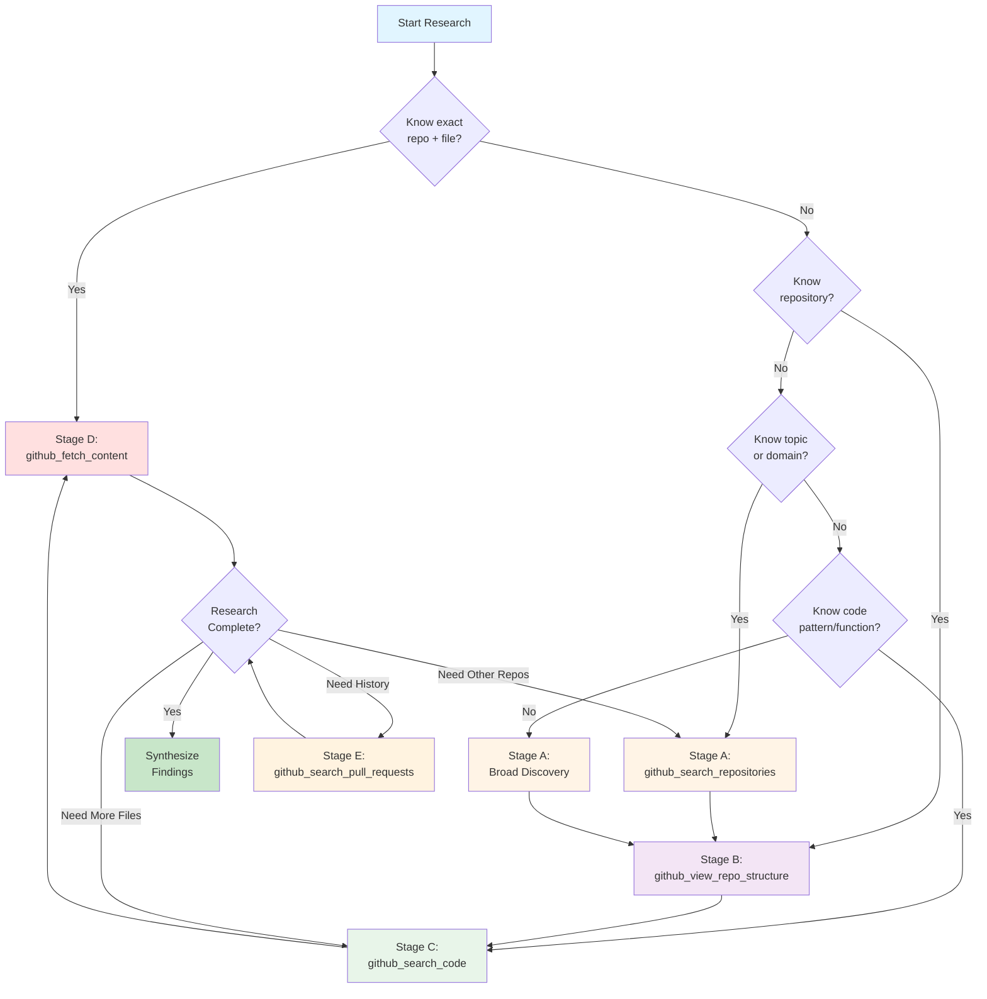
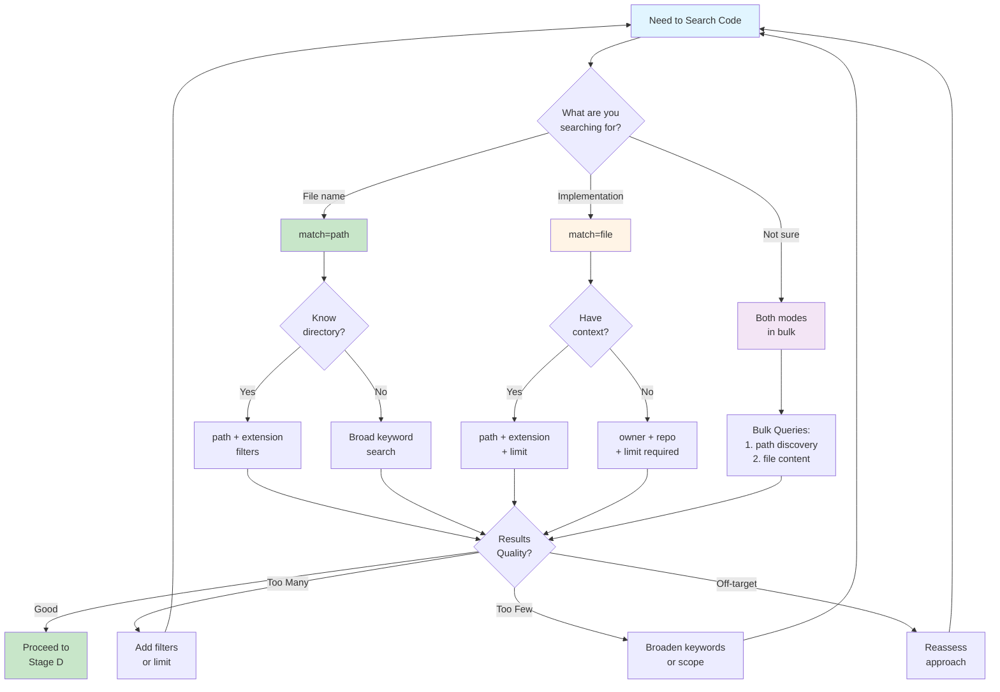
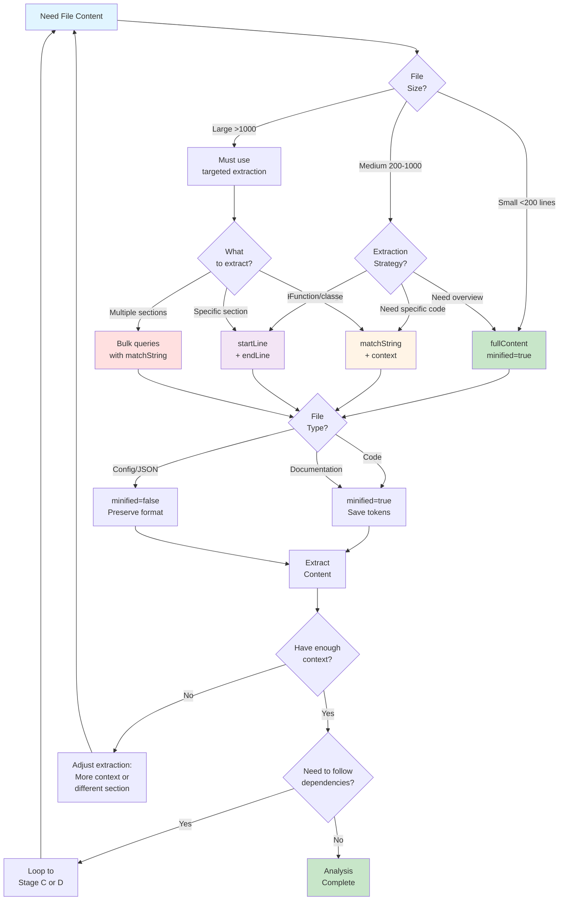

# Research Decision Trees & Thinking Algorithms

## Overview

This document provides systematic decision trees and thinking algorithms for code research using Octocode-MCP tools. Use these frameworks to make optimal tool selection decisions and create effective multi-step research workflows.

---

## Core Research Decision Tree

### Primary Flow: A → B → C → D

```
Stage A: Find Repository (github_search_repositories)
  ├─ Known owner/repo? → Skip to Stage B
  ├─ Known topics? → Targeted topic search (topicsToSearch)
  ├─ Broad themes? → Paired topic+keyword bulk queries
  └─ Generic search? → Keyword search with quality filters (stars>1000)
  
  Thinking Checkpoints:
    • Are results relevant to research goal?
    • Should I normalize filters (stars/language/updated)?
    • Can I compare multiple approaches in bulk?
    • Is this the right domain/technology?

Stage B: Explore Structure (github_view_repo_structure)
  ├─ Unknown layout? → depth=1 first, expand selectively
  ├─ Know target directory? → path="specific/dir", depth=1
  ├─ Unsure branch? → Omit branch parameter (auto-defaults to main)
  └─ Large monorepo? → Explore packages/ separately
  
  Thinking Checkpoints:
    • What are the key directories (src/, lib/, packages/)?
    • Where are tests? Configurations? Entry points?
    • What's the file naming convention?
    • Should I drill deeper into specific directories?

Stage C: Search Pattern (github_search_code)
  ├─ File name search? → match="path" (25x faster discovery)
  ├─ Implementation search? → match="file" + filters
  ├─ Known dirs/extensions? → Apply path/extension/filename filters
  ├─ Multiple hypotheses? → Bulk queries with keyword clusters
  └─ Cross-repo patterns? → Remove owner/repo, add stars filter
  
  Thinking Checkpoints:
    • Are text_matches showing expected patterns?
    • Should I refine keywords or expand scope?
    • Is there cross-repo consistency?
    • Do I need version/language filtering?
    • Should I validate pattern quality across files?

Stage D: Extract Content (github_fetch_content)
  ├─ Specific function/class? → matchString + matchStringContextLines
  ├─ Code block? → startLine/endLine for precise range
  ├─ Full understanding? → fullContent (with minified=true)
  ├─ Config/JSON? → fullContent + minified=false
  └─ Following imports? → Loop back to Stage C
  
  Thinking Checkpoints:
    • Do I have enough context to understand this code?
    • Should I check dependencies (package.json)?
    • Is this current/maintained (check dates)?
    • Should I compare with local implementation?
    • Do I need to follow imports to related files?
```

### Entry Point Selection Matrix

```
Start Point Decision Tree:

Known State              → Entry Stage → Reasoning
────────────────────────────────────────────────────────────────
Exact repo + file path   → Stage D     → Direct content fetch
Repo name known          → Stage B     → Structure exploration
Topic/domain known       → Stage A     → Repository discovery
Owner + vague topic      → Stage A     → Scoped repo search
File name pattern        → Stage C     → Path-based code search
Function/pattern known   → Stage C     → Content-based code search
Complete unknown         → Stage A     → Broad discovery
```

---

## Detailed Thinking Algorithms

### Algorithm 1: Repository Discovery (Stage A)

```yaml
Input: Research goal, domain/topic, constraints
Output: List of relevant repositories

Decision Flow:
  1. Assess Knowledge Level
     IF exact_owner_known AND exact_repo_known:
       → Skip to Stage B (github_view_repo_structure)
     
     IF topic_known AND quality_threshold:
       → Topic Search Strategy
       queries:
         - topicsToSearch: [primary_topic]
           stars: ">1000"
           sort: "stars"
           reasoning: "Find popular, maintained implementations"
     
     IF keywords_only:
       → Keyword Search Strategy
       queries:
         - keywordsToSearch: [term1, term2]
           stars: ">500"
           updated: ">=2023-01-01"
           reasoning: "Find active projects matching description"
     
     IF both_topic_and_keywords:
       → Hybrid Bulk Strategy (auto-splits)
       queries:
         - topicsToSearch: [topic]
           keywordsToSearch: [keywords]
           # Tool auto-expands into separate queries
  
  2. Apply Quality Filters (Thinking Loop)
     FOR each potential_filter IN [stars, updated, created, size]:
       ASK: Does this filter align with research goal?
       EXAMPLES:
         - stars: ">1000" → Production-ready, community-validated
         - updated: ">=2024-01-01" → Active maintenance
         - created: ">=2023-01-01" → Modern practices
         - size: "<5000" → Focused libraries (not frameworks)
  
  3. Evaluate Results (Critical Thinking)
     FOR each result IN results:
       CHECK:
         ✓ Description matches research goal?
         ✓ Topics align with target domain?
         ✓ Stars/activity indicate quality?
         ✓ Last update within acceptable range?
         ✗ Too generic/broad?
         ✗ Wrong language/framework?
       
       IF relevance_score < threshold:
         → Adjust filters and retry
         → Try alternative keywords
         → Broaden or narrow topic scope
  
  4. Select Candidates (Prioritization)
     RANK by:
       1. Direct alignment with research goal
       2. Community validation (stars/forks)
       3. Maintenance activity (recent updates)
       4. Documentation quality (README length/topics)
     
     SELECT top 3-5 repositories for Stage B

Next Stage: B (Structure Exploration)
```

### Algorithm 2: Structure Exploration (Stage B)

```yaml
Input: Repository (owner, repo, branch?)
Output: Directory map, entry points, key files

Decision Flow:
  1. Initial Reconnaissance
     IF unfamiliar_with_repo:
       query:
         owner: "..."
         repo: "..."
         branch: "main"  # or omit for auto-detect
         path: ""
         depth: 1
         reasoning: "Root overview to identify architecture"
     
     IF familiar_with_structure:
       query:
         path: "src"  # or "lib", "packages", etc.
         depth: 2
         reasoning: "Deep dive into implementation directory"
  
  2. Analyze Structure (Pattern Recognition)
     IDENTIFY:
       - Entry points: index.*, main.*, app.*
       - Source code: src/, lib/, packages/
       - Tests: test/, tests/, __tests__/, *.test.*, *.spec.*
       - Configs: *.config.*, .eslintrc, tsconfig.json
       - Docs: docs/, README*, ARCHITECTURE*
       - Build: dist/, build/, out/
     
     RECORD conventions:
       - File naming: kebab-case? camelCase? PascalCase?
       - Test location: Co-located? Separate test/ dir?
       - Module structure: Monorepo? Layered? Feature-based?
  
  3. Map Dependencies (Mental Model)
     BUILD hierarchy:
       Root
       ├── src/           [implementation]
       │   ├── core/      [business logic]
       │   ├── utils/     [helpers]
       │   └── types/     [type definitions]
       ├── tests/         [test suite]
       └── docs/          [documentation]
     
     IDENTIFY key areas for Stage C based on research goal:
       - Authentication? → Look for auth/, security/, middleware/
       - API layer? → Look for api/, routes/, controllers/
       - Data layer? → Look for models/, database/, schema/
  
  4. Prioritize Exploration Targets
     ASK: What directories are most relevant?
     
     IF need_entry_point:
       → Focus on root-level index files
     
     IF need_specific_feature:
       → Drill into feature-specific directories
       NEXT: depth=2 query for that directory
     
     IF monorepo_structure:
       → Explore each package separately
       BULK: queries for packages/pkg1, packages/pkg2, etc.

Next Stage: C (Pattern Search)
```

### Algorithm 3: Pattern Search (Stage C)

```yaml
Input: Pattern/function to find, repository context, structure map
Output: File locations, code snippets, implementation details

Decision Flow:
  1. Choose Search Mode (Critical Decision)
     ASK: What am I searching for?
     
     IF searching_for_filename:
       mode: match="path"
       reasoning: "25x faster, no token-heavy text_matches"
       example:
         keywordsToSearch: ["config", "auth"]
         match: "path"
     
     IF searching_for_implementation:
       mode: match="file"
       reasoning: "Need code snippets to understand implementation"
       example:
         keywordsToSearch: ["authenticate", "verify"]
         match: "file"
         limit: 10
     
     IF searching_for_pattern_validation:
       mode: both (bulk queries)
       reasoning: "Discover files first, then get content"
       example:
         queries:
           - {match: "path", keywordsToSearch: ["auth"]}
           - {match: "file", keywordsToSearch: ["authenticate"], limit: 5}
  
  2. Apply Contextual Filters (Use Stage B Knowledge)
     FROM structure_map:
       IF know_target_directory:
         ADD: path="src/auth"
       
       IF know_file_type:
         ADD: extension="ts"  # or js, py, etc.
       
       IF know_filename_pattern:
         ADD: filename="handler"
     
     FROM research_goal:
       IF need_quality_examples:
         ADD: stars=">1000"
       
       IF specific_repository:
         ADD: owner="...", repo="..."
       
       IF cross_repo_patterns:
         REMOVE: owner/repo
         ADD: stars=">500"  # Quality threshold
  
  3. Formulate Keyword Strategy (Semantic Analysis)
     THINK: What terms would appear in this code?
     
     PRIMARY approach:
       - Use exact terms: "authenticate", "validateToken"
     
     IF no_results:
       → EXPAND with synonyms:
         "auth" → ["authenticate", "authorization", "verify"]
         "cache" → ["memoize", "store", "persist"]
       
       → BROADEN with related terms:
         "error handling" → ["try", "catch", "throw", "error"]
     
     BULK strategy:
       queries:
         - {keywordsToSearch: [exact_term]}
         - {keywordsToSearch: [synonym1, synonym2]}
         - {keywordsToSearch: [broader_term]}
  
  4. Analyze Results (Quality Assessment)
     FOR each result IN search_results:
       IF match="path":
         CHECK:
           ✓ File names match expected patterns?
           ✓ Paths indicate correct layer (src vs test)?
           ✓ Sufficient quantity (not too many/few)?
         
         DECIDE:
           → Proceed to Stage D for promising files
           → OR refine search if results off-target
       
       IF match="file":
         CHECK text_matches:
           ✓ Code snippets show expected usage?
           ✓ Context around matches is relevant?
           ✓ Multiple files show consistent patterns?
           ✗ Test files dominating results? (filter out)
           ✗ Third-party/vendor code? (filter out)
         
         EXTRACT from text_matches:
           - Function names for Stage D matchString
           - Class names for deep-dive
           - Patterns for cross-validation
  
  5. Cross-Reference & Validate (Critical Thinking)
     COMPARE across files:
       • Consistent naming conventions?
       • Similar implementation patterns?
       • Version alignment?
     
     VALIDATE against research goal:
       • Results address the core question?
       • Sufficient examples for understanding?
       • Need more context from other files?
     
     DECIDE next step:
       → Stage D (fetch content) for deep-dive
       → Stage C (refine search) if insufficient
       → Stage B (explore other dirs) if wrong area

Next Stage: D (Content Extraction)
```

### Algorithm 4: Content Extraction (Stage D)

```yaml
Input: File path, extraction strategy, context needs
Output: Code content with sufficient context for understanding

Decision Flow:
  1. Select Extraction Mode (Precision vs Coverage)
     ASSESS: What level of detail is needed?
     
     IF need_specific_function:
       mode: matchString extraction
       strategy:
         matchString: "functionName"  # from Stage C text_matches
         matchStringContextLines: 20  # adjustable 1-50
         minified: true
       reasoning: "85% token savings, focused extraction"
     
     IF need_code_block:
       mode: line range extraction
       strategy:
         startLine: 45
         endLine: 120
         minified: true
       reasoning: "Precise boundaries, efficient"
     
     IF need_full_context:
       mode: full file
       strategy:
         fullContent: true
         minified: true
       reasoning: "Complete picture, minified for efficiency"
     
     IF config_or_data:
       mode: full file, unminified
       strategy:
         fullContent: true
         minified: false
       reasoning: "Preserve structure for configs/JSON/YAML"
  
  2. Optimize Token Usage (Cost-Benefit Analysis)
     CALCULATE estimated tokens:
       - matchString (20 lines context): ~200-400 tokens
       - Line range (50 lines): ~500-1000 tokens
       - Full file (500 lines): ~5000-10000 tokens
       - Full file minified: ~3000-6000 tokens
     
     ASK: Is full file necessary?
       IF file_size > 500_lines AND can_use_matchString:
         → Use matchString extraction
       
       IF need_imports AND need_main_logic:
         → Use two matchString queries in bulk:
           queries:
             - {matchString: "import", matchStringContextLines: 10}
             - {matchString: "mainFunction", matchStringContextLines: 30}
       
       IF exploring_multiple_files:
         → Use bulk queries with matchString
  
  3. Process and Understand Content (Comprehension Loop)
     READ extracted content:
       
     IDENTIFY:
       - Primary functionality
       - Dependencies (imports/requires)
       - External APIs/libraries used
       - Configuration needs
       - Error handling patterns
       - Type definitions (if TypeScript)
     
     CHECK completeness:
       ✓ Imports resolved/understandable?
       ✓ Function signatures clear?
       ✓ Logic flow comprehensible?
       ✓ Sufficient context for research goal?
       ✗ Missing type definitions?
       ✗ Unclear dependencies?
       ✗ External helpers referenced?
  
  4. Follow Dependency Chain (Iterative Deep-Dive)
     IF incomplete_understanding:
       EXTRACT imports/dependencies:
         FROM: import { helper } from './utils/helper'
         ACTION: Loop back to Stage C or D
         
         NEW query:
           path: "utils/helper.ts"
           matchString: "helper"
           reasoning: "Understanding dependency for main function"
       
       BUILD dependency graph:
         main.ts
           ├─ imports: auth.ts (Stage D)
           │   └─ imports: validator.ts (Stage D)
           └─ imports: config.ts (Stage D)
       
       BULK fetch dependencies:
         queries:
           - {path: "auth.ts", matchString: "authenticate"}
           - {path: "validator.ts", matchString: "validate"}
           - {path: "config.ts", fullContent: true, minified: false}
  
  5. Synthesize Understanding (Knowledge Integration)
     COMBINE information from:
       - Primary file content
       - Dependency files
       - Configuration files
       - Type definitions
       - Test files (if explored)
     
     BUILD mental model:
       • How does data flow through the system?
       • What are the entry/exit points?
       • How are errors handled?
       • What are the extension points?
     
     VALIDATE against research goal:
       ✓ Original question answered?
       ✓ Sufficient depth of understanding?
       ✓ Can explain to others?
       ✗ Gaps in understanding?
       ✗ Need historical context (PRs)?
       ✗ Need broader patterns (more repos)?
  
  6. Decide Next Action (Completion Assessment)
     IF research_complete:
       → Synthesize findings
       → Document learnings
       → Answer original question
     
     IF need_more_context:
       → Loop to appropriate stage:
         • More files? → Stage C (code search)
         • Other repos? → Stage A (repo search)
         • Historical context? → Stage E (PR search)
     
     IF need_validation:
       → Cross-reference with:
         • Tests (how is it tested?)
         • Documentation (is it documented?)
         • Usage examples (how is it used?)

Next Stage: Synthesis or Loop back to A/B/C/E
```

---

## Alternative Entry Points & Scenarios

### Scenario 1: Bug Investigation

```
Research Goal: Understand why authentication fails intermittently

Entry Point: Stage C (if known repo) or Stage A (if unknown)

Decision Path:
  1. Stage C: Search for authentication code
     queries:
       - match: "file"
         keywordsToSearch: ["authenticate", "login"]
         path: "src"
         limit: 10
         reasoning: "Find auth implementation"
  
  2. Stage D: Extract auth flow
     queries:
       - path: "src/auth/handler.ts"
         matchString: "authenticate"
         matchStringContextLines: 30
  
  3. Stage C: Find error handling
     queries:
       - match: "file"
         keywordsToSearch: ["error", "catch", "fail"]
         path: "src/auth"
         reasoning: "Understand error scenarios"
  
  4. Stage E (PR Search): Historical context
     queries:
       - query: "authentication fix"
         state: "closed"
         merged: true
         reasoning: "See if this bug was fixed before"
  
  5. Synthesis:
     - Combine current implementation
     - Review error handling patterns
     - Check historical fixes
     - Identify intermittent failure cause

Thinking Questions:
  • Are there race conditions in the code?
  • Is error handling comprehensive?
  • Have similar issues been fixed before?
  • Are there configuration edge cases?
```

### Scenario 2: Architecture Understanding

```
Research Goal: Understand how MCP servers implement authentication

Entry Point: Stage A (broad discovery)

Decision Path:
  1. Stage A: Find MCP server implementations
     queries:
       - topicsToSearch: ["mcp", "model-context-protocol"]
         stars: ">100"
         reasoning: "Quality MCP implementations"
  
  2. Stage B: Explore structure (bulk, multiple repos)
     queries:
       - {owner: "repo1", repo: "mcp-server1", path: "", depth: 1}
       - {owner: "repo2", repo: "mcp-server2", path: "", depth: 1}
       - {owner: "repo3", repo: "mcp-server3", path: "", depth: 1}
       reasoning: "Compare architectural patterns"
  
  3. Stage C: Find auth implementations (bulk)
     queries:
       - {owner: "repo1", repo: "mcp-server1", match: "path", keywordsToSearch: ["auth"]}
       - {owner: "repo2", repo: "mcp-server2", match: "path", keywordsToSearch: ["auth"]}
       - {owner: "repo3", repo: "mcp-server3", match: "path", keywordsToSearch: ["auth"]}
       reasoning: "Discover auth module locations"
  
  4. Stage D: Extract implementations (bulk)
     queries:
       - {owner: "repo1", path: "src/auth/oauth.ts", matchString: "authenticate"}
       - {owner: "repo2", path: "lib/auth.ts", matchString: "authenticate"}
       - {owner: "repo3", path: "server/auth/index.ts", matchString: "authenticate"}
       reasoning: "Compare implementation approaches"
  
  5. Synthesis:
     - Compare patterns across implementations
     - Identify common approaches
     - Note differences and trade-offs
     - Extract best practices

Thinking Questions:
  • What patterns are consistent across repos?
  • What are the trade-offs of each approach?
  • Which implementation is most robust?
  • What would work best for my use case?
```

### Scenario 3: API Integration Learning

```
Research Goal: Learn how to integrate with GitHub API for code search

Entry Point: Stage A → B → D (fast path)

Decision Path:
  1. Stage A: Find GitHub API client libraries
     queries:
       - topicsToSearch: ["github-api"]
         keywordsToSearch: ["code", "search"]
         stars: ">1000"
         reasoning: "Popular, well-tested libraries"
  
  2. Stage B: Quick structure scan
     query:
       owner: "octokit"
       repo: "rest.js"
       path: ""
       depth: 1
       reasoning: "Official library structure"
  
  3. Stage C: Find search endpoints
     queries:
       - match: "path"
         keywordsToSearch: ["search"]
         owner: "octokit"
         repo: "rest.js"
         reasoning: "Locate search modules"
  
  4. Stage D: Extract usage examples
     queries:
       - path: "src/plugins/rest/search/code.ts"
         fullContent: true
         reasoning: "Understand API structure"
       - path: "README.md"
         matchString: "search"
         matchStringContextLines: 20
         reasoning: "Usage documentation"
  
  5. Stage C: Find real-world examples
     queries:
       - match: "file"
         keywordsToSearch: ["octokit.search.code"]
         stars: ">500"
         limit: 10
         reasoning: "See how others use it"
  
  6. Synthesis:
     - API endpoint structure
     - Parameter requirements
     - Response format
     - Real-world usage patterns
     - Error handling approaches

Thinking Questions:
  • What parameters are required vs optional?
  • How do I handle pagination?
  • What are rate limits?
  • How do others handle errors?
```

---

## Visual Decision Trees

### Tool Selection Decision Tree



### Search Mode Decision Tree



### Content Extraction Decision Tree



---

## Advanced Thinking Patterns

### Pattern 1: Progressive Refinement Thinking

```yaml
Iterative Improvement Loop:

Round 1: Broad Discovery
  Action: Wide search with minimal filters
  Thinking:
    • What's the landscape of solutions?
    • What patterns emerge across results?
    • What vocabulary/terms are commonly used?
  
  Collect:
    - Common terms/patterns
    - Popular implementations
    - Naming conventions
    - Technology choices

Round 2: Focused Exploration
  Action: Narrow scope based on Round 1 insights
  Thinking:
    • Which approach aligns with research goal?
    • What specific patterns should I investigate?
    • Where are the high-quality examples?
  
  Apply:
    - Refined keywords from Round 1
    - Quality filters (stars, updates)
    - Scope limits (owner, path, extension)

Round 3: Deep Investigation
  Action: Extract detailed implementation
  Thinking:
    • How does this specific implementation work?
    • What are the edge cases?
    • What dependencies does it have?
  
  Extract:
    - Core logic with matchString
    - Related files via import chain
    - Configuration and setup
    - Tests for validation

Round 4: Validation & Synthesis
  Action: Cross-reference and verify understanding
  Thinking:
    • Is this approach consistent across examples?
    • Are there alternative implementations?
    • What are the trade-offs?
  
  Synthesize:
    - Common patterns
    - Best practices
    - Pitfalls to avoid
    - Recommended approach
```

### Pattern 2: Hypothesis Testing

```yaml
Scientific Method for Code Research:

Step 1: Form Hypothesis
  Based on: Research goal, domain knowledge, initial exploration
  Hypothesis: "Authentication is implemented using JWT middleware"
  
  Predictions:
    • Will find JWT-related imports
    • Middleware pattern in routing
    • Token verification functions
    • Secret/key management

Step 2: Design Experiments (Search Queries)
  Experiment 1: Test for JWT presence
    query:
      match: "file"
      keywordsToSearch: ["jwt", "jsonwebtoken"]
      reasoning: "Verify JWT library usage"
  
  Experiment 2: Test for middleware pattern
    query:
      match: "file"
      keywordsToSearch: ["middleware", "authenticate"]
      reasoning: "Confirm middleware implementation"
  
  Experiment 3: Test for token verification
    query:
      match: "file"
      keywordsToSearch: ["verify", "token"]
      reasoning: "Find verification logic"

Step 3: Collect Evidence
  FOR each experiment:
    EXECUTE query
    RECORD results
    CLASSIFY as:
      ✓ Supports hypothesis
      ✗ Contradicts hypothesis
      ? Inconclusive

Step 4: Analyze Results
  IF majority_support_hypothesis:
    → Hypothesis confirmed
    → Proceed to deep-dive (Stage D)
  
  IF contradictory_evidence:
    → Revise hypothesis
    → Design new experiments
    → Re-test
  
  IF inconclusive:
    → Expand search scope
    → Try alternative keywords
    → Check different repositories

Step 5: Refine Understanding
  BASED on evidence:
    • What is the actual implementation?
    • Why was this approach chosen?
    • What are the variations across repos?
  
  ITERATE:
    → New hypothesis based on findings
    → Test variations
    → Build comprehensive model
```

### Pattern 3: Comparative Analysis

```yaml
Multi-Repository Comparison Framework:

Phase 1: Identify Comparison Targets
  Criteria:
    • Similar domain/purpose
    • Different scale/maturity
    • Varied tech stacks (optional)
  
  Example:
    Target: Authentication implementations
    Repos:
      - Popular framework (e.g., Express.js)
      - Specialized auth library (e.g., Passport)
      - Modern alternative (e.g., Fastify + JWT)

Phase 2: Parallel Exploration (Bulk Operations)
  FOR each repo:
    Stage B: Structure exploration
    Stage C: Pattern discovery
    Stage D: Implementation extraction
  
  Execute in bulk:
    queries:
      - {owner: "repo1", ...}
      - {owner: "repo2", ...}
      - {owner: "repo3", ...}

Phase 3: Feature Matrix Construction
  CREATE comparison table:
  
  Feature          | Repo1 | Repo2 | Repo3 |
  -----------------|-------|-------|-------|
  JWT Support      |   ✓   |   ✓   |   ✓   |
  Session Mgmt     |   ✓   |   ✗   |   ✓   |
  OAuth Integration|   ✓   |   ✓   |   ✓   |
  2FA Support      |   ✗   |   ✓   |   ✓   |
  Password Hashing |   ✓   |   ✓   |   ✓   |
  
  FOR each feature:
    RATE:
      - Implementation quality
      - Code clarity
      - Test coverage
      - Documentation

Phase 4: Pattern Analysis
  IDENTIFY:
    • Consistent patterns (industry standard?)
    • Unique approaches (innovation or quirk?)
    • Common dependencies (ecosystem norms?)
    • Different trade-offs (performance vs security?)
  
  THINK:
    • Why do implementations differ?
    • What contexts favor each approach?
    • What can I learn from each?

Phase 5: Synthesis & Recommendation
  SYNTHESIZE:
    Best practices from all implementations
    Common pitfalls observed
    Trade-off analysis
    Contextual recommendations
  
  OUTPUT:
    • Recommended approach for my context
    • Hybrid solution combining best parts
    • Implementation plan
    • Potential issues to avoid
```

---

## Thinking Checkpoints & Questions

### Stage A: Repository Discovery

**Before Search:**
- [ ] What exactly am I trying to find?
- [ ] Do I know the topic/domain well enough?
- [ ] Should I search by topic or keyword?
- [ ] What quality threshold is appropriate?

**During Analysis:**
- [ ] Are results aligned with my research goal?
- [ ] Should I try alternative search terms?
- [ ] Is there a better way to filter results?
- [ ] Am I being too narrow or too broad?

**After Results:**
- [ ] Do I have enough candidate repositories?
- [ ] Should I explore all or focus on top few?
- [ ] What's my confidence in these selections?

### Stage B: Structure Exploration

**Before Exploration:**
- [ ] Do I know which directory to target?
- [ ] Should I start at root or dive deeper?
- [ ] Is this a monorepo or single-package?
- [ ] What depth is appropriate?

**During Analysis:**
- [ ] What patterns emerge from the structure?
- [ ] Where are the key implementation files?
- [ ] How are tests organized?
- [ ] What's the module hierarchy?

**After Results:**
- [ ] Do I understand the architecture?
- [ ] Which directories should I explore deeper?
- [ ] Are there unexpected patterns?

### Stage C: Pattern Search

**Before Search:**
- [ ] Am I searching for files or content?
- [ ] What keywords best describe the pattern?
- [ ] Should I filter by directory or extension?
- [ ] Should I search one repo or multiple?

**During Analysis:**
- [ ] Are text_matches showing what I expected?
- [ ] Should I refine keywords?
- [ ] Are results too numerous or too sparse?
- [ ] Do I see consistent patterns?

**After Results:**
- [ ] Do I have the right files to investigate?
- [ ] Should I fetch content for all or subset?
- [ ] Are there outliers to investigate?

### Stage D: Content Extraction

**Before Extraction:**
- [ ] What extraction mode is most efficient?
- [ ] Do I need full file or targeted extract?
- [ ] Should I follow dependencies now or later?
- [ ] How will I handle large files?

**During Analysis:**
- [ ] Do I understand the code logic?
- [ ] Are imports/dependencies clear?
- [ ] Is error handling comprehensive?
- [ ] What are the edge cases?

**After Results:**
- [ ] Do I have complete understanding?
- [ ] Should I fetch related files?
- [ ] Can I explain this to others?
- [ ] Have I answered my research goal?

---

## Recovery Strategies

### When Search Returns No Results

```yaml
Diagnostic Questions:
  1. Are my keywords too specific?
  2. Is my scope too narrow (owner/repo/path)?
  3. Am I using the wrong search mode?
  4. Does this pattern actually exist?

Recovery Actions:
  Action 1: Broaden Keywords
    FROM: ["authenticateUser", "validateSession"]
    TO: ["auth", "session"]
    OR: ["authenticate", "validate"]
  
  Action 2: Remove Filters
    FROM: {owner, repo, path, extension}
    TO: {owner, repo}  # Remove path/extension
    OR: {}  # Remove all, search globally
  
  Action 3: Change Search Mode
    FROM: match="file"
    TO: match="path"  # Faster, might find differently
  
  Action 4: Alternative Approach
    IF searching_for_implementation:
      → Try searching for test files
      → Look for documentation
      → Search for imports/usage
  
  Action 5: Verify Assumptions
    → Go back to Stage B (structure)
    → Check if feature exists in this repo
    → Try different repository
```

### When Too Many Results

```yaml
Diagnostic Questions:
  1. Are my keywords too generic?
  2. Am I missing quality filters?
  3. Should I narrow the scope?
  4. Am I including test/vendor files?

Recovery Actions:
  Action 1: Add Specificity
    FROM: ["auth"]
    TO: ["authenticate", "authorization"]
    WITH: extension="ts"
  
  Action 2: Apply Filters
    ADD: path="src"  # Exclude tests
    ADD: limit=10  # Cap results
    ADD: stars=">1000"  # Quality threshold
  
  Action 3: Use Negative Patterns
    EXCLUDE:
      - path NOT CONTAINS "test"
      - path NOT CONTAINS "vendor"
      - path NOT CONTAINS "node_modules"
    (Use structure knowledge from Stage B)
  
  Action 4: Progressive Narrowing
    Round 1: Get all results, analyze patterns
    Round 2: Identify common directories
    Round 3: Focus on most promising directory
```

### When Understanding Is Incomplete

```yaml
Diagnostic Questions:
  1. Am I missing context from imports?
  2. Do I need to see related files?
  3. Is this code using complex patterns?
  4. Should I look at tests or docs?

Recovery Actions:
  Action 1: Follow Dependency Chain
    EXTRACT imports from current file
    FETCH each dependency (bulk)
    BUILD understanding bottom-up
  
  Action 2: Check Tests
    IF implementation_unclear:
      → Search for test files
      → Tests often show usage patterns
      → Tests reveal edge cases
  
  Action 3: Read Documentation
    FETCH: README.md, ARCHITECTURE.md
    WITH: matchString for relevant sections
    UNDERSTAND: Design decisions
  
  Action 4: Historical Context
    → Stage E (PR search)
    → Find implementation PRs
    → Read discussions and decisions
  
  Action 5: Cross-Reference
    → Search same pattern in other repos
    → Compare implementations
    → Identify common approach
```

---

## Summary: Thinking Algorithm Meta-Pattern

```yaml
Universal Research Algorithm:

1. DEFINE
   - Clear research goal
   - Success criteria
   - Constraints (time, depth, scope)

2. ORIENT
   - Assess knowledge state
   - Choose entry point (A/B/C/D)
   - Plan initial approach

3. EXECUTE
   - Run queries with reasoning
   - Use bulk operations
   - Apply contextual filters

4. ANALYZE
   - Evaluate result quality
   - Extract patterns
   - Identify gaps

5. DECIDE
   - Continue current stage?
   - Move to next stage?
   - Loop back for refinement?
   - Try alternative approach?

6. ITERATE
   - Refine based on findings
   - Adjust strategy
   - Deepen or broaden

7. VALIDATE
   - Cross-reference sources
   - Test understanding
   - Check completeness

8. SYNTHESIZE
   - Integrate knowledge
   - Answer research goal
   - Document findings

LOOP until research_complete OR time_limit OR diminishing_returns
```

---

## Quick Reference: Decision Points

| Situation | Tool | Mode/Strategy |
|-----------|------|---------------|
| Need repos | `github_search_repositories` | topics > keywords |
| Unknown structure | `github_view_repo_structure` | depth=1 → depth=2 |
| Find files | `github_search_code` | match="path" (fast) |
| Find implementation | `github_search_code` | match="file" + limit |
| Read specific code | `github_fetch_content` | matchString + context |
| Read full file | `github_fetch_content` | fullContent |
| Read config | `github_fetch_content` | fullContent + minified=false |
| Follow imports | Loop: `github_search_code` → `github_fetch_content` |
| Compare repos | Bulk queries across repos |
| Historical context | `github_search_pull_requests` | merged=true |
| No results | Broaden keywords, remove filters |
| Too many results | Add filters, increase specificity |
| Incomplete understanding | Follow dependencies, check tests |

---

## Attribution

This documentation is powered by **Octocode MCP Research** (https://github.com/bgauryy/octocode-mcp).

⭐ Star the repo if you find this useful!

