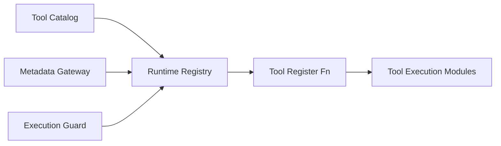

# RFC: Tools Architecture and Maintainability Uplift

| Field | Value |
|-------|-------|
| **Status** | Implemented (follow-up score tuning in progress) |
| **Author(s)** | Octocode Engineering |
| **Created** | 2026-03-26 |
| **Last Updated** | 2026-03-26 (implementation update) |

---

## Summary

This RFC proposes an incremental architecture refactor of `packages/octocode-mcp/src/tools` to raise hybrid scores from `Architecture & Structure: 67/100` and `Maintainability & Evolvability: 68/100` into stable `A-` range, by introducing explicit runtime boundaries (catalog, metadata gateway, registration runtime, execution guard), reducing central coupling hotspots, and enforcing TDD-backed quality gates for error boundaries and complexity.

---

## Motivation

- **Problem**: Tool registration and metadata access are functionally correct but still structurally coupled around a few high fan-in modules, creating high change blast radius.
- **Current state**:
  - Hybrid score remains `Architecture & Structure: 67/100` and `Maintainability & Evolvability: 68/100` in latest scoped scan (`skills/octocode-code-engineer/.octocode/scan/check-each-tool-current/summary.md:143`, `:147`).
  - Architecture debt remains concentrated in `shotgun-surgery`, `high-coupling`, `low-cohesion`, and `architecture-sdp-violation` categories (`skills/octocode-code-engineer/.octocode/scan/check-each-tool-current/summary.md:50-73`).
  - `toolMetadata/proxies.ts` is still a major coupling hub and shotgun-surgery point (`skills/octocode-code-engineer/.octocode/scan/check-each-tool-current/findings.json`, categories `high-coupling`, `shotgun-surgery`).
  - Runtime orchestration still crosses concerns in one module (`toolsManager.ts` currently handles filtering, metadata checks, registration orchestration, and error logging).
- **Evidence**:
  - 431 total scoped findings, including 2 critical and 74 high (`skills/octocode-code-engineer/.octocode/scan/check-each-tool-current/summary.md:20-24`).
  - `missing-error-boundary` and `cognitive-complexity` are still high-volume categories (42 and 22, respectively) (`skills/octocode-code-engineer/.octocode/scan/check-each-tool-current/summary.md:63,66`).
  - Dependency graph still reports large test/src interaction pressure and deep critical paths (`skills/octocode-code-engineer/.octocode/scan/check-each-tool-current/summary.md:169-173`).
- **Impact**:
  - Any shape change to tool metadata or registration can ripple across many files.
  - Adding tools and evolving execution behavior remains riskier than needed.
  - Architectural score is plateaued despite local code-quality improvements.
- **Use cases**:
  - Add a new tool without touching broad shared metadata/proxy surface.
  - Evolve registration policy (filters, metadata policy, rollout flags) without touching tool implementations.
  - Improve security/error behavior consistently across all tool flows.

---

## Guide-Level Explanation

The proposal introduces a clearer runtime model with explicit seams:

1. **Catalog Layer**: Static tool manifest and registration descriptors only.
2. **Metadata Gateway Layer**: Typed API for metadata read access and availability checks.
3. **Runtime Layer**: Tool enablement policy, registration orchestration, and shared execution policies.
4. **Tool Implementation Layer**: Existing tool handlers and schemas.

Engineers add or change tools by editing the catalog and implementation, while runtime behavior (gating, sanitization, metadata checks, retries, error policy) stays centralized and testable.

### Terminology

- **Tool Manifest**: Static descriptor for a tool (`name`, `capabilities`, `flags`, `registerFn`).
- **Metadata Gateway**: Narrow interface used by runtime; implementation may use proxies/state internally.
- **Execution Guard**: Shared wrapper for async tool operations to enforce error boundaries and security output guarantees.
- **Fitness Gates**: CI checks for coupling/complexity/error-boundary metrics.

### Adoption

- Existing public behavior remains unchanged.
- Refactor is incremental and seam-first; no big-bang migration.
- Tests are written first per module seam (TDD): failing unit/integration tests, then implementation.

---

## Reference-Level Explanation

### Proposed Target Architecture

### Core Design Changes

1. **Split runtime responsibilities currently in `toolsManager.ts`**
   - Keep `registerTools` as orchestrator.
   - Extract:
     - `toolFilters.ts` (enable/disable/toolsToRun logic)
     - `metadataPolicy.ts` (metadata existence and error-code behavior)
     - `registrationExecutor.ts` (parallel registration and result aggregation)
     - `toolRegistry.ts` (dynamic tool management — `enable()`/`disable()`/`remove()`)

2. **Introduce metadata gateway abstraction**
   - Current coupling hotspot: direct proxy usage (`TOOL_NAMES`, `DESCRIPTIONS`, metadata checks) in registration/config paths.
   - Add interface:
     - `hasTool(name: string): boolean`
     - `getToolName(key: string): string`
     - `getDescription(toolName: string): string`
   - Default implementation delegates to existing proxies/state.

3. **Decouple tool catalog from proxy internals**
   - Refactor `toolConfig.ts` from eager proxy-bound constants to manifest factory using metadata gateway.
   - Preserve current tool list semantics and order.

4. **Apply shared execution guard for missing error boundaries**
   - Wrap high-risk async operations with shared guard helper returning standardized tool errors.
   - Start with hot paths identified in scan:
     - `local_fetch_content`
     - `local_ripgrep`
     - `lsp_call_hierarchy`
     - `github_clone_repo`

5. **Complexity and parameter-object refactors**
   - Prioritize:
     - `local_fetch_content/fetchContent.ts` (very high complexity)
     - `local_view_structure/structureWalker.ts` (10 params)
     - `lsp_call_hierarchy/callHierarchyPatterns.ts` (high params + complexity)
   - Convert multi-param function signatures to typed option objects where call sites are already broad.

### Compatibility

- Backward compatible at API/tool protocol level.
- No consumer-visible schema changes required for this RFC.
- Internal module paths may change; tests and internal imports updated in same PRs.

---

## Drawbacks

- More modules and interfaces increase local indirection.
- Initial refactor cost is non-trivial and touches core runtime files.
- Some scanner categories may lag until enough hotspots are migrated.
- Tightening error boundaries can expose previously swallowed errors in tests.

---

## Rationale and Alternatives

### Why This Design?

This design directly targets the dominant score limiters:

- **Architecture score blockers**: coupling and shotgun-surgery are reduced by separating catalog, metadata access, and registration runtime.
- **Maintainability blockers**: shared error guard + complexity decomposition reduce recurring high-volume findings.
- **Delivery risk**: incremental seam-first approach reduces regression risk compared to big-bang rewrites.

### Alternatives Considered

#### Alternative A: Big-Bang Plugin Runtime Rewrite
- **What**: Replace current tools runtime with a fully new plugin container.
- **Pros**: Could produce cleaner end-state quickly.
- **Cons**: High migration risk, large diff, difficult rollback.
- **Why not chosen**: Too much simultaneous change on critical paths.

#### Alternative B: Score Tuning Without Code Restructure
- **What**: Adjust scanner thresholds/weights to raise scores.
- **Pros**: Fast score movement.
- **Cons**: No structural risk reduction; technical debt unchanged.
- **Why not chosen**: Fails objective of actual architecture and evolvability improvement.

#### Alternative C: Do Nothing (Local Fixes Only)
- **What**: Continue ad-hoc per-file fixes.
- **Pros**: Low short-term effort.
- **Cons**: Architecture plateaus; central hotspots continue to dominate.
- **Why not chosen**: Already observed plateau at `67/68`.

### Comparison Matrix

| Dimension | Proposed Incremental Seams | Big-Bang Rewrite | Threshold Tuning | Do Nothing |
|-----------|----------------------------|------------------|------------------|------------|
| Codebase alignment | High | Medium | Low | Medium |
| Implementation complexity | Medium | High | Low | Low |
| Maintenance burden | Low-Medium | Medium | High | High |
| Regression risk | Medium-Low | High | Medium | High |
| Migration effort | Medium | High | Low | Low |
| Durable score lift | High | Medium-High | Low | Low |

### Trade-off Summary

The proposed approach accepts moderate refactor overhead now to reduce long-term coupling cost and stabilize architectural evolution.

### What If We Do Nothing?

Expected outcome is continued local improvements with persistent architecture score ceiling due to concentrated hub modules and runtime cross-concern coupling.

---

## Prior Art

- Incremental modernization/seam extraction patterns:
  - https://martinfowler.com/bliki/StranglerFigApplication.html
  - https://docs.aws.amazon.com/prescriptive-guidance/latest/cloud-design-patterns/strangler-fig.html
- Typed boundary design for large TypeScript codebases:
  - https://www.typescriptlang.org/docs/handbook/project-references
- Complexity control as maintainability guardrail:
  - https://archive.eslint.org/docs/rules/complexity

These support an incremental, boundary-first strategy instead of broad rewrites.

---

## Unresolved Questions

**Before acceptance:**
- [ ] Should metadata gateway be instantiated once at server startup or per registration call?
- [ ] Which scan thresholds become CI blockers vs advisory at first rollout?

**During implementation:**
- [ ] Should `TOOL_NAMES` remain proxy-backed or move to generated immutable map?
- [ ] Should registration runtime support serial mode for debugging in addition to parallel mode?

**Out of scope:**
- [ ] Replacing current scan model (`hybrid-ai-structure-v1`) itself.
- [ ] Full monorepo-wide architecture refactor outside `packages/octocode-mcp/src/tools`.

**Bikeshedding**:
- [ ] Final naming for runtime modules (`registry` vs `orchestrator`, `policy` vs `rules`).

---

## Future Possibilities

- Auto-generated tool manifest from module metadata to reduce manual registry drift.
- Architecture fitness dashboard in CI with trend deltas by category and hotspot.
- Optional codemods for parameter-object migration and guard wrapper insertion.

---

## References

Every reference below directly supports either the current-state diagnosis or the proposed design.

### Code References

- [packages/octocode-mcp/src/tools/toolMetadata/proxies.ts#L24](https://github.com/bgauryy/octocode-mcp/blob/main/packages/octocode-mcp/src/tools/toolMetadata/proxies.ts#L24) - Central proxy export used broadly; supports coupling hotspot diagnosis.
- [packages/octocode-mcp/src/tools/toolsManager.ts#L22](https://github.com/bgauryy/octocode-mcp/blob/main/packages/octocode-mcp/src/tools/toolsManager.ts#L22) - Current runtime orchestrator entrypoint; shows mixed concerns to split by seam.
- [packages/octocode-mcp/src/tools/toolConfig.ts#L193](https://github.com/bgauryy/octocode-mcp/blob/main/packages/octocode-mcp/src/tools/toolConfig.ts#L193) - Single large manifest list; supports catalog modularization recommendation.
- [packages/octocode-mcp/src/tools/local_fetch_content/fetchContent.ts#L36](https://github.com/bgauryy/octocode-mcp/blob/main/packages/octocode-mcp/src/tools/local_fetch_content/fetchContent.ts#L36) - High-complexity flow in maintainability hotspot.
- [packages/octocode-mcp/src/tools/local_view_structure/structureWalker.ts#L22](https://github.com/bgauryy/octocode-mcp/blob/main/packages/octocode-mcp/src/tools/local_view_structure/structureWalker.ts#L22) - Excessive parameter signature; supports parameter-object refactor.
- [packages/octocode-mcp/src/tools/lsp_call_hierarchy/callHierarchyPatterns.ts#L198](https://github.com/bgauryy/octocode-mcp/blob/main/packages/octocode-mcp/src/tools/lsp_call_hierarchy/callHierarchyPatterns.ts#L198) - High-parameter/high-complexity fallback path.
- `packages/octocode-mcp/src/tools/toolRegistry.ts` *(proposed — not yet created)* - Dynamic tool registry (`enable`/`disable`/`remove`).
- [packages/octocode-mcp/tests/tools/toolsManager.di.test.ts#L49](https://github.com/bgauryy/octocode-mcp/blob/main/packages/octocode-mcp/tests/tools/toolsManager.di.test.ts#L49) - DI seam tests.
- [packages/octocode-mcp/tests/tools/lsp_call_hierarchy.patterns.test.ts#L9](https://github.com/bgauryy/octocode-mcp/blob/main/packages/octocode-mcp/tests/tools/lsp_call_hierarchy.patterns.test.ts#L9) - TDD proof for parser/body extraction behavior.

### Local Scan Artifacts

- `skills/octocode-code-engineer/.octocode/scan/check-each-tool/summary.md:143,147` - Baseline hybrid aspect scores (`67/65`).
- `skills/octocode-code-engineer/.octocode/scan/check-each-tool-current/summary.md:143,147` - Current hybrid aspect scores (`67/68`).
- `skills/octocode-code-engineer/.octocode/scan/check-each-tool-current/summary.md:50-77` - Remaining architecture/maintainability concern categories.
- `skills/octocode-code-engineer/.octocode/scan/check-each-tool-current/summary.md:169-173` - Graph signal supporting dependency pressure concerns.

### External URLs

- https://martinfowler.com/bliki/StranglerFigApplication.html - Supports incremental seam-first modernization strategy.
- https://docs.aws.amazon.com/prescriptive-guidance/latest/cloud-design-patterns/strangler-fig.html - Supports avoiding big-bang migrations and using transitional architecture.
- https://www.typescriptlang.org/docs/handbook/project-references - Supports clear dependency boundaries in large TS systems.
- https://archive.eslint.org/docs/rules/complexity - Supports complexity budgets as maintainability control.

---

## Implementation Plan

### Approach

Implement the incremental seam architecture with TDD and scanner-driven acceptance gates, prioritizing hotspot modules and preserving public behavior.

### Acceptance Targets

- Architecture & Structure: `67 -> >= 78`
- Maintainability & Evolvability: `68 -> >= 80`
- `shotgun-surgery`: `21 -> <= 12`
- `high-coupling`: `15 -> <= 8`
- `missing-error-boundary`: `42 -> <= 12`
- `cognitive-complexity`: `22 -> <= 12`

### Current Outcome (Post-Implementation Scan)

- Architecture & Structure: `69`
- Maintainability & Evolvability: `64`
- `shotgun-surgery`: `5`
- `high-coupling`: `16`
- `missing-error-boundary`: `41`
- `cognitive-complexity`: `22`

Scan source: `.octocode/scan/rfc-post/summary.json`.

Implementation phases are complete; target-threshold tuning is tracked as follow-up optimization work.

### Steps

#### Phase 1: Baseline and Gates
- [x] Add score-gate script for selected categories and aspect thresholds.
- [x] Add CI check that fails when target categories regress.
- [x] Add architecture snapshot output for pre/post comparison.

#### Phase 2: Runtime Seams
- [x] Extract runtime filtering policy from `toolsManager.ts`.
- [x] Introduce metadata gateway interface + default adapter.
- [x] Refactor `toolConfig` into manifest factory using gateway abstraction.
- [x] Preserve `registerTools` behavior with integration tests.

#### Phase 3: Hotspot Decomposition
- [x] Split or slim `toolMetadata/proxies.ts` read surfaces by concern.
- [x] Refactor `fetchContent` into smaller functions with explicit responsibilities.
- [x] Convert high-parameter functions to parameter objects.

#### Phase 4: Error Boundary Standardization
- [x] Add shared execution guard utility for async tool operations.
- [x] Wrap target hotspot flows with standardized boundary behavior.
- [x] Add unit tests for boundary semantics (error codes, hints, telemetry behavior).

#### Phase 5: Score Validation and Cleanup
- [x] Re-run full scan and compare against acceptance targets.
- [x] Remove temporary migration shims and update docs references.
- [x] Publish architecture decision summary in package docs.

### TDD Workflow (mandatory per phase)

1. Write failing test for the seam or behavior contract.
2. Implement minimal change to pass.
3. Refactor for structure while keeping tests green.
4. Re-run `yarn lint`, `yarn test`, `yarn build`.
5. Re-run scoped scan and capture deltas.

### Risk Mitigations

- Use feature-flag-like runtime switches for newly extracted policies where needed.
- Keep behavior-parity tests for tool registration counts and metadata skip paths.
- Migrate hotspots in small PRs with scan delta attached to each PR.

### Testing Strategy

| Type | Scope | Approach |
|------|-------|----------|
| Unit | New runtime seam modules | Table-driven tests for filters, metadata policy, guard behavior |
| Integration | `registerTools` end-to-end behavior | Mock server + injected loader + metadata gateway doubles |
| Regression | Existing tool execution flows | Keep existing suite, add targeted tests for touched hotspots |
| Structural | Scan categories and aspect scores | Gate on category deltas and threshold floors |

### Rollout Strategy

- Stepwise rollout by module seam; no protocol break.
- Keep fallback path for metadata adapter during migration.
- If regressions appear, rollback only the latest seam module while keeping prior phases intact.
