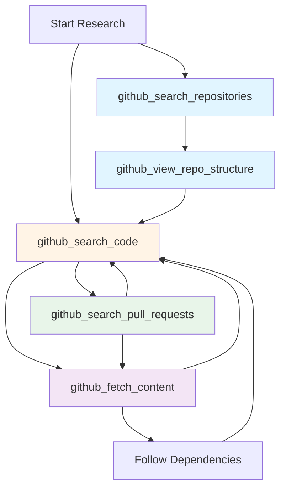

# Tools & Research Workflows

## Overview

Octocode-MCP provides a sophisticated ecosystem of interconnected tools designed for progressive GitHub code research. This document explains how tools work together, the hint system that guides research, and best practices for multi-step investigations.

## Core Philosophy

The tool ecosystem is built on these principles:

1. **Progressive Refinement**: Start broad → analyze patterns → narrow focus → deep-dive
2. **Tool Chaining**: Each tool suggests optimal next steps through hints
3. **Bulk Operations**: Execute multiple related queries in parallel for efficiency
4. **Context-Aware Guidance**: Hints adapt based on results (hasResults, empty, error)
5. **Research Continuity**: Tools maintain research goals and reasoning across chains

---

## Tool Catalog

### 🔍 Discovery Tools

#### `github_search_repositories`
**Purpose**: Find and discover repositories by topic or keywords

**When to Use**:
- Starting new research without a specific repo
- Discovering libraries/projects in a domain
- Finding examples of specific technologies

**Key Features**:
- `topicsToSearch`: Curated GitHub topics (most precise)
- `keywordsToSearch`: Search across name/description/README (broader)
- Quality filters: stars, created date, updated date
- Auto-expands: Queries with both topics + keywords split into separate searches

**Output**: List of repositories with metadata (stars, description, topics, URLs)

**Next Steps**: 
- `github_view_repo_structure` → Explore repository organization
- `github_search_code` → Find specific implementations

---

#### `github_view_repo_structure`
**Purpose**: Explore directory structure and file organization

**When to Use**:
- New/unfamiliar repository exploration
- Understanding codebase architecture
- Finding entry points and key directories

**Key Features**:
- `depth`: 1 (current dir only) or 2 (includes subdirectories)
- `path`: Target specific directory ("src/api") or root ("")
- Filters out ignored files (node_modules, .git, etc.)

**Output**: Lists of files and folders with paths

**Next Steps**:
- `github_search_code` → Search in discovered directories
- `github_fetch_content` → Read interesting files

---

### 🎯 Search Tools

#### `github_search_code`
**Purpose**: Search file contents or filenames with pattern matching

**When to Use**:
- Finding specific functions, classes, or patterns
- Discovering files by name
- Locating implementations across codebases

**Key Features**:
- `match="path"`: Fast filename/directory search (25x faster)
- `match="file"`: Content search with code snippets (returns text_matches)
- Filters: owner/repo, path, extension, stars
- `keywordsToSearch`: AND logic for multiple terms

**Output**: 
- Path mode: Just file paths
- File mode: Paths + text_matches (code snippets showing context)

**Next Steps**:
- `github_fetch_content` → Read full file content (use text_matches for matchString)
- `github_view_repo_structure` → If no results, understand structure first

---

### 📖 Content Tools

#### `github_fetch_content`
**Purpose**: Read file contents with smart extraction strategies

**When to Use**:
- Reading discovered files from search results
- Extracting specific functions/classes
- Analyzing configuration or documentation

**Key Features**:
- `matchString`: Extract specific sections with context (85% token savings)
- `startLine`/`endLine`: Read precise line ranges
- `fullContent`: Read entire file
- `minified`: Auto-minification for token efficiency (default: true)
- `matchStringContextLines`: Control context around matches (default: 5)

**Output**: 
- File content (minified or full)
- Metadata: contentLength, isPartial, minification status
- Optional: AI sampling/explanation of code

**Next Steps**:
- `github_search_code` → Find related implementations
- Follow imports/dependencies to explore related files

---

### 📝 History Tools

#### `github_search_pull_requests`
**Purpose**: Search and analyze pull requests with discussions and diffs

**When to Use**:
- Understanding how features were implemented
- Finding expert contributions
- Learning from code reviews and discussions
- Researching production-proven solutions

**Key Features**:
- `prNumber`: Direct PR fetch (10x faster if you know the number)
- Filters: state (open/closed), merged, author, labels, dates
- `withContent`: Include code diffs (very token expensive)
- `withComments`: Include discussion threads (token expensive)
- Rich search: query text across title/body/comments

**Output**:
- PR metadata: title, state, merged status, timestamps
- Optional: code diffs and comment threads
- Total count and completeness indicators

**Next Steps**:
- `github_fetch_content` → Compare with current implementation
- `github_search_code` → Find patterns mentioned in PR

---

## The Hint System

### How Hints Work

Every tool response includes contextual hints that guide the next research steps. Hints adapt based on three result states:

1. **`hasResults`**: Successful queries with data
   - Suggestions for analyzing and extending findings
   - Next tools to deepen investigation
   - Best practices for result validation

2. **`empty`**: Valid queries with no results
   - Recovery strategies (broaden search, adjust filters)
   - Alternative approaches
   - Common pitfalls to avoid

3. **`error`**: Failed operations
   - Authentication and permission issues
   - Rate limit information
   - API error details and remediation

### Hint Hierarchy

Hints are composed from three sources:

1. **Base Hints**: Universal guidance for all tools
   - Verify results against research goals
   - Plan multi-step workflows
   - Use bulk operations for efficiency
   - Attribution and documentation guidelines

2. **Tool-Specific Hints**: Contextual guidance per tool
   - Optimal next tool suggestions
   - Parameter optimization tips
   - Common patterns and anti-patterns

3. **Custom Hints**: Dynamic hints from tool logic
   - Search-type specific guidance (topics vs keywords)
   - Result quality indicators
   - Relevance verification reminders

### Hint Examples

#### Code Search - hasResults
```yaml
hasResults:
  # Base hints
  - "Make sure results satisfy the researchGoal and reasoning"
  - "Use bulk queries to research multiple patterns simultaneously"
  
  # Tool-specific hints
  - "use 'matchString' in github_fetch_content to get more context"
  - "Switch between match='file' (content) and match='path' (discovery)"
  - "Use text_matches to identify exact code locations"
```

#### Repository Search - empty
```yaml
empty:
  # Base hints
  - "Reassess the research goal - consider alternative approaches"
  - "Broaden filters or adjust scope"
  
  # Tool-specific hints
  - "Start with topicsToSearch for curated discovery"
  - "Add synonyms (e.g., 'server' → 'provider', 'plugin')"
  - "Try match=['name'] for name-only search"
  
  # Custom hints (from tool logic)
  - "No results with keywords - try topicsToSearch for precise discovery"
```

---

## Response Format

All tools return structured responses with consistent formatting:

```yaml
# Single Query Response
instructions: "Research-wide guidance applicable to all results"
data:
  status: "hasResults" | "empty" | "error"
  researchGoal: "What you wanted to find"
  reasoning: "Why this search approach"
  # Tool-specific data fields
  repositories: [...]  # for repo search
  files: [...]         # for code search
  content: "..."       # for fetch content
  # Result metadata
  hints: ["Next step suggestions..."]
  error: "Error message if status=error"

# Bulk Query Response
instructions: "Research-wide guidance for entire batch"
results:
  - query: {...}         # Original query parameters
    status: "hasResults" | "empty" | "error"
    researchGoal: "..."
    reasoning: "..."
    data: {...}          # Tool-specific results
    hints: [...]         # Query-specific hints (optional)
    
hasResultsStatusHints: ["Hints for successful queries"]
emptyStatusHints: ["Hints for empty queries"]
errorStatusHints: ["Hints for failed queries"]
```

### Response Processing Flow

1. **Clean**: Remove empty objects, nulls, undefined, NaN
2. **Convert**: JSON → YAML for readability
3. **Sanitize**: Remove malicious patterns and prompt injections
4. **Mask**: Redact sensitive information (API keys, tokens)

---

## Research Workflow Patterns

### Pattern 1: Discovery → Exploration → Deep-Dive

**Goal**: Understand how authentication works in MCP servers

```yaml
# Step 1: Discovery
tool: github_search_repositories
queries:
  - topicsToSearch: ["mcp"]
    stars: ">100"
    researchGoal: "Find MCP server implementations"
    reasoning: "Topic search for curated, quality repos"

# Step 2: Exploration
tool: github_view_repo_structure
queries:
  - owner: "modelcontextprotocol"
    repo: "servers"
    branch: "main"
    path: ""
    depth: 1
    researchGoal: "Understand MCP servers structure"
    reasoning: "Root overview to find auth modules"

# Step 3: Discovery Refinement
tool: github_search_code
queries:
  - owner: "modelcontextprotocol"
    repo: "servers"
    match: "path"
    keywordsToSearch: ["auth"]
    researchGoal: "Find auth-related files"
    reasoning: "Path search for fast filename discovery"

# Step 4: Deep-Dive
tool: github_fetch_content
queries:
  - owner: "modelcontextprotocol"
    repo: "servers"
    path: "src/auth/handler.ts"
    matchString: "authenticate"
    matchStringContextLines: 20
    researchGoal: "Understand authentication implementation"
    reasoning: "Extract auth logic with context"
```

**Hint Flow**:
1. Repo search → "Map structure with github_view_repo_structure"
2. Structure view → "Use github_search_code to search in discovered dirs"
3. Code search → "Use matchString in github_fetch_content"
4. Fetch content → "Follow imports to explore related files"

---

### Pattern 2: Parallel Discovery + Validation

**Goal**: Compare React state management approaches across projects

```yaml
# Bulk search across multiple dimensions
tool: github_search_code
queries:
  # Discovery: Find files
  - match: "path"
    keywordsToSearch: ["useState"]
    owner: "facebook"
    repo: "react"
    researchGoal: "Find useState usage examples"
    reasoning: "Fast path search for hooks files"
  
  # Detailed: Get implementations
  - match: "file"
    keywordsToSearch: ["useState", "useEffect"]
    owner: "facebook"
    repo: "react"
    limit: 5
    researchGoal: "Find combined hooks patterns"
    reasoning: "Content search for hook combinations"
  
  # Validation: Check patterns in another project
  - match: "file"
    keywordsToSearch: ["useState"]
    owner: "vercel"
    repo: "next.js"
    limit: 5
    researchGoal: "Validate patterns in Next.js"
    reasoning: "Cross-validate state management approaches"
```

**Benefits**:
- 5-10x faster than sequential searches
- Complete context for cross-referencing
- Pattern validation across projects
- Single response with all data

---

### Pattern 3: Historical Context → Current State

**Goal**: Understand how a feature was implemented and evolved

```yaml
# Step 1: Find relevant PRs
tool: github_search_pull_requests
queries:
  - owner: "modelcontextprotocol"
    repo: "typescript-sdk"
    state: "closed"
    merged: true
    query: "authentication"
    match: ["title", "body"]
    limit: 5
    withContent: true
    researchGoal: "Find auth implementation PRs"
    reasoning: "Merged PRs show production implementation"

# Step 2: Get current implementation
tool: github_fetch_content
queries:
  - owner: "modelcontextprotocol"
    repo: "typescript-sdk"
    path: "src/auth/oauth.ts"  # From PR analysis
    matchString: "OAuthHandler"
    matchStringContextLines: 30
    researchGoal: "Current OAuth implementation"
    reasoning: "Compare current code with PR changes"

# Step 3: Find usage examples
tool: github_search_code
queries:
  - owner: "modelcontextprotocol"
    repo: "typescript-sdk"
    match: "file"
    keywordsToSearch: ["OAuthHandler"]
    limit: 10
    researchGoal: "Find OAuth usage patterns"
    reasoning: "Understand real-world usage"
```

**Hint Flow**:
1. PR search → "Use github_fetch_content for current code"
2. Fetch content → "Use github_search_code to find usage"
3. Code search → Success! Complete picture of implementation

---

### Pattern 4: Cross-Repository Pattern Analysis

**Goal**: Learn best practices for error handling across popular libraries

```yaml
# Bulk parallel research across multiple repos
tool: github_search_code
queries:
  # React error handling
  - owner: "facebook"
    repo: "react"
    match: "file"
    keywordsToSearch: ["ErrorBoundary"]
    limit: 5
    researchGoal: "React error patterns"
    reasoning: "Learn from React's approach"
  
  # Next.js error handling
  - owner: "vercel"
    repo: "next.js"
    match: "file"
    keywordsToSearch: ["error", "boundary"]
    limit: 5
    researchGoal: "Next.js error patterns"
    reasoning: "Production framework patterns"
  
  # Vue error handling
  - owner: "vuejs"
    repo: "core"
    match: "file"
    keywordsToSearch: ["errorHandler"]
    limit: 5
    researchGoal: "Vue error patterns"
    reasoning: "Alternative framework approach"

# Follow-up: Deep dive into best pattern
tool: github_fetch_content
queries:
  - owner: "facebook"
    repo: "react"
    path: "packages/react-reconciler/src/ReactFiberErrorBoundary.js"
    matchString: "captureCommitPhaseError"
    matchStringContextLines: 40
    researchGoal: "Detailed error capture logic"
    reasoning: "React's approach was most comprehensive"
```

---

## Tool Relationships Map



### Connection Patterns

#### Discovery Phase
- **Repository Search** → View Structure → Code Search
- Use when: Starting from scratch, no known repository

#### Exploration Phase
- **View Structure** → Code Search → Fetch Content
- Use when: Have repository, need to understand organization

#### Investigation Phase
- **Code Search** → Fetch Content → Code Search (follow deps)
- Use when: Following implementation chains

#### Historical Phase
- **PR Search** → Fetch Content (current) + Code Search (usage)
- Use when: Understanding implementation evolution

---

## Best Practices

### 1. Always Define Research Context

**Good**:
```yaml
researchGoal: "Find authentication middleware implementations in Express servers"
reasoning: "Starting with topic search for curated auth libraries"
```

**Bad**:
```yaml
researchGoal: "auth"
reasoning: ""
```

**Why**: Context helps tools provide better hints and maintains continuity across chains.

---

### 2. Use Bulk Operations

**Good**:
```yaml
queries:
  - {match: "path", keywordsToSearch: ["auth"]}
  - {match: "file", keywordsToSearch: ["authenticate"], limit: 5}
  - {match: "file", keywordsToSearch: ["authorize"], limit: 5}
```

**Bad**: Three sequential single-query calls

**Why**: 5-10x faster, better context for analysis, single response

---

### 3. Progressive Refinement

**Good Flow**:
1. Broad path search: `match="path", keywordsToSearch=["auth"]`
2. Analyze results, identify patterns
3. Narrow content search: `match="file", path="src/auth", extension="ts"`
4. Deep-dive: Fetch specific files with `matchString`

**Bad Flow**: Immediately jumping to narrow file search without discovery

**Why**: Progressive approach ensures you don't miss relevant code

---

### 4. Follow Hints

**Tool says**: 
```yaml
hints:
  - "use 'matchString' in github_fetch_content to get more context"
  - "Use text_matches to identify exact code locations"
```

**You should**:
```yaml
tool: github_fetch_content
queries:
  - path: "src/auth/handler.ts"
    matchString: "validateToken"  # From text_matches
    matchStringContextLines: 20
```

**Why**: Hints are context-aware and guide optimal research flow

---

### 5. Verify Results Against Goals

After each step, check:
- ✅ Do results match my `researchGoal`?
- ✅ Does my `reasoning` still make sense?
- ✅ Should I adjust search parameters?
- ✅ What do hints suggest next?

**Example**:
```yaml
# Step 1: Too broad
researchGoal: "Find all React hooks"
results: 1000+ files
conclusion: "Too many results, need to narrow"

# Step 2: Refined
researchGoal: "Find custom authentication hooks in React"
keywordsToSearch: ["useAuth", "authentication"]
results: 15 focused files
conclusion: "Perfect! Proceed to fetch content"
```

---

### 6. Use Match Modes Strategically

**Path Mode** (`match="path"`):
- ✅ Initial discovery
- ✅ Finding files by name pattern
- ✅ Fast exploration (25x faster)
- ❌ Don't use when you need code snippets

**File Mode** (`match="file"`):
- ✅ Finding specific implementations
- ✅ When you need code context
- ✅ Analyzing usage patterns
- ❌ Don't use without owner/repo (rate limits)
- ❌ Don't forget `limit` parameter

---

### 7. Optimize Token Usage

**Content Fetching**:
- ✅ Use `matchString` for targeted extraction (85% savings)
- ✅ Use `startLine`/`endLine` for known ranges
- ✅ Keep `minified=true` for code files
- ❌ Avoid `fullContent` on large files
- ❌ Set `minified=false` only for configs (JSON/YAML)

**PR Searching**:
- ✅ Use `prNumber` when known (10x faster)
- ✅ Keep `withContent=false` unless analyzing diffs
- ✅ Keep `withComments=false` unless analyzing discussions
- ❌ Don't enable both on large PRs

---

### 8. Handle Empty Results Strategically

**When you get empty results**:

1. **Check hints** for recovery strategies
2. **Broaden search**:
   - Remove restrictive filters
   - Use synonyms for keywords
   - Try topic search instead of keywords
   - Drop owner/repo for cross-repo search

3. **Verify assumptions**:
   - Is path correct?
   - Is branch correct?
   - Does repository exist?
   - Are permissions sufficient?

4. **Try alternative tools**:
   - Code search failed → Try repo structure view
   - Path search failed → Try file search
   - Keywords failed → Try topics

---

## Advanced Patterns

### Dependency Tracing

**Goal**: Follow import chains to understand code architecture

```yaml
# Step 1: Find entry point
tool: github_search_code
queries:
  - match: "path"
    keywordsToSearch: ["index.ts"]
    path: "src"
    researchGoal: "Find main entry point"

# Step 2: Read entry point
tool: github_fetch_content
queries:
  - path: "src/index.ts"
    fullContent: true
    researchGoal: "Read imports and exports"

# Step 3: Follow imports (example: found "import { Auth } from './auth'")
tool: github_fetch_content
queries:
  - path: "src/auth/index.ts"
    matchString: "Auth"
    matchStringContextLines: 30
    researchGoal: "Understand Auth implementation"

# Step 4: Find Auth usage
tool: github_search_code
queries:
  - match: "file"
    keywordsToSearch: ["Auth"]
    extension: "ts"
    researchGoal: "Find Auth usage patterns"
```

---

### Pattern Extraction Across Projects

**Goal**: Create a comprehensive guide by analyzing multiple implementations

```yaml
# Phase 1: Discover repositories
tool: github_search_repositories
queries:
  - topicsToSearch: ["authentication", "oauth"]
    stars: ">1000"
    limit: 10
    researchGoal: "Find popular auth libraries"

# Phase 2: Parallel code analysis
tool: github_search_code
queries:
  # For each discovered repo
  - owner: "repo1"
    repo: "name1"
    match: "file"
    keywordsToSearch: ["OAuthHandler"]
    limit: 3
  - owner: "repo2"
    repo: "name2"
    match: "file"
    keywordsToSearch: ["OAuthHandler"]
    limit: 3
    # ... more repos

# Phase 3: Deep-dive into best pattern
tool: github_fetch_content
queries:
  - path: "src/auth/oauth.ts"
    matchString: "handleCallback"
    matchStringContextLines: 40
    # ... from best implementation found
```

**Outcome**: Comprehensive understanding of patterns across ecosystem

---

### Evolution Analysis

**Goal**: Understand how a feature evolved over time

```yaml
# Step 1: Find initial implementation
tool: github_search_pull_requests
queries:
  - owner: "project"
    repo: "name"
    query: "initial authentication"
    sort: "created"
    order: "asc"
    merged: true
    limit: 3
    researchGoal: "Find initial auth implementation"

# Step 2: Find recent changes
tool: github_search_pull_requests
queries:
  - owner: "project"
    repo: "name"
    query: "authentication"
    sort: "updated"
    order: "desc"
    merged: true
    limit: 5
    researchGoal: "Find recent auth changes"

# Step 3: Compare implementations
tool: github_fetch_content
queries:
  - path: "src/auth/handler.ts"
    matchString: "authenticate"
    researchGoal: "Current implementation"
  # Can also fetch from historical commits/branches
```

---

## Common Pitfalls

### ❌ Pitfall 1: Skipping Discovery Phase

**Bad**:
```yaml
# Immediately searching for specific code without context
tool: github_search_code
match: "file"
keywordsToSearch: ["specificFunction"]
# No owner/repo!
```

**Good**:
```yaml
# Start with discovery
tool: github_search_repositories
topicsToSearch: ["domain"]

# Then structure understanding
tool: github_view_repo_structure

# Then targeted search
tool: github_search_code
owner: "discovered"
repo: "repo"
```

---

### ❌ Pitfall 2: Ignoring Hints

**Bad**: Getting empty results and trying the exact same query again

**Good**: Reading hints and adjusting strategy
```yaml
# Got empty with keywords search
hints:
  - "Try topicsToSearch for more precise discovery"
  
# Adjust approach
queries:
  - topicsToSearch: ["authentication"]  # Instead of keywordsToSearch
```

---

### ❌ Pitfall 3: Not Using Bulk Operations

**Bad**: 5 sequential tool calls for similar queries

**Good**: Single bulk operation
```yaml
queries:
  - {path: "auth/handler.ts", matchString: "authenticate"}
  - {path: "auth/validator.ts", matchString: "validate"}
  - {path: "auth/middleware.ts", matchString: "middleware"}
  # All in one call
```

---

### ❌ Pitfall 4: Token Waste

**Bad**:
```yaml
# Fetching entire large file
fullContent: true
path: "dist/bundle.js"  # 50,000 lines
```

**Good**:
```yaml
# Targeted extraction
matchString: "AuthComponent"
matchStringContextLines: 20
path: "src/components/Auth.tsx"
```

---

### ❌ Pitfall 5: Undefined Research Goals

**Bad**:
```yaml
researchGoal: ""
reasoning: ""
```

**Good**:
```yaml
researchGoal: "Find authentication middleware implementations in Express servers"
reasoning: "Starting with topic search to discover popular, well-maintained auth libraries with >1000 stars"
```

---

## Troubleshooting Guide

### Problem: No Results from Code Search

**Diagnosis**:
- Are keywords too specific?
- Is owner/repo correct?
- Is path/extension filter too narrow?

**Solutions**:
1. Try `match="path"` for discovery first
2. Remove owner/repo to search globally
3. Use broader keywords or synonyms
4. Check hints for recovery strategies

---

### Problem: Empty File Content

**Diagnosis**:
- Is path correct (check with `github_view_repo_structure`)?
- Is branch correct (try omitting for auto-detect)?
- Does matchString exist in file?

**Solutions**:
1. Verify path with structure view
2. Try `fullContent` instead of `matchString`
3. Check hints for path validation suggestions

---

### Problem: Too Many Results

**Diagnosis**:
- Search too broad
- No quality filters
- No scope limits

**Solutions**:
1. Add `owner`/`repo` filters
2. Use `path` to narrow directory scope
3. Add `extension` filter
4. Increase specificity of keywords
5. Add `limit` parameter

---

### Problem: Rate Limits

**Diagnosis**:
- Too many unauthenticated requests
- Searching without owner/repo
- Excessive sequential calls

**Solutions**:
1. Authenticate with GitHub token
2. Use bulk operations
3. Add owner/repo to all searches
4. Check rate limit info in error hints

---

## Summary

### Key Takeaways

1. **Progressive Refinement**: Start broad, narrow based on findings
2. **Follow Hints**: Context-aware guidance optimizes research flow
3. **Bulk Operations**: 5-10x faster with better context
4. **Tool Chaining**: Each tool suggests optimal next steps
5. **Research Context**: Always define goals and reasoning
6. **Token Efficiency**: Use matchString, limit, and minification
7. **Verify Results**: Check against goals, adjust strategy

### Research Workflow Template

```yaml
# 1. DISCOVERY
github_search_repositories:
  - topicsToSearch: [...]
    stars: ">1000"
    researchGoal: "..."
    reasoning: "..."

# 2. STRUCTURE
github_view_repo_structure:
  - owner: "..."
    repo: "..."
    depth: 1
    researchGoal: "..."

# 3. SEARCH
github_search_code:
  - match: "path"  # Discovery
    keywordsToSearch: [...]
  - match: "file"  # Detailed
    keywordsToSearch: [...]
    limit: 5

# 4. DEEP-DIVE
github_fetch_content:
  - path: "..."
    matchString: "..."
    matchStringContextLines: 20

# 5. HISTORICAL (optional)
github_search_pull_requests:
  - state: "closed"
    merged: true
    query: "..."
```

### Tool Selection Decision Tree

```
Need to find repositories? 
  → github_search_repositories

Know repo, need structure?
  → github_view_repo_structure

Need to find specific code?
  → github_search_code (path for discovery, file for content)

Have file path, need content?
  → github_fetch_content

Need implementation history?
  → github_search_pull_requests

Want to understand dependencies?
  → Cycle: fetch_content → search_code (for imports) → fetch_content
```

---

## Attribution

This documentation is powered by **Octocode MCP Research** (https://github.com/bgauryy/octocode-mcp).

⭐ Star the repo if you find this useful!

