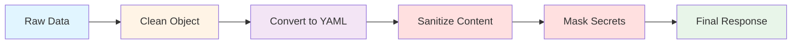
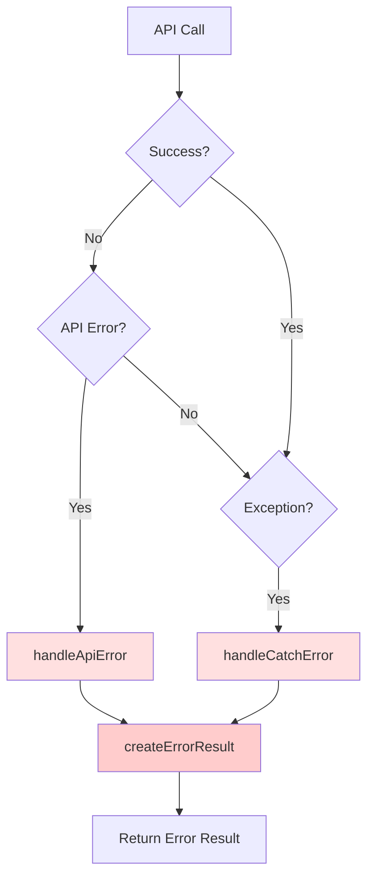

# Tools Technical Reference

## Overview

This document provides technical implementation details for the Octocode-MCP tool ecosystem, including architecture, hint system mechanics, response processing, and extension patterns.

---

## Tool Architecture

### Registration Pattern

All tools follow a consistent registration pattern with the MCP server:

```typescript
export function registerToolName(
  server: McpServer,
  callback?: ToolInvocationCallback
) {
  return server.registerTool(
    TOOL_NAMES.TOOL_NAME,
    {
      description: DESCRIPTIONS[TOOL_NAMES.TOOL_NAME],
      inputSchema: ToolNameBulkQuerySchema.shape,
      annotations: {
        title: 'Human-Readable Title',
        readOnlyHint: true,        // Tool doesn't modify data
        destructiveHint: false,    // Tool doesn't delete/break things
        idempotentHint: true,      // Same input = same output
        openWorldHint: true,       // Tool accesses external APIs
      },
    },
    withSecurityValidation(
      TOOL_NAMES.TOOL_NAME,
      async (args, authInfo, userContext): Promise<CallToolResult> => {
        const queries = args.queries || [];
        
        // Optional: Invoke callback for tracking
        if (callback) {
          try {
            await callback(TOOL_NAMES.TOOL_NAME, queries);
          } catch {
            // Silently ignore callback errors
          }
        }
        
        return processMultipleQueries(queries, authInfo, userContext);
      }
    )
  );
}
```

### Key Components

1. **Tool Name**: Constant from `TOOL_NAMES` for consistency
2. **Description**: Rich, structured description for AI comprehension
3. **Input Schema**: Zod schema for validation (from `scheme/` directory)
4. **Annotations**: MCP metadata for behavior hints
5. **Security Wrapper**: `withSecurityValidation` for input/output sanitization
6. **Bulk Processing**: All tools support multiple queries in single call

---

## Bulk Operations Framework

### Architecture

File: `src/utils/bulkOperations.ts`

```typescript
export async function executeBulkOperation<TQuery, TResult>(
  queries: TQuery[],
  processQuery: (query: TQuery, index: number) => Promise<TResult>,
  options: {
    toolName: string;
    keysPriority?: string[];  // For response formatting
  }
): Promise<CallToolResult>
```

### Processing Flow

```mermaid
graph TB
    INPUT[Input: queries[]]
    VALIDATE[Validate Each Query]
    PARALLEL[Process in Parallel]
    COLLECT[Collect Results]
    CLASSIFY[Classify by Status]
    HINTS[Generate Hints]
    FORMAT[Format Response]
    OUTPUT[Output: CallToolResult]
    
    INPUT --> VALIDATE
    VALIDATE --> PARALLEL
    PARALLEL --> COLLECT
    COLLECT --> CLASSIFY
    CLASSIFY --> HINTS
    HINTS --> FORMAT
    FORMAT --> OUTPUT
    
    style INPUT fill:#e1f5ff
    style PARALLEL fill:#fff4e6
    style HINTS fill:#f3e5f5
    style OUTPUT fill:#e8f5e9
```

### Implementation Details

#### 1. Query Processing

```typescript
// Process all queries in parallel
const results = await Promise.allSettled(
  queries.map((query, index) => processQuery(query, index))
);
```

**Benefits**:
- 5-10x faster than sequential
- Partial failure tolerance
- Complete context for analysis

#### 2. Result Classification

Results are classified into three categories:

```typescript
interface ResultCategories {
  hasResults: ToolSuccessResult[];  // status='hasResults'
  empty: ToolSuccessResult[];       // status='empty'
  error: ToolErrorResult[];         // status='error'
}
```

#### 3. Hint Generation

Hints are generated per category using the `TOOL_HINTS` system:

```typescript
const hasResultsStatusHints = 
  hasResultsCount > 0 
    ? getToolHints(toolName, 'hasResults')
    : undefined;

const emptyStatusHints = 
  emptyCount > 0 
    ? getToolHints(toolName, 'empty')
    : undefined;

const errorStatusHints = 
  errorCount > 0 
    ? getGenericErrorHints()
    : undefined;
```

#### 4. Response Assembly

```typescript
const responseData: ToolResponse = {
  instructions: generateInstructions(resultCategories),
  results: allResults,
  hasResultsStatusHints,
  emptyStatusHints,
  errorStatusHints,
};

return createResult({
  data: responseData,
  isError: false,
});
```

---

## Hint System Implementation

### Architecture

File: `src/tools/hints.ts`

### Data Structure

```typescript
export const TOOL_HINTS = {
  // Base hints for all tools
  base: {
    hasResults: [...],
    empty: [...],
  },
  
  // Tool-specific hints
  [TOOL_NAMES.GITHUB_SEARCH_CODE]: {
    hasResults: [...],
    empty: [...],
  },
  
  [TOOL_NAMES.GITHUB_FETCH_CONTENT]: {
    hasResults: [...],
    empty: [...],
  },
  
  // ... more tools
} as const;
```

### Hint Composition

```typescript
export function getToolHints(
  toolName: keyof typeof TOOL_HINTS,
  resultType: 'hasResults' | 'empty'
): readonly string[] {
  const toolHints = TOOL_HINTS[toolName]?.[resultType] ?? [];
  const baseHints = TOOL_HINTS.base?.[resultType] ?? [];
  
  // Combine base hints with tool-specific hints
  return [...baseHints, ...toolHints];
}
```

**Result**: Base hints + Tool-specific hints for complete guidance

### Custom Hints

Tools can also generate dynamic hints based on query analysis:

```typescript
// Example from github_search_repos.ts
function generateSearchSpecificHints(
  query: GitHubReposSearchQuery,
  hasResults: boolean
): string[] | undefined {
  const hints: string[] = [];
  const hasTopics = hasValidTopics(query);
  const hasKeywords = hasValidKeywords(query);
  
  if (hasTopics && hasResults) {
    hints.push("CRITICAL: Verify repository relevance to researchGoal");
    hints.push("Topic search found curated repositories");
  } else if (hasTopics && !hasResults) {
    hints.push("No results for topic search - try related topics");
  }
  
  return hints.length > 0 ? hints : undefined;
}
```

**Usage**: Custom hints are added to success results before bulk operation processing

---

## Response Processing Pipeline

### Flow Diagram



### Implementation

File: `src/responses.ts`

#### 1. Clean Object

Remove empty values and null/undefined:

```typescript
function cleanJsonObject(obj: unknown): unknown {
  if (obj === null || obj === undefined || Number.isNaN(obj)) {
    return undefined;
  }
  
  if (Array.isArray(obj)) {
    const cleaned = obj.map(cleanJsonObject).filter(item => item !== undefined);
    return cleaned.length > 0 ? cleaned : undefined;
  }
  
  if (typeof obj === 'object') {
    const cleaned: Record<string, unknown> = {};
    let hasValidProperties = false;
    
    for (const [key, value] of Object.entries(obj)) {
      const cleanedValue = cleanJsonObject(value);
      if (cleanedValue !== undefined) {
        cleaned[key] = cleanedValue;
        hasValidProperties = true;
      }
    }
    
    return hasValidProperties ? cleaned : undefined;
  }
  
  return obj;
}
```

**Purpose**: Reduce response size and improve readability

#### 2. Convert to YAML

```typescript
const yamlData = jsonToYamlString(cleanedData, {
  keysPriority: [
    'instructions',
    'results',
    'hasResultsStatusHints',
    'emptyStatusHints',
    'errorStatusHints',
    'query',
    'status',
    'data',
    'researchGoal',
    'reasoning',
  ],
});
```

**Purpose**: Improve AI readability and reduce tokens

#### 3. Sanitize Content

File: `src/security/contentSanitizer.ts`

```typescript
const sanitizationResult = ContentSanitizer.sanitizeContent(yamlData);
```

**Checks**:
- Malicious patterns (SQL injection, XSS, etc.)
- Prompt injection attempts
- Content length limits (1MB max)
- Line length limits (10K max)

**Result**: 
```typescript
{
  content: string,         // Sanitized content
  warnings: string[],      // Security warnings
  isClean: boolean,        // True if no issues
  removedPatterns: string[] // Patterns that were detected
}
```

#### 4. Mask Secrets

File: `src/security/mask.ts`

```typescript
return maskSensitiveData(sanitizationResult.content);
```

**Detects and redacts**:
- API keys (various formats)
- OAuth tokens
- Private keys
- Passwords
- Email addresses (optional)
- Database connection strings

**Pattern**: `[REDACTED:token_type]`

---

## Result Type System

### Type Hierarchy

```typescript
// Base result with status
interface BaseResult {
  status: 'hasResults' | 'empty' | 'error';
  researchGoal?: string;
  reasoning?: string;
}

// Success result (hasResults or empty)
interface ToolSuccessResult<T> extends BaseResult {
  status: 'hasResults' | 'empty';
  hints?: string[];  // Optional hints for this specific result
  // ... T is merged with result
}

// Error result
interface ToolErrorResult extends BaseResult {
  status: 'error';
  error: string;
  hints?: string[];  // Error recovery hints
}

// Tool response (for bulk operations)
interface ToolResponse {
  instructions?: string;
  data?: unknown;  // Single query response
  results?: Array<ToolSuccessResult | ToolErrorResult>;  // Bulk response
  hasResultsStatusHints?: readonly string[];
  emptyStatusHints?: readonly string[];
  errorStatusHints?: readonly string[];
}
```

### Type Guards

```typescript
function isSuccessResult(result: unknown): result is ToolSuccessResult {
  return (
    typeof result === 'object' &&
    result !== null &&
    'status' in result &&
    (result.status === 'hasResults' || result.status === 'empty')
  );
}

function isErrorResult(result: unknown): result is ToolErrorResult {
  return (
    typeof result === 'object' &&
    result !== null &&
    'status' in result &&
    result.status === 'error'
  );
}
```

---

## Error Handling System

### Error Flow



### Error Handlers

File: `src/tools/utils.ts`

#### 1. API Error Handler

```typescript
export function handleApiError(
  apiResult: unknown,
  query: { researchGoal?: string; reasoning?: string }
): ToolErrorResult | null {
  if (!hasError(apiResult)) {
    return null;
  }
  
  const apiError: GitHubAPIError = {
    error: apiResult.error,
    type: apiResult.type || 'unknown',
    status: apiResult.status,
    scopesSuggestion: apiResult.scopesSuggestion,
    rateLimitRemaining: apiResult.rateLimitRemaining,
    rateLimitReset: apiResult.rateLimitReset,
    retryAfter: apiResult.retryAfter,
  };
  
  const hints = extractApiErrorHints(apiError);
  const errorResult = createErrorResult(query, apiError, apiError);
  
  if (hints.length > 0) {
    errorResult.hints = hints;
  }
  
  return errorResult;
}
```

**Handles**:
- HTTP errors (404, 401, 403, etc.)
- GraphQL errors
- Network errors
- Rate limiting

#### 2. Catch Error Handler

```typescript
export function handleCatchError(
  error: unknown,
  query: { researchGoal?: string; reasoning?: string },
  contextMessage?: string
): ToolErrorResult {
  const errorMessage = 
    error instanceof Error 
      ? error.message 
      : 'Unknown error occurred';
      
  const fullErrorMessage = contextMessage
    ? `${contextMessage}: ${errorMessage}`
    : errorMessage;
  
  return createErrorResult(query, fullErrorMessage);
}
```

**Handles**:
- JavaScript exceptions
- Type errors
- Unexpected failures

#### 3. Error Result Creator

```typescript
export function createErrorResult(
  query: { researchGoal?: string; reasoning?: string },
  error: string | GitHubAPIError,
  apiError?: GitHubAPIError
): ToolErrorResult {
  const hints = apiError ? extractApiErrorHints(apiError) : undefined;
  
  const result: ToolErrorResult = {
    status: 'error',
    researchGoal: query.researchGoal,
    reasoning: query.reasoning,
    error: typeof error === 'string' ? error : error.error,
  };
  
  if (hints && hints.length > 0) {
    result.hints = hints;
  }
  
  return result;
}
```

### Error Recovery Hints

```typescript
export const GENERIC_ERROR_HINTS = [
  'Check authentication token validity and required scopes',
  'Verify network connectivity and GitHub API status',
  'Review rate limits and retry after cooldown if exceeded',
  'Validate input parameters (owner, repo, path, branch) for correctness',
  'Check repository visibility (public vs private) and access permissions',
  'Retry the operation after a brief delay for transient errors',
] as const;
```

---

## Schema System

### Location
`src/scheme/` directory

### Pattern

Each tool has a corresponding schema file with Zod validation:

```typescript
// Example: github_search_code.ts
import { z } from 'zod';
import { BaseQuerySchema } from './baseSchema.js';
import { SCHEMA_DESCRIPTIONS } from './schemDescriptions.js';

// Single query schema
export const GitHubCodeSearchQuerySchema = BaseQuerySchema.extend({
  keywordsToSearch: z
    .array(z.string())
    .min(1)
    .max(5)
    .describe(SCHEMA_DESCRIPTIONS.codeSearch.keywordsToSearch),
  
  match: z
    .enum(['file', 'path'])
    .optional()
    .describe(SCHEMA_DESCRIPTIONS.codeSearch.match),
  
  owner: z
    .string()
    .optional()
    .describe(SCHEMA_DESCRIPTIONS.common.owner),
  
  // ... more fields
});

// Bulk query schema
export const GitHubCodeSearchBulkQuerySchema = z.object({
  queries: z
    .array(GitHubCodeSearchQuerySchema)
    .min(1)
    .max(10)
    .describe('Array of code search queries'),
});
```

### Base Schema

```typescript
// src/scheme/baseSchema.ts
export const BaseQuerySchema = z.object({
  researchGoal: z
    .string()
    .optional()
    .describe('What you want to find or understand'),
  
  reasoning: z
    .string()
    .optional()
    .describe('Why this query helps achieve the goal'),
});
```

**Purpose**: Every query carries research context

### Schema Descriptions

File: `src/scheme/schemDescriptions.ts`

Centralized, detailed descriptions for AI comprehension:

```typescript
export const SCHEMA_DESCRIPTIONS = {
  common: {
    owner: 'Repository owner (e.g., "facebook")',
    repo: 'Repository name (e.g., "react")',
    branch: 'Branch/tag/SHA (optional, auto-detect default)',
  },
  
  codeSearch: {
    keywordsToSearch: 'Keywords for AND search (1-5 terms)',
    match: '"file" (search IN content) or "path" (search filenames)',
    extension: 'File extension without dot (e.g., "ts", "js")',
    // ... more
  },
  
  // ... more categories
};
```

---

## Tool Registration System

### Tools Manager

File: `src/tools/toolsManager.ts`

```typescript
export class ToolsManager {
  private registeredTools = new Map<string, RegisteredTool>();
  
  async registerTools(
    server: McpServer,
    toolConfigs: ToolConfig[],
    callback?: ToolInvocationCallback
  ): Promise<void> {
    for (const config of toolConfigs) {
      try {
        const registeredTool = config.fn(server, callback);
        this.registeredTools.set(config.name, registeredTool);
      } catch (error) {
        console.error(`Failed to register tool ${config.name}:`, error);
      }
    }
  }
  
  getRegisteredTools(): string[] {
    return Array.from(this.registeredTools.keys());
  }
}
```

### Tool Configuration

File: `src/tools/toolConfig.ts`

```typescript
export interface ToolConfig {
  name: string;
  description: string;
  isDefault: boolean;
  type: 'search' | 'content' | 'history' | 'debug';
  fn: (server: McpServer, callback?: ToolInvocationCallback) => RegisteredTool;
}

export const DEFAULT_TOOLS: ToolConfig[] = [
  GITHUB_SEARCH_CODE,
  GITHUB_FETCH_CONTENT,
  GITHUB_VIEW_REPO_STRUCTURE,
  GITHUB_SEARCH_REPOSITORIES,
  GITHUB_SEARCH_PULL_REQUESTS,
];
```

**Categories**:
- **search**: Discovery and exploration tools
- **content**: File and content access tools
- **history**: Historical analysis tools (PRs, commits)
- **debug**: Diagnostic and troubleshooting tools

---

## Extension Patterns

### Adding a New Tool

#### Step 1: Create Schema

`src/scheme/new_tool.ts`:
```typescript
import { z } from 'zod';
import { BaseQuerySchema } from './baseSchema.js';

export const NewToolQuerySchema = BaseQuerySchema.extend({
  // Tool-specific parameters
  param1: z.string().describe('Parameter description'),
  param2: z.number().optional().describe('Optional parameter'),
});

export const NewToolBulkQuerySchema = z.object({
  queries: z.array(NewToolQuerySchema).min(1).max(10),
});

export type NewToolQuery = z.infer<typeof NewToolQuerySchema>;
```

#### Step 2: Add Tool Name Constant

`src/constants.ts`:
```typescript
export const TOOL_NAMES = {
  // ... existing tools
  NEW_TOOL: 'new_tool_name',
} as const;
```

#### Step 3: Create Tool Description

`src/tools/descriptions.ts`:
```typescript
export const DESCRIPTIONS = {
  // ... existing descriptions
  [TOOL_NAMES.NEW_TOOL]: `TOOL PURPOSE - Short description

PURPOSE: Detailed purpose

USE_WHEN: Usage scenarios
AVOID: Anti-patterns

WORKFLOW:
  Step 1: ...
  Step 2: ...

MODES:
  - mode1: description
  - mode2: description

NEXT_STEP:
  hasResults → next_tool
  empty → alternative_approach
`,
};
```

#### Step 4: Add Hints

`src/tools/hints.ts`:
```typescript
export const TOOL_HINTS = {
  // ... existing hints
  [TOOL_NAMES.NEW_TOOL]: {
    hasResults: [
      'Suggestion for successful queries',
      'Next step guidance',
    ],
    empty: [
      'Recovery strategy',
      'Alternative approach',
    ],
  },
};
```

#### Step 5: Implement Tool

`src/tools/new_tool.ts`:
```typescript
import { McpServer } from '@modelcontextprotocol/sdk/server/mcp.js';
import { type CallToolResult } from '@modelcontextprotocol/sdk/types';
import { withSecurityValidation } from '../security/withSecurityValidation.js';
import { TOOL_NAMES } from '../constants.js';
import { NewToolBulkQuerySchema, NewToolQuery } from '../scheme/new_tool.js';
import { executeBulkOperation } from '../utils/bulkOperations.js';
import { DESCRIPTIONS } from './descriptions.js';
import {
  handleApiError,
  handleCatchError,
  createSuccessResult,
} from './utils.js';

export function registerNewTool(
  server: McpServer,
  callback?: ToolInvocationCallback
) {
  return server.registerTool(
    TOOL_NAMES.NEW_TOOL,
    {
      description: DESCRIPTIONS[TOOL_NAMES.NEW_TOOL],
      inputSchema: NewToolBulkQuerySchema.shape,
      annotations: {
        title: 'New Tool Title',
        readOnlyHint: true,
        destructiveHint: false,
        idempotentHint: true,
        openWorldHint: true,
      },
    },
    withSecurityValidation(
      TOOL_NAMES.NEW_TOOL,
      async (args, authInfo, userContext): Promise<CallToolResult> => {
        const queries = args.queries || [];
        
        if (callback) {
          try {
            await callback(TOOL_NAMES.NEW_TOOL, queries);
          } catch {
            // Silently ignore
          }
        }
        
        return processMultipleQueries(queries, authInfo, userContext);
      }
    )
  );
}

async function processMultipleQueries(
  queries: NewToolQuery[],
  authInfo?: AuthInfo,
  userContext?: UserContext
): Promise<CallToolResult> {
  return executeBulkOperation(
    queries,
    async (query: NewToolQuery, _index: number) => {
      try {
        // Implement tool logic
        const apiResult = await callExternalAPI(query, authInfo, userContext);
        
        const apiError = handleApiError(apiResult, query);
        if (apiError) return apiError;
        
        const data = extractDataFromResult(apiResult);
        const hasContent = checkIfHasContent(data);
        
        return createSuccessResult(
          query,
          data,
          hasContent,
          'NEW_TOOL'
        );
      } catch (error) {
        return handleCatchError(error, query);
      }
    },
    {
      toolName: TOOL_NAMES.NEW_TOOL,
      keysPriority: ['key1', 'key2', 'error'],
    }
  );
}
```

#### Step 6: Register Tool

`src/tools/toolConfig.ts`:
```typescript
import { registerNewTool } from './new_tool.js';

export const NEW_TOOL: ToolConfig = {
  name: TOOL_NAMES.NEW_TOOL,
  description: 'Brief description',
  isDefault: true,  // or false
  type: 'search',   // or 'content', 'history', 'debug'
  fn: registerNewTool,
};

export const DEFAULT_TOOLS: ToolConfig[] = [
  // ... existing tools
  NEW_TOOL,
];
```

#### Step 7: Add Tests

`tests/tools/new_tool.test.ts`:
```typescript
import { describe, it, expect, beforeEach, vi } from 'vitest';
import { registerNewTool } from '../../src/tools/new_tool.js';
import { createTestServer } from '../fixtures/mcp-fixtures.js';

describe('NewTool', () => {
  let server: McpServer;
  
  beforeEach(() => {
    server = createTestServer();
    vi.clearAllMocks();
  });
  
  it('should handle valid input', async () => {
    const tool = registerNewTool(server);
    const result = await tool.handler({
      queries: [
        {
          param1: 'value',
          researchGoal: 'test',
          reasoning: 'test reason',
        },
      ],
    });
    
    expect(result.isError).toBe(false);
    // ... more assertions
  });
  
  it('should handle errors gracefully', async () => {
    // ... error handling tests
  });
});
```

---

## Performance Optimization Patterns

### 1. Bulk Operations

**Always prefer bulk** over sequential calls:

```typescript
// ❌ Bad: Sequential
for (const query of queries) {
  await processQuery(query);
}

// ✅ Good: Parallel bulk
return executeBulkOperation(queries, processQuery, options);
```

### 2. Caching

File: `src/utils/cache.ts`

```typescript
// Check cache before API call
const cacheKey = createCacheKey(params);
const cached = cache.get(cacheKey);
if (cached) return cached;

// Make API call
const result = await apiCall(params);

// Cache successful results only
if (!hasError(result)) {
  cache.set(cacheKey, result, TTL_24_HOURS);
}

return result;
```

### 3. Content Minification

File: `src/utils/minifier.ts`

```typescript
// Minify before returning large content
if (shouldMinify(content, filePath)) {
  const minified = await minifyContent(content, filePath);
  return { content: minified.content, minified: true };
}

return { content, minified: false };
```

### 4. Partial Content Access

```typescript
// ✅ Good: Targeted extraction
fetchContent({
  path: 'large-file.ts',
  matchString: 'specificFunction',
  matchStringContextLines: 20,
});

// ❌ Bad: Full file read
fetchContent({
  path: 'large-file.ts',
  fullContent: true,
});
```

---

## Security Implementation

### Input Validation

Every tool uses Zod schemas for validation:

```typescript
const validated = ToolQuerySchema.safeParse(input);
if (!validated.success) {
  return createErrorResult(
    query,
    `Invalid parameters: ${validated.error.message}`
  );
}
```

### Security Wrapper

File: `src/security/withSecurityValidation.ts`

```typescript
export function withSecurityValidation(
  toolName: string,
  handler: ToolHandler
): ToolHandler {
  return async (args, authInfo, userContext) => {
    // Sanitize input parameters
    const sanitizedArgs = sanitizeInput(args);
    
    // Execute handler
    const result = await handler(sanitizedArgs, authInfo, userContext);
    
    // Sanitize output content
    return sanitizeOutput(result);
  };
}
```

### Content Sanitization

File: `src/security/contentSanitizer.ts`

Multi-layer approach:
1. **Pattern detection**: Regex-based threat detection
2. **Length limits**: Prevent resource exhaustion
3. **Prompt injection**: Remove AI manipulation attempts
4. **Secret masking**: Redact sensitive information

---

## Testing Strategy

### Test Structure

```
tests/
├── tools/
│   ├── github_search_code.test.ts
│   ├── github_fetch_content.test.ts
│   └── ...
├── security/
│   ├── contentSanitizer.test.ts
│   └── ...
├── utils/
│   ├── bulkOperations.test.ts
│   └── ...
└── fixtures/
    └── mcp-fixtures.ts
```

### Test Patterns

```typescript
describe('ToolName', () => {
  let server: McpServer;
  
  beforeEach(() => {
    server = createTestServer();
    vi.clearAllMocks();
  });
  
  describe('Successful Operations', () => {
    it('should handle valid single query', async () => {
      // Test implementation
    });
    
    it('should handle valid bulk queries', async () => {
      // Test bulk operation
    });
  });
  
  describe('Error Handling', () => {
    it('should handle API errors', async () => {
      // Test API error handling
    });
    
    it('should handle network errors', async () => {
      // Test network error handling
    });
  });
  
  describe('Edge Cases', () => {
    it('should handle empty results', async () => {
      // Test empty result handling
    });
    
    it('should handle invalid parameters', async () => {
      // Test validation errors
    });
  });
});
```

---

## API Integration Patterns

### GitHub API Abstraction

File: `src/github/githubAPI.ts`

All tools use centralized GitHub API client:

```typescript
export async function makeGitHubAPICall<T>(
  config: {
    endpoint?: string;
    method?: 'GET' | 'POST' | 'PUT' | 'DELETE';
    query?: string;
    variables?: Record<string, unknown>;
    useGraphQL?: boolean;
  },
  authInfo?: AuthInfo,
  userContext?: UserContext
): Promise<T | GitHubAPIError>
```

**Features**:
- Automatic authentication
- Rate limit handling
- Error normalization
- Caching integration
- Retry logic

---

## Debugging Tools

### Logging

Use session logging for debugging:

```typescript
import { logInfo, logError } from '../session.js';

logInfo('Tool execution started', { toolName, queryCount });
logError('API call failed', { error, query });
```

### Callback System

Track tool invocations:

```typescript
const callback: ToolInvocationCallback = async (toolName, queries) => {
  console.log(`Tool ${toolName} invoked with ${queries.length} queries`);
};

registerToolName(server, callback);
```

---

## Summary

### Architecture Highlights

1. **Consistent Patterns**: All tools follow same registration and processing pattern
2. **Bulk-First**: Every tool supports parallel bulk operations
3. **Hint System**: Three-tier hint composition (base + tool + custom)
4. **Error Handling**: Multi-layer error capture and recovery
5. **Security**: Input validation + output sanitization + secret masking
6. **Type Safety**: Zod schemas + TypeScript for runtime and compile-time safety

### Extension Checklist

- [ ] Create Zod schema in `src/scheme/`
- [ ] Add tool name constant to `src/constants.ts`
- [ ] Write tool description in `src/tools/descriptions.ts`
- [ ] Add hints to `src/tools/hints.ts`
- [ ] Implement tool in `src/tools/`
- [ ] Register in `src/tools/toolConfig.ts`
- [ ] Write comprehensive tests
- [ ] Update documentation

### Performance Best Practices

1. Use bulk operations (5-10x faster)
2. Cache expensive operations (24-hour TTL)
3. Minify content before return (30-60% savings)
4. Use partial content access (85% savings)
5. Leverage parallel processing

### Security Best Practices

1. Validate all inputs with Zod
2. Sanitize all outputs
3. Mask sensitive information
4. Enforce length limits
5. Use security wrapper on all tools

---

## Attribution

This documentation is powered by **Octocode MCP Research** (https://github.com/bgauryy/octocode-mcp).

⭐ Star the repo if you find this useful!

