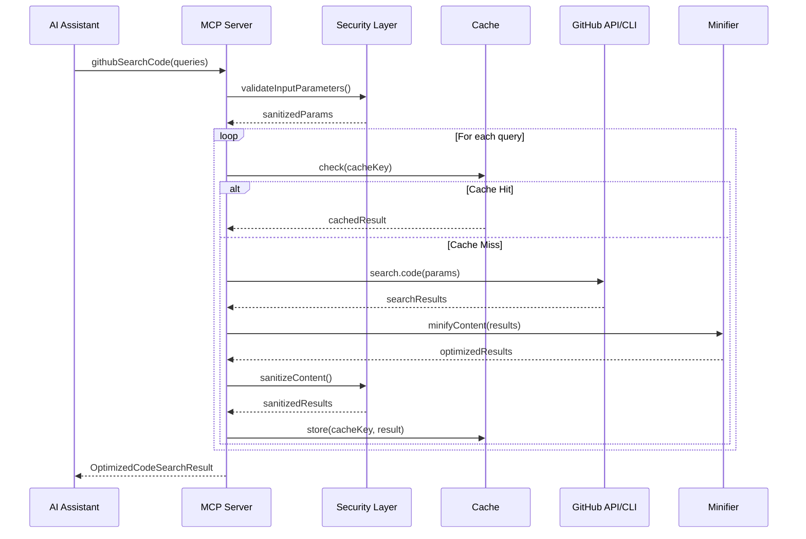
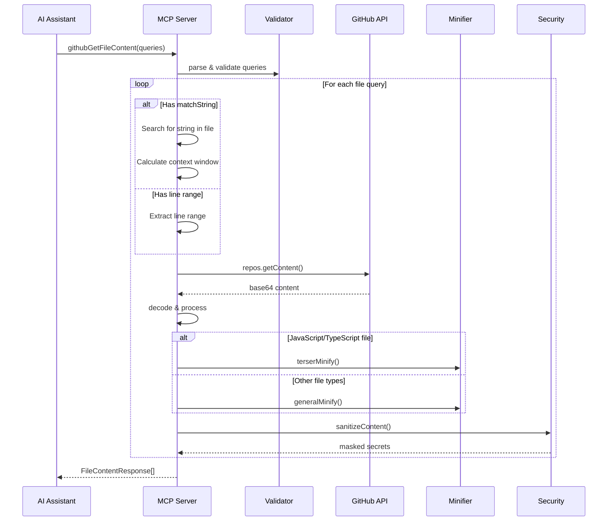

# OctoCode MCP - Technical Architecture and Flow Documentation

## Table of Contents
1. [Overview](#overview)
2. [Architecture Layers](#architecture-layers)
3. [Component Deep Dive](#component-deep-dive)
4. [Technical Flows](#technical-flows)
5. [Security Architecture](#security-architecture)
6. [Performance Optimizations](#performance-optimizations)
7. [Tool Implementation Details](#tool-implementation-details)
8. [Integration Points](#integration-points)

## Overview

OctoCode MCP is a TypeScript-based Model Context Protocol (MCP) server that provides AI assistants with sophisticated code research capabilities through GitHub CLI and npm CLI integration. The architecture is designed with security, performance, and extensibility as core principles.

### Core Technologies
- **Language**: TypeScript
- **Protocol**: Model Context Protocol (MCP)
- **External Integrations**: GitHub CLI (`gh`), npm CLI, GitHub API (Octokit)
- **Key Libraries**:
  - `@modelcontextprotocol/sdk`: MCP protocol implementation
  - `octokit`: GitHub API client with throttling
  - `zod`: Runtime validation and type safety
  - `node-cache`: In-memory caching with TTL
  - `terser`: JavaScript minification
  - `async-mutex`: Thread-safe operations

## Architecture Layers

### 1. Entry Point and Server Initialization

```typescript
// src/index.ts
┌─────────────────────────────────────┐
│         MCP Server Setup            │
│  - Version: from package.json       │
│  - Config: SERVER_CONFIG            │
│  - Transport: StdioServerTransport  │
└─────────────────────────┬───────────┘
                          │
                          ▼
┌─────────────────────────────────────┐
│      Tool Registration System       │
│  - Dynamic tool loading             │
│  - Options propagation              │
│  - Error resilience                 │
└─────────────────────────────────────┘
```

**Key Flow**:
1. Server checks for GitHub token (`GITHUB_TOKEN` or `GH_TOKEN`)
2. Determines API type: 'octokit' (if token exists) or 'gh' (CLI fallback)
3. Checks npm availability via `getNPMUserDetails()`
4. Creates unified `ToolOptions` object
5. Registers all tools with error handling
6. Establishes stdio transport connection
7. Sets up graceful shutdown handlers

### 2. Tool Framework Layer

Each tool follows a consistent pattern:

```typescript
interface ToolPattern {
  // 1. Schema Definition (Zod)
  schema: z.ZodSchema;
  
  // 2. Security Wrapper
  handler: withSecurityValidation(async (args) => {
    // 3. Input Validation
    const validated = schema.parse(args);
    
    // 4. Cache Check
    const cacheKey = generateCacheKey(toolName, validated);
    
    // 5. Execute Operation
    return withCache(cacheKey, async () => {
      // Tool-specific logic
    });
  });
  
  // 6. Response Formatting
  response: createResult(data);
}
```

### 3. Security Layer Architecture

```
┌─────────────────────────────────────────┐
│        Security Layer Components         │
├─────────────────────────────────────────┤
│  ContentSanitizer                       │
│  ├─ validateInputParameters()           │
│  ├─ sanitizeContent()                   │
│  └─ detectSecrets()                     │
├─────────────────────────────────────────┤
│  Secret Detection (1100+ patterns)       │
│  ├─ API Keys & Tokens                   │
│  ├─ Cryptographic Keys                  │
│  ├─ Cloud Provider Secrets              │
│  └─ Database Credentials                │
├─────────────────────────────────────────┤
│  Command Execution Security              │
│  ├─ Allowlisted Commands                │
│  ├─ Platform-specific Escaping          │
│  └─ Shell Injection Prevention          │
└─────────────────────────────────────────┘
```

## Component Deep Dive

### Tool Registration System

```typescript
// Tool registration flow
async function registerAllTools(server: McpServer) {
  const toolOptions: ToolOptions = {
    githubAPIType: GITHUB_API_TYPE,
    npmEnabled: npmEnabled,
    ghToken: token,
    apiType: GITHUB_API_TYPE, // Backward compatibility
  };

  const toolRegistrations = [
    { name: GITHUB_SEARCH_CODE_TOOL_NAME, fn: registerGitHubSearchCodeTool, opts: toolOptions },
    { name: GITHUB_SEARCH_REPOSITORIES_TOOL_NAME, fn: registerSearchGitHubReposTool, opts: toolOptions },
    // ... other tools
  ];

  // Resilient registration with error tracking
  for (const tool of toolRegistrations) {
    try {
      tool.fn(server, tool.opts);
      successCount++;
    } catch (error) {
      failedTools.push(tool.name);
    }
  }
}
```

### Execution Layer

The execution layer handles both CLI and API calls:

```typescript
// CLI Execution (exec.ts)
export async function executeGitHubCommand(
  command: GhCommand,
  args: string[],
  options?: ExecOptions
): Promise<CallToolResult> {
  // Mutex ensures sequential GitHub API calls
  return githubMutex.runExclusive(async () => {
    const { cmd, env } = buildCommand('gh', command, args, options);
    const result = await safeExecAsync(cmd, { env, ...execOptions });
    return createSuccessResult(JSON.parse(result.stdout));
  });
}

// API Execution (githubAPI.ts)
export async function searchGitHubCodeAPI(
  params: GitHubCodeSearchQuery,
  ghToken?: string
): Promise<CallToolResult> {
  const octokit = getOctokit(ghToken);
  const searchResponse = await octokit.search.code(searchParams);
  // Process and optimize response
  return createResult(optimizedResult);
}
```

### Cache System

```typescript
// Multi-level caching strategy
const cache = new NodeCache({
  stdTTL: 86400,     // 24 hour default TTL
  checkperiod: 3600, // Hourly cleanup
  maxKeys: 1000,     // Memory limit
});

// Cache key generation ensures consistency
export function generateCacheKey(prefix: string, params: unknown): string {
  const paramString = JSON.stringify(params, Object.keys(params).sort());
  const hash = crypto.createHash('md5').update(paramString).digest('hex');
  return `${VERSION}-${prefix}:${hash}`;
}
```

## Technical Flows

### 1. GitHub Code Search Flow



### 2. File Content Fetch Flow



### 3. Cross-Tool Research Flow

```typescript
// Tool Relationship System enables intelligent research flows
const TOOL_RELATIONSHIPS = {
  [GITHUB_SEARCH_CODE]: {
    fallbackTools: [
      { tool: PACKAGE_SEARCH, reason: 'search for package implementations' },
      { tool: GITHUB_SEARCH_REPOSITORIES, reason: 'find repositories by topic' }
    ],
    nextSteps: [
      { tool: GITHUB_FETCH_CONTENT, reason: 'view full content with context' },
      { tool: GITHUB_VIEW_REPO_STRUCTURE, reason: 'explore structure' }
    ],
    strategicAlternatives: [
      { tool: GITHUB_SEARCH_COMMITS, reason: 'trace evolution' },
      { tool: GITHUB_SEARCH_ISSUES, reason: 'find discussions' }
    ]
  }
  // ... other tool relationships
};
```

## Security Architecture

### Input Validation Pipeline

```typescript
// Three-layer validation approach
1. Zod Schema Validation
   - Type checking
   - Format validation
   - Range constraints

2. Security Validation (withSecurityValidation wrapper)
   - Parameter sanitization
   - Injection prevention
   - Path traversal protection

3. Content Sanitization (post-processing)
   - Secret detection & masking
   - PII removal
   - Malicious content filtering
```

### Secret Detection System

```typescript
// Comprehensive pattern matching across 18+ categories
const allRegexPatterns = [
  // API Keys
  { name: 'Generic API Key', regex: /\b[Aa][Pp][Ii][_-]?[Kk][Ee][Yy]\s*[:=]\s*['"]?[A-Za-z0-9_\-]{20,}['"]?/g },
  
  // Cloud Providers
  { name: 'AWS Access Key', regex: /\b(AKIA|A3T|AGPA|AIDA|AROA|AIPA|ANPA|ANVA|ASIA)[A-Z0-9]{16}\b/g },
  
  // Cryptographic
  { name: 'Private Key', regex: /-----BEGIN\s+(RSA\s+)?PRIVATE\s+KEY-----/g },
  
  // ... 1100+ more patterns
];
```

### Command Execution Security

```typescript
// Platform-aware secure command execution
function getShellConfig(preferredWindowsShell?: WindowsShell): ShellConfig {
  if (platform() === 'win32') {
    // Windows-specific security
    return preferredWindowsShell === 'cmd' 
      ? { shell: 'cmd.exe', shellEnv: '/d /s /c', type: 'cmd' }
      : { shell: 'powershell.exe', shellEnv: '-NoProfile -NonInteractive -Command', type: 'powershell' };
  }
  // Unix-like systems
  return { shell: process.env.SHELL || '/bin/sh', shellEnv: '-c', type: 'unix' };
}
```

## Performance Optimizations

### 1. Content Minification Strategy

```typescript
// Multi-strategy minification based on file type
export async function minifyContentV2(content: string, filePath?: string): Promise<{
  content: string;
  minified: boolean;
  minificationType: string;
}> {
  // JavaScript/TypeScript: Terser minification
  if (isJavaScriptOrTypeScript(filePath)) {
    return terserMinify(content);
  }
  
  // JSON: Parse and re-stringify
  if (filePath?.endsWith('.json')) {
    return { content: JSON.stringify(JSON.parse(content)), minified: true, minificationType: 'json' };
  }
  
  // General: Pattern-based optimization
  return generalMinify(content);
}
```

### 2. API Throttling and Rate Limiting

```typescript
// Octokit throttling configuration
const OctokitWithThrottling = Octokit.plugin(throttling);

const throttleOptions = {
  onRateLimit: (retryAfter: number, options: any, octokit: any, retryCount: number) => {
    if (retryCount < 3) {
      octokit.log.warn(`Rate limited, retrying after ${retryAfter} seconds`);
      return true; // Retry
    }
    return false; // Don't retry
  },
  onSecondaryRateLimit: (retryAfter: number) => {
    // Handle secondary rate limits
    return retryAfter < 60; // Only retry if wait is less than 1 minute
  }
};
```

### 3. Concurrent Processing

```typescript
// Bulk operations with controlled concurrency
export async function processBulkQueries(queries: Query[]): Promise<BulkResult[]> {
  // Process up to 5 queries in parallel
  const results = await Promise.all(
    queries.slice(0, 5).map(async (query) => {
      try {
        const result = await processQuery(query);
        return { queryId: query.id, result, error: null };
      } catch (error) {
        return { queryId: query.id, result: null, error };
      }
    })
  );
  return results;
}
```

## Tool Implementation Details

### GitHub Search Code Tool

**Key Features**:
- Progressive search refinement
- Multi-query support (up to 5 concurrent)
- Smart fallback mechanisms
- Content optimization

**Implementation**:
```typescript
const GitHubBulkCodeSearchParamsSchema = z.object({
  queries: z.array(GitHubCodeSearchQuerySchema).min(1).max(5),
  verbose: z.boolean().optional().default(false)
});

// Process each query with fallback support
for (const query of validatedArgs.queries) {
  let result = await searchSingleQuery(query);
  
  if (result.result.total_count === 0 && query.fallbackParams) {
    // Try fallback parameters
    result = await searchSingleQuery({
      ...query,
      ...query.fallbackParams
    });
    result.fallbackTriggered = true;
  }
}
```

### Package Search Tool

**Cross-Ecosystem Support**:
```typescript
// Unified interface for NPM and Python packages
interface PackageSearchBulkParams {
  npmPackages?: NpmPackageQuery[];
  pythonPackages?: PythonPackageQuery[];
  searchLimit?: number;
  npmSearchStrategy?: 'individual' | 'combined';
  npmFetchMetadata?: boolean;
}

// Parallel ecosystem search
const [npmResults, pythonResults] = await Promise.all([
  searchNpmPackages(npmQueries),
  searchPythonPackages(pythonQueries)
]);
```

### Repository Structure Tool

**Intelligent Filtering**:
```typescript
// Smart file categorization and filtering
function shouldIncludeFile(item: GitHubApiFileItem, options: FilterOptions): boolean {
  // Skip hidden files unless explicitly included
  if (!options.includeIgnored && item.name.startsWith('.')) return false;
  
  // Skip build artifacts
  if (isBuildArtifact(item.path)) return false;
  
  // Skip media files unless requested
  if (!options.showMedia && isMediaFile(item.path)) return false;
  
  return true;
}
```

## Integration Points

### 1. MCP Protocol Integration

```typescript
// Tool registration with MCP server
export function registerGitHubSearchCodeTool(
  server: McpServer,
  options: ToolOptions = {}
): void {
  server.setRequestHandler(
    CallToolRequestSchema,
    async (request): Promise<CallToolResult> => {
      if (request.params.name === GITHUB_SEARCH_CODE_TOOL_NAME) {
        return withSecurityValidation<GitHubBulkCodeSearchParams>(
          searchGitHubCodeHandler(options)
        )(request.params.arguments || {});
      }
      throw new Error(`Unknown tool: ${request.params.name}`);
    }
  );
}
```

### 2. GitHub CLI Integration

```typescript
// Dynamic CLI detection and fallback
function findExecutable(name: string, customPath?: string): string | null {
  // 1. Check custom path
  if (customPath && isExecutableFile(customPath)) return customPath;
  
  // 2. Check PATH environment
  const envPath = process.env.PATH || '';
  const pathDirs = envPath.split(path.delimiter);
  
  for (const dir of pathDirs) {
    const execPath = join(dir, name);
    if (isExecutableFile(execPath)) return execPath;
  }
  
  // 3. Platform-specific fallbacks
  return findPlatformSpecificPath(name);
}
```

### 3. Error Recovery System

```typescript
// Progressive error recovery with context
const ERROR_RECOVERY_STRATEGIES = {
  NO_RESULTS: {
    suggestions: [
      'Broaden search terms',
      'Remove filters',
      'Try different tool'
    ],
    fallbackTools: ['package_search', 'github_search_repositories']
  },
  AUTH_REQUIRED: {
    suggestions: ['Run "gh auth login"'],
    fallbackTools: []
  },
  RATE_LIMITED: {
    suggestions: ['Wait 5-10 minutes', 'Use more targeted queries'],
    fallbackTools: ['github_search_repositories']
  }
};
```

## Performance Characteristics

### Response Time Optimization
- **Cache Hit**: <10ms response time
- **API Call**: 200-2000ms (depends on GitHub API)
- **Bulk Operations**: Parallel processing reduces total time by 60-80%

### Token Usage Optimization
- **Minification**: 60-80% token reduction for code files
- **Smart Truncation**: Limits response size while preserving context
- **Partial File Access**: Only fetches needed content with line ranges

### Memory Management
- **Cache Limits**: Maximum 1000 entries to prevent memory bloat
- **Stream Processing**: Large files processed in chunks
- **Cleanup**: Automatic expired entry removal

## Conclusion

OctoCode MCP's architecture demonstrates a sophisticated approach to building secure, performant, and extensible MCP servers. The layered architecture ensures separation of concerns, while the comprehensive security measures protect against various attack vectors. The performance optimizations make it suitable for production use at scale, and the intelligent tool relationship system enables powerful cross-tool research workflows.

Key architectural achievements:
- **Security-First Design**: Multi-layer validation and sanitization
- **Performance at Scale**: Caching, minification, and parallel processing
- **Intelligent Research**: Tool relationships enable complex workflows
- **Platform Flexibility**: Supports both CLI and API approaches
- **Enterprise Ready**: Respects permissions, handles auth, provides audit trails