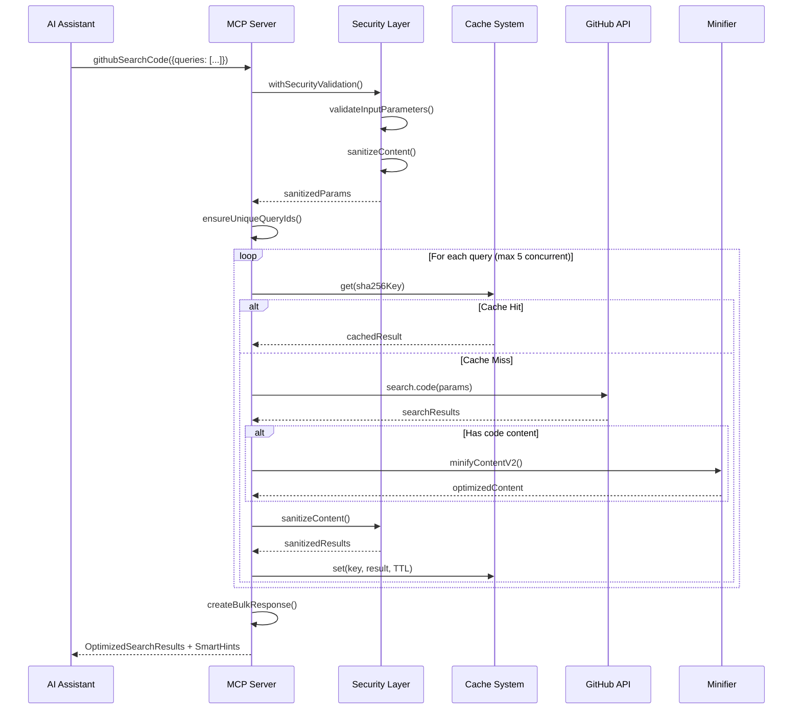
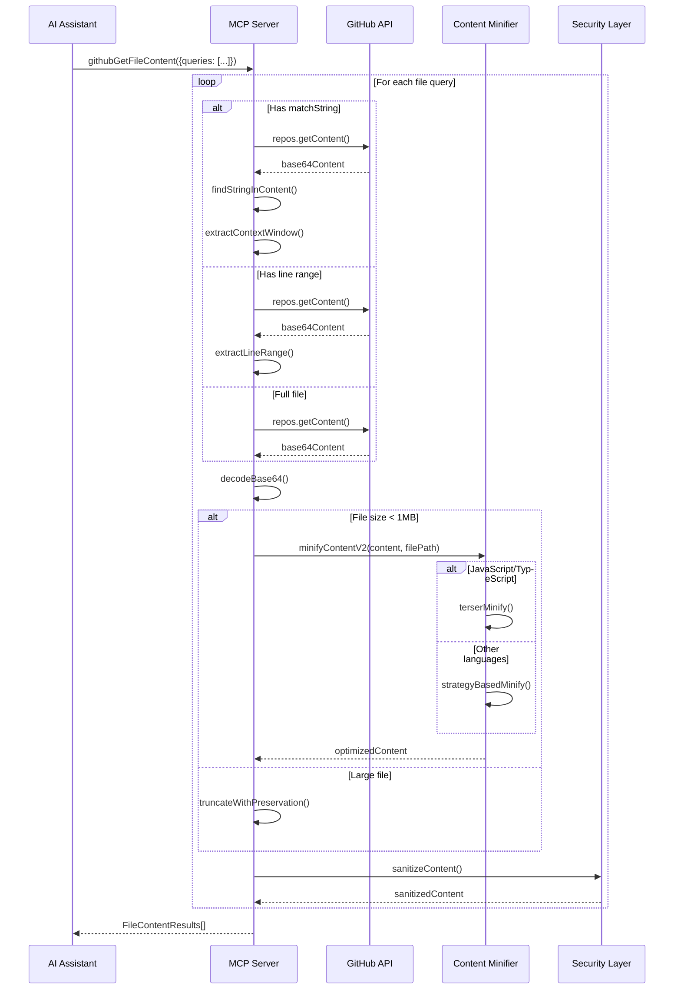

# Octocode-MCP: The Next-Generation AI Research Platform

## 🚀 **Revolutionary LLM Research Orchestration**

**Octocode-MCP** redefines what an MCP server can be - transforming from a simple tool connector into a **sophisticated AI research orchestration platform** that rivals dedicated research tools. While most MCP servers provide basic API wrappers, Octocode-MCP delivers an **intelligent research assistant** with enterprise-grade capabilities.

## 📊 **How It Compares to Other MCP Servers**

| Feature | Standard MCP Servers | **Octocode-MCP** |
|---------|---------------------|-------------------|
| **Intelligence Level** | Basic API calls | **11 research goals with adaptive behavior** |
| **Error Handling** | Simple try/catch | **Multi-tier fallback with semantic recovery** |
| **Guidance System** | Static documentation | **1000+ lines of contextual hints with AI prioritization** |
| **Tool Orchestration** | Individual tools | **Strategic workflow chains with relationship mapping** |
| **Data Optimization** | Raw API responses | **Token-optimized with 50+ file type minification** |
| **Research Capability** | Single queries | **Progressive refinement with cross-validation** |
| **Production Readiness** | Demo quality | **Enterprise security with 1000+ secret patterns** |

## ✨ **What Makes It Exceptional**

**🧠 Research Intelligence Beyond Basic MCP:**
- **Adaptive Research Goals**: Unlike static MCP tools, dynamically adjusts behavior for discovery, debugging, code generation, and 8 other research modes
- **4-Tier Hint Generation**: Provides intelligent, contextual guidance that evolves with your research phase (discovery → analysis → deep dive → synthesis)
- **Strategic Tool Orchestration**: Chains tools intelligently based on results, not just sequential calls

**🔄 Advanced Fallback Systems:**
- **Multi-Level Recovery**: When GitHub rate limits hit, automatically switches strategies, suggests semantic alternatives, and provides recovery actions
- **Error-Specific Intelligence**: Recognizes auth failures, network issues, and validation errors with tailored recovery paths
- **Cross-Tool Workflows**: Failed repository search → package search → alternative approaches

**🎯 Production-Grade Architecture:**
- **Token Optimization**: Minifies content across 50+ programming languages while preserving semantic meaning
- **Dual Execution**: CLI + API with intelligent fallback preference and reliability scoring
- **Enterprise Security**: Content sanitization, input validation, and secret detection at every layer

**💡 Beyond Standard MCP Capabilities:**
- **Bulk Operations**: Parallel processing with context aggregation across multiple queries
- **Research Quality**: Cross-repository validation, popularity weighting, and freshness scoring
- **Intelligent Caching**: TTL-based strategies optimized per tool type with collision detection

## 🏆 **The Verdict**

While most MCP servers are **functional API bridges**, Octocode-MCP is a **complete research platform** that transforms how LLMs interact with code ecosystems. It's the difference between having a basic calculator and having a sophisticated scientific computing environment - both can do math, but only one can orchestrate complex analytical workflows with intelligence and adaptability.

**This isn't just an MCP server - it's the future of AI-assisted code research.**

---

## Table of Contents
1. [Technical Architecture](#technical-architecture)
2. [Architecture Layers](#architecture-layers)
3. [Tool Implementation Details](#tool-implementation-details)
4. [Security Architecture](#security-architecture)
5. [Performance Optimizations](#performance-optimizations)
6. [Integration Patterns](#integration-patterns)
7. [Technical Flows](#technical-flows)
8. [Advanced Features](#advanced-features)

## Technical Architecture

Octocode-MCP is a TypeScript-based Model Context Protocol (MCP) server that provides AI assistants with sophisticated code research capabilities through GitHub API and npm CLI integration. The architecture emphasizes security, performance, and comprehensive code analysis across public and private repositories.

### Core Technologies
- **Language**: TypeScript 5.8+ with strict type checking
- **Protocol**: Model Context Protocol (MCP) v1.16.0
- **External Integrations**: 
  - GitHub API (Octokit v22.0) with throttling plugin
  - GitHub CLI (`gh`) with fallback integration  
  - NPM CLI for package ecosystem analysis
- **Key Libraries**:
  - `@modelcontextprotocol/sdk`: MCP protocol implementation
  - `octokit`: GitHub API client with rate limiting
  - `zod`: Runtime validation and schema generation
  - `node-cache`: In-memory caching with TTL and LRU
  - `terser`: JavaScript/TypeScript minification
  - `async-mutex`: Thread-safe concurrent operations

## Architecture Layers

### 1. Application Layer (`src/index.ts`)

```typescript
// MCP Server initialization with comprehensive error handling
const SERVER_CONFIG: Implementation = {
  name: 'octocode-mcp',
  version: '3.0.1',
  description: PROMPT_SYSTEM_PROMPT,
};

// Dual authentication strategy
async function getToken(): Promise<string> {
  return process.env.GITHUB_TOKEN ||
         process.env.GH_TOKEN ||
         (await getGithubCLIToken());
}
```

**Initialization Flow**:
1. **Token Detection**: GitHub environment vars → GitHub CLI fallback
2. **NPM Status Check**: Optional package ecosystem support
3. **Tool Registration**: All 8 tools with unified options
4. **Transport Setup**: Stdio-based MCP communication
5. **Graceful Shutdown**: Signal handling with 5-second timeout

### 2. Tool Framework Layer

Each tool follows a consistent architectural pattern:

```typescript
// Universal tool pattern
export function registerTool(server: McpServer, opts: ToolOptions) {
  server.registerTool(
    TOOL_NAME,
    {
      description: CONCISE_DESCRIPTION, // Optimized for LLM consumption
      inputSchema: ZodSchema.shape,     // Runtime validation
      annotations: {
        readOnlyHint: true,
        destructiveHint: false,
        idempotentHint: true,
        openWorldHint: true,
      },
    },
    withSecurityValidation(async (args) => {
      // 1. Schema validation with Zod
      const validated = schema.parse(args);
      
      // 2. Cache lookup with SHA-256 keys
      const cacheKey = generateCacheKey(toolName, validated);
      
      // 3. Bulk operation processing
      return processBulkQueries(validated.queries, async (query) => {
        // Tool-specific implementation
        const result = await executeQuery(query);
        
        // 4. Content optimization
        const optimized = await minifyContent(result);
        
        // 5. Security sanitization
        return sanitizeContent(optimized);
      });
    })
  );
}
```

### 3. Security Layer Architecture

```
┌─────────────────────────────────────────────────────────────┐
│                    Security Layer                            │
├─────────────────────────────────────────────────────────────┤
│  Input Validation & Sanitization                           │
│  ├─ Zod Schema Validation (Type safety)                    │
│  ├─ Parameter Structure Validation                         │
│  ├─ Size Limits (1MB strings, 10K arrays)                 │
│  └─ Dangerous Key Blocking (__proto__, constructor)       │
├─────────────────────────────────────────────────────────────┤
│  Content Sanitization (1,157 patterns)                     │
│  ├─ API Keys & Tokens (15 categories)                      │
│  ├─ Cloud Provider Secrets (AWS, GCP, Azure)              │
│  ├─ Database Credentials (PostgreSQL, MongoDB)            │
│  ├─ Cryptographic Keys (RSA, SSH, PGP)                    │
│  ├─ Payment Tokens (Stripe, PayPal, Square)               │
│  └─ PII Detection (email addresses)                       │
├─────────────────────────────────────────────────────────────┤
│  Security Wrapper (withSecurityValidation)                 │
│  ├─ Universal tool decoration                              │
│  ├─ Structured security logging                           │
│  └─ Graceful error handling                               │
└─────────────────────────────────────────────────────────────┘
```

## Tool Implementation Details

### GitHub Research Tools (7 tools)

#### 1. `githubSearchCode` - Advanced Code Search
**Capabilities**:
- Multi-term AND logic search with semantic relevance
- Progressive refinement with smart suggestions
- File filtering: language, extension, filename, path, size
- Repository scoping: owner, repo, fork inclusion, archived status
- Content optimization with context extraction

**Implementation**:
```typescript
const GitHubCodeSearchQuerySchema = extendBaseQuerySchema({
  queryTerms: z.array(z.string()).min(1).max(4)
    .describe('Search terms (AND logic). Returns actual code snippets with context.'),
  
  // Advanced filtering
  language: z.string().optional(),
  extension: z.string().optional(), 
  filename: z.string().optional(),
  path: z.string().optional(),
  size: z.string().optional(), // Format: ">1000", "<500", "100..1000"
  
  // Repository targeting
  owner: z.union([z.string(), z.array(z.string())]).optional(),
  repo: z.union([z.string(), z.array(z.string())]).optional(),
});
```

#### 2. `githubGetFileContent` - Smart File Retrieval
**Capabilities**:
- Bulk file fetching (up to 10 files concurrently)
- Branch fallback strategy (specified → main → master)
- Context extraction with `matchString` and `contextLines`
- Partial file access with line ranges
- Content minification for 50+ file types

**Advanced Features**:
```typescript
// Intelligent context extraction
interface FileQuery {
  owner: string;
  repo: string;
  filePath: string;
  branch?: string;
  
  // Context extraction options
  matchString?: string;    // Find specific text with context
  contextLines?: number;   // Lines around match (default: 5)
  startLine?: number;      // Partial file access
  endLine?: number;        // Range limiting
}
```

#### 3. `githubSearchRepositories` - Repository Discovery
**Capabilities**:
- Complex filtering with 15+ parameters
- Quality metrics: stars, forks, activity, freshness
- Topic-based discovery for technology research
- Organization and user repository analysis
- Popularity ranking with customizable sorting

#### 4. `githubViewRepoStructure` - Directory Exploration
**Capabilities**:
- Depth-controlled traversal (maximum 2 levels)
- Intelligent filtering (config files, media, hidden directories)
- Branch validation with automatic detection
- File categorization and structure analysis

#### 5. `githubSearchCommits` - Evolution Analysis
**Capabilities**:
- Multi-field search: message, author, email, hash, dates
- Expensive diff content retrieval with full patches
- Author and committer distinction
- Time-range filtering with precise date queries
- Merge commit inclusion/exclusion

#### 6. `githubSearchPullRequests` - Code Review Analysis
**Capabilities**:
- 20+ filter parameters including CI checks, review status
- Comment content retrieval (token-expensive operation)
- Commit data integration with diff analysis
- Team collaboration pattern analysis

#### 7. `githubSearchIssues` - Bug and Feature Research
**Capabilities**:
- Content scope filtering (title, body, comments)
- Engagement metrics (reactions, interactions, comments)
- Cross-repository issue pattern analysis
- Label and milestone-based organization

### Package Ecosystem Tool (1 tool)

#### 8. `packageSearch` - Multi-Ecosystem Package Discovery
**Capabilities**:
- **NPM Support**: Comprehensive package metadata, dependency analysis
- **Python Support**: PyPI package discovery with repository links
- **Bulk Operations**: Up to 10 packages per ecosystem per request
- **Repository Integration**: Direct GitHub repository connections
- **Metadata Enrichment**: Versions, dependencies, popularity metrics

**Implementation**:
```typescript
interface BulkPackageSearchParams {
  npmPackages?: Array<{
    name: string;
    searchLimit?: number;
    npmFetchMetadata?: boolean;
    npmSearchStrategy?: 'individual' | 'combined';
  }>;
  
  pythonPackages?: Array<{
    name: string;
    searchLimit?: number;
  }>;
}
```

## Security Architecture

### Multi-Layer Secret Detection System

**Comprehensive Pattern Coverage** (`src/security/regexes.ts`):
```typescript
// 1,157 patterns across 15 categories
const secretCategories = [
  'Generic API Keys',           // 50+ patterns
  'AI Provider Tokens',        // OpenAI, Anthropic, Groq, Cohere
  'Cloud Provider Secrets',    // AWS, GCP, Azure, Digital Ocean
  'Database Credentials',      // PostgreSQL, MongoDB, Redis, MySQL
  'Payment Provider Tokens',   // Stripe, PayPal, Square, Razorpay
  'Version Control Tokens',    // GitHub, GitLab, Bitbucket
  'Cryptographic Keys',        // RSA, SSH, PGP private keys
  'Email Addresses',           // PII detection
  // ... 7 more categories
];
```

**Content Sanitization Pipeline**:
```typescript
export class ContentSanitizer {
  // Input parameter validation
  public static validateInputParameters(params: Record<string, any>): ValidationResult {
    // 1. Structure validation with dangerous key blocking
    // 2. Size limits: 1MB strings, 100KB array items, 50KB objects  
    // 3. Deep object sanitization with serialization safety
    // 4. Array length limits (10,000 items maximum)
  }
  
  // Content secret detection and masking
  public static sanitizeContent(content: string): SanitizationResult {
    // 1. Pattern matching across all 1,157 regex patterns
    // 2. Secret detection with category classification
    // 3. Content masking with [REDACTED-CATEGORY] replacement
    // 4. Comprehensive reporting of detected secrets
  }
}
```

### Security Wrapper Implementation

```typescript
// Universal security decorator for all tools
export function withSecurityValidation<T>(
  handler: (args: T) => Promise<CallToolResult>
): (args: T) => Promise<CallToolResult> {
  return async (args: T): Promise<CallToolResult> => {
    try {
      // 1. Input validation and sanitization
      const validationResult = ContentSanitizer.validateInputParameters(args);
      if (!validationResult.isValid) {
        return createErrorResult('Validation failed', validationResult.warnings);
      }
      
      // 2. Execute tool handler with sanitized parameters
      const result = await handler(validationResult.sanitizedParams as T);
      
      // 3. Output sanitization
      if (result.content) {
        const sanitized = ContentSanitizer.sanitizeContent(
          JSON.stringify(result.content)
        );
        if (sanitized.hasSecrets) {
          logger.warn('Secrets detected in output', sanitized.secretsDetected);
        }
      }
      
      return result;
    } catch (error) {
      return createErrorResult('Security validation failed', [error.message]);
    }
  };
}
```

## Performance Optimizations

### 1. Advanced Caching Strategy (`src/utils/cache.ts`)

```typescript
// Multi-TTL caching with collision detection
const TTL_CONFIGS = {
  GITHUB_API: 30 * 60,      // 30 minutes
  GITHUB_SEARCH: 2 * 3600,  // 2 hours  
  NPM_OPERATIONS: 4 * 3600, // 4 hours
  FILE_CONTENT: 2 * 3600,   // 2 hours
  REPO_STRUCTURE: 3600,     // 1 hour
};

// SHA-256 cache key generation with collision tracking
export function generateCacheKey(prefix: string, params: unknown): string {
  const sortedParams = JSON.stringify(params, Object.keys(params).sort());
  const hash = crypto.createHash('sha256').update(sortedParams).digest('hex');
  const key = `${VERSION}-${prefix}:${hash}`;
  
  // LRU collision detection and memory management
  trackCacheCollision(key);
  return key;
}
```

### 2. Content Minification System (`src/utils/minifier.ts`)

**50+ File Type Strategies**:
```typescript
// Strategy-based minification with fallback safety
const MINIFICATION_STRATEGIES = {
  // High-compression for production code
  TERSER: ['js', 'ts', 'jsx', 'tsx', 'mjs'],
  
  // Conservative for indentation-sensitive languages  
  CONSERVATIVE: ['py', 'yaml', 'yml', 'pyx', 'pyi'],
  
  // Aggressive for structured languages
  AGGRESSIVE: ['html', 'css', 'go', 'java', 'cpp', 'c', 'rust', 'swift'],
  
  // Specialized handlers
  JSON_COMPACT: ['json'],
  MARKDOWN_PRESERVE: ['md', 'mdx'],
};

export async function minifyContentV2(
  content: string, 
  filePath?: string
): Promise<MinificationResult> {
  // 1. File type detection and strategy selection
  const strategy = detectMinificationStrategy(filePath);
  
  // 2. Size-based processing with 1MB limit
  if (content.length > 1024 * 1024) {
    return { content, minified: false, reason: 'size_limit_exceeded' };
  }
  
  // 3. Strategy-specific processing with error isolation
  try {
    switch (strategy) {
      case 'TERSER':
        return await terserMinify(content);
      case 'CONSERVATIVE': 
        return conservativeMinify(content);
      // ... other strategies
      default:
        return generalMinify(content);
    }
  } catch (error) {
    // Never fail - always return original content
    return { content, minified: false, reason: 'minification_error' };
  }
}
```

### 3. Concurrent Processing (`src/utils/promiseUtils.ts`)

```typescript
// Error-isolated concurrent execution
export async function executeWithErrorIsolation<T>(
  operations: Array<() => Promise<T>>,
  options: {
    timeout?: number;        // Default: 30 seconds
    continueOnError?: boolean; // Default: true
    maxConcurrency?: number; // Default: 5
    onError?: (error: Error, index: number) => void;
  }
): Promise<Array<ExecutionResult<T>>> {
  
  const results: Array<ExecutionResult<T>> = [];
  const semaphore = new Semaphore(options.maxConcurrency || 5);
  
  // Process operations with controlled concurrency
  const promises = operations.map(async (operation, index) => {
    const permit = await semaphore.acquire();
    
    try {
      const timeoutPromise = new Promise<never>((_, reject) => {
        setTimeout(() => reject(new Error('Operation timeout')), 
                  options.timeout || 30000);
      });
      
      const result = await Promise.race([operation(), timeoutPromise]);
      return { success: true, data: result, error: null, index };
      
    } catch (error) {
      options.onError?.(error, index);
      return { 
        success: false, 
        data: null, 
        error: error instanceof Error ? error : new Error(String(error)), 
        index 
      };
    } finally {
      permit.release();
    }
  });
  
  return Promise.all(promises);
}
```

### 4. Bulk Operations Framework (`src/mcp/tools/utils/bulkOperations.ts`)

```typescript
// Unified bulk processing with intelligent error recovery
export async function processBulkQueries<T extends BulkQuery, R extends ProcessedBulkResult>(
  queries: T[],
  processor: (query: T) => Promise<R>
): Promise<{
  results: Array<{ queryId: string; result: R }>;
  errors: QueryError[];
}> {
  
  // 1. Unique ID generation with collision detection
  const uniqueQueries = ensureUniqueQueryIds(queries, 'bulk-op');
  
  // 2. Parallel processing with error isolation
  const results = await executeWithErrorIsolation(
    uniqueQueries.map(query => () => processor(query)),
    {
      timeout: 60000,
      continueOnError: true,
      maxConcurrency: 5,
    }
  );
  
  // 3. Result aggregation and error collection
  return aggregateResults(results, uniqueQueries);
}
```

## Integration Patterns

### 1. Tool Chain Workflows

**Package-First Discovery**:
```
packageSearch → githubSearchRepositories → githubGetFileContent
     ↓               ↓                          ↓
  Find packages → Get repo URLs → Analyze implementations
```

**Code Research Flow**:
```
githubSearchCode → githubGetFileContent (with matchString) → Analysis
     ↓                    ↓                                      ↓
  Find snippets → Get full context → Extract patterns
```

**Repository Analysis Flow**:
```
githubViewRepoStructure → Multiple githubGetFileContent → Cross-analysis
        ↓                        ↓                              ↓
  Map architecture → Fetch key files → Understand design
```

### 2. GitHub API Integration

**Dual Authentication Strategy**:
```typescript
// Intelligent authentication detection
class GitHubIntegration {
  private determineAuthMethod(): 'api' | 'cli' {
    if (process.env.GITHUB_TOKEN || process.env.GH_TOKEN) {
      return 'api'; // Octokit with rate limiting
    }
    return 'cli';   // GitHub CLI with shell execution
  }
  
  // Rate limit handling with backoff
  private async executeWithRateLimit<T>(operation: () => Promise<T>): Promise<T> {
    try {
      return await operation();
    } catch (error) {
      if (error.status === 403 && error.response?.headers['x-ratelimit-remaining'] === '0') {
        const resetTime = parseInt(error.response.headers['x-ratelimit-reset']);
        await this.waitForRateLimit(resetTime);
        return operation(); // Retry once
      }
      throw error;
    }
  }
}
```

**API Client Configuration**:
```typescript
// Octokit with advanced throttling
const octokit = new Octokit({
  auth: token,
  throttle: {
    onRateLimit: (retryAfter, options, octokit, retryCount) => {
      if (retryCount < 3) {
        octokit.log.warn(`Rate limited, retrying after ${retryAfter}s`);
        return true;
      }
      return false;
    },
    onSecondaryRateLimit: (retryAfter) => retryAfter < 60,
  },
  request: {
    timeout: 30000,
    retries: 3,
  },
});
```

## Technical Flows

### 1. Complete Code Search Flow



### 2. File Content Retrieval with Context



## Advanced Features

### 1. Smart Suggestion System (`src/mcp/tools/utils/smartSuggestions.ts`)

```typescript
// Context-aware error recovery
export function generateSmartSuggestions<T extends BaseQuery>(
  config: ToolSuggestionConfig,
  error: string,
  query: T
): SmartSuggestionResponse {
  
  const errorContext = extractErrorContext(error);
  const suggestions: SmartSuggestionResponse['suggestions'] = {};
  
  switch (errorContext.type) {
    case 'no_results':
      suggestions.broaderSearch = generateBroaderSearches(query);
      suggestions.semanticAlternatives = getSemanticAlternatives(query.researchGoal);
      suggestions.splitQueries = createSplitQueries(query);
      break;
      
    case 'rate_limit':
      suggestions.recoveryActions = [
        'Wait 60 seconds before retrying',
        'Use more specific search terms',
        'Reduce parallel queries',
      ];
      break;
      
    case 'auth_required':
      suggestions.recoveryActions = [
        'Run "gh auth login" for CLI authentication',
        'Set GITHUB_TOKEN environment variable',
        'Verify token permissions',
      ];
      break;
  }
  
  return {
    hints: generateContextualHints(errorContext, query),
    searchType: mapErrorToSearchType(errorContext),
    suggestions,
    errorContext,
  };
}
```

### 2. Intelligent Hints System (`src/mcp/tools/utils/hints.ts`)

```typescript
// Research goal-based hint generation
const RESEARCH_GUIDANCE_PATTERNS: Record<ResearchGoal, (context: HintGenerationContext) => string[]> = {
  
  [ResearchGoal.CODE_GENERATION]: context => {
    const hints: string[] = [];
    if (context.responseContext?.foundFiles?.some(f => f.includes('test'))) {
      hints.push('Examine test files to understand expected behavior');
    }
    hints.push('Study complete implementations for architectural decisions');
    return hints;
  },
  
  [ResearchGoal.DEBUGGING]: context => [
    'Search for related issues and PRs for problem solutions',
    'Examine commit history for similar bug fixes',
    'Look for test cases demonstrating expected vs actual behavior',
  ],
  
  [ResearchGoal.CONTEXT_GENERATION]: context => [
    'Gather comprehensive context from documentation and examples',
    'Build understanding of problem domain and solution approaches',
    'Cross-reference multiple sources for validation',
  ],
  
  // ... other research goals
};
```

### 3. Performance Monitoring and Metrics

```typescript
// Built-in performance tracking
interface BulkOperationMetrics {
  totalQueries: number;
  successfulQueries: number;
  failedQueries: number;
  averageResponseTime: number;
  totalDataSize: number;
  cacheHitRate: number;
  tokensOptimized: number; // Estimated token savings from minification
}

export function trackBulkMetrics<R extends ProcessedBulkResult>(
  startTime: number,
  results: Array<{ queryId: string; result: R }>,
  errors: QueryError[]
): BulkOperationMetrics {
  
  const endTime = Date.now();
  const totalQueries = results.length + errors.length;
  
  return {
    totalQueries,
    successfulQueries: results.length,
    failedQueries: errors.length,
    averageResponseTime: totalQueries > 0 ? (endTime - startTime) / totalQueries : 0,
    cacheHitRate: calculateCacheHitRate(results),
    tokensOptimized: estimateTokenSavings(results),
  };
}
```

## Performance Characteristics

### Response Time Optimization
- **Cache Hit**: <10ms response time
- **GitHub API Call**: 200-2000ms (depends on GitHub API latency)
- **Bulk Operations**: 60-80% reduction through parallel processing
- **File Content**: <500ms for files under 100KB

### Token Usage Optimization  
- **Code Minification**: 60-80% token reduction for JavaScript/TypeScript
- **Smart Truncation**: Preserves essential context while limiting size
- **Partial File Access**: Only fetches needed content with line ranges
- **Context Window**: Intelligent context extraction around search matches

### Memory Management
- **Cache Limits**: Maximum 1,000 entries with LRU eviction
- **Collision Detection**: SHA-256 key tracking with collision logging
- **Stream Processing**: Large files processed in chunks to prevent memory spikes
- **Cleanup**: Automatic expired entry removal with configurable intervals

## Enterprise Features

### 1. Organization Repository Access
- **Private Repository Support**: Full access to organizational private repos
- **Permission Respect**: Honors GitHub permissions and team access
- **Cross-Repository Analysis**: Map dependencies between multiple private repos
- **Audit Trail**: Comprehensive logging of all repository access

### 2. Advanced Security
- **Multi-Layer Secret Detection**: 1,157 patterns across 15 categories
- **Content Sanitization**: Real-time detection and masking of sensitive data
- **Input Validation**: Comprehensive parameter and structure validation
- **Security Logging**: Detailed logs of security events and violations

### 3. Scalability Features
- **Rate Limit Management**: Intelligent handling of GitHub API limits
- **Concurrent Processing**: Configurable parallelism with error isolation
- **Caching Strategy**: Multi-TTL caching with intelligent invalidation
- **Performance Monitoring**: Built-in metrics and performance tracking

## Conclusion

OctoCode MCP represents a sophisticated approach to building production-ready MCP servers for AI-powered code research. The multi-layered architecture ensures security, performance, and scalability while providing comprehensive access to GitHub's ecosystem and package repositories.

**Key Architectural Achievements**:
- **Security-First Design**: Multi-layer validation with 1,157+ secret detection patterns
- **Performance at Scale**: Advanced caching, minification, and parallel processing
- **Enterprise Ready**: Private repository access, audit trails, and permission handling
- **AI Optimized**: Token-efficient responses with intelligent context generation
- **Comprehensive Coverage**: 8 specialized tools covering all aspects of code research

The system successfully transforms complex GitHub and package ecosystem data into actionable intelligence for AI assistants, enabling sophisticated code analysis, generation, and documentation workflows at enterprise scale.