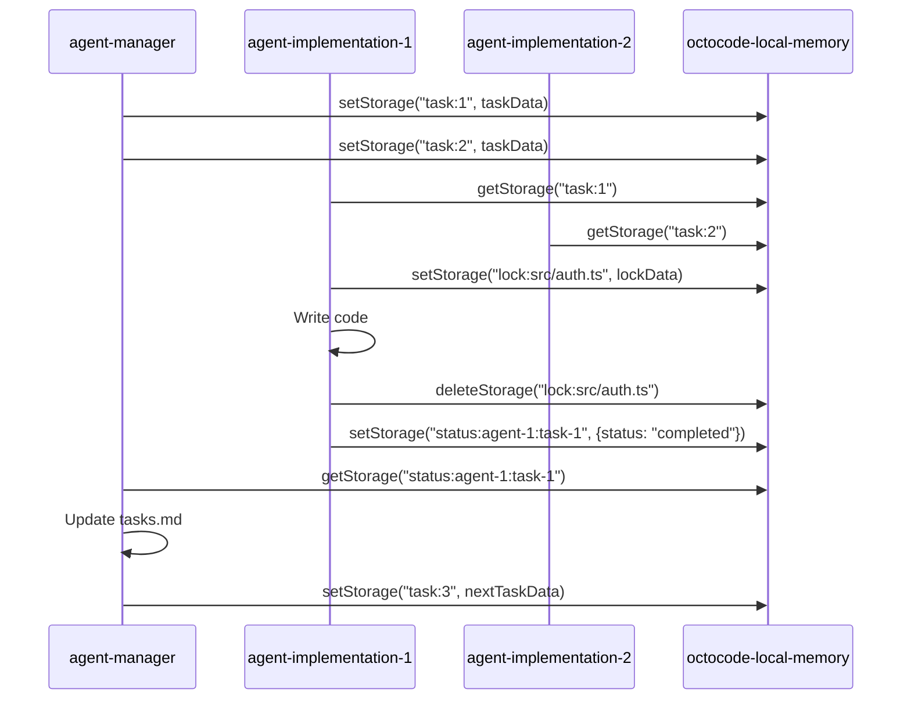
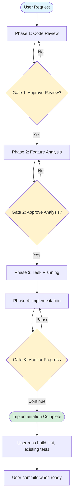

# Octocode Command Flows

This document explains the complete workflows for both Octocode commands: `/octocode-generate` (build from scratch) and `/octocode-feature` (enhance existing code).

---

## Overview

Octocode provides **two specialized workflows**:

1. **`/octocode-generate`** - Build projects from scratch (6 agents, 4 gates)
2. **`/octocode-feature`** - Add features or fix bugs in existing code (4 agents, 3 gates)

Both workflows follow the **MVP-first approach**:
- ✅ Build passes
- ✅ Types correct
- ✅ Lint passes
- ✅ Features work
- ❌ NO tests until post-MVP (user request only)

### Important: Git Operations

**NO GIT COMMANDS:** All agents only modify local files. You (the user) are responsible for all git operations including commits, pushes, branch management, and merges.

---

## Command 1: `/octocode-generate` - Build from Scratch

**Purpose:** Transform an idea into production-ready code
**Agents:** 6 specialized agents
**Gates:** 4 human approval checkpoints
**Output:** `docs/requirements.md`, `docs/design.md`, `docs/test-plan.md`, `docs/tasks.md`, README.md, working codebase

### Workflow Diagram



```mermaid
flowchart TD
    Start([User Request]) --> P1[Phase 1: Requirements]
    P1 --> G1{Gate 1: Approve Requirements?}
    G1 -->|No| P1
    G1 -->|Yes| P2[Phase 2: Architecture Design]
    P2 --> G2{Gate 2: Approve Architecture?}
    G2 -->|No| P2
    G2 -->|Yes| P2_5[Phase 2.5: Verification Planning]
    P2_5 --> G2_5{Gate 2.5: Approve Test Plan?}
    G2_5 -->|No| P2_5
    G2_5 -->|Yes| P2_75[Phase 2.75: Project Foundation]
    P2_75 --> G2_75{Gate 2.75: Approve Foundation?}
    G2_75 -->|No| P2_75
    G2_75 -->|Yes| P3[Phase 3: Task Planning]
    P3 --> P4[Phase 4: Implementation]
    P4 --> G3{Gate 3: Monitor Progress}
    G3 -->|Pause| P4
    G3 -->|Continue| End([Implementation Complete])
    End --> Manual[User runs build, lint, test-plan.md]
    Manual --> Commit[User commits when ready]

    style Start fill:#e1f5ff
    style End fill:#d4edda
    style G1 fill:#fff3cd
    style G2 fill:#fff3cd
    style G2_5 fill:#fff3cd
    style G2_75 fill:#fff3cd
    style G3 fill:#fff3cd
```

### Phase 1: Requirements Gathering

**Agent:** `agent-product` (Product Manager)
**Model:** Claude Opus
**Tools:** Read, Write, Grep, Glob, LS, TodoWrite, WebFetch, WebSearch, ListMcpResourcesTool, ReadMcpResourceTool

**What Happens:**
1. Asks clarifying questions about the project
2. Researches similar projects using **octocode-mcp** (610+ curated repos)
3. Creates comprehensive requirements document

**Output:** `<project>/docs/requirements.md` (<50KB)
- Product overview and value proposition
- Feature list with priorities and acceptance criteria
- User stories (if UX is complex)
- Performance/scale criteria (if critical)
- Footer: "**Created by octocode-mcp**"

**✋ Gate 1: Requirements Review**

User reviews and can:
- ✅ **Approve** → Continue to Architecture
- 📝 **Modify** → Request changes
- ❓ **Questions** → Clarify specific points

---

### Phase 2: Architecture Design

**Agent:** `agent-architect` (Solution Architect)
**Model:** Claude Opus
**Tools:** Read, Write, Grep, Glob, LS, TodoWrite, WebFetch, WebSearch, ListMcpResourcesTool, ReadMcpResourceTool

**What Happens:**
1. Studies requirements document
2. Researches proven architectures using **octocode-mcp** (>1000★ repos)
3. Applies critical thinking framework to design decisions
4. Creates comprehensive design document

**Critical Thinking Questions:**
- What am I optimizing for? (performance/maintainability/cost)
- What are the constraints? (scale/budget/expertise)
- What could go wrong?
- What's the evidence? (proven at scale)

**Output:** `<project>/docs/design.md` (<50KB)
- Tech stack with rationale
- Architecture overview (system flow, components)
- Key decisions with context, options, tradeoffs
- Database schema, API design, auth strategy (as needed)
- Project structure and organization
- Build and lint setup
- Footer: "**Created by octocode-mcp**"

**✋ Gate 2: Architecture Review**

User reviews tech stack and can:
- ✅ **Approve** → Triggers Phase 2.5
- 📝 **Modify** → Request changes
- ❓ **Questions** → Clarify decisions

---

### Phase 2.5: Verification Planning

**Agent:** `agent-quality` (Quality Architect)
**Model:** Claude Opus
**Tools:** Read, Write, Grep, Glob, LS, TodoWrite, WebFetch, WebSearch, ListMcpResourcesTool, ReadMcpResourceTool

**🚨 IMPORTANT: Creates VERIFICATION GUIDES, NOT TEST CODE**

**What Happens:**
1. Studies requirements and design documents
2. Researches testing approaches using **octocode-mcp** (>500★ repos)
3. Creates manual verification plan (NOT test code)

**Output:** `<project>/docs/test-plan.md` (<50KB)
- Verification strategy (what needs verification, manual steps)
- Feature verification flows (step-by-step user flows)
- Component verification mapping (API, DB, UI interactions)
- Test data scenarios (sample data, edge cases)
- Quality checklist (build, lint, performance, security)
- Verification guidance (how to verify, what to look for)
- Footer: "**Created by octocode-mcp**"

**This is a MANUAL VERIFICATION GUIDE:**
- ✅ What features to check
- ✅ How to verify each works
- ✅ What scenarios to test
- ❌ NOT .test.ts files
- ❌ NOT Jest/Vitest setup

**✋ Gate 2.5: Verification Plan Review**

User reviews and can:
- ✅ **Approve** → Triggers Phase 2.75
- 📝 **Adjust Coverage** → Modify plan
- ❓ **Questions** → Clarify approach

---

### Phase 2.75: Project Foundation

**Agent:** `agent-founding-engineer` (Founding Engineer)
**Model:** Claude Sonnet
**Tools:** Read, Write, Edit, Bash, BashOutput, Grep, Glob, LS, TodoWrite, ListMcpResourcesTool, ReadMcpResourceTool

**What Happens:**
1. Studies design.md and test-plan.md
2. Creates initial project scaffold
3. Sets up build system and tooling
4. Verifies foundation works

**Actions:**
1. **Generate scaffold:**
   - Initialize package.json with dependencies
   - Set up build system (TypeScript, bundler, etc.)
   - Configure linting (ESLint, Prettier)
   - Create project structure per design.md
   - Add config files (.gitignore, tsconfig.json, etc.)

2. **Implement core structure:**
   - Create placeholder files for main components
   - Set up entry points (main.ts, index.ts, etc.)
   - Add type definitions
   - Ensure clean architecture boundaries

3. **Verify foundation:**
   - Run `npm install`
   - Verify `npm run build` passes
   - Verify `npm run lint` passes
   - Ensure types are correct

**Output:**
- Complete project scaffold
- `README.md` in project root with:
  - Project overview and purpose
  - Tech stack
  - Setup instructions
  - Development commands
  - Project structure overview
  - Footer: "**Created by octocode-mcp**"

**✋ Gate 2.75: Foundation Review**

User reviews initial project and can:
- ✅ **Approve** → Continue to Planning
- 📝 **Adjust** → Request changes
- ❓ **Questions** → Clarify structure

---

### Phase 3: Task Planning

**Agent:** `agent-manager` (Engineering Manager)
**Model:** Claude Sonnet
**Tools:** Read, Write, Edit, Grep, Glob, LS, TodoWrite, Bash, BashOutput, Task, KillShell, ListMcpResourcesTool, ReadMcpResourceTool

**What Happens:**
1. Reads design.md and patterns (if exists)
2. Creates comprehensive task breakdown
3. Identifies logical dependencies
4. Plans parallelization strategy

**Output:** `<project>/docs/tasks.md` (<50KB)
- Logical phases (setup, core, integrations, polish)
- Individual tasks with descriptions
- Complexity estimates (low/medium/high)
- Logical dependencies only
- Footer: "**Created by octocode-mcp**"

**No Gate** - Manager proceeds directly to implementation

---

### Phase 4: Implementation

**Agents:** 4-5 instances of `agent-implementation` (Software Engineers)
**Managed by:** `agent-manager`
**Model:** Claude Sonnet
**Tools:** Read, Write, Edit, MultiEdit, Bash, BashOutput, Grep, Glob, LS, TodoWrite, ListMcpResourcesTool, ReadMcpResourceTool

**Coordination via octocode-local-memory:**
- Task assignments: `setStorage("task:{id}", taskData, ttl: 3600)`
- Status updates: `setStorage("status:agent-{id}:{taskId}", statusData, ttl: 3600)`
- File locks: `setStorage("lock:{filepath}", lockData, ttl: 300)` → `deleteStorage("lock:{filepath}")`
- Inter-agent messages: `setStorage("question:impl-{id}:{target}:{topic}", questionData, ttl: 1800)`

**Implementation Workflow:**


**Quality Standards (Per Task):**
- ✅ Follow design patterns from docs
- ✅ TypeScript strict mode, minimize `any`
- ✅ Validate inputs (Zod, etc.)
- ✅ Handle errors gracefully
- ✅ Build passes
- ✅ Lint passes
- ❌ NO console.log (use proper logging)
- ❌ NO hardcoded values (use env vars)
- ❌ NO TESTS yet

**Output:**
- Complete feature implementation
- Updated `docs/tasks.md` with progress

**🔄 Gate 3: Live Implementation Monitoring**

User can monitor in real-time:
- ⏸️ **Pause** - Stop all agents, save state
- 📊 **Details** - View task status
- 🔍 **Inspect** - View agent's work
- ⚠️ **Issues** - Review errors
- 🔄 **Continue** - Keep monitoring

---

### Post-Implementation

**User Actions:**
1. Run `npm run build` - Verify build passes
2. Run `npm run lint` - Verify lint passes
3. Follow `docs/test-plan.md` - Manual verification
4. Commit changes when ready (user controls git)

**Tests added post-MVP only when user requests.**

---

## Command 2: `/octocode-feature` - Enhance Existing Code

**Purpose:** Add features or fix bugs in existing codebases
**Agents:** 4 specialized agents
**Gates:** 3 human approval checkpoints
**Output:** `docs/codebase-review.md`, `docs/analysis.md`, `docs/tasks.md`, modified codebase

### Workflow Diagram



### Phase 1: Code Review

**Agent:** `agent-code-review` (Code Analyst)
**Model:** Claude Sonnet
**Tools:** Read, Write, Grep, Glob, LS, TodoWrite, Bash, BashOutput, ListMcpResourcesTool, ReadMcpResourceTool

**What Happens:**
1. Analyzes package files and configs
2. Studies code to identify patterns and conventions
3. Assesses quality (linting, TypeScript, build)
4. Creates comprehensive review document

**Output:** `<project>/docs/codebase-review.md` (<50KB)
- Summary: project type, framework, quality score
- Full tech stack with versions
- Code patterns with examples
- Build and lint setup
- Project structure and organization
- Recommendations for new code
- Footer: "**Created by octocode-mcp**"

**✋ Gate 1: Review Complete**

User reviews and can:
- ✅ **Proceed** → Continue to Analysis
- 📊 **Details** → Review specific sections
- ❓ **Questions** → Clarify findings

---

### Phase 2: Feature Analysis

**Agent:** `agent-feature-analyzer` (Feature Analyst)
**Model:** Claude Opus
**Tools:** Read, Write, Grep, Glob, LS, TodoWrite, WebFetch, WebSearch, ListMcpResourcesTool, ReadMcpResourceTool

**What Happens:**
1. Reads codebase-review.md and user request
2. Applies critical thinking framework
3. Researches implementation patterns using **octocode-mcp** (>500★ repos)
4. Analyzes impact and creates implementation plan

**Critical Thinking Questions:**
- What's the simplest solution?
- What could go wrong?
- What am I assuming?
- Is there production evidence?

**Red Flags:** No similar implementations, HIGH complexity + LOW confidence, >10 files
**Green Flags:** Similar feature exists, pattern proven (>500★), low risk

**Output:** `<project>/docs/analysis.md` (<50KB)
- Clear understanding and acceptance criteria
- Impact assessment (files, DB, API, UI)
- Risks with mitigation
- Solution options with recommendation
- High-level task breakdown
- Build and lint considerations
- Footer: "**Created by octocode-mcp**"

**✋ Gate 2: Analysis Complete**

User reviews and can:
- ✅ **Implement** → Continue to Planning
- 📝 **Adjust** → Modify approach
- 🔍 **Review** → Deep dive into analysis

---

### Phase 3: Task Planning

**Agent:** `agent-manager` (Engineering Manager)
**Model:** Claude Sonnet
**Tools:** Read, Write, Edit, Grep, Glob, LS, TodoWrite, Bash, BashOutput, Task, KillShell, ListMcpResourcesTool, ReadMcpResourceTool

**What Happens:**
1. Reads design.md, patterns.md (if exists), and analysis.md
2. Creates task breakdown
3. Identifies dependencies
4. Plans parallelization

**Output:** `<project>/docs/tasks.md` (<50KB)
- Logical phases
- Individual tasks with descriptions
- Complexity estimates
- Logical dependencies
- Footer: "**Created by octocode-mcp**"

**No Gate** - Manager proceeds directly to implementation

---

### Phase 4: Implementation

**Same as `/octocode-generate` Phase 4:**

- 4-5 `agent-implementation` instances work in parallel
- Coordinate via **octocode-local-memory** (task assignments, file locks, status updates)
- Follow existing code patterns from codebase-review.md
- Update tasks.md with progress

**Quality Standards:**
- ✅ Build passes
- ✅ Types correct
- ✅ Lint passes
- ✅ Existing tests pass (if any)
- ✅ Feature/fix works
- ❌ NO new test files (until post-MVP)

**🔄 Gate 3: Live Implementation Monitoring**

User can monitor in real-time:
- ⏸️ **Pause** - Stop all agents
- 📊 **Details** - View status
- 🔍 **Inspect** - View work
- ⚠️ **Issues** - Review errors
- 🔄 **Continue** - Keep monitoring

---

### Post-Implementation

**User Actions:**
1. Run `npm run build` - Verify build passes
2. Run `npm run lint` - Verify lint passes
3. Run existing tests (if any) - Ensure no regressions
4. Verify changes manually
5. Commit when ready (user controls git)

**New tests added only when user requests.**

---

## Agent Communication (Both Commands)

Agents communicate using **octocode-local-memory MCP** (storage-based, NOT files):

### Task Assignment (Manager → Implementation)
```javascript
setStorage("task:3.1", JSON.stringify({
  taskId: "3.1",
  agentId: "agent-implementation-1",
  description: "Implement user authentication",
  files: ["src/auth/login.ts"],
  complexity: "medium"
}), ttl: 3600);
```

### Status Updates (Implementation → Manager)
```javascript
setStorage("status:agent-1:task-3.1", JSON.stringify({
  status: "in_progress",
  progress: 65,
  currentStep: "Writing auth logic"
}), ttl: 3600);
```

### File Locks (Prevent Conflicts)
```javascript
// Before editing
setStorage("lock:src/auth/login.ts", JSON.stringify({
  lockedBy: "agent-implementation-1",
  taskId: "3.1"
}), ttl: 300);

// After editing
deleteStorage("lock:src/auth/login.ts");
```

### Inter-Agent Questions
```javascript
// Implementation asks architect
setStorage("question:impl-1:architect:auth-approach", JSON.stringify({
  question: "Should we use JWT or sessions?",
  context: "Working on task 3.1"
}), ttl: 1800);

// Architect responds
setStorage("answer:impl-1:architect:auth-approach", JSON.stringify({
  answer: "Use JWT tokens",
  reasoning: "Better scalability"
}), ttl: 3600);
```

**Why storage instead of files?**
- **50x faster** (< 1ms vs 10-50ms per operation)
- Built-in concurrency safety
- Automatic TTL-based cleanup
- Simple key-value API

📖 **Full patterns:** [AGENT_COMMUNICATION.md](./AGENT_COMMUNICATION.md)

---

## MCPs Used by Agents

### octocode-mcp: Code Research & Planning
**Purpose:** Finding proven patterns, researching implementations

**Used by:**
- ✅ agent-product (requirements research)
- ✅ agent-architect (architecture research)
- ✅ agent-quality (testing patterns research)
- ✅ agent-feature-analyzer (implementation patterns research)
- ⚠️ agent-implementation (only for missing patterns)

**Usage:**
- Search 100M+ GitHub repositories
- Access curated resources (610+ repos, 12 files)
- Extract proven patterns
- Find similar projects

📚 **Resources:** https://github.com/bgauryy/octocode-mcp/tree/main/resources

### octocode-local-memory: Agent Coordination
**Purpose:** Fast inter-agent communication during parallel implementation

**Used by:**
- ✅ agent-manager (task assignment, progress tracking)
- ✅ agent-implementation (status updates, file locks, questions)

**Operations:**
- Task assignments (1-2ms)
- File locks (< 1ms)
- Status updates (< 1ms)
- Inter-agent messages (1-2ms)

**Performance:** 50x faster than file-based coordination

---

## Summary Tables

### `/octocode-generate` Flow

| Phase | Agent | Output | Gate |
|-------|-------|--------|------|
| 1. Requirements | agent-product | `docs/requirements.md` | ✋ Gate 1 |
| 2. Architecture | agent-architect | `docs/design.md` | ✋ Gate 2 |
| 2.5. Verification | agent-quality | `docs/test-plan.md` | ✋ Gate 2.5 |
| 2.75. Foundation | agent-founding-engineer | Scaffold + README | ✋ Gate 2.75 |
| 3. Planning | agent-manager | `docs/tasks.md` | - |
| 4. Implementation | 4-5 × agent-implementation | Code + updated tasks.md | 🔄 Gate 3 |

**Result:** 4 docs (<50KB each), working codebase, 4 approval gates

### `/octocode-feature` Flow

| Phase | Agent | Output | Gate |
|-------|-------|--------|------|
| 1. Code Review | agent-code-review | `docs/codebase-review.md` | ✋ Gate 1 |
| 2. Analysis | agent-feature-analyzer | `docs/analysis.md` | ✋ Gate 2 |
| 3. Planning | agent-manager | `docs/tasks.md` | - |
| 4. Implementation | 4-5 × agent-implementation | Code + updated tasks.md | 🔄 Gate 3 |

**Result:** 3 docs (<50KB each), modified codebase, 3 approval gates

---

## Quality Standards (Both Commands)

**MVP-First Approach:**
- ✅ Build passes (`npm run build`)
- ✅ Types correct (TypeScript strict, minimal `any`)
- ✅ Lint passes (`npm run lint`)
- ✅ Features work as designed
- ✅ Existing tests pass (for `/octocode-feature`)
- ❌ NO new test files until post-MVP
- ❌ NO automated testing during MVP

**Post-MVP:**
- User runs build/lint checks
- User follows test-plan.md for manual verification (generate) or tests changes (feature)
- User commits when ready (user controls git)
- Tests added only when user requests

**Documentation:**
- All docs in `<project>/docs/`
- All docs <50KB each
- All docs include footer: "**Created by octocode-mcp**"

---

## Success Metrics

**At completion, you have:**

✅ **Clear documentation** - 3-4 concise files explaining everything
✅ **Working code** - Build + lint + types all pass
✅ **Human approval** - You approved 3-4 times during workflow
✅ **Production-ready** - Manual verification complete
✅ **Version control** - You commit when ready (agents don't touch git)
✅ **Efficient process** - Parallel execution, research-driven decisions
✅ **Quality-focused** - MVP first, tests when you request

---

**Made with ❤️ by Guy Bary**

🏗️ **Octocode** - Transform Claude into a complete AI development team
