# Octocode Development Flow

This document describes the complete workflow from user request to production-ready code using the Octocode AI development team.

## Overview

Octocode orchestrates 7 specialized AI agents through a **7-phase waterfall** with **5 human gates** for approval and monitoring. Each phase builds on previous work with clear outputs and validation.

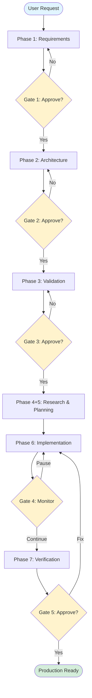

---

## Phase 1: Requirements Gathering

**Agent:** `agent-product` (Product Manager)  
**Model:** Claude Opus  
**Tools:** Read, Write, TodoWrite

### Responsibilities

1. **Discover requirements** through clarifying questions
2. **Research similar projects** using octocode-mcp GitHub resources
3. **Create comprehensive PRD** with features, user stories, success metrics

### Inputs

- User's project request
- Octocode-MCP resources (610+ curated Node.js/TypeScript repos)

### Outputs

Created in `.octocode/requirements/`:

| File | Description |
|------|-------------|
| `prd.md` | Product Requirements Document with problem, users, features, metrics |
| `features.md` | Detailed feature specs with acceptance criteria and dependencies |
| `user-stories.md` | User journeys, edge cases, error scenarios |
| `error-handling.md` | Error scenarios and handling strategies |
| `performance.md` | Performance criteria and SLAs |

### Gate 1: PRD Approval ✋

User reviews requirements summary and can:
- ✅ **Approve** → Continue to Architecture
- 📝 **Modify** → Request changes to requirements
- ❓ **Questions** → Clarify specific points
- 📖 **Review** → Read full PRD documentation

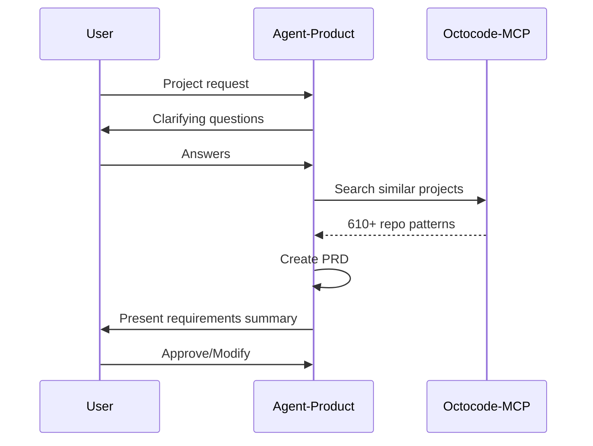

---

## Phase 2: Architecture Design

**Agent:** `agent-architect` (Solution Architect)  
**Model:** Claude Opus  
**Tools:** Read, Write, Grep, Glob, LS, TodoWrite

### Responsibilities

1. **Analyze requirements** with critical thinking framework
2. **Research best practices** from production repositories (>1000 stars)
3. **Design complete architecture** (backend + frontend + database)
4. **Document all decisions** with evidence and rationale
5. **Create project structure** after approval

### Critical Thinking Framework

Before ANY major decision:

1. What am I optimizing for? (Performance? Maintainability? Cost?)
2. What are the constraints? (Scale? Budget? Team?)
3. What are my assumptions? (Prove them with evidence)
4. What questions need answers? (List unknowns)
5. What would make this wrong? (Failure modes)

### Outputs

Created in `.octocode/designs/`:

| File | Description |
|------|-------------|
| `architecture.md` | System overview, components, data flow (backend + frontend) |
| `tech-stack.md` | Full stack choices with rationale (framework, database, auth, etc.) |
| `component-structure.md` | Module organization (backend + frontend folders) |
| `api-design.md` | Endpoints, contracts, versioning |
| `database-schema.md` | Tables, fields, relationships, indexes |
| `data-flow.md` | State management, caching, real-time updates |
| `ui-approach.md` | Frontend framework, component library, design system |
| `auth-strategy.md` | Authentication/authorization design |
| `testing-strategy.md` | Test approach and frameworks |
| `deployment.md` | Hosting, CI/CD, environment variables |
| `tradeoffs.md` | Decisions, alternatives, and justifications |

### Gate 2: Architecture Review ✋

User reviews tech stack and key decisions, then agent creates:
- Initial project structure
- README.md with what/why/how
- Configuration files

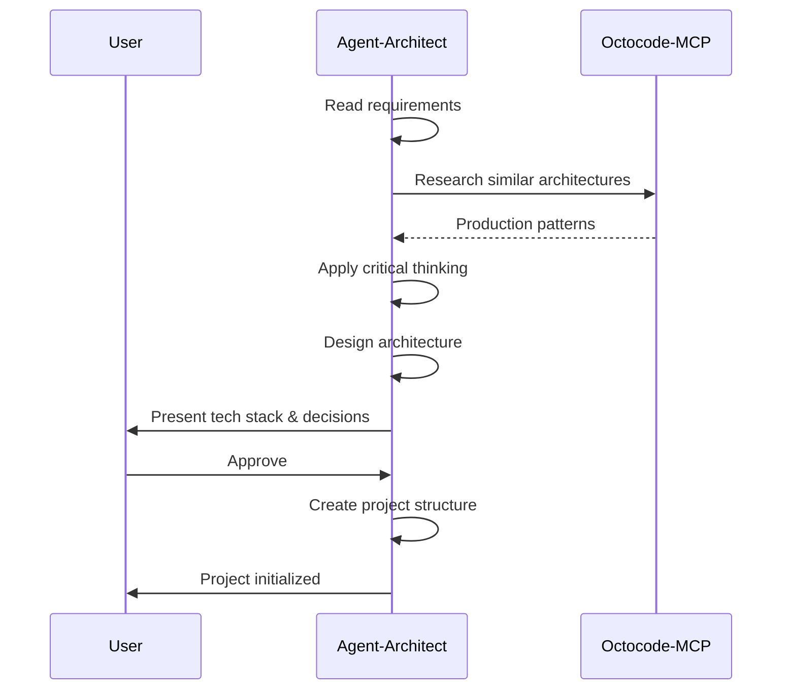

---

## Phase 3: Design Validation & Task Planning

**Agent:** `agent-design-verification` (Technical Lead)  
**Model:** Claude Sonnet  
**Tools:** Read, Write, Grep, Glob, LS, TodoWrite

### Responsibilities

1. **Validate requirements coverage** - Ensure all features have design
2. **Validate architecture soundness** - Check for missing components
3. **Identify issues** - Escalate to agent-product or agent-architect
4. **Create comprehensive task breakdown** with dependencies

### Task Breakdown Format

```markdown
## Phase N: [Name] [parallel-group]

- [ ] N.1: Task name
      Files: [file1.ts, file2.ts]
      Complexity: low
      [can-run-parallel]

- [ ] N.2: Another task
      Files: [file3.ts]
      Complexity: medium
      [can-run-parallel-with: N.1]

- [ ] N.3: Dependent task
      Files: [file1.ts]
      Complexity: low
      [blocked-by: N.1] ⚠️ (shared file)
```

### Outputs

Created in `.octocode/`:

| File | Description |
|------|-------------|
| `tasks.md` | Complete task breakdown with files, dependencies, estimates, parallelization hints |

### Gate 3: Task Plan Approval ✋

User reviews:
- Total tasks and time estimates
- Parallelization strategy
- Phase breakdown

Can adjust scope or optimize parallelization.

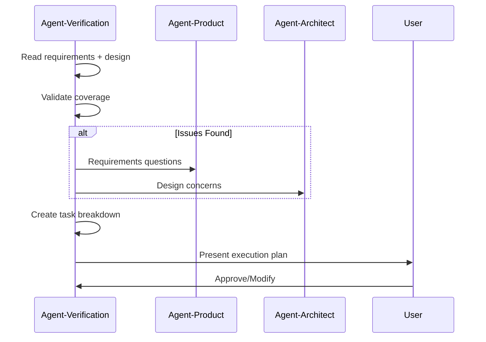

---

## Phase 4: Research Context (Parallel)

**Agent:** `agent-research-context` (Research Specialist)  
**Model:** Claude Sonnet  
**Tools:** Read, Write, LS, TodoWrite

### Responsibilities

1. **Identify research topics** from tech stack
2. **Search GitHub** for production implementations (>500 stars)
3. **Extract code patterns** (50-100 line examples)
4. **Create copy-paste ready guides**

### Research Strategy

For each tech component:
1. Read relevant resource files (project-examples.md, architecture.md, etc.)
2. Search GitHub for proven patterns
3. Study 5-10 high-quality repositories
4. Extract and document common patterns
5. Include pitfalls and alternatives

### Outputs

Created in `.octocode/context/`:

| File Pattern | Description |
|--------------|-------------|
| `[framework]-patterns.md` | Framework-specific patterns (e.g., Next.js, tRPC) |
| `[integration]-patterns.md` | Integration patterns (e.g., Prisma + tRPC) |
| `[feature]-patterns.md` | Feature implementations (e.g., real-time WebSocket) |
| `testing-patterns.md` | Testing approaches and examples |
| `deployment-patterns.md` | Deployment and CI/CD patterns |

### Parallel Execution

Phase 4 (Research Context) and Phase 5 (Planning) can run **simultaneously** to optimize workflow efficiency.

---

## Phase 5: Execution Planning

**Agent:** `agent-manager` (Engineering Manager)  
**Model:** Claude Sonnet  
**Tools:** Read, Write, TodoWrite, Bash, BashOutput, Task, KillShell

### Responsibilities (Planning)

1. **Analyze tasks** from `.octocode/tasks.md`
2. **Identify file dependencies** (which tasks share files?)
3. **Create execution plan** with parallelization strategy
4. **Initialize state management** (locks.json, execution-state.json)

### File Dependency Analysis Example

```
Task 3.1: Files [src/auth/auth.ts, src/types/user.ts]
Task 3.2: Files [src/api/api.ts, src/api/routes.ts]
Task 3.3: Files [src/auth/auth.ts]

→ 3.1 and 3.2: No shared files ✅ Run in parallel
→ 3.1 and 3.3: Both need auth.ts ❌ Run sequentially
```

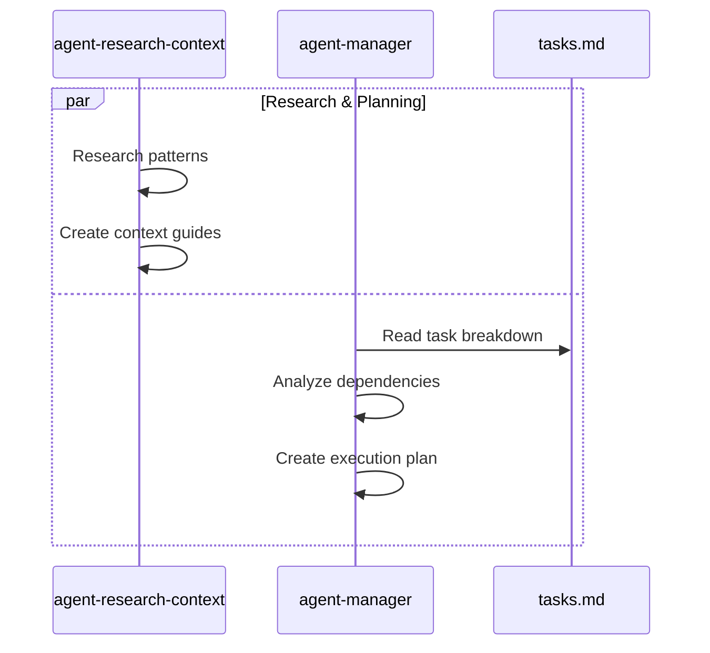

---

## Phase 6: Implementation

**Agents:** Multiple `agent-implementation` instances (4-5 running in parallel)  
**Managed by:** `agent-manager`  
**Model:** Claude Sonnet  
**Tools:** Read, Write, Edit, Bash, BashOutput, Grep, Glob, LS, TodoWrite

### Architecture

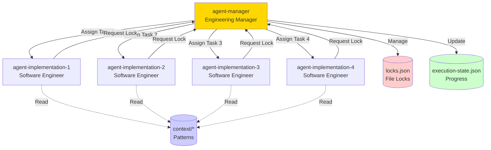

### Implementation Workflow

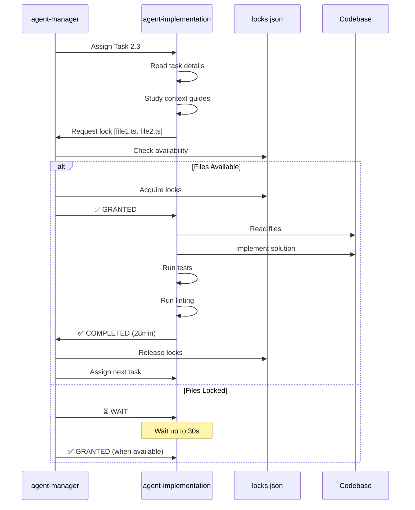

### File Lock Management

**locks.json:**
```json
{
  "locks": {
    "src/auth/auth.ts": {
      "lockedBy": "agent-implementation-1",
      "taskId": "3.1",
      "acquiredAt": "2025-10-14T14:30:00Z"
    }
  }
}
```

**Operations:**
- **Acquire:** Check all files available → Grant atomically or WAIT
- **Release:** Task completes → Release atomically → Notify waiting agents
- **Stale Detection:** Auto-release locks older than 5 minutes

### Progress Tracking

**Live Dashboard (.octocode/logs/progress-dashboard.md):**

```
⚡ IMPLEMENTATION IN PROGRESS
━━━━━━━━━━━━━━━━━━━━━━━━━━━━━━━━━━━━━━━━━━━━━━

Progress: [████████░░░░░░░░] 65% (23/35 tasks)

🤖 Active Agents:
  agent-impl-1 → Task 4.2: Portfolio API [2min elapsed]
  agent-impl-2 → Task 4.3: Price alerts [5min elapsed]
  agent-impl-3 → Task 4.5: Chart component [1min elapsed]
  agent-impl-4 → Idle (waiting for auth.ts unlock)

✅ Completed: 23 tasks
  Phase 1: ████████ 100% (5/5) ✅
  Phase 2: ████████ 100% (8/8) ✅
  Phase 3: ██████░░ 75% (9/12)

🔒 Current Locks:
  • src/api/portfolio.ts (agent-impl-1)
  • src/components/AlertList.tsx (agent-impl-2)

━━━━━━━━━━━━━━━━━━━━━━━━━━━━━━━━━━━━━━━━━━━━━━
Last update: 10s ago
```

### State Persistence

**execution-state.json:**
```json
{
  "currentPhase": "implementation",
  "tasks": {
    "total": 35,
    "completed": 23,
    "inProgress": 3,
    "pending": 9
  },
  "activeAgents": [
    {
      "agentId": "agent-implementation-1",
      "taskId": "4.2",
      "lockedFiles": ["src/api/portfolio.ts"]
    }
  ],
  "lastCheckpoint": "2025-10-14T14:30:00Z"
}
```

### Gate 4: Live Monitoring 🔄

**Interactive dashboard with controls:**
- ⏸️ **Pause** - Stop all agents, save state
- 📊 **Details** - View task status
- 🔍 **Inspect** - View agent's work
- ⚠️ **Issues** - Review errors
- 🔄 **Continue** - Keep monitoring
- 🛑 **Stop** - Graceful shutdown

Auto-refreshes every 30 seconds.

### Quality Standards (Per Task)

Each implementation agent must:
- ✅ Follow design patterns from context guides
- ✅ Add TypeScript types (no `any`)
- ✅ Validate inputs (Zod, etc.)
- ✅ Handle errors gracefully
- ✅ Write unit tests
- ✅ Pass linting
- ❌ No console.log (use proper logging)
- ❌ No hardcoded values (use env vars)

---

## Phase 7: Verification

**Agent:** `agent-verification` (QA Engineer)  
**Model:** Claude Sonnet  
**Tools:** Read, Bash, BashOutput, Grep, Glob, LS, TodoWrite, KillShell

### Comprehensive Verification

```mermaid
flowchart LR
    Start([Implementation<br/>Complete]) --> Build[1. Build<br/>Verification]
    Build --> Tests[2. Test<br/>Verification]
    Tests --> Lint[3. Lint<br/>Verification]
    Lint --> Features[4. Feature<br/>Verification]
    Features --> Perf[5. Performance<br/>Verification]
    Perf --> Code[6. Code Quality<br/>Review]
    Code --> Prod[7. Production<br/>Readiness]
    Prod --> Runtime[8. Runtime<br/>Testing]
    Runtime --> Report[Generate<br/>Report]
    Report --> Gate5{Gate 5}

    style Build fill:#d1ecf1
    style Tests fill:#d1ecf1
    style Lint fill:#d1ecf1
    style Features fill:#fff3cd
    style Perf fill:#d1ecf1
    style Code fill:#d1ecf1
    style Prod fill:#fff3cd
    style Runtime fill:#fff3cd
    style Gate5 fill:#f8d7da
```

### 1. Build Verification ✅

```bash
npm run build
# Check: Build completes without errors
```

### 2. Test Verification ✅

```bash
npm test
npm run test:coverage
# Check: All tests pass, coverage meets requirements
```

### 3. Lint Verification ✅

```bash
npm run lint
npm run lint:fix
# Check: No critical lint errors
```

### 4. Feature Verification ✅ (CRITICAL)

**For EACH feature in `.octocode/requirements/features.md`:**

```markdown
Feature: User can create portfolio
PRD: Section 3.1

Verification:
  ✅ UI component exists (src/components/PortfolioForm.tsx)
  ✅ API endpoint exists (src/api/portfolio.create.ts)
  ✅ Database table exists
  ✅ Tests cover flow (portfolio.test.ts)
  ✅ Error handling implemented

Status: ✅ VERIFIED
```

### 5. Performance Verification ✅

Compare against `.octocode/requirements/performance.md`:

| Metric | Target | Actual | Status |
|--------|--------|--------|--------|
| Page load | <2s | 1.2s | ✅ |
| API response | <500ms | 180ms | ✅ |
| Cache hit rate | >80% | 92% | ✅ |

### 6. Code Quality Review ✅

**Checks:**
- TypeScript strict mode enabled
- No `any` types (or minimal with justification)
- No functions >100 lines
- No nesting >5 levels
- Minimal `@ts-ignore` usage

### 7. Production Readiness ✅

**Environment:**
- `.env.example` exists
- `.env` in `.gitignore`

**Security:**
- No hardcoded secrets
- Security headers configured (helmet, cors)

**Infrastructure:**
- Deployment configs exist (Dockerfile, docker-compose.yml)
- CI/CD pipeline configured

### 8. Runtime Testing ✅

**Using Chrome DevTools:**
1. Start dev server (`npm run dev`)
2. Open in Chrome
3. Navigate key user flows
4. Monitor console for errors
5. Check network requests
6. Test interactions

**Look for:**
- ❌ JavaScript errors
- ⚠️ Console warnings
- ❌ Failed requests (404, 500)
- ❌ CORS errors

**Measure performance:**
- LCP < 2.5s
- FID < 100ms
- CLS < 0.1

### Verification Report

**Generated: `.octocode/verification-report.md`**

```markdown
# Verification Report

**Date:** 2025-10-14
**Status:** ✅ PASSED / ⚠️ PASSED WITH WARNINGS / ❌ FAILED

## Summary

| Category | Status | Details |
|----------|--------|---------|
| Build | ✅ Pass | No errors |
| Tests | ✅ Pass | 154/154, 87% coverage |
| Linting | ✅ Pass | No critical errors |
| Features | ✅ Pass | 12/12 must-have |
| Performance | ✅ Pass | All metrics met |
| Security | ✅ Pass | No vulnerabilities |
| Code Quality | ✅ Pass | No issues |
| Production | ✅ Pass | Ready for deployment |
| Runtime | ✅ Pass | No console errors |

## Critical Issues ❌
[None or list issues with severity, location, fix description]

## Warnings ⚠️
[None or list warnings]

## Next Steps
[Must Fix (P0) / Recommended / Optional]

## Conclusion
[Production-ready status and recommendations]
```

### Gate 5: Final Approval ✋

```markdown
✅ VERIFICATION COMPLETE
━━━━━━━━━━━━━━━━━━━━━━━━━━━━━━━━━━━━━━━━━━━━━━

Status: ✅ PASSED

🏗️ Build: ✅ PASSED
🧪 Tests: ✅ PASSED (154/154, 87% coverage)
📋 Features: ✅ 12/12 must-have
⚡ Performance: ✅ PASSED
🔒 Security: ✅ PASSED
📊 Code Quality: 9.5/10
🚀 Production: ✅ READY
🌐 Runtime: ✅ PASSED

📂 Full report: .octocode/verification-report.md

━━━━━━━━━━━━━━━━━━━━━━━━━━━━━━━━━━━━━━━━━━━━━━

Options:
  [1] 🚀 Ship It - Deploy to production
  [2] 🔧 Fix Issues - Address remaining items
  [3] 🔄 Iterate - Add improvements
  [4] 📖 Review - See full report
```

---

## State Management & Resume

### Files

| File | Purpose |
|------|---------|
| `.octocode/execution-state.json` | Current phase, progress, active agents |
| `.octocode/locks.json` | File locks during implementation |
| `.octocode/tasks.md` | Task list with status updates |
| `.octocode/logs/progress-dashboard.md` | Live progress display |
| `.octocode/logs/issues-log.md` | Problems and resolutions |
| `.octocode/debug/communication-log.md` | Agent-to-agent communication |

### Resume Capability

**Command:** `/octocode-generate --resume`

**Behavior:**
1. Load `.octocode/execution-state.json`
2. Check current phase
3. Resume from last checkpoint
4. Restore file locks if in implementation
5. Continue from where it stopped

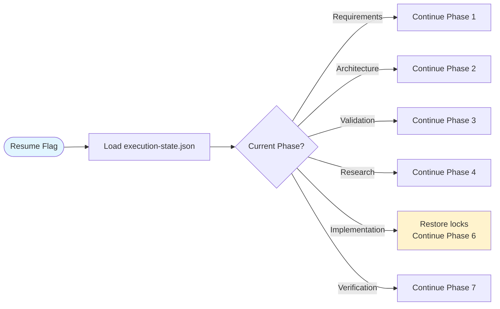

---

## Inter-Agent Communication

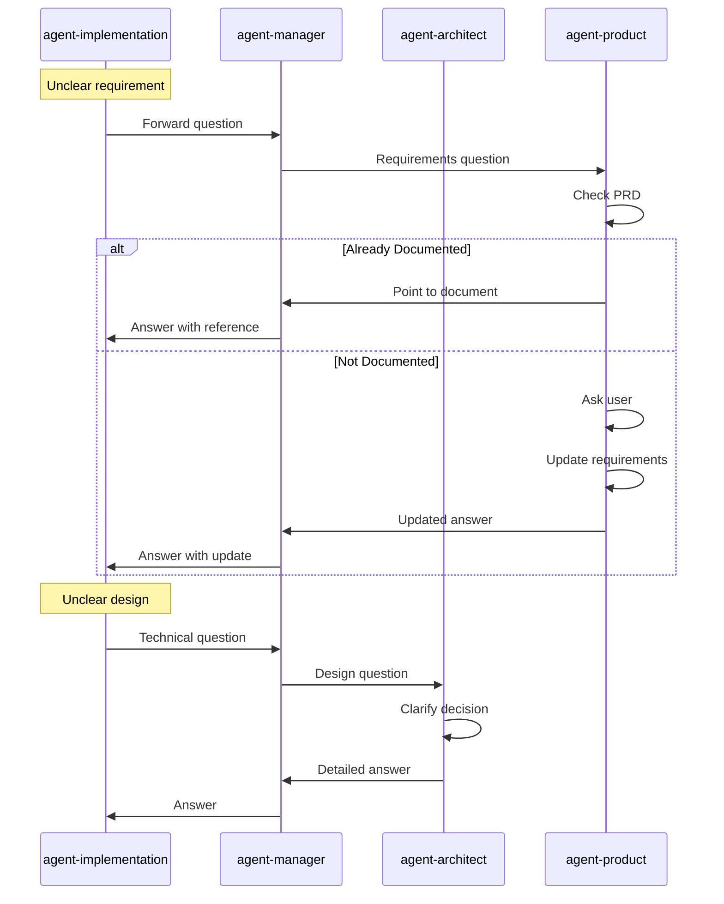

**Communication Log:** `.octocode/debug/communication-log.md`

---

## Resource Utilization

### Octocode-MCP Resources

**Location:** https://github.com/bgauryy/octocode-mcp/tree/main/resources

**Contents:**
- 610+ curated Node.js/TypeScript repositories
- 12 specialized files organized by domain

| File | Purpose | Used By |
|------|---------|---------|
| `project-examples.md` | Full-stack project templates | All agents (START HERE) |
| `architecture.md` | Architecture patterns | architect, research |
| `frontend-libs.md` | Frontend frameworks & libraries | product, architect |
| `backend.md` | Backend frameworks & tools | architect, research |
| `database.md` | Database & ORM patterns | architect, research |
| `auth.md` | Authentication solutions | architect, research |
| `fullstack-frameworks.md` | Integrated frameworks (Next.js, etc.) | architect |
| `testing.md` | Testing strategies & tools | architect, verification |
| `tooling.md` | Development tools & CLI | architect, implementation |
| `security.md` | Security best practices | architect, verification |
| `ai-agents.md` | AI integration patterns | architect (if needed) |
| `mcp-typescript.md` | MCP TypeScript examples | architect (if needed) |

### Agent Resource Usage Pattern

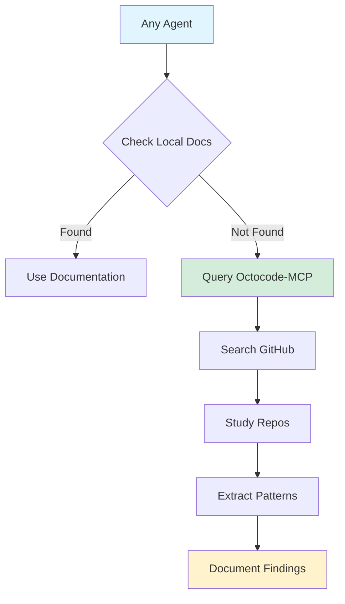

---

## Agent Specialization Summary

| Agent | Role | Model | Key Tools | Phase |
|-------|------|-------|-----------|-------|
| `agent-product` | Product Manager | Opus | Read, Write, TodoWrite | 1 |
| `agent-architect` | Solution Architect | Opus | Read, Write, Grep, Glob, LS, TodoWrite | 2 |
| `agent-design-verification` | Technical Lead | Sonnet | Read, Write, Grep, Glob, LS, TodoWrite | 3 |
| `agent-research-context` | Research Specialist | Sonnet | Read, Write, LS, TodoWrite | 4 |
| `agent-manager` | Engineering Manager | Sonnet | Read, Write, TodoWrite, Bash, Task, KillShell | 5-6 |
| `agent-implementation` | Software Engineer | Sonnet | Read, Write, Edit, Bash, Grep, Glob, LS, TodoWrite | 6 |
| `agent-verification` | QA Engineer | Sonnet | Read, Bash, Grep, Glob, LS, TodoWrite, KillShell | 7 |

### Model Selection Rationale

- **Opus (Phases 1-2):** Complex reasoning, critical thinking, architecture decisions
- **Sonnet (Phases 3-7):** Fast execution, code implementation, verification tasks

---

## Success Criteria

At Gate 5, application must meet:

- ✅ Build passes without errors
- ✅ All tests pass (unit + integration)
- ✅ All PRD features implemented and verified
- ✅ Performance metrics met
- ✅ Security scan passes
- ✅ Code quality standards met
- ✅ Production readiness checklist complete
- ✅ Runtime testing passes (no console errors)
- ✅ User approves at Gate 5

---

## Process Flow Summary

**Sample project: Todo App with Real-time Collaboration**

| Phase | Key Activities | Gate |
|-------|----------------|------|
| Phase 1: Requirements | Product Manager gathers requirements, creates PRD | ✋ Gate 1: User reviews requirements |
| Phase 2: Architecture | Architect designs complete system | ✋ Gate 2: User reviews architecture |
| Phase 3: Validation | Tech Lead creates task breakdown | ✋ Gate 3: User reviews task plan |
| Phase 4: Research | Research Specialist finds patterns | **Runs parallel with Phase 5** |
| Phase 5: Planning | Manager analyzes dependencies | - |
| Phase 6: Implementation | 4-5 Software Engineers work in parallel | ✋ Gate 4: Live progress monitoring |
| Phase 7: Verification | QA Engineer runs all checks | ✋ Gate 5: Final approval |

---

## Flow Verification ✅

The flow has been verified to be:

1. **Complete** - All phases connect properly
2. **Logical** - Each phase builds on previous work
3. **Efficient** - Phases 4 & 5 run in parallel
4. **Safe** - File locking prevents conflicts
5. **Resumable** - State persists after each phase
6. **Validated** - 5 human gates ensure quality
7. **Production-Ready** - Comprehensive verification before deployment

All agent responsibilities are clear, inputs/outputs are well-defined, and communication paths are established.
