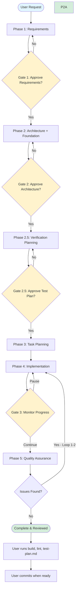

# Octocode Command Flows

This document explains the complete workflows for all three Octocode commands: `/octocode-generate-quick` (fast build), `/octocode-generate` (thorough build), and `/octocode-feature` (enhance existing code).

---

## Overview

Octocode provides **three specialized workflows**:

1. **`/octocode-generate-quick`** ⚡ - Fast build from scratch (3 agents, 1 gate)
2. **`/octocode-generate`** - Thorough build from scratch (5 agents, 3 gates)
3. **`/octocode-feature`** - Add features or fix bugs in existing code (3 agents, 2 gates)

All workflows follow the **MVP-first approach**:
- ✅ Build passes
- ✅ Types correct
- ✅ Lint passes
- ✅ Features work
- ❌ NO tests until post-MVP (user request only)

### Important: Git Operations

**NO GIT COMMANDS:** All agents only modify local files. You (the user) are responsible for all git operations including commits, pushes, branch management, and merges.

---

## Command 1: `/octocode-generate-quick` ⚡ - Fast Build from Scratch

**Purpose:** Quickly transform an idea into production-ready code
**Agents:** 3 specialized agents (agent-rapid-planner, agent-manager, agent-implementation)
**Gates:** 1 human approval checkpoint
**Output:** `docs/PROJECT_SPEC.md` (~80KB consolidated doc), working codebase

### Workflow Diagram


### Phase 1: Rapid Planning

**Agent:** `agent-rapid-planner` (Rapid Planner)
**Model:** Claude Opus
**Tools:** Read, Write, Edit, Grep, Glob, LS, Bash, BashOutput, TodoWrite, WebFetch, WebSearch, ListMcpResourcesTool, ReadMcpResourceTool

**What Happens:**
1. Asks 2-3 critical questions (if needed)
2. Researches boilerplate commands and 2-3 similar projects using **octocode-mcp**
3. Creates single consolidated PROJECT_SPEC.md with:
   - Overview & Requirements
   - Architecture & Design (with boilerplate CLI command)
   - Verification Plan
   - Implementation Tasks

**Output:** `<project>/docs/PROJECT_SPEC.md` (~80KB)
- Everything in one file for speed
- Includes 🚀 Quick Start Command with CLI boilerplate
- Task breakdown with complexity and parallelization
- Footer: "**Created by octocode-mcp**"

**✋ Gate 1: Specification Review (ONLY GATE)**

User reviews complete spec and can:
- ✅ **Approve & Start Building** → Continue to Implementation
- 📝 **Modify** → Request changes
- ❓ **Questions** → Clarify sections

### Phase 2: Implementation

**Agents:** 2-8 instances of `agent-implementation` (Software Engineers, dynamically scaled)
**Managed by:** `agent-manager` (Engineering Manager)
**Model:** Claude Sonnet (both)
**Tools:** Same as standard mode implementation

**Dynamic Scaling:** Agent count (2-8) determined by task complexity score
**Coordination:** Same as standard mode using **octocode-local-memory**

**Output:**
- Complete feature implementation
- Updated `docs/PROJECT_SPEC.md` with progress inline

**🔄 Live Monitoring:** User can pause/continue/inspect

### Phase 3: Quality Check & Code Review

**Agent:** `agent-rapid-planner` (returns for validation)
**Model:** Claude Opus

**What Happens:**
1. **Build Validation:**
   - Run `npm run build` - must pass
   - Run `npm run lint` - must pass
   - TypeScript strict mode check
   - Feature completeness check

2. **Code Review (Bug Prevention):**
   - Logic flow analysis (critical paths, edge cases, async patterns)
   - Type safety & validation check
   - Error handling review
   - Security scan (secrets, XSS, SQL injection, auth)
   - Performance & resources (memory leaks, cleanup)
   - Common bug patterns (mutations, race conditions, state issues)

3. **If Issues Found:**
   - Create fix tasks in PROJECT_SPEC.md
   - Back to implementation (max 2 loops)

4. **If All Clean:**
   - Update PROJECT_SPEC.md with ✅ Complete & Reviewed status

**Output:** Validated, bug-scanned, production-ready code

### Post-Implementation

**User Actions:**
1. Run `npm run build && npm run lint` - Verify
2. Follow manual testing steps from section 3
3. Test edge cases and scenarios
4. Commit when ready (user controls git)

**Tests added post-MVP only when user requests.**

---

## Command 2: `/octocode-generate` - Thorough Build from Scratch

**Purpose:** Transform an idea into production-ready code
**Agents:** 4 specialized agents
**Gates:** 3 human approval checkpoints
**Output:** `docs/requirements.md`, `docs/design.md`, `docs/test-plan.md`, `docs/tasks.md`, README.md, `docs/bug-report.md`, working codebase

### Workflow Diagram



### Phase 1: Requirements Gathering

**Agent:** `agent-product` (Product Manager)
**Model:** Claude Opus
**Tools:** Read, Write, Grep, Glob, LS, TodoWrite, WebFetch, WebSearch, ListMcpResourcesTool, ReadMcpResourceTool

**What Happens:**
1. Asks clarifying questions about the project
2. Researches similar projects using **octocode-mcp** (610+ curated repos)
3. Creates comprehensive requirements document

**Output:** `<project>/docs/requirements.md` (<50KB)
- Product overview and value proposition
- Feature list with priorities and acceptance criteria
- User stories (if UX is complex)
- Performance/scale criteria (if critical)
- Footer: "**Created by octocode-mcp**"

**✋ Gate 1: Requirements Review**

User reviews and can:
- ✅ **Approve** → Continue to Architecture
- 📝 **Modify** → Request changes
- ❓ **Questions** → Clarify specific points

---

### Phase 2: Architecture Design + Foundation Creation

**Agent:** `agent-architect` (Solution Architect)
**Model:** Claude Opus
**Tools:** Read, Write, Edit, Bash, BashOutput, Grep, Glob, LS, TodoWrite, WebFetch, WebSearch, ListMcpResourcesTool, ReadMcpResourceTool

**What Happens:**

**Part 1: Architecture Design**
1. Studies requirements document
2. **🚀 Prioritizes boilerplate commands:** Checks `https://github.com/bgauryy/octocode-mcp/blob/main/resources/boilerplate_cli.md` FIRST
3. Researches proven architectures using **octocode-mcp** (>1000★ repos)
4. Applies critical thinking framework to design decisions
5. Creates comprehensive design document

**Critical Thinking Questions:**
- What am I optimizing for? (performance/maintainability/cost)
- What are the constraints? (scale/budget/expertise)
- What could go wrong?
- What's the evidence? (proven at scale)

**Output:** `<project>/docs/design.md` (<50KB)
- **Boilerplate command** - CLI command to initialize project (if applicable)
- Tech stack with rationale
- Architecture overview (system flow, components)
- Key decisions with context, options, tradeoffs
- Database schema, API design, auth strategy (as needed)
- Project structure and organization
- Build and lint setup
- Footer: "**Created by octocode-mcp**"

**✋ Gate 2: Architecture Review**

User reviews tech stack and can:
- ✅ **Approve** → Architect continues to create foundation
- 📝 **Modify** → Request changes
- ❓ **Questions** → Clarify decisions

**Part 2: Foundation Creation** (runs AFTER Gate 2 approval)

5. Executes boilerplate CLI command (e.g., `npx create-next-app@latest`)
6. Scaffolds project structure per design.md
7. Configures build system, linting, TypeScript
8. Creates README.md with setup instructions
9. Verifies foundation (`npm install`, `npm run build`, `npm run lint`)

**Output:**
- Complete project scaffold
- README.md in project root
- All dependencies installed
- Build + lint passing

**Proceeds directly to Phase 2.5**

---

### Phase 2.5: Verification Planning

**Agent:** `agent-quality-architect` (Quality Architect - Mode 1)
**Model:** Claude Opus
**Tools:** Read, Write, Grep, Glob, LS, TodoWrite, Bash, BashOutput, WebFetch, WebSearch, ListMcpResourcesTool, ReadMcpResourceTool

**Mode:** Verification Planning (Mode 1 of 3)

**🚨 IMPORTANT: Creates VERIFICATION GUIDES, NOT TEST CODE**

**What Happens:**
1. Studies requirements and design documents
2. Researches testing approaches using **octocode-mcp** (>500★ repos)
3. Creates manual verification plan (NOT test code)

**Output:** `<project>/docs/test-plan.md` (<50KB)
- Verification strategy (what needs verification, manual steps)
- Feature verification flows (step-by-step user flows)
- Component verification mapping (API, DB, UI interactions)
- Test data scenarios (sample data, edge cases)
- Quality checklist (build, lint, performance, security)
- Verification guidance (how to verify, what to look for)
- Footer: "**Created by octocode-mcp**"

**This is a MANUAL VERIFICATION GUIDE:**
- ✅ What features to check
- ✅ How to verify each works
- ✅ What scenarios to test
- ❌ NOT .test.ts files
- ❌ NOT Jest/Vitest setup

**✋ Gate 2.5: Verification Plan Review**

User reviews and can:
- ✅ **Approve** → Proceed to Task Planning
- 📝 **Adjust Coverage** → Modify plan
- ❓ **Questions** → Clarify approach

---

### Phase 3: Task Planning

**Agent:** `agent-manager` (Engineering Manager)
**Model:** Claude Sonnet
**Tools:** Read, Write, Edit, Grep, Glob, LS, TodoWrite, Bash, BashOutput, Task, KillShell, ListMcpResourcesTool, ReadMcpResourceTool

**What Happens:**
1. Reads design.md and patterns (if exists)
2. Creates comprehensive task breakdown
3. Identifies logical dependencies
4. Plans parallelization strategy

**Output:** `<project>/docs/tasks.md` (<50KB)
- Logical phases (setup, core, integrations, polish)
- Individual tasks with descriptions
- Complexity estimates (low/medium/high)
- Logical dependencies only
- Footer: "**Created by octocode-mcp**"

**No Gate** - Manager proceeds directly to implementation

---

### Phase 4: Implementation

**Agents:** 2-8 instances of `agent-implementation` (Software Engineers, dynamically scaled)
**Managed by:** `agent-manager`
**Model:** Claude Sonnet
**Tools:** Read, Write, Edit, MultiEdit, Bash, BashOutput, Grep, Glob, LS, TodoWrite, ListMcpResourcesTool, ReadMcpResourceTool

**Dynamic Scaling:** Manager analyzes task complexity and spawns optimal agent count (2-8)

**Coordination via octocode-local-memory:**
- Task assignments: `setStorage("task:{id}", taskData, ttl: 3600)`
- Status updates: `setStorage("status:agent-{id}:{taskId}", statusData, ttl: 3600)`
- File locks: `setStorage("lock:{filepath}", lockData, ttl: 300)` → `deleteStorage("lock:{filepath}")`
- Inter-agent messages: `setStorage("question:impl-{id}:{target}:{topic}", questionData, ttl: 1800)`

**Implementation Workflow:**


**Quality Standards (Per Task):**
- ✅ Follow design patterns from docs
- ✅ TypeScript strict mode, minimize `any`
- ✅ Validate inputs (Zod, etc.)
- ✅ Handle errors gracefully
- ✅ Build passes
- ✅ Lint passes
- ❌ NO console.log (use proper logging)
- ❌ NO hardcoded values (use env vars)
- ❌ NO TESTS yet

**Output:**
- Complete feature implementation
- Updated `docs/tasks.md` with progress

**🔄 Gate 3: Live Implementation Monitoring**

User can monitor in real-time:
- ⏸️ **Pause** - Stop all agents, save state
- 📊 **Details** - View task status
- 🔍 **Inspect** - View agent's work
- ⚠️ **Issues** - Review errors
- 🔄 **Continue** - Keep monitoring

---

### Phase 5: Quality Assurance

**Agent:** `agent-quality-architect` (Quality Architect - Mode 3)
**Model:** Claude Opus
**Tools:** Read, Write, Grep, Glob, LS, TodoWrite, Bash, BashOutput, WebFetch, WebSearch, ListMcpResourcesTool, ReadMcpResourceTool

**Mode:** Bug Scanning (Mode 3 of 3)

**What Happens:**

**Step 1: Build Validation**
1. Run `npm run build` (or equivalent) - must pass
2. Run `npm run lint` (or equivalent) - must be clean
3. Check TypeScript compilation - no type errors
4. Verify feature completeness against requirements/design docs

**Step 2: Code Review for Runtime Bugs**

Scan all newly implemented code for common bug patterns:

1. **Logic Flow Issues** - Edge cases, conditionals, loops, async/await, state updates
2. **Type Safety Issues** - Input validation, API response validation, type guards
3. **Error Handling** - Try-catch blocks, user-friendly errors, no silent failures
4. **Security Issues** - No hardcoded secrets, input sanitization, auth checks
5. **Performance & Memory** - Event listeners cleanup, resource cleanup, efficient queries
6. **Common Pitfalls** - Array mutations, race conditions, state issues

**Output:** `<project>/docs/bug-report.md` (~20KB)

**Decision Tree:**

- **If Build/Lint/Types Fail:** Create bug report → Manager spawns fix tasks
- **If 1-5 Critical Issues:** Create bug report → Manager spawns fix tasks → Re-scan (max 2 loops)
- **If 6+ Critical Issues:** Create bug report → User decision point
- **If Clean (0 critical):** Update docs with ✅ Quality Reviewed status → Done!

**Communication with Manager:**
```bash
setStorage("qa:status", "complete", ttl: 3600)
setStorage("qa:result", "{critical: N, warnings: N, status: 'clean'|'issues'}", ttl: 3600)
```

**Key Principles:**
- Focus on runtime bugs (what breaks in production)
- Provide specific file:line references
- Suggest concrete fixes
- Keep scan time under 5 minutes

---

### Post-Implementation

**User Actions:**
1. Run `npm run build` - Verify build passes
2. Run `npm run lint` - Verify lint passes
3. Follow `docs/test-plan.md` - Manual verification
4. Commit changes when ready (user controls git)

**Tests added post-MVP only when user requests.**

---

## Command 3: `/octocode-feature` - Enhance Existing Code

**Purpose:** Add features or fix bugs in existing codebases
**Agents:** 3 specialized agents
**Gates:** 2 human approval checkpoints
**Output:** `docs/codebase-review.md`, `docs/analysis.md`, `docs/tasks.md`, modified codebase

### Workflow Diagram


### Phase 1: Codebase Analysis

**Agent:** `agent-quality-architect` (Quality Architect - Mode 2)
**Model:** Claude Opus
**Tools:** Read, Write, Grep, Glob, LS, TodoWrite, Bash, BashOutput, WebFetch, WebSearch, ListMcpResourcesTool, ReadMcpResourceTool

**Mode:** Codebase Analysis (Mode 2 of 3)

**What Happens:**
1. Analyzes package files and configs
2. Studies code to identify patterns and conventions
3. Assesses quality (linting, TypeScript, build)
4. Creates comprehensive review document

**Output:** `<project>/docs/codebase-review.md` (<50KB)
- Summary: project type, framework, quality score (1-10)
- Full tech stack with versions
- Code patterns with examples
- Build and lint setup
- Project structure and organization
- Recommendations for new code
- Footer: "**Created by octocode-mcp**"

**No Gate 1** - Proceeds directly to Feature Analysis

---

### Phase 2: Feature Analysis

**Agent:** `agent-feature-analyzer` (Feature Analyst)
**Model:** Claude Opus
**Tools:** Read, Write, Grep, Glob, LS, TodoWrite, WebFetch, WebSearch, ListMcpResourcesTool, ReadMcpResourceTool

**What Happens:**
1. Reads codebase-review.md and user request
2. Applies critical thinking framework
3. Researches implementation patterns using **octocode-mcp** (>500★ repos)
4. Analyzes impact and creates implementation plan

**Critical Thinking Questions:**
- What's the simplest solution?
- What could go wrong?
- What am I assuming?
- Is there production evidence?

**Red Flags:** No similar implementations, HIGH complexity + LOW confidence, >10 files
**Green Flags:** Similar feature exists, pattern proven (>500★), low risk

**Output:** `<project>/docs/analysis.md` (<50KB)
- Clear understanding and acceptance criteria
- Impact assessment (files, DB, API, UI)
- Risks with mitigation
- Solution options with recommendation
- High-level task breakdown
- Build and lint considerations
- Footer: "**Created by octocode-mcp**"

**✋ Gate 2: Analysis Complete**

User reviews and can:
- ✅ **Implement** → Continue to Planning
- 📝 **Adjust** → Modify approach
- 🔍 **Review** → Deep dive into analysis

---

### Phase 3: Task Planning

**Agent:** `agent-manager` (Engineering Manager)
**Model:** Claude Sonnet
**Tools:** Read, Write, Edit, Grep, Glob, LS, TodoWrite, Bash, BashOutput, Task, KillShell, ListMcpResourcesTool, ReadMcpResourceTool

**What Happens:**
1. Reads design.md, patterns.md (if exists), and analysis.md
2. Creates task breakdown
3. Identifies dependencies
4. Plans parallelization

**Output:** `<project>/docs/tasks.md` (<50KB)
- Logical phases
- Individual tasks with descriptions
- Complexity estimates
- Logical dependencies
- Footer: "**Created by octocode-mcp**"

**No Gate** - Manager proceeds directly to implementation

---

### Phase 4: Implementation

**Same as `/octocode-generate` Phase 4:**

- 2-8 `agent-implementation` instances work in parallel (dynamically scaled)
- Coordinate via **octocode-local-memory** (task assignments, file locks, status updates)
- Follow existing code patterns from codebase-review.md
- Update tasks.md with progress

**Quality Standards:**
- ✅ Build passes
- ✅ Types correct
- ✅ Lint passes
- ✅ Existing tests pass (if any)
- ✅ Feature/fix works
- ❌ NO new test files (until post-MVP)

**🔄 Gate 3: Live Implementation Monitoring**

User can monitor in real-time:
- ⏸️ **Pause** - Stop all agents
- 📊 **Details** - View status
- 🔍 **Inspect** - View work
- ⚠️ **Issues** - Review errors
- 🔄 **Continue** - Keep monitoring

---

### Phase 5: Quality Assurance

**Agent:** `agent-quality-architect` (Quality Architect - Mode 3)
**Model:** Claude Opus
**Tools:** Read, Write, Grep, Glob, LS, TodoWrite, Bash, BashOutput, WebFetch, WebSearch, ListMcpResourcesTool, ReadMcpResourceTool

**Mode:** Bug Scanning (Mode 3 of 3)

**What Happens:**
Same as Phase 5 in `/octocode-generate` (see above) - scans modified code for runtime bugs, validates build/lint/types, creates bug report if issues found.

**Output:** `<project>/docs/bug-report.md`

**Decision Tree:**
- **If Issues Found (1-5):** Manager spawns fix tasks → Re-scan (max 2 loops)
- **If Issues Found (6+):** User decision point
- **If Clean:** Update docs with ✅ Quality Reviewed status → Done!

---

### Post-Implementation

**User Actions:**
1. Run `npm run build` - Verify build passes
2. Run `npm run lint` - Verify lint passes
3. Run existing tests (if any) - Ensure no regressions
4. Verify changes manually
5. Commit when ready (user controls git)

**New tests added only when user requests.**

---

## Agent Communication (All Commands)

Agents communicate using **octocode-local-memory MCP** (storage-based, NOT files):

### Task Assignment (Manager → Implementation)
```javascript
setStorage("task:3.1", JSON.stringify({
  taskId: "3.1",
  agentId: "agent-implementation-1",
  description: "Implement user authentication",
  files: ["src/auth/login.ts"],
  complexity: "medium"
}), ttl: 3600);
```

### Status Updates (Implementation → Manager)
```javascript
setStorage("status:agent-1:task-3.1", JSON.stringify({
  status: "in_progress",
  progress: 65,
  currentStep: "Writing auth logic"
}), ttl: 3600);
```

### File Locks (Prevent Conflicts)
```javascript
// Before editing
setStorage("lock:src/auth/login.ts", JSON.stringify({
  lockedBy: "agent-implementation-1",
  taskId: "3.1"
}), ttl: 300);

// After editing
deleteStorage("lock:src/auth/login.ts");
```

### Inter-Agent Questions
```javascript
// Implementation asks architect
setStorage("question:impl-1:architect:auth-approach", JSON.stringify({
  question: "Should we use JWT or sessions?",
  context: "Working on task 3.1"
}), ttl: 1800);

// Architect responds
setStorage("answer:impl-1:architect:auth-approach", JSON.stringify({
  answer: "Use JWT tokens",
  reasoning: "Better scalability"
}), ttl: 3600);
```

**Why storage instead of files?**
- **50x faster** (< 1ms vs 10-50ms per operation)
- Built-in concurrency safety
- Automatic TTL-based cleanup
- Simple key-value API

📖 **Full patterns:** [AGENT_COMMUNICATION.md](./AGENT_COMMUNICATION.md)

---

## MCPs Used by Agents

### octocode-mcp: Code Research & Planning
**Purpose:** Finding proven patterns, researching implementations

**Used by:**
- ✅ agent-rapid-planner (quick mode: all research in one pass)
- ✅ agent-product (requirements research)
- ✅ agent-architect (architecture research + **boilerplate commands - CHECK FIRST!**)
- ✅ agent-quality-architect (Mode 1: testing patterns, Mode 2: codebase patterns, Mode 3: bug patterns)
- ✅ agent-feature-analyzer (implementation patterns research)
- ⚠️ agent-implementation (only for missing patterns)

**Usage:**
- Search 100M+ GitHub repositories
- Access curated resources (610+ repos, 12 files)
- Extract proven patterns
- Find similar projects

📚 **Resources:** https://github.com/bgauryy/octocode-mcp/tree/main/resources

### octocode-local-memory: Agent Coordination
**Purpose:** Fast inter-agent communication during parallel implementation

**Used by:**
- ✅ agent-manager (task assignment, progress tracking)
- ✅ agent-implementation (status updates, file locks, questions)

**Operations:**
- Task assignments (1-2ms)
- File locks (< 1ms)
- Status updates (< 1ms)
- Inter-agent messages (1-2ms)

**Performance:** 50x faster than file-based coordination

---

## Summary Tables

### `/octocode-generate-quick` Flow ⚡

| Phase | Agent | Output | Gate |
|-------|-------|--------|------|
| 1. Rapid Planning | agent-rapid-planner | `docs/PROJECT_SPEC.md` (~80KB) | ✋ Gate 1 (ONLY) |
| 2. Implementation | agent-manager + 2-8 × agent-implementation (dynamic) | Code + updated PROJECT_SPEC.md | 🔄 Monitor |
| 3. Quality & Review | agent-rapid-planner | Validation + bug scan | - |

**Result:** 1 consolidated doc (~80KB), working codebase, 1 approval gate, automated code review

### `/octocode-generate` Flow (Standard)

| Phase | Agent | Output | Gate |
|-------|-------|--------|------|
| 1. Requirements | agent-product | `docs/requirements.md` | ✋ Gate 1 |
| 2. Architecture + Foundation | agent-architect | `docs/design.md` + Scaffold + README | ✋ Gate 2 |
| 2.5. Verification | agent-quality-architect (Mode 1) | `docs/test-plan.md` | ✋ Gate 2.5 |
| 3. Planning | agent-manager | `docs/tasks.md` | - |
| 4. Implementation | 2-8 × agent-implementation (dynamic) | Code + updated tasks.md | 🔄 Gate 3 |
| 5. Quality Assurance | agent-quality-architect (Mode 3) | `docs/bug-report.md` | 🔄 Fix loop |

**Result:** 5 docs (<50KB each), working codebase, 3 approval gates, automated QA

### `/octocode-feature` Flow

| Phase | Agent | Output | Gate |
|-------|-------|--------|------|
| 1. Codebase Analysis | agent-quality-architect (Mode 2) | `docs/codebase-review.md` | ✋ Gate 1 |
| 2. Feature Analysis | agent-feature-analyzer | `docs/analysis.md` | ✋ Gate 2 |
| 3. Planning | agent-manager | `docs/tasks.md` | - |
| 4. Implementation | 2-8 × agent-implementation (dynamic) | Code + updated tasks.md | 🔄 Gate 3 |
| 5. Quality Assurance | agent-quality-architect (Mode 3) | `docs/bug-report.md` | 🔄 Fix loop |

**Result:** 4 docs (<50KB each), modified codebase, 2 approval gates, automated QA

---

## Quality Standards (All Commands)

**MVP-First Approach:**
- ✅ Build passes (`npm run build`)
- ✅ Types correct (TypeScript strict, minimal `any`)
- ✅ Lint passes (`npm run lint`)
- ✅ Features work as designed
- ✅ Existing tests pass (for `/octocode-feature`)
- ❌ NO new test files until post-MVP
- ❌ NO automated testing during MVP

**Post-MVP:**
- User runs build/lint checks
- User follows test-plan.md for manual verification (generate) or tests changes (feature)
- User commits when ready (user controls git)
- Tests added only when user requests

**Documentation:**
- All docs in `<project>/docs/`
- All docs <50KB each
- All docs include footer: "**Created by octocode-mcp**"

---

## Success Metrics

**At completion, you have:**

✅ **Clear documentation** - 3-4 concise files explaining everything
✅ **Working code** - Build + lint + types all pass
✅ **Human approval** - You approved 3-4 times during workflow
✅ **Production-ready** - Manual verification complete
✅ **Version control** - You commit when ready (agents don't touch git)
✅ **Efficient process** - Parallel execution, research-driven decisions
✅ **Quality-focused** - MVP first, tests when you request

---

**Made with ❤️ by Guy Bary**

🏗️ **Octocode** - Transform Claude into a complete AI development team
