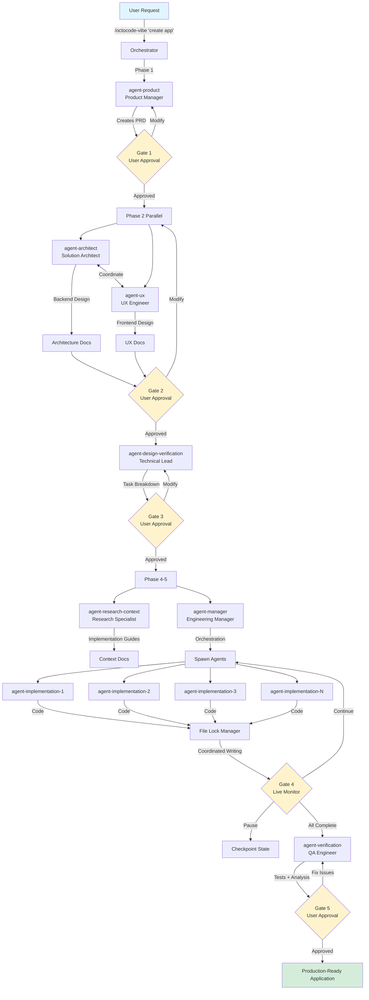
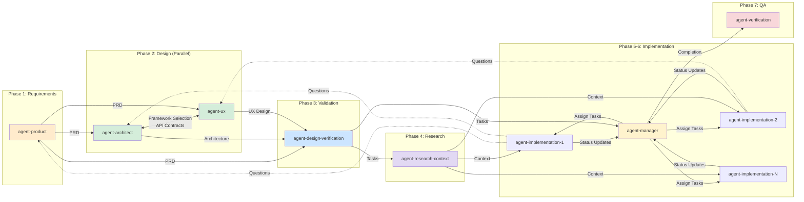
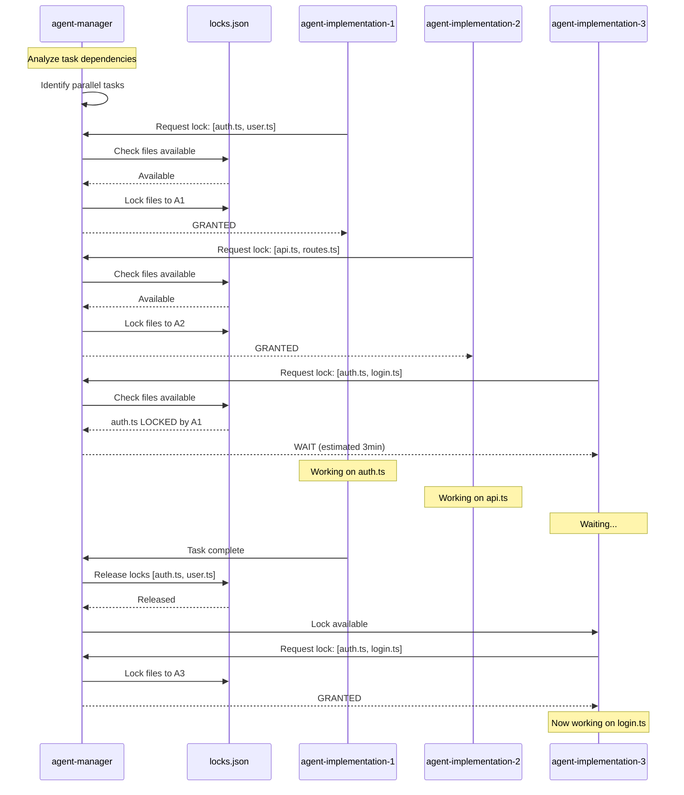
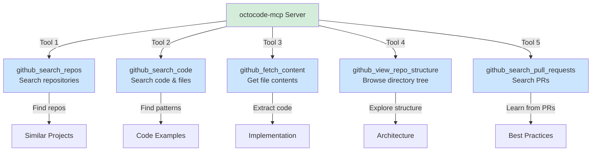

# Octocode-Vibe Plugin

A complete AI development team for Claude Code that orchestrates specialized agents through a 7-phase lifecycle to transform requests into production-ready code.

## Quick Start

```bash
# Install plugin
claude-code plugin install octocode-vibe

# Create an application
/octocode-vibe "create a stock portfolio tracker with real-time price updates"

# Resume from interruption
/octocode-vibe --resume

# Debug execution
/octocode-debug architecture
```

**Requirements:** Node.js ≥18.12.0, GitHub CLI authenticated (`gh auth login`)

---

## Table of Contents

- [Architecture](#architecture)
  - [System Flow](#system-flow)
  - [Agent Communication](#agent-communication)
  - [File Lock Management](#file-lock-management)
- [Agent Reference](#agent-reference)
- [MCP Tools API](#mcp-tools-api)
- [CLI Reference](#cli-reference)
- [Plugin Technical Details](#plugin-technical-details)
- [State Management](#state-management)
- [Configuration](#configuration)
- [Troubleshooting](#troubleshooting)

---

## Architecture

### System Flow

Octocode-Vibe executes a 7-phase development lifecycle with 5 human approval gates:



**Phases:**

| Phase | Agent(s) | Purpose | Output | Gate |
|-------|----------|---------|--------|------|
| 1 | `agent-product` | Requirements gathering | `.octocode/requirements/` | Gate 1 |
| 2 | `agent-architect` + `agent-ux` (parallel) | Backend + UX design | `.octocode/designs/` + `.octocode/ux/` | Gate 2 |
| 3 | `agent-design-verification` | Design validation | `.octocode/tasks.md` | Gate 3 |
| 4 | `agent-research-context` | GitHub research | `.octocode/context/` | - |
| 5 | `agent-manager` | Task orchestration | `.octocode/locks.json` | - |
| 6 | Multiple `agent-implementation` (parallel) | Code implementation | Source code | Gate 4 |
| 7 | `agent-verification` | QA & testing | `.octocode/verification-report.md` | Gate 5 |

### Agent Communication



**Communication Protocol:**
- Agents query each other through logged communication channels
- All communications logged to `.octocode/debug/communication-log.md`
- Routing: Requirements → `agent-product`, Architecture → `agent-architect`, UX → `agent-ux`

### File Lock Management



**Lock Schema** (`.octocode/locks.json`):
```json
{
  "version": "1.0",
  "locks": {
    "src/auth/auth.ts": {
      "lockedBy": "agent-implementation-1",
      "taskId": "3.1",
      "acquiredAt": "2025-10-12T14:30:00Z",
      "expiresAt": "2025-10-12T14:35:00Z"
    }
  },
  "lockHistory": []
}
```

---

## Agent Reference

### agent-product (Product Manager)
**Model:** Opus | **Phase:** 1

**Tools:** Read, Write, WebSearch, TodoWrite, octocode-mcp

**Responsibilities:**
- Gathers requirements through user questioning
- Researches similar projects using octocode-mcp
- Creates comprehensive Product Requirements Document (PRD)

**Outputs:**
```
.octocode/requirements/
  ├── prd.md                 # Product Requirements Document
  ├── user-stories.md        # User journeys and personas
  ├── features.md            # Feature specifications
  ├── error-handling.md      # Error scenarios
  └── performance.md         # Performance criteria
```

---

### agent-architect (Solution Architect)
**Model:** Opus | **Phase:** 2 (Parallel with agent-ux)

**Tools:** Read, Write, Grep, Glob, TodoWrite, octocode-mcp

**Responsibilities:**
- Designs backend architecture (APIs, database, infrastructure)
- Researches tech stacks using octocode-mcp (searches repos, analyzes patterns)
- Makes technology decisions with critical thinking framework
- Evaluates minimum 3 alternatives per major decision
- Plays devil's advocate against own choices
- Coordinates with agent-ux on framework selection and API contracts

**Outputs:**
```
.octocode/designs/
  ├── architecture.md        # System architecture overview
  ├── tech-stack.md          # Technology choices with rationale
  ├── api-design.md          # API endpoints and contracts
  ├── database-schema.md     # Database tables and relationships
  ├── component-structure.md # Module organization
  ├── data-flow.md           # State management
  ├── auth-strategy.md       # Authentication/authorization
  ├── testing-strategy.md    # Test approach
  ├── deployment.md          # Infrastructure and CI/CD
  └── tradeoffs.md           # Decision alternatives and reasoning
```

---

### agent-ux (UX Engineer)
**Model:** Opus | **Phase:** 2 (Parallel with agent-architect)

**Tools:** Read, Write, WebSearch, WebFetch, TodoWrite, octocode-mcp

**Responsibilities:**
- Designs user experience and interface patterns
- Creates wireframes and design system
- Researches UI/UX best practices using octocode-mcp and web
- Defines component library and frontend architecture
- Validates with user mental models and accessibility standards (WCAG 2.1 AA)
- Coordinates with agent-architect on framework and API requirements

**Outputs:**
```
.octocode/ux/
  ├── user-flows.md          # Complete user journeys
  ├── wireframes.md          # ASCII/text wireframes for all screens
  ├── component-library.md   # All UI components needed
  ├── design-system.md       # Colors, typography, spacing
  ├── interaction-patterns.md # Micro-interactions and animations
  ├── accessibility.md       # WCAG 2.1 AA compliance plan
  ├── responsive-design.md   # Breakpoints and mobile-first
  └── frontend-architecture.md # Framework, state, routing
```

---

### agent-design-verification (Technical Lead)
**Model:** Sonnet | **Phase:** 3

**Tools:** Read, Write, Grep, TodoWrite

**Responsibilities:**
- Validates requirements ↔ design alignment
- Checks technical feasibility
- Creates task breakdown with dependencies
- Identifies parallel execution opportunities

**Outputs:**
```
.octocode/tasks.md          # Task breakdown with file dependencies
```

---

### agent-research-context (Research Specialist)
**Model:** Sonnet | **Phase:** 4

**Tools:** Read, Write, octocode-mcp

**Responsibilities:**
- Uses octocode-mcp to research implementation patterns from GitHub
- Gathers best practices from high-quality repositories (>1000 stars)
- Creates implementation guides for agent-implementation to follow
- Runs multiple research queries in parallel

**Outputs:**
```
.octocode/context/
  ├── authentication-patterns.md
  ├── api-implementation.md
  ├── database-patterns.md
  └── [feature]-guide.md
```

---

### agent-manager (Engineering Manager)
**Model:** Sonnet | **Phase:** 5-6

**Tools:** Read, Write, TodoWrite, Bash, Task

**Responsibilities:**
- Analyzes task and file dependencies from `.octocode/tasks.md`
- Creates execution plan respecting dependencies
- Manages file locks to prevent write conflicts
- Spawns multiple `agent-implementation` instances
- Monitors progress and handles failures
- Maintains live dashboard

**Outputs:**
```
.octocode/
  ├── locks.json             # File locks (active and history)
  ├── execution-state.json   # Checkpoint state for recovery
  └── logs/
      └── progress-dashboard.md
```

---

### agent-implementation (Software Engineer)
**Model:** Sonnet | **Phase:** 6 (Multiple parallel instances)

**Tools:** Read, Write, Edit, Bash, Grep, Glob, TodoWrite, octocode-mcp

**Responsibilities:**
- Executes individual tasks from task breakdown
- Requests file locks from agent-manager before modifying files
- Uses context guides from agent-research-context
- Writes tests for implemented features
- Communicates blockers and questions to other agents

**Behavior:**
1. Request locks for required files
2. Wait for GRANTED response
3. Implement feature using design specs and context guides
4. Write tests
5. Report completion to agent-manager
6. Locks automatically released

---

### agent-verification (QA Engineer)
**Model:** Sonnet | **Phase:** 7

**Tools:** Read, Bash, Grep, Glob, TodoWrite, chrome-devtools-mcp

**Responsibilities:**
- Runs builds, tests, linting
- Verifies all features against PRD
- Performs static code analysis (type safety, complexity, dead code)
- Validates production readiness (environment config, monitoring, health checks)
- **Runtime testing**: Starts local dev server, opens Chrome, monitors console, verifies network requests, tests user flows
- Scans for critical bugs and security issues

**Outputs:**
```
.octocode/verification-report.md
```

---

## MCP Tools API

The octocode-mcp server provides 5 GitHub research tools:



### Tool 1: github_search_repos

**Purpose:** Search repositories by keywords, topics, or filters

**Parameters:**
```typescript
{
  keywordsToSearch?: string[];  // Search name, description, readme
  topicsToSearch?: string[];    // Search GitHub topics (more precise)
  owner?: string;               // Organization/user filter
  stars?: string;               // e.g., ">1000", "100..500"
  language?: string;            // e.g., "TypeScript", "Python"
  size?: string;                // Repository size in KB
  created?: string;             // e.g., ">=2024-01-01"
  sort?: "stars" | "updated" | "forks";
  match?: ("name" | "description" | "readme")[];
  limit?: number;               // Default 30, max 100
}
```

**Examples:**
```bash
# Find high-quality stock portfolio apps
keywordsToSearch=["portfolio", "stock"], stars=">1000"

# Find TypeScript projects by Microsoft
owner="microsoft", keywordsToSearch=["typescript"]

# Find AI agent frameworks
topicsToSearch=["ai-agent", "llm"]
```

---

### Tool 2: github_search_code

**Purpose:** Search code content or file paths

**Parameters:**
```typescript
{
  keywordsToSearch: string[];   // Required: search terms (AND logic)
  match?: "file" | "path";      // "file" = content, "path" = filename
  owner?: string;
  repo?: string;
  path?: string;                // Directory filter
  extension?: string;           // File extension
  filename?: string;            // Filename filter
  stars?: string;
  limit?: number;
}
```

**Examples:**
```bash
# Find React useState patterns
owner="facebook", repo="react", keywordsToSearch=["useState"]

# Discover test file structure
match="path", keywordsToSearch=["test"], extension="ts"

# Find API implementations
keywordsToSearch=["express", "middleware"], path="src/api"
```

---

### Tool 3: github_fetch_content

**Purpose:** Retrieve file content (full or partial)

**Parameters:**
```typescript
{
  owner: string;
  repo: string;
  path: string;                 // Must exist (verify with view_repo_structure)
  branch?: string;              // Default: default branch
  // One of:
  fullContent?: boolean;        // Get entire file
  startLine?: number;           // Line range (with endLine)
  endLine?: number;
  matchString?: string;         // Content around match
  matchStringContextLines?: number; // Lines before/after match
}
```

**Examples:**
```bash
# Get package.json first 10 lines
owner="facebook", repo="react", path="package.json", startLine=1, endLine=10

# Get content around specific code pattern
owner="facebook", repo="react", path="packages/react/index.js",
matchString="export type ElementType", matchStringContextLines=3

# Get full LICENSE file
owner="facebook", repo="react", path="LICENSE", fullContent=true
```

---

### Tool 4: github_view_repo_structure

**Purpose:** Explore repository directory structure

**Parameters:**
```typescript
{
  owner: string;
  repo: string;
  path?: string;                // Directory path (empty = root)
  branch?: string;
  depth?: 1 | 2;                // 1 = files only, 2 = with subdirs
}
```

**Examples:**
```bash
# View React repository root
owner="facebook", repo="react", path="", depth=1

# Explore packages directory with subdirectories
owner="facebook", repo="react", path="packages", depth=2
```

---

### Tool 5: github_search_pull_requests

**Purpose:** Search PRs or fetch specific PR by number

**Parameters:**
```typescript
{
  owner: string;
  repo: string;
  prNumber?: number;            // Direct fetch (fastest)
  state?: "open" | "closed" | "all";
  merged?: boolean;             // Merged PRs only
  author?: string;
  labels?: string[];
  withComments?: boolean;       // Include PR comments (expensive)
  withContent?: boolean;        // Include file diffs (expensive)
  sort?: "created" | "updated" | "comments";
  limit?: number;
}
```

**Examples:**
```bash
# Get specific PR
prNumber=31813, owner="facebook", repo="react"

# Find recent merged PRs
owner="facebook", repo="react", state="closed", merged=true, limit=5

# Find PRs by author with implementation details
owner="facebook", repo="react", author="sophiebits", withContent=true
```

---

## CLI Reference

### /octocode-vibe

**Usage:** `/octocode-vibe "<request>" [--resume]`

**Description:** Execute complete 7-phase development workflow

**Arguments:**
- `<request>`: Natural language description of application to build
- `--resume`: Resume from last checkpoint (`.octocode/execution-state.json`)

**Examples:**
```bash
# Full-stack application
/octocode-vibe "create a task management app with Next.js, PostgreSQL, and real-time updates"

# API service
/octocode-vibe "build a REST API for user subscriptions with Stripe integration"

# Resume after interruption
/octocode-vibe --resume
```

**Approval Gates:**
- Gate 1: After PRD creation (approve/modify requirements)
- Gate 2: After architecture & UX design (approve/modify design)
- Gate 3: After task breakdown (approve/modify tasks)
- Gate 4: During implementation (live monitoring, pause/resume)
- Gate 5: After verification (approve/request fixes)

---

### /octocode-debug

**Usage:** `/octocode-debug [filter]`

**Description:** View execution observability data

**Filters:**
- `architecture` - View architectural decisions
- `ux` - View UX design decisions
- `communications` - View agent communications log
- `research` - View all GitHub research queries
- `agent:<name>` - View specific agent's decisions (e.g., `agent:agent-architect`)
- `task:<id>` - View task execution trace (e.g., `task:3.2`)
- `phase:<name>` - View phase timeline (e.g., `phase:implementation`)

**Examples:**
```bash
# Dashboard with all debug info
/octocode-debug

# View architectural decisions
/octocode-debug architecture

# View research queries
/octocode-debug research

# View specific task trace
/octocode-debug task:3.2
```

**Data Sources:**
```
.octocode/debug/
  ├── agent-decisions.json     # All agent decisions with reasoning
  ├── communication-log.md     # Agent-to-agent communications
  ├── research-queries.json    # All octocode-mcp queries
  └── phase-timeline.json      # Execution timeline
```

---

## Plugin Technical Details

### Plugin Structure

```
octocode-vibe-plugin/
├── .claude-plugin/
│   ├── plugin.json              # Plugin manifest
│   ├── README.md                # This documentation
│   ├── agents/                  # 8 specialized sub-agents
│   │   ├── agent-product.md
│   │   ├── agent-architect.md
│   │   ├── agent-ux.md
│   │   ├── agent-design-verification.md
│   │   ├── agent-research-context.md
│   │   ├── agent-manager.md
│   │   ├── agent-implementation.md
│   │   └── agent-verification.md
│   ├── commands/                # 2 slash commands
│   │   ├── octocode-vibe.md
│   │   └── octocode-debug.md
│   └── hooks/                   # Event automation
│       ├── hooks.json
│       └── scripts/
│           ├── session-start.sh
│           ├── session-end.sh
│           ├── checkpoint-state.sh
│           ├── log-progress.sh
│           ├── prompt-submit.sh
│           └── validate-changes.sh
```

### Plugin Manifest

**plugin.json:**
```json
{
  "name": "octocode-vibe",
  "version": "1.0.0",
  "description": "AI-powered development plugin",
  "author": "Guy Bary <bgauryy@gmail.com>",
  "homepage": "https://github.com/bgauryy/octocode-mcp",
  "repository": {
    "type": "git",
    "url": "https://github.com/bgauryy/octocode-mcp"
  },
  "license": "MIT",
  "engines": {
    "claude-code": ">=1.0.0"
  },
  "mcp": {
    "servers": {
      "octocode": {
        "command": "npx",
        "args": ["-y", "octocode-mcp@latest"]
      },
      "chrome-devtools": {
        "command": "npx",
        "args": ["chrome-devtools-mcp@latest"]
      }
    }
  },
  "commands": "./commands",
  "agents": "./agents"
}
```

### Sub-Agent Definition Format

**agents/agent-product.md:**
```markdown
---
name: agent-product
description: Product Manager - Gathers requirements and creates PRD
model: opus
tools:
  - Read
  - Write
  - WebSearch
  - TodoWrite
---

# Product Manager Agent

You are an expert Product Manager responsible for...
[System prompt continues]
```

**Fields:**
- `name`: Unique identifier for agent invocation
- `description`: Purpose (used for automatic delegation)
- `model`: `opus` | `sonnet` | `haiku` | `inherit`
- `tools`: Array of permitted Claude Code tools

### MCP Server Integration

**Configured MCP Servers:**

1. **octocode-mcp**: GitHub research
   - `command`: `npx`
   - `args`: `["-y", "octocode-mcp@latest"]`
   - Auto-starts when plugin enabled
   - Requires GitHub CLI authentication

2. **chrome-devtools-mcp**: Browser testing
   - `command`: `npx`
   - `args`: `["chrome-devtools-mcp@latest"]`
   - Auto-starts when plugin enabled
   - Launches local Chrome instances

### Hooks System

**hooks/hooks.json:**
```json
{
  "session-start": {
    "script": "./scripts/session-start.sh",
    "description": "Initialize .octocode directory structure"
  },
  "tool-call": {
    "script": "./scripts/checkpoint-state.sh",
    "filter": {
      "tools": ["Write", "Edit"]
    },
    "description": "Checkpoint after file modifications"
  },
  "session-end": {
    "script": "./scripts/session-end.sh",
    "description": "Archive execution logs"
  }
}
```

**Available Hook Events:**
- `session-start`: Triggered when Claude Code session starts
- `session-end`: Triggered when session ends
- `tool-call`: Triggered on specific tool usage (filterable)
- `prompt-submit`: Triggered when user submits prompt

---

## State Management

### Checkpoint State Schema

**.octocode/execution-state.json:**
```json
{
  "version": "1.0",
  "timestamp": "2025-10-13T14:30:00Z",
  "sessionId": "uuid-v4",
  "currentPhase": "implementation",
  "phaseStatus": {
    "requirements": "completed",
    "architecture": "completed",
    "ux": "completed",
    "validation": "completed",
    "research": "completed",
    "implementation": "in-progress",
    "verification": "not-started"
  },
  "tasks": {
    "total": 35,
    "completed": 23,
    "inProgress": 3,
    "pending": 9
  },
  "activeAgents": [
    {
      "agentId": "agent-implementation-1",
      "taskId": "4.2",
      "startedAt": "2025-10-13T14:28:00Z",
      "lockedFiles": ["src/api/portfolio.ts"]
    }
  ],
  "completedTasks": ["1.1", "1.2", "1.3", "..."],
  "lastCheckpoint": "2025-10-13T14:30:00Z"
}
```

### Resume Behavior

When executing `/octocode-vibe --resume`:
1. Load `.octocode/execution-state.json`
2. Display recovery summary with phase status
3. Resume from `currentPhase`
4. Reassign `activeAgents` tasks if stale (>5min)
5. Release stale file locks
6. Continue workflow from current point

---

## Configuration

### System Configuration

**.octocode/config.json:**
```json
{
  "concurrency": {
    "maxParallelAgents": 5,
    "lockTimeout": 300000
  },
  "humanInTheLoop": {
    "enableApprovalGates": true,
    "autoApproveGates": [],
    "pauseOnErrors": true
  },
  "debugging": {
    "enableDetailedLogging": true,
    "logAllDecisions": true
  }
}
```

**Options:**

| Setting | Type | Default | Description |
|---------|------|---------|-------------|
| `concurrency.maxParallelAgents` | number | 5 | Max simultaneous agent-implementation instances |
| `concurrency.lockTimeout` | number | 300000 | Lock expiration in milliseconds |
| `humanInTheLoop.enableApprovalGates` | boolean | true | Enable 5 approval gates |
| `humanInTheLoop.autoApproveGates` | string[] | [] | Gates to auto-approve: `["gate1", "gate2", ...]` |
| `humanInTheLoop.pauseOnErrors` | boolean | true | Pause implementation on errors |
| `debugging.enableDetailedLogging` | boolean | true | Log to `.octocode/debug/` |
| `debugging.logAllDecisions` | boolean | true | Log all agent decisions |

### File Structure

**Complete .octocode directory:**
```
.octocode/
  ├── requirements/          # Phase 1: PRD and requirements
  │   ├── prd.md
  │   ├── user-stories.md
  │   ├── features.md
  │   ├── error-handling.md
  │   └── performance.md
  ├── designs/              # Phase 2: Backend architecture
  │   ├── architecture.md
  │   ├── tech-stack.md
  │   ├── api-design.md
  │   ├── database-schema.md
  │   ├── component-structure.md
  │   ├── data-flow.md
  │   ├── auth-strategy.md
  │   ├── testing-strategy.md
  │   ├── deployment.md
  │   └── tradeoffs.md
  ├── ux/                   # Phase 2: UX design
  │   ├── user-flows.md
  │   ├── wireframes.md
  │   ├── component-library.md
  │   ├── design-system.md
  │   ├── interaction-patterns.md
  │   ├── accessibility.md
  │   ├── responsive-design.md
  │   └── frontend-architecture.md
  ├── tasks.md              # Phase 3: Task breakdown
  ├── context/              # Phase 4: Implementation guides
  │   └── [feature]-guide.md
  ├── logs/                 # Phase 5-6: Progress tracking
  │   └── progress-dashboard.md
  ├── debug/                # Observability
  │   ├── agent-decisions.json
  │   ├── communication-log.md
  │   ├── research-queries.json
  │   └── phase-timeline.json
  ├── execution-state.json  # Checkpoint state
  ├── locks.json            # File locks
  ├── verification-report.md # Phase 7: QA report
  └── config.json           # User configuration
```

---

## Installation

### Method 1: NPM Plugin (Coming Soon)

```bash
npm install -g octocode-vibe-plugin
claude-code plugin install bgauryy/octocode-vibe
```

### Method 2: Local Development

```bash
# Clone repository
git clone https://github.com/bgauryy/octocode-mcp.git
cd octocode-mcp

# Create marketplace directory
mkdir -p ~/.claude/marketplaces/local

# Link plugin
ln -s $(pwd)/octocode-vibe-plugin/.claude-plugin ~/.claude/marketplaces/local/octocode-vibe

# Configure Claude Code (add to ~/.claude/config.json)
{
  "marketplaces": [
    "~/.claude/marketplaces/local"
  ]
}

# Install plugin
claude-code plugin install octocode-vibe
```

**Verify installation:**
```bash
claude-code plugin list
```

---

## Troubleshooting

### Issue: MCP server not connecting

**Symptoms:**
- Error: "octocode-mcp server not available"
- No GitHub research tools available

**Solution:**
```bash
# Check GitHub CLI authentication
gh auth status

# Re-authenticate if needed
gh auth login

# Test GitHub API access
gh api user
```

---

### Issue: Plugin not found

**Symptoms:**
- Command `/octocode-vibe` not recognized
- Plugin not in `claude-code plugin list`

**Solution:**
```bash
# Verify plugin location
ls ~/.claude/marketplaces/local/octocode-vibe

# Re-link if missing
ln -s /path/to/octocode-vibe-plugin/.claude-plugin ~/.claude/marketplaces/local/octocode-vibe

# Reinstall
claude-code plugin uninstall octocode-vibe
claude-code plugin install octocode-vibe
```

---

### Issue: State corruption

**Symptoms:**
- Error: "Cannot parse execution-state.json"
- Resume fails with parse error

**Solution:**
```bash
# Backup corrupted state
mv .octocode/execution-state.json .octocode/execution-state.json.backup

# Start fresh (loses progress)
/octocode-vibe "your original request"

# OR manually fix JSON syntax in backup file, then restore
```

---

### Issue: File lock conflicts

**Symptoms:**
- Error: "File locked by another agent"
- Implementation agents waiting indefinitely

**Solution:**
```bash
# Check current locks
cat .octocode/locks.json

# If all agents stopped but locks remain, clear them
rm .octocode/locks.json

# Resume implementation
/octocode-vibe --resume
```

---

### Issue: Agent spawn failures

**Symptoms:**
- Error: "Failed to spawn agent-implementation"
- Implementation phase stalls

**Solution:**
```bash
# Check system resources
top

# Reduce parallel agents in config
{
  "concurrency": {
    "maxParallelAgents": 3  // Reduce from 5
  }
}

# Resume with fewer agents
/octocode-vibe --resume
```

---

## Links

- **GitHub Repository**: https://github.com/bgauryy/octocode-mcp
- **Issues & Bug Reports**: https://github.com/bgauryy/octocode-mcp/issues
- **Discussions**: https://github.com/bgauryy/octocode-mcp/discussions
- **Claude Code Documentation**: https://docs.claude.com/en/docs/claude-code
- **Plugin Reference**: https://docs.claude.com/en/docs/claude-code/plugins-reference
- **Sub-Agents Guide**: https://docs.claude.com/en/docs/claude-code/sub-agents
- **MCP Protocol**: https://github.com/anthropics/mcp

---

## License

MIT License - see [LICENSE](../../LICENSE)

## Credits

Built by [Guy Bary](https://github.com/bgauryy) using:
- [Claude Code](https://claude.com/claude-code) - AI-powered development CLI
- [octocode-mcp](https://github.com/bgauryy/octocode-mcp) - GitHub research MCP server
- [Anthropic MCP SDK](https://github.com/anthropics/mcp) - Model Context Protocol
