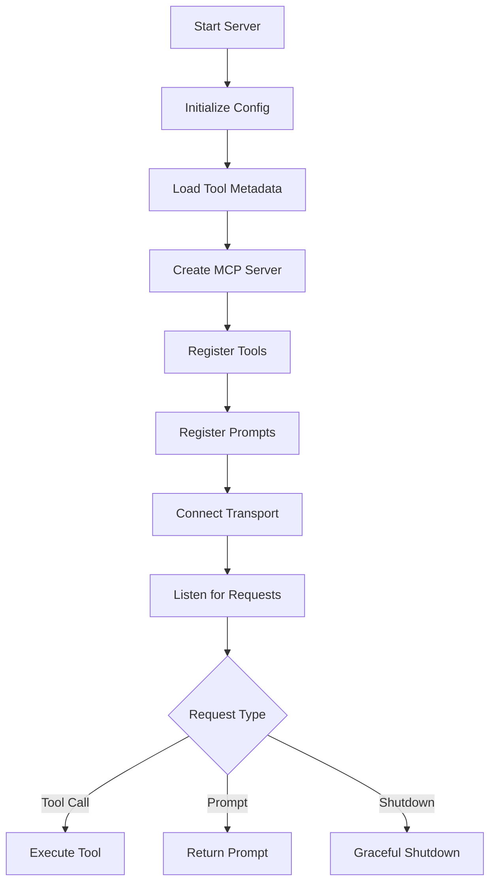
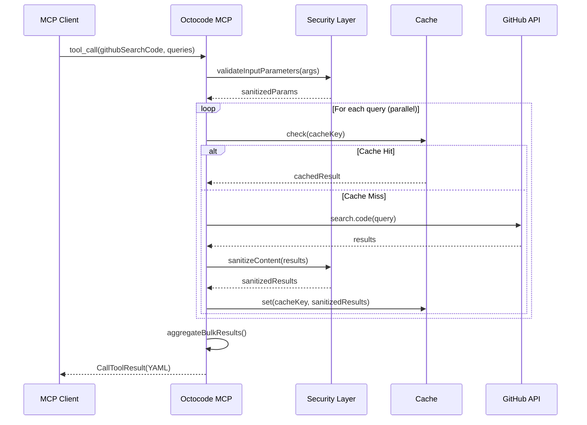
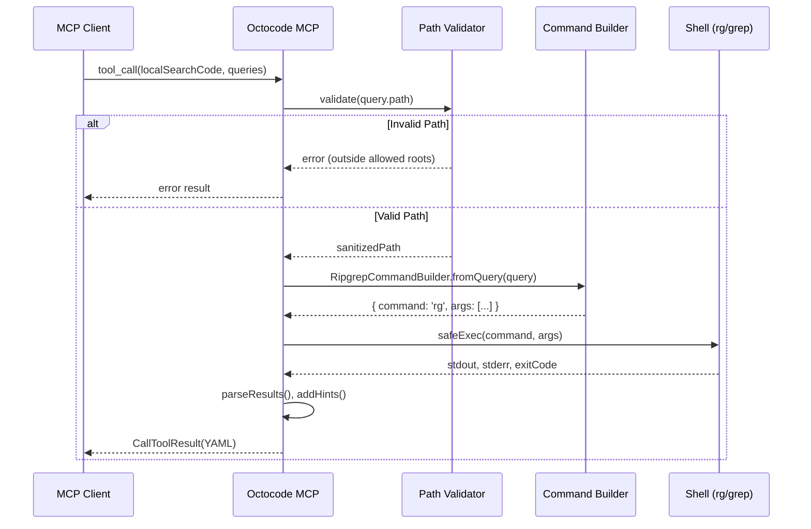

# Octocode MCP Architecture

> Model Context Protocol (MCP) server for GitHub and local code research, built in TypeScript.

## Overview

Octocode MCP is an MCP server that provides AI agents with powerful code exploration capabilities. It exposes tools for:

- **GitHub Research**: Search code, repositories, pull requests, view repo structure, and fetch file content
- **Local Research**: Search local codebases using ripgrep, browse directory structure, find files, and read content
- **Package Discovery**: Search NPM and PyPI for package information and repository URLs

The server follows the [Model Context Protocol](https://modelcontextprotocol.io/) specification and integrates with MCP-compatible clients like Cursor, Claude Desktop, and others.

---

## Project Structure

```
src/
├── index.ts                 # Entry point - server initialization
├── serverConfig.ts          # Configuration & GitHub token management
├── session.ts               # Session tracking & telemetry
├── responses.ts             # Response formatting utilities
├── errorCodes.ts            # Centralized error definitions
├── types.ts                 # Shared TypeScript types
│
├── scheme/                  # 📐 Input validation schemas (Zod)
│   ├── baseSchema.ts        # Common schema patterns & bulk query builder
│   ├── github_*.ts          # GitHub tool schemas
│   ├── local_*.ts           # Local tool schemas
│   ├── package_search.ts    # Package search schema
│   └── responsePriority.ts  # Response field ordering
│
├── tools/                   # 🔧 Tool implementations
│   ├── toolConfig.ts        # Tool registry & configuration
│   ├── toolMetadata.ts      # Dynamic metadata from API
│   ├── toolNames.ts         # Static tool name constants
│   ├── toolsManager.ts      # Tool registration orchestrator
│   ├── github_*.ts          # GitHub tool implementations
│   ├── local_*.ts           # Local tool implementations
│   ├── package_search.ts    # Package search implementation
│   ├── utils.ts             # Tool-specific utilities
│   └── hints/               # Dynamic hint generation
│
├── github/                  # 🐙 GitHub API layer
│   ├── client.ts            # Octokit client with throttling
│   ├── githubAPI.ts         # Core API types & interfaces
│   ├── codeSearch.ts        # Code search operations
│   ├── fileContent.ts       # File content retrieval
│   ├── repoSearch.ts        # Repository search
│   ├── repoStructure.ts     # Repository tree exploration
│   ├── pullRequestSearch.ts # PR search & diff retrieval
│   ├── queryBuilders.ts     # GitHub search query construction
│   ├── errors.ts            # GitHub error handling
│   └── errorConstants.ts    # GitHub-specific error codes
│
├── security/                # 🔒 Security layer
│   ├── withSecurityValidation.ts  # Security wrapper for tools
│   ├── contentSanitizer.ts  # Secret detection & redaction
│   ├── pathValidator.ts     # Path traversal prevention
│   ├── commandValidator.ts  # Command injection prevention
│   ├── ignoredPathFilter.ts # Sensitive path filtering
│   ├── regexes.ts           # Secret detection patterns
│   ├── mask.ts              # Data masking utilities
│   └── patternsConstants.ts # Security pattern definitions
│
├── commands/                # 🖥️ CLI command builders
│   ├── BaseCommandBuilder.ts    # Abstract command builder
│   ├── RipgrepCommandBuilder.ts # ripgrep (rg) command builder
│   ├── GrepCommandBuilder.ts    # grep fallback builder
│   ├── FindCommandBuilder.ts    # find command builder
│   └── LsCommandBuilder.ts      # ls command builder
│
├── utils/                   # 🛠️ Shared utilities
│   ├── bulkOperations.ts    # Bulk query execution
│   ├── cache.ts             # Response caching
│   ├── constants.ts         # Global constants
│   ├── fetchWithRetries.ts  # HTTP fetch with retry logic
│   ├── promiseUtils.ts      # Async utilities
│   ├── logger.ts            # MCP logging integration
│   ├── types.ts             # Utility types
│   ├── exec/                # Command execution utilities
│   ├── local/               # Local filesystem utilities
│   ├── minifier/            # Content minification
│   └── pagination/          # Pagination utilities
│
├── prompts/                 # 💬 MCP prompts
│   └── prompts.ts           # Prompt registration
│
└── types/                   # 📝 Type definitions
    ├── metadata.ts          # Metadata types
    └── markdown.d.ts        # Markdown type declarations
```

---

## Core Components

### 1. Entry Point (`index.ts`)

The server starts by:

1. **Initializing configuration** - Load environment variables, resolve GitHub token
2. **Loading tool metadata** - Fetch dynamic metadata from Octocode API
3. **Creating MCP server** - Initialize `McpServer` with capabilities
4. **Registering tools** - Register all enabled tools with security wrappers
5. **Registering prompts** - Register available prompts
6. **Connecting transport** - Start stdio transport for MCP communication
7. **Setting up shutdown handlers** - Graceful shutdown on SIGINT/SIGTERM



### 2. Tool Registration Flow

Tools follow a layered architecture: **Schema → Implementation → Security**

```
┌─────────────────────────────────────────────────────────────────────┐
│                         MCP Client Request                          │
└─────────────────────────────────────────────────────────────────────┘
                                    │
                                    ▼
┌─────────────────────────────────────────────────────────────────────┐
│                     1. Schema Validation (Zod)                      │
│                        scheme/github_*.ts                           │
│                        scheme/local_*.ts                            │
└─────────────────────────────────────────────────────────────────────┘
                                    │
                                    ▼
┌─────────────────────────────────────────────────────────────────────┐
│                   2. Security Validation Wrapper                    │
│                 security/withSecurityValidation.ts                  │
│   • Input parameter validation                                      │
│   • Secret detection in parameters                                  │
│   • Session logging                                                 │
└─────────────────────────────────────────────────────────────────────┘
                                    │
                                    ▼
┌─────────────────────────────────────────────────────────────────────┐
│                     3. Bulk Operations Handler                      │
│                     utils/bulkOperations.ts                         │
│   • Execute 1-5 queries in parallel                                 │
│   • Isolate errors per query                                        │
│   • Aggregate results & hints                                       │
└─────────────────────────────────────────────────────────────────────┘
                                    │
                                    ▼
┌─────────────────────────────────────────────────────────────────────┐
│                      4. Tool Implementation                         │
│                       tools/github_*.ts                             │
│                       tools/local_*.ts                              │
│   • Business logic                                                  │
│   • API calls / Command execution                                   │
│   • Result transformation                                           │
└─────────────────────────────────────────────────────────────────────┘
                                    │
                                    ▼
┌─────────────────────────────────────────────────────────────────────┐
│                     5. Content Sanitization                         │
│                  security/contentSanitizer.ts                       │
│   • Detect secrets in output                                        │
│   • Redact sensitive data                                           │
│   • Minify content for tokens                                       │
└─────────────────────────────────────────────────────────────────────┘
                                    │
                                    ▼
┌─────────────────────────────────────────────────────────────────────┐
│                     6. Response Formatting                          │
│                        responses.ts                                 │
│   • YAML formatting                                                 │
│   • Field prioritization                                            │
│   • Final masking                                                   │
└─────────────────────────────────────────────────────────────────────┘
```

### 3. Tool Configuration (`toolConfig.ts`)

Each tool is defined with:

```typescript
interface ToolConfig {
  name: string;        // Tool identifier (e.g., 'githubSearchCode')
  description: string; // Human-readable description
  isDefault: boolean;  // Enabled by default
  isLocal: boolean;    // Requires local filesystem access
  type: 'search' | 'content' | 'history' | 'debug';
  fn: (server, callback?) => RegisteredTool;
}
```

**Available Tools:**

| Tool | Type | Local | Description |
|------|------|-------|-------------|
| `githubSearchCode` | search | ❌ | Search code across GitHub |
| `githubGetFileContent` | content | ❌ | Fetch file content from repos |
| `githubViewRepoStructure` | content | ❌ | Browse repository tree |
| `githubSearchRepositories` | search | ❌ | Search GitHub repositories |
| `githubSearchPullRequests` | history | ❌ | Search PRs and view diffs |
| `packageSearch` | search | ❌ | Search NPM/PyPI packages |
| `localSearchCode` | search | ✅ | Search code with ripgrep |
| `localViewStructure` | content | ✅ | Browse local directories |
| `localFindFiles` | search | ✅ | Find files by metadata |
| `localGetFileContent` | content | ✅ | Read local file content |

---

## Schema Layer (`scheme/`)

Schemas use [Zod](https://zod.dev/) for runtime validation and TypeScript type inference.

### Base Schema Pattern

All queries inherit from `BaseQuerySchema`:

```typescript
// Required research context for all queries
const BaseQuerySchema = z.object({
  mainResearchGoal: z.string(),  // High-level research objective
  researchGoal: z.string(),      // Specific query goal
  reasoning: z.string(),         // Why this query helps
});

// Bulk query wrapper (default: 3 for GitHub, 5 for local tools)
function createBulkQuerySchema(toolName, singleQuerySchema, options?) {
  const { maxQueries = 3 } = options;
  return z.object({
    queries: z.array(singleQuerySchema).min(1).max(maxQueries),
  });
}
```

### Example: GitHub Code Search Schema

```typescript
const GitHubCodeSearchQuerySchema = BaseQuerySchema.extend({
  keywordsToSearch: z.array(z.string()).min(1).max(5),
  owner: z.string().optional(),
  repo: z.string().optional(),
  extension: z.string().optional(),
  filename: z.string().optional(),
  path: z.string().optional(),
  match: z.enum(['file', 'path']).optional(),
  limit: z.number().int().min(1).max(100).default(10),
  page: z.number().int().min(1).max(10).default(1),
});
```

---

## Security Layer (`security/`)

### Security Wrapper (`withSecurityValidation.ts`)

Wraps all tool handlers with security checks:

```typescript
function withSecurityValidation<T>(
  toolName: string,
  toolHandler: (sanitizedArgs: T, authInfo?, sessionId?) => Promise<CallToolResult>
) {
  return async (args, { authInfo, sessionId }) => {
    // 1. Validate input parameters
    const validation = ContentSanitizer.validateInputParameters(args);
    if (!validation.isValid) {
      return createResult({ data: { error: validation.warnings }, isError: true });
    }
    
    // 2. Log tool call for analytics
    if (isLoggingEnabled()) {
      logToolCall(toolName, repos, researchGoal, reasoning);
    }
    
    // 3. Execute tool with sanitized params
    return await toolHandler(validation.sanitizedParams, authInfo, sessionId);
  };
}
```

### Content Sanitizer (`contentSanitizer.ts`)

Detects and redacts secrets using regex patterns:

- API keys, tokens, passwords
- AWS credentials, private keys
- Database connection strings
- OAuth tokens, JWTs
- And 100+ other patterns

```typescript
class ContentSanitizer {
  static sanitizeContent(content: string): SanitizationResult {
    // Detect and redact secrets
    const secretsResult = this.detectSecrets(content);
    return {
      content: secretsResult.sanitizedContent,
      hasSecrets: secretsResult.hasSecrets,
      secretsDetected: secretsResult.secretsDetected,
    };
  }
  
  static validateInputParameters(params): ValidationResult {
    // Block prototype pollution
    // Validate parameter types
    // Detect secrets in inputs
    // Enforce length limits
  }
}
```

### Path Validator (`pathValidator.ts`)

Prevents directory traversal attacks for local tools:

```typescript
class PathValidator {
  private allowedRoots: string[];
  
  validate(inputPath: string): PathValidationResult {
    // 1. Expand ~ to home directory
    // 2. Resolve to absolute path
    // 3. Check against allowed roots
    // 4. Verify symlink targets
    // 5. Filter ignored paths (.git, node_modules, etc.)
  }
}
```

---

## GitHub Token Management

### Token Resolution (`serverConfig.ts`)

The server resolves GitHub tokens in priority order:

```
1. GITHUB_TOKEN environment variable
2. GitHub CLI token (gh auth token)
```

```typescript
async function resolveGitHubToken(): Promise<string | null> {
  // Priority 1: Environment variable
  if (process.env.GITHUB_TOKEN) {
    return process.env.GITHUB_TOKEN;
  }
  
  // Priority 2: GitHub CLI
  try {
    const cliToken = await getGithubCLIToken();
    if (cliToken?.trim()) {
      return cliToken.trim();
    }
  } catch (error) {
    // Mask any sensitive data in error messages
    error.message = maskSensitiveData(error.message);
  }
  
  return null;
}
```

### Octokit Client (`github/client.ts`)

Octokit is configured with:

- **Throttling plugin** - Handles rate limits gracefully
- **Custom user agent** - `octocode-mcp/{version}`
- **Configurable base URL** - For GitHub Enterprise
- **Request timeout** - Default 30s
- **Instance caching** - Reuse authenticated clients

```typescript
const OctokitWithThrottling = Octokit.plugin(throttling);

function createOctokitInstance(token?: string) {
  return new OctokitWithThrottling({
    userAgent: `octocode-mcp/${version}`,
    baseUrl: config.githubApiUrl,
    request: { timeout: config.timeout },
    throttle: { /* rate limit handlers */ },
    ...(token && { auth: token }),
  });
}

// Instances are cached by token hash
async function getOctokit(authInfo?: AuthInfo) {
  if (authInfo?.token) {
    const key = hashToken(authInfo.token);
    if (!instances.has(key)) {
      instances.set(key, createOctokitInstance(authInfo.token));
    }
    return instances.get(key)!;
  }
  // Return default instance with resolved token
  return instances.get('DEFAULT');
}
```

---

## Bulk Operations (`utils/bulkOperations.ts`)

All tools support bulk queries for efficiency:
- **GitHub tools**: 1-3 queries per request
- **Local tools**: 1-5 queries per request

```typescript
async function executeBulkOperation<TQuery, TData>(
  queries: TQuery[],
  processor: (query: TQuery, index: number) => Promise<ProcessedBulkResult>,
  config: BulkResponseConfig
): Promise<CallToolResult> {
  // Execute queries with:
  // - Parallel execution (concurrency: 3)
  // - Error isolation (one failure doesn't stop others)
  // - Per-query timeout (60s)
  // - Result aggregation
  
  const { results, errors } = await processBulkQueries(queries, processor);
  return createBulkResponse(config, results, errors, queries);
}
```

**Response Structure:**

```yaml
instructions: "Bulk response with 3 results: 2 hasResults, 1 empty..."
results:
  - id: 1
    status: "hasResults"
    data: { ... }
    researchGoal: "..."
  - id: 2
    status: "empty"
    data: {}
    researchGoal: "..."
hasResultsStatusHints: ["Next steps when results found..."]
emptyStatusHints: ["Try semantic variants..."]
errorStatusHints: ["Error recovery suggestions..."]
```

---

## Session Management (`session.ts`)

Anonymous telemetry for usage analytics (opt-out via `LOG=false`):

```typescript
class SessionManager {
  private sessionId: string;  // UUID per server instance
  
  async logToolCall(toolName, repos, researchGoal, reasoning);
  async logPromptCall(promptName);
  async logError(toolName, errorCode);
  async logRateLimit(data);
}
```

Logged events:

- `init` - Server startup
- `tool_call` - Tool invocation with research context
- `prompt_call` - Prompt usage
- `error` - Error occurrences
- `rate_limit` - GitHub API rate limit events

---

## Command Builders (`commands/`)

Local tools use command builders for safe CLI execution:

```typescript
abstract class BaseCommandBuilder {
  protected args: string[] = [];
  
  abstract build(): { command: string; args: string[] };
}

// Example: RipgrepCommandBuilder
class RipgrepCommandBuilder extends BaseCommandBuilder {
  fromQuery(query: RipgrepQuery) {
    this.addPattern(query.pattern);
    this.addPath(query.path);
    this.addOptions(query);
    return this;
  }
  
  build() {
    return { command: 'rg', args: this.args };
  }
}
```

**Fallback Chain:**

```
ripgrep (rg) → grep (fallback) → error
```

---

## Local Tools Architecture

A detailed breakdown of how local filesystem tools work, from input validation to response formatting.

### 1. Schema Definitions (`src/scheme/local_*.ts`)

Zod validation schemas provide type safety and input validation for all local tools:

- **Base schema**: Extends `BaseQuerySchemaLocal` with research fields (`mainResearchGoal`, `researchGoal`, `reasoning`)
- **Bulk queries**: Support 1-5 queries per call for efficient batch processing
- **Validation warnings**: `validateRipgrepQuery()` detects conflicting options before execution

```typescript
// Local tools use BaseQuerySchemaLocal (reasoning optional for local tools)
const BaseQuerySchemaLocal = z.object({
  mainResearchGoal: z.string().optional(),
  researchGoal: z.string().optional(),
  reasoning: z.string().optional(),
});

// Example: localSearchCode schema with ripgrep options
const LocalSearchCodeQuerySchema = BaseQuerySchemaLocal.extend({
  pattern: z.string().min(1),
  path: z.string(),
  contextLines: z.number().int().min(0).max(50).optional(),
  caseSensitive: z.boolean().optional(),
  wholeWord: z.boolean().optional(),
  // ... many more ripgrep options
});
```

### 2. Tool Implementations (`src/tools/local_*.ts`)

Four local tools are available:

| Tool | Purpose | Key Features |
|------|---------|--------------|
| `localSearchCode` | Search code with ripgrep | Pattern matching, context lines, file type filtering |
| `localViewStructure` | Browse directory structure | Depth control, sorting, file/dir filtering |
| `localFindFiles` | Find files by metadata | Name patterns, size, modified time, permissions |
| `localGetFileContent` | Read file content | Line ranges, pattern matching, minification |

Each tool follows the same pattern:

```typescript
export function registerLocalSearchCode(server: McpServer) {
  return server.tool(
    TOOL_NAMES.LOCAL_SEARCH_CODE,
    toolDescription,
    LocalSearchCodeBulkSchema.shape.queries.element.shape,
    withSecurityValidation(
      TOOL_NAMES.LOCAL_SEARCH_CODE,
      async (args) => {
        // 1. Path validation via validateToolPath()
        // 2. Build command via RipgrepCommandBuilder
        // 3. Execute via executeBulkOperation()
        // 4. Parse and return results with hints
      }
    )
  );
}
```

### 3. Security Flow

```
Input Request
     │
     ▼
┌─────────────────────────────────────────────────────────────────┐
│              withSecurityValidation() Wrapper                    │
│  security/withSecurityValidation.ts                             │
└─────────────────────────────────────────────────────────────────┘
     │
     ▼
┌─────────────────────────────────────────────────────────────────┐
│           ContentSanitizer.validateInputParameters()             │
│  • Block prototype pollution (__proto__, constructor)           │
│  • Validate parameter types and lengths                         │
│  • Detect secrets in input values                               │
└─────────────────────────────────────────────────────────────────┘
     │
     ▼
┌─────────────────────────────────────────────────────────────────┐
│                  PathValidator.validate()                        │
│  • Expand ~ to home directory                                   │
│  • Resolve to absolute path                                      │
│  • Check against allowed roots (workspace directories)          │
│  • Verify symlink targets stay within bounds                    │
│  • Block directory traversal attacks (../)                      │
└─────────────────────────────────────────────────────────────────┘
     │
     ▼
Tool Execution
```

### 4. Content Sanitization (`src/security/contentSanitizer.ts`)

Input and output sanitization protects against data leakage:

**Input Validation:**
- Maximum string length: 10,000 characters
- Maximum array length: 100 items
- Blocked keys: `__proto__`, `constructor`, `prototype`

**Secret Detection:**
- Uses `allRegexPatterns` from `regexes.ts` (100+ patterns)
- Detects: API keys, tokens, passwords, AWS credentials, private keys, connection strings
- Automatic redaction: `[REDACTED-<TYPE>]` replacement

```typescript
// Example: Secret detection in content
const result = ContentSanitizer.sanitizeContent(fileContent);
// result.content: "const apiKey = [REDACTED-GENERIC_API_KEY]"
// result.secretsDetected: ["GENERIC_API_KEY"]
```

### 5. Content Minification (`src/utils/minifier/`)

File-type aware minification reduces token usage:

| Strategy | Used For | Approach |
|----------|----------|----------|
| `terser` | JavaScript, TypeScript | Full minification via terser |
| `aggressive` | JSON with comments | Remove all whitespace |
| `conservative` | Python, YAML, Shell | Preserve structure, remove comments |
| `json` | JSON files | Compact JSON formatting |
| `markdown` | Markdown files | Minimal processing |
| `general` | Unknown types | Basic whitespace normalization |

**Comment Removal by Language:**
- C-style: `//`, `/* */` (JS, TS, Java, C, Go)
- Hash: `#` (Python, Ruby, Shell, YAML)
- HTML: `<!-- -->` (HTML, XML)
- SQL: `--`, `/* */` (SQL)
- Lua: `--`, `--[[ ]]` (Lua)
- Haskell: `--`, `{- -}` (Haskell)

### 6. Bulk Operations (`src/utils/bulkOperations.ts`)

Parallel query execution with error isolation:

```typescript
// Configuration
const BULK_CONFIG = {
  concurrency: 3,           // Max parallel queries
  queryTimeout: 60000,      // 60s per query
  maxQueries: 5,            // For local tools (3 for GitHub)
};

// Error isolation ensures one failure doesn't crash others
async function executeWithErrorIsolation<T>(
  fn: () => Promise<T>,
  queryIndex: number
): Promise<{ success: true; data: T } | { success: false; error: Error }> {
  try {
    return { success: true, data: await fn() };
  } catch (error) {
    return { success: false, error };
  }
}
```

**Status Tracking:**
- `hasResults` - Query returned data
- `empty` - Query succeeded but found nothing
- `error` - Query failed with error

### 7. Response Formatting (`src/responses.ts`)

All responses are formatted as YAML for efficient LLM consumption:

```typescript
function createResponseFormat(data: unknown): CallToolResult {
  // 1. Clean and sanitize JSON
  const cleanedData = cleanJson(data);
  
  // 2. Sanitize content for secrets
  const sanitized = ContentSanitizer.sanitizeContent(JSON.stringify(cleanedData));
  
  // 3. Convert to YAML with priority ordering
  const yaml = jsonToYamlString(cleanedData, keyPriority);
  
  // 4. Final masking pass
  return { content: [{ type: 'text', text: maskSensitiveData(yaml) }] };
}
```

**Key Priority Ordering:**
Fields are ordered for optimal LLM comprehension:
1. `instructions`, `status`, `summary` (context first)
2. `data`, `results`, `files`, `matches` (main content)
3. `hints`, `pagination`, `metadata` (supplementary)

### 8. Error Handling (`src/errorCodes.ts`, `src/utils/errorResult.ts`)

Centralized error handling with recovery hints:

```typescript
// Error categories for local tools
const LOCAL_TOOL_ERROR_CODES = {
  FILE_SYSTEM: {
    FILE_NOT_FOUND: { code: 'FILE_NOT_FOUND', recoverable: true },
    PERMISSION_DENIED: { code: 'PERMISSION_DENIED', recoverable: false },
    PATH_TRAVERSAL: { code: 'PATH_TRAVERSAL', recoverable: false },
  },
  VALIDATION: {
    INVALID_PATH: { code: 'INVALID_PATH', recoverable: true },
    INVALID_PATTERN: { code: 'INVALID_PATTERN', recoverable: true },
  },
  SEARCH: {
    NO_MATCHES: { code: 'NO_MATCHES', recoverable: true },
    BINARY_FILE: { code: 'BINARY_FILE', recoverable: false },
  },
  EXECUTION: {
    COMMAND_TIMEOUT: { code: 'COMMAND_TIMEOUT', recoverable: true },
    COMMAND_FAILED: { code: 'COMMAND_FAILED', recoverable: true },
  },
};

// Unified error response with hints
function createErrorResult(error: ToolError): CallToolResult {
  return {
    content: [{
      type: 'text',
      text: jsonToYamlString({
        status: 'error',
        error: {
          code: error.code,
          message: error.message,
          category: error.category,
          recoverable: error.recoverable,
        },
        hints: getErrorHints(error.code),
      }),
    }],
    isError: true,
  };
}
```

---

## Configuration

### Environment Variables

| Variable | Description | Default |
|----------|-------------|---------|
| `GITHUB_TOKEN` | GitHub personal access token | - |
| `GITHUB_API_URL` | GitHub API base URL | `https://api.github.com` |
| `ENABLE_LOCAL` or `LOCAL` | Enable local filesystem tools | `false` |
| `LOG` | Enable session logging | `true` |
| `REQUEST_TIMEOUT` | API request timeout (ms) | `30000` |
| `MAX_RETRIES` | Maximum retry attempts | `3` |
| `TOOLS_TO_RUN` | Comma-separated tool whitelist | - |
| `ENABLE_TOOLS` | Comma-separated tools to enable | - |
| `DISABLE_TOOLS` | Comma-separated tools to disable | - |

### Tool Filtering Logic

```typescript
function isToolEnabled(tool, localEnabled, config) {
  // 1. Check if local tool and local is disabled
  if (tool.isLocal && !localEnabled) return false;
  
  // 2. If TOOLS_TO_RUN is set, only allow those
  if (config.toolsToRun.length > 0) {
    return config.toolsToRun.includes(tool.name);
  }
  
  // 3. Check disable list
  if (config.disableTools.includes(tool.name)) return false;
  
  // 4. Enable if in enable list or is default
  return config.enableTools.includes(tool.name) || tool.isDefault;
}
```

---

## Data Flow Diagrams

### GitHub Code Search Flow



### Local Code Search Flow



### Tool Execution Lifecycle

The following flowchart illustrates the complete lifecycle of a tool request, including security validation, bulk processing, and the feedback loop.

```mermaid
flowchart TD
    %% Actors
    Agent[🤖 AI Agent / Client]
    
    %% Request Phase
    subgraph Request_Phase [1. Request & Validation]
        direction TB
        Call[Tool Call]
        Context[Research Context<br/>mainResearchGoal, researchGoal, reasoning]
        Schema{Schema Check<br/>Zod}
        SecurityIn{Security Wrapper<br/>Input Validation}
        
        Call --> Context
        Context --> Schema
        Schema -- Invalid --> Error[Return Error]
        Schema -- Valid --> SecurityIn
        SecurityIn -- Secrets Detected --> Error
        SecurityIn -- Safe --> Bulk[Bulk Splitter]
    end

    %% Execution Phase
    subgraph Execution_Phase [2. Execution (Bulk 1-5)]
        direction TB
        Bulk --> Query1[Query 1]
        Bulk --> Query2[Query N...]
        
        Query1 --> Exec{Execute Tool}
        Query2 --> Exec
        
        Exec -- GitHub --> API[GitHub API / Cache]
        Exec -- Local --> Shell[Local Shell / FS]
    end

    %% Processing Phase
    subgraph Processing_Phase [3. Processing & Safety]
        direction TB
        RawData[Raw Results]
        Sanitizer[Content Sanitizer<br/>Redact Secrets]
        Minifier[Minifier<br/>Reduce Tokens]
        
        API --> RawData
        Shell --> RawData
        RawData --> Sanitizer
        Sanitizer --> Minifier
    end

    %% Response Phase
    subgraph Response_Phase [4. Response & Guidance]
        direction TB
        Hints[Hints Generator<br/>Dynamic Suggestions]
        Format[Response Formatter<br/>JSON → YAML]
        Result[Final Result]
        
        Minifier --> Hints
        Hints --> Format
        Format --> Result
    end

    %% Flow Connections
    Agent --> Call
    Result --> Agent
    
    %% Feedback Loop
    Agent -.->|Reads Hints & Data| Decision{Next Step?}
    Decision -.->|Follow Hint| NextTool[Next Tool Call]
    Decision -.->|Refine| RefinedQuery[Refined Query]
    
    %% Styling
    style SecurityIn fill:#ffcccc,stroke:#cc0000
    style Sanitizer fill:#ffcccc,stroke:#cc0000
    style Context fill:#e1f5fe,stroke:#01579b
    style Hints fill:#e6fffa,stroke:#009688
```

---

## Testing

Tests are located in `tests/` and use Vitest:

```
tests/
├── index.test.ts              # Server startup/shutdown
├── github/                    # GitHub API tests
├── tools/                     # Tool implementation tests
├── security/                  # Security layer tests
├── commands/                  # Command builder tests
├── utils/                     # Utility tests
├── scheme/                    # Schema validation tests
└── helpers/                   # Test utilities
```

Run tests:

```bash
yarn test           # Run with coverage
yarn test:quiet     # Minimal output
```

Coverage requirement: **90%** across all metrics.

---

## Key Design Decisions

1. **Bulk Queries** - All tools accept 1-5 queries per request to minimize round trips
2. **Research Context** - Every query requires `mainResearchGoal`, `researchGoal`, `reasoning` for better AI agent guidance
3. **Security First** - All inputs sanitized, all outputs checked for secrets, paths validated
4. **Graceful Degradation** - Local tools fall back from ripgrep to grep, errors isolated per query
5. **Token Efficiency** - Content minification, YAML output, response prioritization
6. **Dynamic Metadata** - Tool descriptions and hints fetched from API for easy updates
7. **Caching** - Response caching reduces GitHub API calls and improves latency

---

## Related Documentation

- [README.md](./README.md) - Installation and usage
- [Model Context Protocol](https://modelcontextprotocol.io/) - MCP specification
- [GitHub REST API](https://docs.github.com/en/rest) - GitHub API reference

---

*Architecture document generated for Octocode MCP v1.x*
