# 🚀 Enterprise Authentication Refactoring Plan

## 📋 Overview

This document outlines a comprehensive plan to refactor the enterprise authentication flow in the Octocode MCP server. The current implementation suffers from scattered initialization logic, configuration redundancy, complex token resolution, duplicate audit logging, and inconsistent enterprise mode detection.

## 🎯 Motivation

### Why This Refactoring is Critical

#### 🔴 **Current Pain Points**
1. **Configuration Redundancy** - Duplicate enterprise settings scattered across multiple config blocks
2. **Scattered Initialization** - Authentication logic spread across 3+ different functions
3. **Complex Token Resolution** - Multiple overlapping token resolution paths with confusing fallbacks
4. **Duplicate Audit Logging** - Same events logged multiple times in initialization
5. **Inconsistent Enterprise Detection** - Different enterprise mode checks across files

#### 🔵 **MCP OAuth Integration Requirements**
The refactoring must preserve and enhance the existing MCP OAuth capabilities:
- ✅ **MCP Auth Protocol** - `MCPAuthProtocol` class handles MCP-compliant OAuth flows
- ✅ **OAuth Manager** - `OAuthManager` provides RFC 6749/7636 compliant OAuth 2.0/2.1 flows
- ✅ **PKCE Support** - Proof Key for Code Exchange for secure public clients
- ✅ **Token Management** - Automatic refresh, validation, and secure storage
- ✅ **Enterprise Integration** - OAuth works with enterprise audit logging and rate limiting

#### 🟢 **Benefits of Refactoring**
- **Maintainability** - Single source of truth for authentication logic
- **Reliability** - Consistent behavior across all authentication flows
- **Security** - Centralized security controls and audit logging
- **Developer Experience** - Clear, predictable authentication patterns
- **Enterprise Readiness** - Proper separation of concerns for enterprise features

### 📚 Reference Implementation

The [GitHub MCP Server](https://github.com/github/github-mcp-server) provides an excellent reference for clean authentication patterns:

```go
// Simple, clean configuration structure
type MCPServerConfig struct {
    Version         string
    Host           string
    Token          string
    EnabledToolsets []string
    DynamicToolsets bool
    ReadOnly       bool
    Translator     translations.TranslationHelperFunc
}

// Single initialization point
func RunStdioServer(config StdioServerConfig) error {
    // Clean, single-purpose initialization
    token := viper.GetString("personal_access_token")
    if token == "" {
        return errors.New("GITHUB_PERSONAL_ACCESS_TOKEN not set")
    }
    // ... rest of initialization
}
```

**Key Principles from Reference:**
- ✅ Single configuration structure
- ✅ Clear initialization flow
- ✅ Simple token resolution
- ✅ No duplicate logic

## 🏗️ Architecture Overview

```mermaid
graph TD
    A[Server Start] --> B[AuthenticationManager.initialize]
    B --> C[initializeAuthProtocols]
    B --> D[initializeEnterpriseFeatures]
    B --> E[initializeTokenManagement]
    
    C --> F[OAuth/GitHub App Setup]
    D --> G[Audit/Rate Limiting/Organization]
    E --> H[Unified Token Resolution]
    
    H --> I[TokenResolver.resolveToken]
    I --> J[OAuth → GitHub App → Env → CLI → Header]
    
    K[Tool Execution] --> L[withSecurityValidation]
    L --> M[Enterprise Mode Check]
    M --> N[Single Audit Point]
    
    style A fill:#e1f5fe
    style B fill:#fff3e0
    style I fill:#f3e5f5
    style N fill:#e8f5e8
```



## 🚨 **Critical OAuth Integration Requirements**

### **MCP OAuth Support Must Be Preserved**

The refactoring **MUST NOT BREAK** the existing OAuth integration. The following components are critical for MCP OAuth support:

#### **Core OAuth Components (DO NOT REMOVE)**
1. **`src/auth/oauthManager.ts`** - OAuth 2.0/2.1 flow management
   - ✅ PKCE support (RFC 7636)
   - ✅ State parameter validation
   - ✅ Token refresh capabilities
   - ✅ Enterprise audit logging

2. **`src/auth/mcpAuthProtocol.ts`** - MCP-compliant OAuth integration
   - ✅ MCP authentication challenge handling
   - ✅ WWW-Authenticate header generation
   - ✅ Protected resource metadata
   - ✅ OAuth authorization URL generation
   - ✅ Token exchange functionality

3. **OAuth Configuration in `serverConfig.ts`**
   ```typescript
   oauth?: {
     clientId: string;
     clientSecret: string;
     redirectUri: string;
     scopes: string[];
     enabled: boolean;
     authorizationUrl?: string;
     tokenUrl?: string;
   };
   ```

#### **OAuth Integration Points (MUST PRESERVE)**
- ✅ **Token Resolution Priority** - OAuth tokens have highest priority
- ✅ **MCP Auth Protocol** - `MCPAuthProtocol` class handles MCP-specific OAuth flows
- ✅ **Token Management** - OAuth tokens integrated with `tokenManager.ts`
- ✅ **Enterprise Features** - OAuth works with audit logging and rate limiting
- ✅ **PKCE Flow** - Secure public client authentication
- ✅ **Token Refresh** - Automatic token refresh with retry logic

#### **Critical OAuth Methods (DO NOT BREAK)**
```typescript
// These methods MUST continue to work after refactoring:
MCPAuthProtocol.getAuthorizationUrl()
MCPAuthProtocol.exchangeCodeForToken()
MCPAuthProtocol.validateBearerToken()
OAuthManager.generatePKCEParams()
OAuthManager.startAuthorizationFlow()
OAuthManager.refreshToken()
```

## ✅ Plan Validation & Updates

### **Validation Summary**

This plan has been **validated against the current `src/` implementation** and updated to ensure backward compatibility and accurate implementation details.

#### **Key Corrections Made:**

1. **✅ Token Priority Order Corrected**
   - **Plan Originally:** OAuth → CLI → Env → Authorization
   - **Updated to Match Code:** OAuth → GitHub App → Env → CLI → Authorization
   - **Evidence:** Current `resolveToken()` function and tests prioritize env vars over CLI

2. **✅ GitHub App Integration Added**
   - **Missing from Plan:** GitHub App tokens were omitted from priority list
   - **Added:** GitHub App as priority #2, with proper refresh and metadata handling
   - **Evidence:** `tryGetGitHubAppToken()` function exists and is actively used

3. **✅ Line References Updated**
   - **ServerConfig duplicates:** Updated to lines 39-42 (not 40-42)
   - **Duplicate audit logging:** Updated to lines 222-250 (not 223-251)
   - **Enterprise function removal:** Updated to lines 175-274 (not 175-275)

4. **✅ Token Failure Location Clarified**
   - **Current Behavior:** `getToken()` throws in `registerAllTools()` 
   - **Plan Options:** Keep current behavior OR move to `AuthenticationManager.initialize()`
   - **Requirement:** Only one place should throw to avoid double error paths

5. **✅ Backward Compatibility Ensured**
   - All existing tests expect env vars to have priority over CLI
   - OAuth and GitHub App components are preserved and integrated properly
   - No breaking changes to public APIs or environment variable handling

#### **Validation Evidence:**
- ✅ Confirmed duplicate enterprise config fields in `serverConfig.ts`
- ✅ Confirmed duplicate audit logging in `index.ts`
- ✅ Confirmed scattered enterprise detection across multiple files
- ✅ Confirmed MCP OAuth components are intact and functional
- ✅ Confirmed token resolution is already centralized in `tokenManager.ts`

## 📋 Implementation Plan

### 🎯 **Phase 0: Pre-Implementation Review & Analysis**

**Priority:** 🔴 Critical  
**Estimated Time:** 2-3 hours  
**Risk Level:** Low

#### Step 0.1: Comprehensive Code Review

**Review the entire `src/` directory to:**

1. **Map all authentication-related code**
   - [ ] Identify all files that handle tokens, OAuth, GitHub App authentication
   - [ ] Document current authentication flows and dependencies
   - [ ] Create dependency graph of authentication components

2. **Identify redundant files and code**
   - [ ] Find duplicate authentication logic across files
   - [ ] Identify unused authentication functions or classes
   - [ ] Mark files/code for potential removal after refactoring

3. **Document backward compatibility requirements**
   - [ ] List all public APIs that must remain unchanged
   - [ ] Identify environment variables that must continue to work
   - [ ] Document expected behavior for existing users

4. **Test current system**
   - [ ] Run `yarn test` - ensure all tests pass before refactoring
   - [ ] Run `yarn build` - ensure clean build
   - [ ] Run `yarn lint` - fix any linting issues before starting
   - [ ] Test all authentication flows manually

#### Step 0.2: Define Authentication Flow Requirements

**Mandatory Token Resolution Priority (BACKWARD COMPATIBLE):**

```typescript
/**
 * Authentication Flow Priority (MUST MAINTAIN THIS ORDER - MATCHES CURRENT IMPLEMENTATION)
 * 1. OAuth Token (if configured and available)
 * 2. GitHub App Token (if configured and available)
 * 3. Environment Variables (GITHUB_TOKEN || GH_TOKEN)  
 * 4. CLI Token (gh auth token) - disabled in enterprise mode
 * 5. Bearer Token from Authorization header
 * 6. If none found -> THROW ERROR (location: see options below)
 */
```

**Critical Requirements:**
- ✅ **OAuth First** - If OAuth is configured, prioritize OAuth tokens
- ✅ **GitHub App Second** - GitHub App installation tokens (if configured)
- ✅ **Environment Third** - `GITHUB_TOKEN` or `GH_TOKEN` env vars (current behavior)
- ✅ **CLI Fourth** - GitHub CLI tokens (except in enterprise mode)
- ✅ **Bearer Last** - Extract from Authorization header
- ❌ **Error if None** - Throw descriptive error if no token found

**Token Failure Location Options:**
- **Option A (No Change):** Keep current behavior - `getToken()` throws in `registerAllTools()`
- **Option B (Early Failure):** Move failure to `AuthenticationManager.initialize()` for faster feedback
- **Requirement:** Only one place should throw to avoid double error paths

#### Step 0.3: Create Refactoring Checklist

**Before any changes:**
- [ ] Create backup branch: `git checkout -b backup-before-auth-refactor`
- [ ] Document current test coverage: `yarn test --coverage`
- [ ] Create list of all files to be modified
- [ ] Create list of all files to be removed after refactoring

**Quality Gates:**
- [ ] All existing tests must pass: `yarn test`
- [ ] Build must succeed: `yarn build`
- [ ] Linting must pass: `yarn lint`
- [ ] No breaking changes to public APIs
- [ ] All authentication flows must work as before

### 🎯 **Phase 1: Remove Configuration Redundancy**

**Priority:** 🔴 Critical  
**Estimated Time:** 1-2 hours  
**Risk Level:** Low

#### Step 1.1: Clean up ServerConfig

**File:** `src/config/serverConfig.ts`

**❌ REMOVE these duplicate fields (lines 39-42):**
```typescript
// Enterprise features - DELETE THESE
organizationId?: string;          // ❌ Remove
auditLogging: boolean;           // ❌ Remove  
rateLimiting: boolean;           // ❌ Remove
```

**✅ ENHANCE the consolidated enterprise config:**
```typescript
// Enhanced Enterprise Configuration
enterprise?: {
  organizationId?: string;
  ssoEnforcement: boolean;
  auditLogging: boolean;
  rateLimiting: boolean;           // ← Add this here
  tokenValidation: boolean;
  permissionValidation: boolean;
};

// ⚠️ CRITICAL: DO NOT MODIFY OAuth configuration - it's required for MCP support
oauth?: {
  clientId: string;
  clientSecret: string;
  redirectUri: string;
  scopes: string[];
  enabled: boolean;
  authorizationUrl?: string;
  tokenUrl?: string;
};
```

#### Step 1.2: Add Enterprise Utilities

**File:** `src/config/serverConfig.ts`

**✅ ADD new enterprise-specific getters:**
```typescript
static isEnterpriseMode(): boolean {
  const config = this.getConfig();
  return !!(
    config.enterprise?.organizationId ||
    config.enterprise?.auditLogging ||
    config.enterprise?.rateLimiting ||
    config.enterprise?.ssoEnforcement
  );
}

static getEnterpriseConfig(): ServerConfig['enterprise'] {
  return this.getConfig().enterprise;
}
```

### 🎯 **Phase 2: Unified Authentication Manager**

**Priority:** 🟡 High  
**Estimated Time:** 3-4 hours  
**Risk Level:** Medium

#### Step 2.1: Create AuthenticationManager

**New File:** `src/auth/authenticationManager.ts`

```typescript
/**
 * Unified Authentication Manager
 * Single entry point for all authentication initialization
 * 
 * Inspired by the clean patterns from GitHub MCP Server:
 * - Single initialization method
 * - Clear separation of concerns  
 * - Proper error handling
 */
export class AuthenticationManager {
  private static instance: AuthenticationManager;
  private initialized = false;

  static getInstance(): AuthenticationManager {
    if (!this.instance) {
      this.instance = new AuthenticationManager();
    }
    return this.instance;
  }

  /**
   * Single initialization method for all authentication
   * Replaces scattered initialization across multiple functions
   */
  async initialize(): Promise<void> {
    if (this.initialized) return;

    try {
      // 1. Initialize core authentication protocols
      await this.initializeAuthProtocols();
      
      // 2. Initialize enterprise features (if configured)
      await this.initializeEnterpriseFeatures();
      
      // 3. Initialize unified token management
      await this.initializeTokenManagement();
      
      this.initialized = true;
      this.logSuccess('Authentication system initialized successfully');
      
    } catch (error) {
      this.logError('Authentication initialization failed', error);
      throw error;
    }
  }

  private async initializeAuthProtocols(): Promise<void> {
    const config = ConfigManager.getConfig();
    
    // ✅ CRITICAL: Initialize MCP Auth Protocol with OAuth support
    if (config.oauth?.enabled || config.githubApp?.enabled) {
      const { createMCPAuthProtocol } = await import('./mcpAuthProtocol.js');
      await createMCPAuthProtocol();
      
      // ✅ ENSURE: OAuth Manager is properly initialized for MCP integration
      if (config.oauth?.enabled) {
        const { OAuthManager } = await import('./oauthManager.js');
        const oauthManager = OAuthManager.getInstance();
        oauthManager.initialize(config.oauth);
        
        // Log OAuth initialization for enterprise audit
        this.logEvent('oauth_manager_initialized', 'success', {
          clientId: config.oauth.clientId,
          scopes: config.oauth.scopes,
          redirectUri: config.oauth.redirectUri,
        });
      }
    }
  }

  private async initializeEnterpriseFeatures(): Promise<void> {
    if (!ConfigManager.isEnterpriseMode()) {
      return; // Skip if not enterprise mode
    }

    const enterprise = ConfigManager.getEnterpriseConfig();
    if (!enterprise) return;

    // Initialize in dependency order: Audit → Organization → Rate Limiting → Policy
    if (enterprise.auditLogging) {
      const { AuditLogger } = await import('../security/auditLogger.js');
      AuditLogger.initialize();
    }

    if (enterprise.organizationId) {
      const { OrganizationManager } = await import('../security/organizationManager.js');
      OrganizationManager.initialize();
    }

    if (enterprise.rateLimiting) {
      const { RateLimiter } = await import('../security/rateLimiter.js');
      RateLimiter.initialize();
    }

    // Always initialize policy manager in enterprise mode
    const { PolicyManager } = await import('../security/policyManager.js');
    PolicyManager.initialize();
  }

  private async initializeTokenManagement(): Promise<void> {
    const enterprise = ConfigManager.getEnterpriseConfig();
    
    // Initialize token manager with enterprise config if available
    const tokenConfig = enterprise ? {
      organizationId: enterprise.organizationId,
      enableAuditLogging: enterprise.auditLogging,
      enableRateLimiting: enterprise.rateLimiting,
      enableOrganizationValidation: !!enterprise.organizationId,
    } : undefined;

    const { initialize: initializeTokenManager } = await import('../mcp/tools/utils/tokenManager.js');
    await initializeTokenManager(tokenConfig);
  }

  private logSuccess(message: string): void {
    this.logEvent('authentication_initialized', 'success', { message });
  }

  private logError(message: string, error: unknown): void {
    this.logEvent('authentication_initialized', 'failure', {
      message,
      error: error instanceof Error ? error.message : String(error),
    });
  }

  private logEvent(action: string, outcome: 'success' | 'failure', details: Record<string, unknown>): void {
    try {
      const enterprise = ConfigManager.getEnterpriseConfig();
      if (enterprise?.auditLogging) {
        import('../security/auditLogger.js').then(({ AuditLogger }) => {
          AuditLogger.logEvent({
            action,
            outcome,
            source: 'auth',
            details,
          });
        });
      }
    } catch {
      // Silent fail - don't break initialization
    }
  }
}
```

#### Step 2.2: Update index.ts

**File:** `src/index.ts`

**❌ REPLACE the scattered initialization:**

```typescript
// REPLACE initializeAuthentication() and initializeEnterpriseFeatures()
// WITH this single, clean call:

async function initializeAuthentication(): Promise<void> {
  try {
    const { AuthenticationManager } = await import('./auth/authenticationManager.js');
    const authManager = AuthenticationManager.getInstance();
    await authManager.initialize();
    
    // ✅ OPTION B: Early token validation (alternative to current behavior)
    // Current behavior: getToken() throws in registerAllTools()
    // This option moves validation earlier for faster feedback
    const { getGitHubToken } = await import('./mcp/tools/utils/tokenManager.js');
    const token = await getGitHubToken();
    
    if (!token) {
      throw new Error(
        'No GitHub token found. Please provide authentication via:\n' +
        '1. OAuth configuration (preferred for enterprise)\n' +
        '2. GitHub App configuration\n' +
        '3. Environment variable: GITHUB_TOKEN or GH_TOKEN\n' +
        '4. GitHub CLI: gh auth login\n' +
        '5. Authorization header with Bearer token'
      );
    }
  } catch (error) {
    // ❌ CRITICAL: Don't just warn - THROW ERROR if no token found
    const errorMessage = error instanceof Error ? error.message : String(error);
    process.stderr.write(`Error: Authentication failed: ${errorMessage}\n`);
    throw error; // This will stop server startup
  }
}

// ❌ DELETE the entire initializeEnterpriseFeatures() function (lines 175-274)
```

### 🎯 **Phase 3: Centralize Token Resolution**

**Priority:** 🟡 High  
**Estimated Time:** 2-3 hours  
**Risk Level:** Medium

#### Step 3.1: Enhance tokenManager.ts

**File:** `src/mcp/tools/utils/tokenManager.ts`

**✅ ADD unified token resolution system:**

```typescript
/**
 * Unified Token Resolution System
 * Single source of truth for all token resolution
 * Priority: OAuth → GitHub App → Env → CLI → Authorization (BACKWARD COMPATIBLE)
 */
class TokenResolver {
  private static readonly TOKEN_SOURCES = [
    'oauth',
    'github_app',
    'env',
    'cli',
    'authorization'
  ] as const;

  /**
   * Main token resolution method - replaces scattered token logic
   * Inspired by GitHub MCP Server's clean token handling
   */
  static async resolveToken(): Promise<TokenResolutionResult> {
    for (const source of this.TOKEN_SOURCES) {
      try {
        const result = await this.tryTokenSource(source);
        if (result.token) {
          this.logTokenResolution(source, 'success');
          return result;
        }
      } catch (error) {
        this.logTokenResolution(source, 'failure', error);
        continue; // Try next source
      }
    }

    return { token: null, source: 'unknown' };
  }

  private static async tryTokenSource(source: TokenSource): Promise<TokenResolutionResult> {
    switch (source) {
      case 'oauth':
        return await this.tryOAuthToken();
      
      case 'github_app':
        return await this.tryGitHubAppToken();
      
      case 'env':
        return this.tryEnvironmentToken();
      
      case 'cli':
        return await this.tryCliToken();
      
      case 'authorization':
        return this.tryAuthorizationHeader();
      
      default:
        return { token: null, source: 'unknown' };
    }
  }

  private static async tryOAuthToken(): Promise<TokenResolutionResult> {
    const oauthToken = await tryGetOAuthToken();
    return oauthToken ? {
      token: oauthToken.accessToken,
      source: 'oauth',
      metadata: oauthToken,
      expiresAt: oauthToken.expiresAt,
    } : { token: null, source: 'oauth' };
  }

  private static async tryGitHubAppToken(): Promise<TokenResolutionResult> {
    const appToken = await tryGetGitHubAppToken();
    return appToken ? {
      token: appToken.installationToken,
      source: 'github_app',
      metadata: appToken,
      expiresAt: appToken.expiresAt,
    } : { token: null, source: 'github_app' };
  }

  private static tryEnvironmentToken(): TokenResolutionResult {
    // Priority: GITHUB_TOKEN → GH_TOKEN (current implementation)
    const token = process.env.GITHUB_TOKEN || process.env.GH_TOKEN;
    return token ? { token, source: 'env' } : { token: null, source: 'env' };
  }

  private static async tryCliToken(): Promise<TokenResolutionResult> {
    // Skip CLI in enterprise mode for security (current behavior)
    if (ConfigManager.isEnterpriseMode()) {
      return { token: null, source: 'cli' };
    }

    const cliToken = await getGithubCLIToken();
    return cliToken ? { token: cliToken, source: 'cli' } : { token: null, source: 'cli' };
  }

  private static tryAuthorizationHeader(): TokenResolutionResult {
    const authToken = extractBearerToken(process.env.Authorization ?? '');
    return authToken ? { token: authToken, source: 'authorization' } : { token: null, source: 'authorization' };
  }

  private static logTokenResolution(source: TokenSource, outcome: 'success' | 'failure', error?: unknown): void {
    // Single audit logging point - no duplicates
    if (config?.enableAuditLogging) {
      import('../../../security/auditLogger.js').then(({ logAuthEvent }) => {
        logAuthEvent('token_resolved', outcome, {
          source,
          isEnterpriseMode: ConfigManager.isEnterpriseMode(),
          ...(error && { error: error instanceof Error ? error.message : String(error) })
        });
      });
    }
  }
}

// ✅ REPLACE resolveTokenWithOAuth() with:
async function resolveTokenWithOAuth(): Promise<TokenResolutionResult> {
  return TokenResolver.resolveToken();
}

// ❌ REMOVE the old resolveToken() function - no longer needed
```

#### Step 3.2: Remove scattered token logic

**Files to clean up:**
- `src/utils/github/client.ts` - Remove any token resolution
- Any other files with scattered token logic
- Ensure all token access goes through `tokenManager.ts`

### 🎯 **Phase 4: Fix Duplicate Audit Logging**

**Priority:** 🔴 Critical  
**Estimated Time:** 30 minutes  
**Risk Level:** Low

#### Step 4.1: Remove duplicate logging

**File:** `src/index.ts`

**❌ DELETE lines 222-250 (duplicate audit logging):**

```typescript
// DELETE THIS ENTIRE BLOCK:
// Log via audit logger rather than console
try {
  const { AuditLogger } = await import('./security/auditLogger.js');
  AuditLogger.logEvent({
    action: 'enterprise_features_initialized',
    outcome: 'success',
    source: 'system',
    details: {
      message: 'Enterprise security features initialized successfully',
    },
  });
} catch {
  // Fallback: silent if audit logger not available
}

// Log the initialization
if (hasAuditConfig) {
  const { AuditLogger } = await import('./security/auditLogger.js');
  AuditLogger.logEvent({
    action: 'enterprise_features_initialized', // ← DUPLICATE!
    outcome: 'success',
    source: 'system',
    details: {
      organizationId: process.env.GITHUB_ORGANIZATION,
      auditLogging: hasAuditConfig,
      rateLimiting: !!hasRateLimitConfig,
      organizationValidation: !!hasOrgConfig,
    },
  });
}
```

#### Step 4.2: Standardize audit logging

**All audit logging should only use:**
```typescript
import { AuditLogger } from './security/auditLogger.js';

// Single method call - no duplicates
AuditLogger.logEvent({
  action: 'your_action',
  outcome: 'success' | 'failure',
  source: 'system' | 'auth' | 'tool_execution' | 'api_client',
  details: { /* your details */ }
});
```

### 🎯 **Phase 5: Standardize Enterprise Mode Detection**

**Priority:** 🟡 High  
**Estimated Time:** 1-2 hours  
**Risk Level:** Low

#### Step 5.1: Create enterprise utilities

**New File:** `src/utils/enterpriseUtils.ts`

```typescript
/**
 * Enterprise Mode Utilities
 * Single source of truth for enterprise mode detection
 * Inspired by GitHub MCP Server's simple configuration patterns
 */

import { ConfigManager } from '../config/serverConfig.js';

/**
 * Check if system is running in enterprise mode
 * Single source of truth - use this everywhere
 */
export function isEnterpriseMode(): boolean {
  return ConfigManager.isEnterpriseMode();
}

/**
 * Get enterprise configuration
 */
export function getEnterpriseConfig() {
  return ConfigManager.getEnterpriseConfig();
}

/**
 * Check if specific enterprise feature is enabled
 */
export function isEnterpriseFeatureEnabled(feature: keyof NonNullable<ServerConfig['enterprise']>): boolean {
  const config = getEnterpriseConfig();
  return config?.[feature] === true;
}

/**
 * Get organization ID from enterprise config
 */
export function getOrganizationId(): string | undefined {
  return getEnterpriseConfig()?.organizationId;
}
```

#### Step 5.2: Update all files to use the utility

**Replace all scattered enterprise mode checks with:**

```typescript
import { isEnterpriseMode } from '../utils/enterpriseUtils.js';

// Use this everywhere instead of:
// - process.env checks
// - config.enterprise checks  
// - Different detection logic

if (isEnterpriseMode()) {
  // Enterprise-specific logic
}
```

**Files to update:**
- `src/mcp/tools/utils/tokenManager.ts`
- `src/mcp/tools/utils/withSecurityValidation.ts`
- `src/auth/githubAppManager.ts`
- `src/auth/oauthManager.ts`
- `src/auth/mcpAuthProtocol.ts`
- Any other files with enterprise mode checks

## 📋 Implementation Checklist

### 🎯 **Phase 0: Pre-Implementation Review**
- [ ] **Code Review**
  - [ ] Map all authentication-related files in `src/`
  - [ ] Identify redundant authentication code
  - [ ] Document current authentication flows
  - [ ] Create dependency graph of auth components
- [ ] **Quality Gates**
  - [ ] Run `yarn test` - all tests must pass
  - [ ] Run `yarn build` - build must succeed  
  - [ ] Run `yarn lint` - fix all linting issues
  - [ ] Create backup branch: `git checkout -b backup-before-auth-refactor`
- [ ] **Backward Compatibility Analysis**
  - [ ] Document all public APIs that must remain unchanged
  - [ ] List environment variables that must continue working
  - [ ] Test current authentication flows manually
- [ ] **Cleanup Planning**
  - [ ] Create list of files to be modified
  - [ ] Create list of redundant files/code to remove after refactoring
  - [ ] Plan removal of unused authentication functions

### 🎯 **Phase 1: Configuration Cleanup**
- [ ] Remove duplicate fields from `ServerConfig` (lines 39-42)
- [ ] Add `rateLimiting` to enterprise config block  
- [ ] Update `isEnterpriseMode()` method to use consolidated `enterprise` block
- [ ] Add `getEnterpriseConfig()` method to `ConfigManager`
- [ ] Test configuration loading

### 🎯 **Phase 2: Unified Authentication Manager**
- [ ] Create `src/auth/authenticationManager.ts`
- [ ] Implement `AuthenticationManager` class
- [ ] Add `initialize()` method with proper error handling
- [ ] **CRITICAL: Ensure OAuth integration is preserved**
  - [ ] Verify `MCPAuthProtocol` initialization works
  - [ ] Verify `OAuthManager` initialization works
  - [ ] Test OAuth token resolution priority
  - [ ] Test PKCE flow integration
- [ ] Update `src/index.ts` to use new manager
- [ ] Remove old `initializeEnterpriseFeatures()` function
- [ ] Test authentication initialization

### 🎯 **Phase 3: Centralized Token Resolution**
- [ ] Create `TokenResolver` class in `tokenManager.ts`
- [ ] Implement unified `resolveToken()` method with correct priority order
- [ ] Add token source priority handling: OAuth → GitHub App → Env → CLI → Authorization
- [ ] **CRITICAL: Ensure OAuth and GitHub App token resolution works correctly**
  - [ ] Test OAuth token has highest priority
  - [ ] Test GitHub App token has second priority
  - [ ] Test environment variables have third priority (current behavior)
  - [ ] Test CLI has fourth priority (current behavior)
  - [ ] Test OAuth token refresh functionality
  - [ ] Test GitHub App token refresh functionality
  - [ ] Verify integration with `tryGetOAuthToken()` and `tryGetGitHubAppToken()` functions
- [ ] Replace `resolveTokenWithOAuth()` implementation
- [ ] Keep existing `resolveToken()` function for backward compatibility (used by new resolver)
- [ ] Remove scattered token logic from other files
- [ ] Test all token resolution paths maintain backward compatibility

### 🎯 **Phase 4: Fix Duplicate Audit Logging**
- [ ] Remove duplicate logging block in `index.ts` (lines 222-250)
- [ ] Verify single audit logging point in `AuthenticationManager`
- [ ] Test audit logging (no duplicates)

### 🎯 **Phase 5: Enterprise Mode Detection**
- [ ] Create `src/utils/enterpriseUtils.ts`
- [ ] Implement enterprise utility functions
- [ ] Update `tokenManager.ts` to use utilities
- [ ] Update `withSecurityValidation.ts` to use utilities
- [ ] Update auth managers to use utilities
- [ ] Update any other files with enterprise checks
- [ ] Test enterprise mode detection consistency

### 🎯 **Phase 6: Final Cleanup & Validation**
- [ ] **Remove Redundant Code**
  - [ ] Remove unused authentication functions
  - [ ] Delete redundant files identified in Phase 0
  - [ ] Clean up imports and dependencies
- [ ] **Quality Validation**
  - [ ] Run `yarn test` - all tests must pass
  - [ ] Run `yarn build` - build must succeed
  - [ ] Run `yarn lint` - no linting errors
  - [ ] Test all authentication flows end-to-end
- [ ] **Backward Compatibility Verification**
  - [ ] **CRITICAL: OAuth Flow Verification**
    - [ ] Test `MCPAuthProtocol.getAuthorizationUrl()` works
    - [ ] Test `MCPAuthProtocol.exchangeCodeForToken()` works
    - [ ] Test `OAuthManager.generatePKCEParams()` works
    - [ ] Test OAuth token has highest priority in resolution
    - [ ] Test OAuth token refresh functionality
    - [ ] Test OAuth integration with enterprise features
  - [ ] Test CLI token resolution works as before  
  - [ ] Test environment variable resolution works as before
  - [ ] Test Bearer token extraction works as before
  - [ ] Verify server throws error when no token found
- [ ] **Documentation Update**
  - [ ] Update authentication documentation
  - [ ] Update environment variable documentation
  - [ ] Update troubleshooting guides

## 🧪 Testing Strategy

### **Unit Tests**
- [ ] Test `AuthenticationManager` initialization
- [ ] Test `TokenResolver` priority order
- [ ] Test enterprise mode detection
- [ ] Test configuration parsing

### **Integration Tests**
- [ ] **OAuth Flow Testing (CRITICAL for MCP support)**
  - [ ] Test OAuth authorization URL generation
  - [ ] Test PKCE parameter generation (code_verifier, code_challenge)
  - [ ] Test authorization code exchange for tokens
  - [ ] Test OAuth token refresh flow
  - [ ] Test OAuth token validation
  - [ ] Test OAuth integration with MCP Auth Protocol
- [ ] Test GitHub App flow end-to-end
- [ ] Test CLI token resolution
- [ ] Test enterprise feature initialization
- [ ] Test audit logging (no duplicates)

### **Manual Testing**
- [ ] **Authentication Flow Testing (CRITICAL)**
  - [ ] Test OAuth token resolution (priority 1)
  - [ ] Test GitHub App token resolution (priority 2)
  - [ ] Test GITHUB_TOKEN env var (priority 3)
  - [ ] Test GH_TOKEN env var (priority 3)
  - [ ] Test CLI token resolution (priority 4) - disabled in enterprise mode
  - [ ] Test Bearer token extraction (priority 5)
  - [ ] Test error thrown when no token found
- [ ] **Server Startup Testing**
  - [ ] Test server startup with OAuth config
  - [ ] Test server startup with GitHub App config
  - [ ] Test server startup with enterprise config
  - [ ] Test server startup with minimal config
  - [ ] Test server startup with no authentication (should fail)
- [ ] **Quality Validation**
  - [ ] Verify no duplicate audit logs
  - [ ] Verify `yarn test` passes
  - [ ] Verify `yarn build` succeeds
  - [ ] Verify `yarn lint` passes

## 📊 Expected Results

### ✅ **After Refactoring**
- **Single Configuration Block** - No duplicate enterprise settings
- **Unified Initialization** - One `AuthenticationManager.initialize()` call
- **Centralized Token Resolution** - All token logic in `tokenManager.ts`
- **No Duplicate Logging** - Single audit logging point
- **Consistent Enterprise Detection** - One `isEnterpriseMode()` function
- **Cleaner Architecture** - Clear separation of concerns
- **Better Maintainability** - Easy to understand and modify
- **Enterprise Ready** - Proper security controls and audit trails

### 📈 **Metrics**
- **Code Reduction** - ~200 lines of duplicate code removed
- **Complexity Reduction** - Single initialization path vs. scattered logic
- **Maintainability** - Clear ownership of authentication concerns
- **Security** - Centralized audit logging and enterprise controls

## 🚨 Risk Mitigation

### **Low Risk Changes**
- Configuration cleanup
- Duplicate logging removal
- Enterprise mode detection utilities

### **Medium Risk Changes**
- Authentication manager creation
- Token resolution centralization

### **Mitigation Strategies**
1. **Incremental Implementation** - Implement one phase at a time
2. **Backward Compatibility** - Keep old functions until new ones are tested
3. **Comprehensive Testing** - Test each phase thoroughly
4. **Rollback Plan** - Keep backups of original files

## 🔄 Migration Path

### **Recommended Order**
1. **Phase 0: Pre-Implementation Review** → Comprehensive analysis of `src/`
2. **Phase 1: Configuration Cleanup** → Remove duplicate enterprise settings
3. **Phase 2: AuthenticationManager** → Create unified authentication manager
4. **Phase 3: Token Resolution** → Centralize all token logic in `tokenManager.ts`
5. **Phase 4: Audit Logging** → Remove duplicate logging
6. **Phase 5: Enterprise Utilities** → Standardize enterprise mode detection
7. **Phase 6: Final Cleanup** → Remove redundant code and validate everything

### **Validation Points**
- After each phase, run full test suite
- Verify server starts successfully
- Check audit logs for duplicates
- Test all authentication flows

## 📚 References

- [GitHub MCP Server](https://github.com/github/github-mcp-server) - Clean authentication patterns
- [MCP Protocol Specification](https://modelcontextprotocol.io/) - Authentication standards
- [OAuth 2.1 Specification](https://datatracker.ietf.org/doc/draft-ietf-oauth-v2-1/) - OAuth best practices
- [GitHub App Authentication](https://docs.github.com/en/apps/creating-github-apps/authenticating-with-a-github-app) - GitHub App patterns

---

**This refactoring will transform the messy authentication flow into a clean, maintainable, enterprise-ready system! 🚀**
