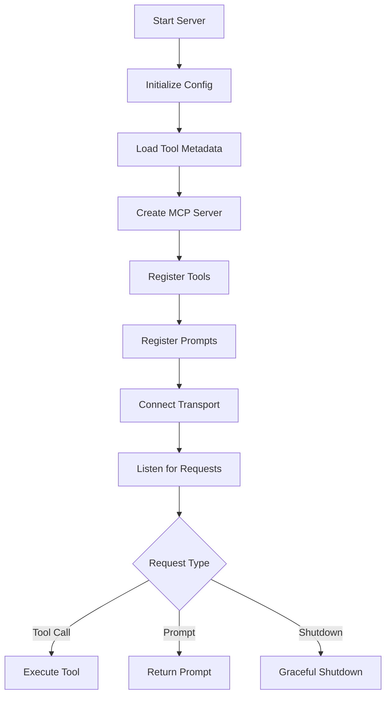

# Octocode MCP Architecture

> Model Context Protocol (MCP) server for GitHub and local code research, built in TypeScript.

## Overview

Octocode MCP is an MCP server that provides AI agents with powerful code exploration capabilities. It exposes **13 tools** for:

- **GitHub Research**: Search code, repositories, pull requests, view repo structure, and fetch file content
- **Local Research**: Search local codebases using ripgrep, browse directory structure, find files, and read content
- **LSP Intelligence**: Semantic code navigation via Language Server Protocol (go-to-definition, find references, call hierarchy)
- **Package Discovery**: Search NPM and PyPI for package information and repository URLs

The server follows the [Model Context Protocol](https://modelcontextprotocol.io/) specification and integrates with MCP-compatible clients like Cursor, Claude Desktop, and others.

---

## Project Structure

```
src/
├── index.ts                 # Entry point - server initialization
├── serverConfig.ts          # Configuration & GitHub token management
├── session.ts               # Session tracking & telemetry
├── responses.ts             # Response formatting utilities
├── errorCodes.ts            # Centralized error definitions
├── types.ts                 # Shared TypeScript types
├── public.ts                # Public API exports
│
├── scheme/                  # 📐 Input validation schemas (Zod)
│   ├── baseSchema.ts        # Common schema patterns & bulk query builder
│   ├── github_*.ts          # GitHub tool schemas (5 files)
│   ├── local_*.ts           # Local tool schemas (4 files)
│   ├── lsp_*.ts             # LSP tool schemas (3 files)
│   ├── package_search.ts    # Package search schema
│   └── responsePriority.ts  # Response field ordering
│
├── tools/                   # 🔧 Tool implementations
│   ├── toolConfig.ts        # Tool registry & configuration
│   ├── toolMetadata.ts      # Dynamic metadata from API
│   ├── toolNames.ts         # Static tool name constants
│   ├── toolsManager.ts      # Tool registration orchestrator
│   ├── github_*.ts          # GitHub tool implementations (5 files)
│   ├── local_*.ts           # Local tool implementations (4 files)
│   ├── lsp_*.ts             # LSP tool implementations (3 files)
│   ├── package_search.ts    # Package search implementation
│   ├── utils.ts             # Tool-specific utilities
│   └── hints/               # Dynamic hint generation
│       ├── index.ts         # Hints module exports
│       ├── dynamic.ts       # Context-aware hints
│       ├── static.ts        # Predefined hints
│       ├── localBaseHints.ts # Local tool base hints
│       └── types.ts         # Hint type definitions
│
├── github/                  # 🐙 GitHub API layer
│   ├── index.ts             # GitHub module exports
│   ├── client.ts            # Octokit client with throttling
│   ├── githubAPI.ts         # Core API types & interfaces
│   ├── codeSearch.ts        # Code search operations
│   ├── fileContent.ts       # File content retrieval
│   ├── fileOperations.ts    # File operation utilities
│   ├── repoSearch.ts        # Repository search
│   ├── repoStructure.ts     # Repository tree exploration
│   ├── pullRequestSearch.ts # PR search & diff retrieval
│   ├── queryBuilders.ts     # GitHub search query construction
│   ├── errors.ts            # GitHub error handling
│   └── errorConstants.ts    # GitHub-specific error codes
│
├── lsp/                     # 🔤 Language Server Protocol
│   ├── index.ts             # LSP module exports
│   ├── client.ts            # LSP client (spawns servers, JSON-RPC)
│   ├── types.ts             # LSP type definitions
│   └── resolver.ts          # Symbol resolution utilities
│
├── security/                # 🔒 Security layer
│   ├── withSecurityValidation.ts  # Security wrapper for tools
│   ├── contentSanitizer.ts  # Secret detection & redaction
│   ├── pathValidator.ts     # Path traversal prevention
│   ├── commandValidator.ts  # Command injection prevention
│   ├── executionContextValidator.ts # Execution context validation
│   ├── ignoredPathFilter.ts # Sensitive path filtering
│   ├── regexes.ts           # Secret detection patterns (100+)
│   ├── mask.ts              # Data masking utilities
│   ├── patternsConstants.ts # Security pattern definitions
│   └── securityConstants.ts # Security configuration
│
├── commands/                # 🖥️ CLI command builders
│   ├── BaseCommandBuilder.ts    # Abstract command builder
│   ├── RipgrepCommandBuilder.ts # ripgrep (rg) command builder
│   ├── GrepCommandBuilder.ts    # grep fallback builder
│   ├── FindCommandBuilder.ts    # find command builder
│   └── LsCommandBuilder.ts      # ls command builder
│
├── utils/                   # 🛠️ Shared utilities (organized by domain)
│   ├── core/                # Core utilities
│   │   ├── constants.ts     # Global constants
│   │   ├── logger.ts        # MCP logging integration
│   │   ├── promise.ts       # Async/promise utilities
│   │   └── types.ts         # Core type definitions
│   │
│   ├── credentials/         # Credential utilities
│   │   └── index.ts         # Credential management
│   │
│   ├── environment/         # Environment utilities
│   │   └── environmentDetection.ts # Environment detection
│   │
│   ├── exec/                # Command execution
│   │   ├── index.ts         # Module exports
│   │   ├── safe.ts          # Safe command execution
│   │   ├── spawn.ts         # Process spawning
│   │   ├── npm.ts           # NPM command utilities
│   │   └── commandAvailability.ts # Command detection
│   │
│   ├── file/                # File operations
│   │   ├── byteOffset.ts    # Byte offset calculations
│   │   ├── filters.ts       # File filtering utilities
│   │   ├── size.ts          # File size utilities
│   │   ├── toolHelpers.ts   # Tool-specific helpers
│   │   └── types.ts         # File type definitions
│   │
│   ├── http/                # HTTP utilities
│   │   ├── cache.ts         # Response caching
│   │   └── fetch.ts         # Fetch with retries
│   │
│   ├── minifier/            # Content minification
│   │   ├── index.ts         # Module exports
│   │   ├── minifier.ts      # File-type aware minification
│   │   └── jsonToYamlString.ts # YAML conversion
│   │
│   ├── package/             # Package utilities
│   │   ├── common.ts        # Shared package utilities
│   │   ├── npm.ts           # NPM package search
│   │   └── python.ts        # PyPI package search
│   │
│   ├── pagination/          # Pagination utilities
│   │   ├── index.ts         # Module exports
│   │   ├── core.ts          # Core pagination logic
│   │   ├── hints.ts         # Pagination hints
│   │   └── types.ts         # Pagination types
│   │
│   ├── parsers/             # Output parsers
│   │   ├── diff.ts          # Diff parsing
│   │   └── ripgrep.ts       # Ripgrep output parsing
│   │
│   └── response/            # Response utilities
│       ├── bulk.ts          # Bulk operation responses
│       └── error.ts         # Error response formatting
│
├── prompts/                 # 💬 MCP prompts
│   └── prompts.ts           # Prompt registration
│
└── types/                   # 📝 Type definitions
    ├── metadata.ts          # Metadata types
    └── markdown.d.ts        # Markdown type declarations
```

---

## Core Components

### 1. Entry Point (`index.ts`)

The server starts by:

1. **Initializing configuration** - Load environment variables, resolve GitHub token
2. **Loading tool metadata** - Fetch dynamic metadata from Octocode API
3. **Creating MCP server** - Initialize `McpServer` with capabilities
4. **Registering tools** - Register all enabled tools with security wrappers
5. **Registering prompts** - Register available prompts
6. **Connecting transport** - Start stdio transport for MCP communication
7. **Setting up shutdown handlers** - Graceful shutdown on SIGINT/SIGTERM



### 2. Tool Registration Flow

Tools follow a layered architecture: **Schema → Implementation → Security**

```
┌─────────────────────────────────────────────────────────────────────┐
│                         MCP Client Request                          │
└─────────────────────────────────────────────────────────────────────┘
                                    │
                                    ▼
┌─────────────────────────────────────────────────────────────────────┐
│                     1. Schema Validation (Zod)                      │
│                        scheme/github_*.ts                           │
│                        scheme/local_*.ts                            │
│                        scheme/lsp_*.ts                              │
└─────────────────────────────────────────────────────────────────────┘
                                    │
                                    ▼
┌─────────────────────────────────────────────────────────────────────┐
│                   2. Security Validation Wrapper                    │
│                 security/withSecurityValidation.ts                  │
│   • Input parameter validation                                      │
│   • Secret detection in parameters                                  │
│   • Session logging                                                 │
└─────────────────────────────────────────────────────────────────────┘
                                    │
                                    ▼
┌─────────────────────────────────────────────────────────────────────┐
│                     3. Bulk Operations Handler                      │
│                     utils/bulkOperations.ts                         │
│   • Execute 1-5 queries in parallel                                 │
│   • Isolate errors per query                                        │
│   • Aggregate results & hints                                       │
└─────────────────────────────────────────────────────────────────────┘
                                    │
                                    ▼
┌─────────────────────────────────────────────────────────────────────┐
│                      4. Tool Implementation                         │
│                       tools/github_*.ts                             │
│                       tools/local_*.ts                              │
│                       tools/lsp_*.ts                                │
│   • Business logic                                                  │
│   • API calls / Command execution / LSP client                      │
│   • Result transformation                                           │
└─────────────────────────────────────────────────────────────────────┘
                                    │
                                    ▼
┌─────────────────────────────────────────────────────────────────────┐
│                     5. Content Sanitization                         │
│                  security/contentSanitizer.ts                       │
│   • Detect secrets in output                                        │
│   • Redact sensitive data                                           │
│   • Minify content for tokens                                       │
└─────────────────────────────────────────────────────────────────────┘
                                    │
                                    ▼
┌─────────────────────────────────────────────────────────────────────┐
│                     6. Response Formatting                          │
│                        responses.ts                                 │
│   • YAML formatting                                                 │
│   • Field prioritization                                            │
│   • Final masking                                                   │
└─────────────────────────────────────────────────────────────────────┘
```

### 3. Tool Configuration (`toolConfig.ts`)

Each tool is defined with:

```typescript
interface ToolConfig {
  name: string;        // Tool identifier (e.g., 'githubSearchCode')
  description: string; // Human-readable description
  isDefault: boolean;  // Enabled by default
  isLocal: boolean;    // Requires local filesystem access
  type: 'search' | 'content' | 'history' | 'debug';
  fn: (server, callback?) => RegisteredTool;
}
```

**Available Tools (13 total):**

| Tool | Type | Local | Description |
|------|------|-------|-------------|
| `githubSearchCode` | search | ❌ | Search code across GitHub |
| `githubGetFileContent` | content | ❌ | Fetch file content from repos |
| `githubViewRepoStructure` | content | ❌ | Browse repository tree |
| `githubSearchRepositories` | search | ❌ | Search GitHub repositories |
| `githubSearchPullRequests` | history | ❌ | Search PRs and view diffs |
| `packageSearch` | search | ❌ | Search NPM/PyPI packages |
| `localSearchCode` | search | ✅ | Search code with ripgrep |
| `localViewStructure` | content | ✅ | Browse local directories |
| `localFindFiles` | search | ✅ | Find files by metadata |
| `localGetFileContent` | content | ✅ | Read local file content |
| `lspGotoDefinition` | content | ✅ | Jump to symbol definition |
| `lspFindReferences` | search | ✅ | Find all usages of a symbol |
| `lspCallHierarchy` | content | ✅ | Trace function call relationships |

---

## Schema Layer (`scheme/`)

[Zod](https://zod.dev/) schemas for runtime validation. All queries require research context (`mainResearchGoal`, `researchGoal`, `reasoning`). Bulk queries: 1-3 for GitHub, 1-5 for local/LSP.

---

## Security Layer (`security/`)

### Security Wrapper (`withSecurityValidation.ts`)

Wraps all tool handlers: validates inputs → logs calls → executes with sanitized params.

### Content Sanitizer (`contentSanitizer.ts`)

- **Input validation**: Max 10K chars, block prototype pollution (`__proto__`, `constructor`)
- **Secret detection**: 100+ regex patterns (API keys, tokens, AWS credentials, etc.)
- **Automatic redaction**: `[REDACTED-<TYPE>]` replacement

### Path Validator (`pathValidator.ts`)

Prevents directory traversal: expands `~`, resolves absolute paths, validates against allowed roots, verifies symlinks.

---

## GitHub Client (`github/`)

### Token Resolution

Tokens are resolved in priority order: `GITHUB_TOKEN` env var → GitHub CLI (`gh auth token`).

### Octokit Configuration

- **Throttling plugin** - Handles rate limits gracefully
- **Instance caching** - Reuse clients by token hash
- **Configurable base URL** - GitHub Enterprise support
- **Request timeout** - Default 30s

---

## Bulk Operations (`utils/response/bulk.ts`)

All tools support bulk queries: **1-3 for GitHub**, **1-5 for local/LSP**.

- **Parallel execution** (concurrency: 3)
- **Error isolation** (one failure doesn't stop others)
- **Per-query timeout** (60s)
- **Status tracking**: `hasResults`, `empty`, `error`

---

## Session Management (`session.ts`)

Anonymous telemetry (opt-out via `LOG=false`). Logs: `init`, `tool_call`, `prompt_call`, `error`, `rate_limit`.

---

## Command Builders (`commands/`)

Local tools use command builders for safe CLI execution. Fallback chain: `ripgrep (rg) → grep → error`.

---

## LSP (Language Server Protocol) (`lsp/`)

Semantic code intelligence via spawned language servers (JSON-RPC).

- **TypeScript/JavaScript bundled** - works out-of-box
- **30+ languages supported** - Python, Go, Rust, Java, C/C++ (install required)
- **Tools**: `lspGotoDefinition`, `lspFindReferences`, `lspCallHierarchy`

See [LSP_TOOLS.md](./docs/LSP_TOOLS.md) for full documentation.

---

## Configuration

| Variable | Description | Default |
|----------|-------------|---------|
| `GITHUB_TOKEN` | GitHub personal access token | - |
| `GITHUB_API_URL` | GitHub API base URL | `https://api.github.com` |
| `ENABLE_LOCAL` / `LOCAL` | Enable local/LSP tools | `false` |
| `LOG` | Enable session logging | `true` |
| `REQUEST_TIMEOUT` | API timeout (ms) | `30000` |
| `TOOLS_TO_RUN` | Tool whitelist (comma-separated) | - |
| `ENABLE_TOOLS` / `DISABLE_TOOLS` | Enable/disable specific tools | - |

---

## Data Flow

### Tool Execution Lifecycle

The following flowchart illustrates the complete lifecycle of a tool request, including security validation, bulk processing, and the feedback loop.

```mermaid
flowchart TD
    %% Actors
    Agent[🤖 AI Agent / Client]
    
    %% Request Phase
    subgraph Request_Phase [1. Request & Validation]
        direction TB
        Call[Tool Call]
        Context[Research Context<br/>mainResearchGoal, researchGoal, reasoning]
        Schema{Schema Check<br/>Zod}
        SecurityIn{Security Wrapper<br/>Input Validation}
        
        Call --> Context
        Context --> Schema
        Schema -- Invalid --> Error[Return Error]
        Schema -- Valid --> SecurityIn
        SecurityIn -- Secrets Detected --> Error
        SecurityIn -- Safe --> Bulk[Bulk Splitter]
    end

    %% Execution Phase
    subgraph Execution_Phase [2. Execution (Bulk 1-5)]
        direction TB
        Bulk --> Query1[Query 1]
        Bulk --> Query2[Query N...]
        
        Query1 --> Exec{Execute Tool}
        Query2 --> Exec
        
        Exec -- GitHub --> API[GitHub API / Cache]
        Exec -- Local --> Shell[Local Shell / FS]
        Exec -- LSP --> LSP[Language Server]
    end

    %% Processing Phase
    subgraph Processing_Phase [3. Processing & Safety]
        direction TB
        RawData[Raw Results]
        Sanitizer[Content Sanitizer<br/>Redact Secrets]
        Minifier[Minifier<br/>Reduce Tokens]
        
        API --> RawData
        Shell --> RawData
        LSP --> RawData
        RawData --> Sanitizer
        Sanitizer --> Minifier
    end

    %% Response Phase
    subgraph Response_Phase [4. Response & Guidance]
        direction TB
        Hints[Hints Generator<br/>Dynamic Suggestions]
        Format[Response Formatter<br/>JSON → YAML]
        Result[Final Result]
        
        Minifier --> Hints
        Hints --> Format
        Format --> Result
    end

    %% Flow Connections
    Agent --> Call
    Result --> Agent
    
    %% Feedback Loop
    Agent -.->|Reads Hints & Data| Decision{Next Step?}
    Decision -.->|Follow Hint| NextTool[Next Tool Call]
    Decision -.->|Refine| RefinedQuery[Refined Query]
    
    %% Styling
    style SecurityIn fill:#ffcccc,stroke:#cc0000
    style Sanitizer fill:#ffcccc,stroke:#cc0000
    style Context fill:#e1f5fe,stroke:#01579b
    style Hints fill:#e6fffa,stroke:#009688
```

---

## Testing

**170 test files** using Vitest. Coverage: **90%** required.

| Directory | Files | Purpose |
|-----------|-------|---------|
| `commands/` | 4 | Command builder tests |
| `github/` | 29 | GitHub API tests |
| `lsp/` | 7 | LSP client tests |
| `security/` | 15 | Security & penetration tests |
| `tools/` | 55 | Tool implementation tests |
| `utils/` | 37 | Utility tests |

```bash
yarn test        # Run with coverage
yarn test:quiet  # Minimal output
```

---

## Key Design Decisions

1. **Bulk Queries** - All tools accept 1-5 queries per request to minimize round trips
2. **Research Context** - Every query requires `mainResearchGoal`, `researchGoal`, `reasoning` for better AI agent guidance
3. **Security First** - All inputs sanitized, all outputs checked for secrets, paths validated
4. **Graceful Degradation** - Local tools fall back from ripgrep to grep, errors isolated per query
5. **Token Efficiency** - Content minification, YAML output, response prioritization
6. **Dynamic Metadata** - Tool descriptions and hints fetched from API for easy updates
7. **Caching** - Response caching reduces GitHub API calls and improves latency
8. **LSP Integration** - Semantic code intelligence via spawned language servers for definition/reference lookup

---

## Related Documentation

- [README.md](../README.md) - Installation and usage
- [LSP_TOOLS.md](./LSP_TOOLS.md) - LSP tools configuration and supported languages
- [HINTS_ARCHITECTURE.md](./HINTS_ARCHITECTURE.md) - Dynamic hints system
- [Model Context Protocol](https://modelcontextprotocol.io/) - MCP specification
- [GitHub REST API](https://docs.github.com/en/rest) - GitHub API reference
- [LSP Specification](https://microsoft.github.io/language-server-protocol/) - Language Server Protocol

---

*Architecture document for Octocode MCP v11.x*
