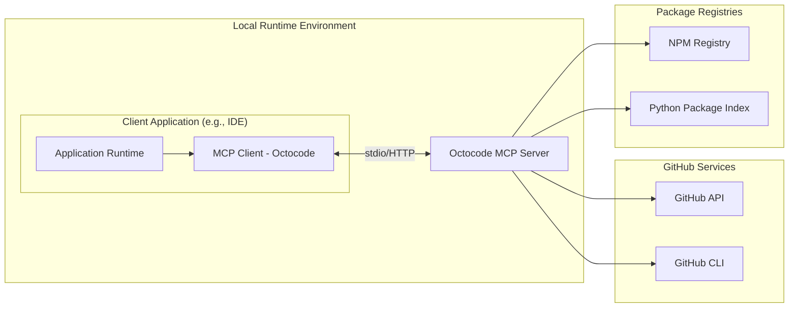

# Octocode MCP Host Integration Guide

This guide outlines integration considerations for MCP Host authors who want to allow installation of Octocode MCP Server.

---

## Table of Contents

- [Understanding MCP Architecture](#understanding-mcp-architecture)
- [Connecting to Octocode MCP Server](#connecting-to-octocode-mcp-server)
- [Authentication Methods](#authentication-methods)
- [Enterprise Integration](#enterprise-integration)
- [Configuration Examples](#configuration-examples)
- [Security Considerations](#security-considerations)

---

## Understanding MCP Architecture

Octocode MCP Server provides GitHub repository analysis and package discovery capabilities through the Model Context Protocol standard.

### Architecture Overview



---

## Connecting to Octocode MCP Server

### Local Server Configuration

Octocode MCP Server runs locally alongside your application and communicates via standard I/O or HTTP.

#### Basic Configuration

```json
{
  "servers": {
    "octocode": {
      "command": "npx",
      "args": ["octocode-mcp"],
      "env": {
        "GITHUB_TOKEN": "${input:github_token}"
      }
    }
  },
  "inputs": [
    {
      "type": "promptString",
      "id": "github_token",
      "description": "GitHub Personal Access Token",
      "password": true
    }
  ]
}
```

#### Docker Configuration

```json
{
  "servers": {
    "octocode": {
      "command": "docker",
      "args": [
        "run", "-i", "--rm",
        "-e", "GITHUB_TOKEN",
        "octocode/octocode-mcp:latest"
      ],
      "env": {
        "GITHUB_TOKEN": "${input:github_token}"
      }
    }
  }
}
```

---

## Authentication Methods

### 1. GitHub Personal Access Token (Recommended)

```bash
# Set environment variable
export GITHUB_TOKEN="ghp_xxxxxxxxxxxxxxxxxxxx"

# Or use GitHub CLI
gh auth login
```

**Required Scopes:**
- `repo` - Repository access
- `read:org` - Organization membership (for enterprise features)
- `read:user` - User profile information

### 2. GitHub CLI Integration (Individual Mode Only)

Octocode automatically detects and uses GitHub CLI authentication:

```bash
gh auth login --scopes repo,read:org,read:user
```

**⚠️ Enterprise Restriction**: CLI token resolution is **disabled in enterprise mode** for security reasons. Enterprise deployments must use environment variables.

### 3. Multiple Token Sources

Octocode resolves tokens in this priority order:
1. `GITHUB_TOKEN` environment variable
2. `GH_TOKEN` environment variable
3. GitHub CLI token (`gh auth token`) - **disabled in enterprise mode**
4. `Authorization` header

---

## Enterprise Integration

### Organization Configuration

```bash
# Required for enterprise features
export GITHUB_ORGANIZATION="your-org"
export GITHUB_ORGANIZATION_NAME="Your Organization"

# Access controls
export GITHUB_ALLOWED_USERS="user1,user2,user3"
export GITHUB_REQUIRED_TEAMS="developers,security"
export GITHUB_ADMIN_USERS="admin1,admin2"

# Security policies
export RESTRICT_TO_MEMBERS=true
export REQUIRE_MFA=true

# Audit logging
export AUDIT_ALL_ACCESS=true
export AUDIT_LOG_DIR="./logs/audit"

# Rate limiting
export RATE_LIMIT_API_HOUR=1000
export RATE_LIMIT_AUTH_HOUR=10
export RATE_LIMIT_TOKEN_HOUR=50
```

### Toolset Management

```bash
# Enable specific toolsets (GitHub MCP compatible)
export GITHUB_TOOLSETS="repos,search,packages"

# Read-only mode
export GITHUB_READ_ONLY=true

# Dynamic toolset discovery
export GITHUB_DYNAMIC_TOOLSETS=true
```

---

## Configuration Examples

### VS Code Configuration

```json
{
  "mcp": {
    "servers": {
      "octocode": {
        "command": "npx",
        "args": ["octocode-mcp"],
        "env": {
          "GITHUB_TOKEN": "${input:github_token}",
          "GITHUB_ORGANIZATION": "${input:github_org}",
          "GITHUB_TOOLSETS": "repos,search,packages"
        }
      }
    },
    "inputs": [
      {
        "type": "promptString",
        "id": "github_token",
        "description": "GitHub Personal Access Token",
        "password": true
      },
      {
        "type": "promptString", 
        "id": "github_org",
        "description": "GitHub Organization (optional)"
      }
    ]
  }
}
```

### Claude Desktop Configuration

```json
{
  "mcpServers": {
    "octocode": {
      "command": "npx",
      "args": ["octocode-mcp"],
      "env": {
        "GITHUB_TOKEN": "ghp_xxxxxxxxxxxxxxxxxxxx"
      }
    }
  }
}
```

### Cursor Configuration

```json
{
  "mcp.servers": {
    "octocode": {
      "command": "npx",
      "args": ["octocode-mcp"],
      "env": {
        "GITHUB_TOKEN": "${GITHUB_TOKEN}"
      }
    }
  }
}
```

---

## Security Considerations

### Token Storage
- Use secure platform APIs for token storage
- Never hardcode tokens in configuration files
- Prefer environment variables or secure credential stores

### Input Validation
- All tool arguments are automatically sanitized
- Content filtering prevents sensitive data exposure
- Rate limiting prevents abuse

### Enterprise Security
- Organization membership validation
- Team-based access controls
- Comprehensive audit logging
- Policy-based access management

### Network Security
- All GitHub API calls use HTTPS
- No external network access beyond GitHub/NPM APIs
- Local execution environment

---

## Troubleshooting

### Authentication Issues

```bash
# Verify token works
curl -H "Authorization: token $GITHUB_TOKEN" https://api.github.com/user

# Check organization access
curl -I -H "Authorization: token $GITHUB_TOKEN" \
  https://api.github.com/orgs/YOUR_ORG/members/YOUR_USERNAME
```

### Configuration Issues

```bash
# Test basic connectivity
npx octocode-mcp --version

# Enable debug logging
export DEBUG=octocode:*
npx octocode-mcp
```

### Enterprise Features

```bash
# Verify organization configuration
echo $GITHUB_ORGANIZATION

# Check audit log directory
ls -la $AUDIT_LOG_DIR

# Test rate limiting
curl -H "Authorization: token $GITHUB_TOKEN" \
  https://api.github.com/rate_limit
```

---

## Additional Resources

- [GitHub Personal Access Tokens](https://docs.github.com/en/authentication/keeping-your-account-and-data-secure/managing-your-personal-access-tokens)
- [GitHub CLI Authentication](https://cli.github.com/manual/gh_auth_login)
- [Model Context Protocol Specification](https://modelcontextprotocol.io/specification/)
- [Enterprise Configuration Guide](./ENTERPRISE.md)
- [Installation Guide](./INSTALLATION.md)
