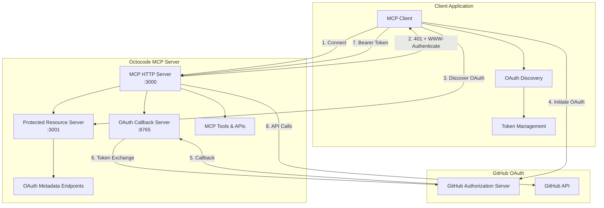

# Octocode MCP OAuth Implementation Guide

**🔐 Complete OAuth 2.1 implementation guide for hosting OAuth-enabled MCP servers, client integration, and production deployment with Model Context Protocol.**

---

## Table of Contents

### Core Implementation
- [OAuth Architecture Overview](#oauth-architecture-overview)
- [Server Implementation](#server-implementation)
- [Client Integration](#client-integration)
- [MCP Protocol Compliance](#mcp-protocol-compliance)

### Deployment Scenarios
- [🏠 Local Development Server](#-local-development-server)
- [🌐 Hosted Web Services](#-hosted-web-services)
- [☁️ Cloud & Container Deployment](#-cloud--container-deployment)
- [🏢 Enterprise Integration](#-enterprise-integration)

### Advanced Topics
- [OAuth Discovery & Metadata](#oauth-discovery--metadata)
- [Security Implementation](#security-implementation)
- [Production Considerations](#production-considerations)
- [Troubleshooting & Debugging](#troubleshooting--debugging)

---

## OAuth Architecture Overview

### System Components



### Transport Modes

| Mode | Use Case | Configuration | Best For |
|------|----------|---------------|----------|
| **stdio** | Local development, CLI tools | Default MCP transport | Individual developers |
| **http** | Hosted services, web apps | HTTP server on port 3000 | Production deployments |
| **hybrid** | Development + testing | Both transports available | Development teams |

---

## Server Implementation

### HTTP Server Setup

#### Basic HTTP Server Configuration

```typescript
// server.ts
import { McpServer } from '@modelcontextprotocol/sdk/server/mcp.js';
import { MCPHttpServer } from 'octocode-mcp/http/mcpHttpServer.js';
import { ProtectedResourceServer } from 'octocode-mcp/http/protectedResourceServer.js';
import { registerAllTools } from 'octocode-mcp';

async function startOAuthMCPServer() {
  // Initialize MCP server with tools
  const mcpServer = new McpServer({
    name: 'octocode-oauth',
    version: '1.0.0'
  });

  // Register all Octocode tools
  await registerAllTools(mcpServer);

  // Start HTTP transport server
  const httpServer = new MCPHttpServer(mcpServer, {
    port: 3000,
    hostname: '0.0.0.0',
    corsEnabled: true,
    enableHealthCheck: true
  });

  // Start OAuth metadata server (RFC 9728 compliance)
  const metadataServer = new ProtectedResourceServer({
    port: 3001,
    hostname: '0.0.0.0',
    corsEnabled: true,
    enableHealthCheck: true
  });

  await Promise.all([
    httpServer.start(),
    metadataServer.start()
  ]);

  console.log('🚀 OAuth MCP Server running:');
  console.log(`   MCP HTTP: http://localhost:3000`);
  console.log(`   OAuth Metadata: http://localhost:3001`);
  console.log(`   Discovery: http://localhost:3001/.well-known/oauth-protected-resource`);
}

startOAuthMCPServer().catch(console.error);
```

#### Environment Configuration

```bash
# OAuth Configuration
export GITHUB_OAUTH_CLIENT_ID=Iv1.a629723d4c8a5678
export GITHUB_OAUTH_CLIENT_SECRET=your_client_secret_here
export GITHUB_OAUTH_REDIRECT_URI=http://localhost:8765/auth/callback
export GITHUB_OAUTH_SCOPES=repo,read:user,read:org
export GITHUB_OAUTH_ENABLED=true

# Server Configuration
export MCP_TRANSPORT=http
export MCP_HTTP_PORT=3000
export MCP_HTTP_HOST=0.0.0.0
export OAUTH_METADATA_PORT=3001
export OAUTH_METADATA_HOST=0.0.0.0

# Optional: Enterprise features
export GITHUB_ORGANIZATION=your-org
export AUDIT_ALL_ACCESS=true
export RATE_LIMIT_API_HOUR=5000

# Optional: GitHub Enterprise Server
export GITHUB_HOST=https://github.enterprise.com
```

#### Complete Server Implementation

```typescript
// production-server.ts
import { McpServer } from '@modelcontextprotocol/sdk/server/mcp.js';
import { MCPHttpServer } from 'octocode-mcp/http/mcpHttpServer.js';
import { ProtectedResourceServer } from 'octocode-mcp/http/protectedResourceServer.js';
import { OAuthCallbackServer } from 'octocode-mcp/http/oauthCallbackServer.js';
import { ConfigManager } from 'octocode-mcp/config/serverConfig.js';
import { registerAllTools } from 'octocode-mcp';

class OAuthMCPServerManager {
  private mcpServer: McpServer;
  private httpServer: MCPHttpServer | null = null;
  private metadataServer: ProtectedResourceServer | null = null;
  private callbackServer: OAuthCallbackServer | null = null;

  constructor() {
    this.mcpServer = new McpServer({
      name: 'octocode-oauth-production',
      version: process.env.npm_package_version || '1.0.0'
    });
  }

  async initialize(): Promise<void> {
    // Initialize configuration
    const config = ConfigManager.initialize();
    
    // Register all Octocode tools
    await registerAllTools(this.mcpServer);

    // Initialize servers
    this.httpServer = new MCPHttpServer(this.mcpServer, {
      port: parseInt(process.env.MCP_HTTP_PORT || '3000', 10),
      hostname: process.env.MCP_HTTP_HOST || '0.0.0.0',
      corsEnabled: process.env.MCP_HTTP_CORS !== 'false',
      enableHealthCheck: true
    });

    this.metadataServer = new ProtectedResourceServer({
      port: parseInt(process.env.OAUTH_METADATA_PORT || '3001', 10),
      hostname: process.env.OAUTH_METADATA_HOST || '0.0.0.0',
      corsEnabled: process.env.OAUTH_METADATA_CORS !== 'false',
      enableHealthCheck: true
    });

    // Optional: OAuth callback server for local development
    if (process.env.ENABLE_OAUTH_CALLBACK_SERVER === 'true') {
      this.callbackServer = new OAuthCallbackServer({
        port: parseInt(process.env.OAUTH_CALLBACK_PORT || '8765', 10),
        hostname: process.env.OAUTH_CALLBACK_HOST || '127.0.0.1'
      });
    }
  }

  async start(): Promise<void> {
    if (!this.httpServer || !this.metadataServer) {
      throw new Error('Server not initialized. Call initialize() first.');
    }

    const startPromises = [
      this.httpServer.start(),
      this.metadataServer.start()
    ];

    if (this.callbackServer) {
      startPromises.push(this.callbackServer.start());
    }

    await Promise.all(startPromises);

    console.log('🚀 OAuth MCP Server started successfully:');
    console.log(`   📡 MCP HTTP Server: http://${process.env.MCP_HTTP_HOST || '0.0.0.0'}:${process.env.MCP_HTTP_PORT || '3000'}`);
    console.log(`   🔍 OAuth Metadata: http://${process.env.OAUTH_METADATA_HOST || '0.0.0.0'}:${process.env.OAUTH_METADATA_PORT || '3001'}`);
    console.log(`   🔐 Discovery Endpoint: http://localhost:${process.env.OAUTH_METADATA_PORT || '3001'}/.well-known/oauth-protected-resource`);
    
    if (this.callbackServer) {
      console.log(`   🔄 OAuth Callback: http://${process.env.OAUTH_CALLBACK_HOST || '127.0.0.1'}:${process.env.OAUTH_CALLBACK_PORT || '8765'}/auth/callback`);
    }
  }

  async stop(): Promise<void> {
    const stopPromises = [];
    
    if (this.httpServer) {
      stopPromises.push(this.httpServer.stop());
    }
    
    if (this.metadataServer) {
      stopPromises.push(this.metadataServer.stop());
    }
    
    if (this.callbackServer) {
      stopPromises.push(this.callbackServer.stop());
    }

    await Promise.all(stopPromises);
    console.log('🛑 OAuth MCP Server stopped');
  }
}

// Production server startup
async function main() {
  const server = new OAuthMCPServerManager();
  
  try {
    await server.initialize();
    await server.start();

    // Graceful shutdown
    process.on('SIGINT', async () => {
      console.log('\n🛑 Received SIGINT, shutting down gracefully...');
      await server.stop();
      process.exit(0);
    });

    process.on('SIGTERM', async () => {
      console.log('\n🛑 Received SIGTERM, shutting down gracefully...');
      await server.stop();
      process.exit(0);
    });

  } catch (error) {
    console.error('❌ Failed to start server:', error);
    process.exit(1);
  }
}

if (require.main === module) {
  main();
}

export { OAuthMCPServerManager };
```

---

## Client Integration

### MCP Client with OAuth Discovery

#### TypeScript Client Implementation

```typescript
// mcp-oauth-client.ts
import { Client } from '@modelcontextprotocol/sdk/client/index.js';
import { StdioClientTransport } from '@modelcontextprotocol/sdk/client/stdio.js';
import { HttpClientTransport } from '@modelcontextprotocol/sdk/client/http.js';

interface OAuthMetadata {
  authorization_servers: Array<{
    issuer: string;
    authorization_endpoint: string;
    token_endpoint: string;
    scopes_supported: string[];
    response_types_supported: string[];
    grant_types_supported: string[];
    code_challenge_methods_supported: string[];
  }>;
  resource_server: {
    resource_server_id: string;
    scopes_supported: string[];
  };
}

class OAuthMCPClient {
  private client: Client;
  private transport: HttpClientTransport;
  private accessToken: string | null = null;
  private serverUrl: string;

  constructor(serverUrl: string) {
    this.serverUrl = serverUrl;
    this.transport = new HttpClientTransport(new URL(serverUrl));
    this.client = new Client({
      name: 'oauth-mcp-client',
      version: '1.0.0'
    }, {
      capabilities: {}
    });
  }

  async connect(): Promise<void> {
    await this.client.connect(this.transport);
  }

  async discoverOAuth(): Promise<OAuthMetadata> {
    const metadataUrl = this.serverUrl.replace(':3000', ':3001') + '/.well-known/oauth-protected-resource';
    const response = await fetch(metadataUrl);
    
    if (!response.ok) {
      throw new Error(`OAuth discovery failed: ${response.status}`);
    }

    return await response.json();
  }

  async authenticateWithOAuth(): Promise<void> {
    try {
      // Try to make a request without authentication
      await this.client.request({
        method: 'tools/list',
        params: {}
      }, {});
    } catch (error: any) {
      if (error.code === -32001) { // Unauthorized
        console.log('🔐 Authentication required, starting OAuth flow...');
        
        // Discover OAuth endpoints
        const metadata = await this.discoverOAuth();
        console.log('📡 Discovered OAuth metadata:', metadata);

        // Start OAuth flow using the simpleOAuth tool
        const authResult = await this.client.request({
          method: 'tools/call',
          params: {
            name: 'simpleOAuth',
            arguments: {
              action: 'authenticate',
              scopes: ['repo', 'read:user', 'read:org']
            }
          }
        }, {});

        console.log('🔑 OAuth authentication initiated:', authResult);
        
        if (authResult.content?.[0]?.text) {
          const authData = JSON.parse(authResult.content[0].text);
          
          if (authData.userCode && authData.verificationUrl) {
            console.log(`\n🌐 Please visit: ${authData.verificationUrl}`);
            console.log(`🔢 Enter code: ${authData.userCode}`);
            console.log('⏳ Waiting for authentication...\n');

            // Poll for completion (simpleOAuth handles this automatically)
            await this.waitForAuthentication();
          }
        }
      } else {
        throw error;
      }
    }
  }

  private async waitForAuthentication(maxAttempts: number = 30): Promise<void> {
    for (let i = 0; i < maxAttempts; i++) {
      await new Promise(resolve => setTimeout(resolve, 2000)); // Wait 2 seconds

      try {
        const statusResult = await this.client.request({
          method: 'tools/call',
          params: {
            name: 'simpleOAuth',
            arguments: {
              action: 'status'
            }
          }
        }, {});

        if (statusResult.content?.[0]?.text) {
          const status = JSON.parse(statusResult.content[0].text);
          
          if (status.authenticated) {
            console.log('✅ Authentication successful!');
            console.log(`👤 Authenticated as: ${status.user?.login || 'Unknown'}`);
            return;
          }
        }
      } catch (error) {
        // Continue polling
      }
    }

    throw new Error('Authentication timeout');
  }

  async callTool(name: string, arguments_: Record<string, any>): Promise<any> {
    return await this.client.request({
      method: 'tools/call',
      params: {
        name,
        arguments: arguments_
      }
    }, {});
  }

  async listTools(): Promise<any> {
    return await this.client.request({
      method: 'tools/list',
      params: {}
    }, {});
  }

  async disconnect(): Promise<void> {
    await this.client.close();
  }
}

// Usage Example
async function main() {
  const client = new OAuthMCPClient('http://localhost:3000');

  try {
    console.log('🔌 Connecting to MCP server...');
    await client.connect();

    console.log('🔐 Starting OAuth authentication...');
    await client.authenticateWithOAuth();

    console.log('📋 Listing available tools...');
    const tools = await client.listTools();
    console.log('Available tools:', tools.result?.tools?.map((t: any) => t.name));

    console.log('🔍 Searching GitHub code...');
    const searchResult = await client.callTool('githubSearchCode', {
      queries: [{
        queryTerms: ['oauth', 'authentication'],
        owner: 'microsoft',
        repo: 'vscode'
      }]
    });

    console.log('Search results:', JSON.stringify(searchResult, null, 2));

  } catch (error) {
    console.error('❌ Error:', error);
  } finally {
    await client.disconnect();
  }
}

if (require.main === module) {
  main();
}

export { OAuthMCPClient };
```

#### JavaScript Client (Browser)

```javascript
// browser-oauth-client.js
class BrowserOAuthMCPClient {
  constructor(serverUrl) {
    this.serverUrl = serverUrl;
    this.accessToken = localStorage.getItem('mcp_access_token');
  }

  async discoverOAuth() {
    const metadataUrl = this.serverUrl.replace(':3000', ':3001') + '/.well-known/oauth-protected-resource';
    const response = await fetch(metadataUrl);
    return await response.json();
  }

  async makeRequest(method, params = {}) {
    const headers = {
      'Content-Type': 'application/json'
    };

    if (this.accessToken) {
      headers['Authorization'] = `Bearer ${this.accessToken}`;
    }

    const response = await fetch(this.serverUrl, {
      method: 'POST',
      headers,
      body: JSON.stringify({
        jsonrpc: '2.0',
        id: Date.now(),
        method,
        params
      })
    });

    const result = await response.json();

    if (response.status === 401) {
      // Handle authentication challenge
      const wwwAuth = response.headers.get('WWW-Authenticate');
      console.log('Authentication required:', wwwAuth);
      throw new Error('Authentication required');
    }

    return result;
  }

  async authenticateWithOAuth() {
    try {
      // Try to list tools to check authentication
      await this.makeRequest('tools/list');
      console.log('✅ Already authenticated');
      return;
    } catch (error) {
      if (error.message === 'Authentication required') {
        console.log('🔐 Starting OAuth flow...');
        
        // Discover OAuth metadata
        const metadata = await this.discoverOAuth();
        const authServer = metadata.authorization_servers[0];

        // Generate PKCE parameters
        const codeVerifier = this.generateCodeVerifier();
        const codeChallenge = await this.generateCodeChallenge(codeVerifier);
        const state = this.generateState();

        // Store PKCE parameters
        sessionStorage.setItem('oauth_code_verifier', codeVerifier);
        sessionStorage.setItem('oauth_state', state);

        // Build authorization URL
        const authUrl = new URL(authServer.authorization_endpoint);
        authUrl.searchParams.set('client_id', 'your_client_id'); // Get from config
        authUrl.searchParams.set('response_type', 'code');
        authUrl.searchParams.set('scope', 'repo read:user read:org');
        authUrl.searchParams.set('state', state);
        authUrl.searchParams.set('code_challenge', codeChallenge);
        authUrl.searchParams.set('code_challenge_method', 'S256');
        authUrl.searchParams.set('redirect_uri', window.location.origin + '/oauth/callback');

        // Redirect to GitHub
        window.location.href = authUrl.toString();
      } else {
        throw error;
      }
    }
  }

  async handleOAuthCallback(code, state) {
    // Verify state parameter
    const storedState = sessionStorage.getItem('oauth_state');
    if (state !== storedState) {
      throw new Error('Invalid state parameter');
    }

    const codeVerifier = sessionStorage.getItem('oauth_code_verifier');
    
    // Exchange code for token
    const tokenResponse = await fetch('https://github.com/login/oauth/access_token', {
      method: 'POST',
      headers: {
        'Accept': 'application/json',
        'Content-Type': 'application/x-www-form-urlencoded'
      },
      body: new URLSearchParams({
        client_id: 'your_client_id', // Get from config
        client_secret: 'your_client_secret', // Get from config
        code,
        code_verifier: codeVerifier
      })
    });

    const tokenData = await tokenResponse.json();
    
    if (tokenData.access_token) {
      this.accessToken = tokenData.access_token;
      localStorage.setItem('mcp_access_token', this.accessToken);
      
      // Clean up session storage
      sessionStorage.removeItem('oauth_code_verifier');
      sessionStorage.removeItem('oauth_state');
      
      console.log('✅ OAuth authentication successful');
    } else {
      throw new Error('Token exchange failed');
    }
  }

  generateCodeVerifier() {
    const array = new Uint8Array(32);
    crypto.getRandomValues(array);
    return btoa(String.fromCharCode.apply(null, array))
      .replace(/\+/g, '-')
      .replace(/\//g, '_')
      .replace(/=/g, '');
  }

  async generateCodeChallenge(verifier) {
    const encoder = new TextEncoder();
    const data = encoder.encode(verifier);
    const digest = await crypto.subtle.digest('SHA-256', data);
    return btoa(String.fromCharCode.apply(null, new Uint8Array(digest)))
      .replace(/\+/g, '-')
      .replace(/\//g, '_')
      .replace(/=/g, '');
  }

  generateState() {
    const array = new Uint8Array(16);
    crypto.getRandomValues(array);
    return btoa(String.fromCharCode.apply(null, array));
  }

  async callTool(name, arguments_) {
    return await this.makeRequest('tools/call', {
      name,
      arguments: arguments_
    });
  }

  async listTools() {
    return await this.makeRequest('tools/list');
  }
}

// Usage in browser
const client = new BrowserOAuthMCPClient('http://localhost:3000');

// Handle OAuth callback
if (window.location.pathname === '/oauth/callback') {
  const urlParams = new URLSearchParams(window.location.search);
  const code = urlParams.get('code');
  const state = urlParams.get('state');
  
  client.handleOAuthCallback(code, state).then(() => {
    window.location.href = '/'; // Redirect back to main app
  });
}

// Main application
client.authenticateWithOAuth().then(async () => {
  const tools = await client.listTools();
  console.log('Available tools:', tools.result.tools);
  
  const searchResult = await client.callTool('githubSearchCode', {
    queries: [{
      queryTerms: ['react', 'hooks'],
      owner: 'facebook',
      repo: 'react'
    }]
  });
  
  console.log('Search results:', searchResult);
});
```

#### Python Client

```python
# python_oauth_client.py
import asyncio
import aiohttp
import json
import base64
import hashlib
import secrets
from urllib.parse import urlencode, parse_qs
import webbrowser

class OAuthMCPClient:
    def __init__(self, server_url: str):
        self.server_url = server_url
        self.metadata_url = server_url.replace(':3000', ':3001')
        self.access_token = None
        self.session = None

    async def __aenter__(self):
        self.session = aiohttp.ClientSession()
        return self

    async def __aexit__(self, exc_type, exc_val, exc_tb):
        if self.session:
            await self.session.close()

    async def discover_oauth(self):
        """Discover OAuth endpoints from metadata server"""
        url = f"{self.metadata_url}/.well-known/oauth-protected-resource"
        async with self.session.get(url) as response:
            return await response.json()

    async def make_request(self, method: str, params: dict = None):
        """Make MCP request with optional Bearer token"""
        headers = {'Content-Type': 'application/json'}
        
        if self.access_token:
            headers['Authorization'] = f'Bearer {self.access_token}'

        payload = {
            'jsonrpc': '2.0',
            'id': 1,
            'method': method,
            'params': params or {}
        }

        async with self.session.post(self.server_url, 
                                   headers=headers, 
                                   json=payload) as response:
            if response.status == 401:
                www_auth = response.headers.get('WWW-Authenticate')
                print(f"Authentication required: {www_auth}")
                raise Exception("Authentication required")
            
            return await response.json()

    async def authenticate_with_oauth(self):
        """Authenticate using OAuth Device Flow via simpleOAuth tool"""
        try:
            # Try to make a request to check if already authenticated
            await self.make_request('tools/list')
            print("✅ Already authenticated")
            return
        except Exception as e:
            if "Authentication required" in str(e):
                print("🔐 Starting OAuth authentication...")
                
                # Use simpleOAuth tool for device flow
                auth_result = await self.make_request('tools/call', {
                    'name': 'simpleOAuth',
                    'arguments': {
                        'action': 'authenticate',
                        'scopes': ['repo', 'read:user', 'read:org']
                    }
                })

                if auth_result.get('result', {}).get('content'):
                    content = auth_result['result']['content'][0]['text']
                    auth_data = json.loads(content)
                    
                    if auth_data.get('userCode') and auth_data.get('verificationUrl'):
                        print(f"\n🌐 Please visit: {auth_data['verificationUrl']}")
                        print(f"🔢 Enter code: {auth_data['userCode']}")
                        print("⏳ Waiting for authentication...\n")

                        # Open browser automatically
                        webbrowser.open(auth_data['verificationUrl'])

                        # Wait for authentication completion
                        await self.wait_for_authentication()
            else:
                raise e

    async def wait_for_authentication(self, max_attempts: int = 30):
        """Wait for OAuth authentication to complete"""
        for i in range(max_attempts):
            await asyncio.sleep(2)  # Wait 2 seconds
            
            try:
                status_result = await self.make_request('tools/call', {
                    'name': 'simpleOAuth',
                    'arguments': {
                        'action': 'status'
                    }
                })

                if status_result.get('result', {}).get('content'):
                    content = status_result['result']['content'][0]['text']
                    status = json.loads(content)
                    
                    if status.get('authenticated'):
                        user = status.get('user', {})
                        print(f"✅ Authentication successful!")
                        print(f"👤 Authenticated as: {user.get('login', 'Unknown')}")
                        return
            except:
                continue  # Continue polling

        raise Exception("Authentication timeout")

    async def call_tool(self, name: str, arguments: dict):
        """Call an MCP tool"""
        return await self.make_request('tools/call', {
            'name': name,
            'arguments': arguments
        })

    async def list_tools(self):
        """List available MCP tools"""
        return await self.make_request('tools/list')

# Usage example
async def main():
    async with OAuthMCPClient('http://localhost:3000') as client:
        try:
            print("🔐 Starting OAuth authentication...")
            await client.authenticate_with_oauth()

            print("📋 Listing available tools...")
            tools_result = await client.list_tools()
            tools = [tool['name'] for tool in tools_result.get('result', {}).get('tools', [])]
            print(f"Available tools: {tools}")

            print("🔍 Searching GitHub code...")
            search_result = await client.call_tool('githubSearchCode', {
                'queries': [{
                    'queryTerms': ['oauth', 'authentication'],
                    'owner': 'microsoft',
                    'repo': 'vscode',
                    'limit': 5
                }]
            })

            print("Search results:")
            print(json.dumps(search_result, indent=2))

        except Exception as error:
            print(f"❌ Error: {error}")

if __name__ == "__main__":
    asyncio.run(main())
```

---

## MCP Protocol Compliance

### OAuth Discovery Endpoints

The server automatically provides RFC-compliant OAuth discovery endpoints:

#### Protected Resource Metadata (RFC 9728)

```http
GET /.well-known/oauth-protected-resource HTTP/1.1
Host: localhost:3001

HTTP/1.1 200 OK
Content-Type: application/json

{
  "authorization_servers": [
    {
      "issuer": "https://github.com",
      "authorization_endpoint": "https://github.com/login/oauth/authorize",
      "token_endpoint": "https://github.com/login/oauth/access_token",
      "scopes_supported": ["repo", "read:user", "read:org"],
      "response_types_supported": ["code"],
      "grant_types_supported": ["authorization_code", "refresh_token"],
      "code_challenge_methods_supported": ["S256"],
      "token_endpoint_auth_methods_supported": ["client_secret_post"],
      "revocation_endpoint": "https://github.com/login/oauth/revoke"
    }
  ],
  "resource_server": {
    "resource_server_id": "github-api",
    "scopes_supported": ["repo", "read:user", "read:org"]
  }
}
```

#### Authorization Server Metadata (RFC 8414)

```http
GET /.well-known/oauth-authorization-server HTTP/1.1
Host: localhost:3001

HTTP/1.1 200 OK
Content-Type: application/json

{
  "issuer": "https://github.com",
  "authorization_endpoint": "https://github.com/login/oauth/authorize",
  "token_endpoint": "https://github.com/login/oauth/access_token",
  "scopes_supported": ["repo", "read:user", "read:org", "gist", "user"],
  "response_types_supported": ["code"],
  "grant_types_supported": ["authorization_code", "refresh_token"],
  "code_challenge_methods_supported": ["S256"],
  "token_endpoint_auth_methods_supported": ["client_secret_post"],
  "revocation_endpoint": "https://github.com/login/oauth/revoke"
}
```

### WWW-Authenticate Headers

When clients make unauthenticated requests, the server returns proper OAuth challenges:

```http
POST /mcp HTTP/1.1
Host: localhost:3000
Content-Type: application/json

{"jsonrpc": "2.0", "method": "tools/list", "id": 1}

HTTP/1.1 401 Unauthorized
WWW-Authenticate: Bearer realm="github-api", scope="repo read:user read:org", error="missing_token", error_description="Bearer token required for MCP access"
Content-Type: application/json

{
  "error": "unauthorized",
  "error_description": "Bearer token required for MCP access",
  "oauth_metadata": "http://localhost:3001/.well-known/oauth-protected-resource"
}
```

---

## 🏠 Local Development Server

### Quick Start

```bash
# 1. Clone and setup
git clone https://github.com/your-org/octocode-mcp
cd octocode-mcp
npm install

# 2. Configure OAuth
export GITHUB_OAUTH_CLIENT_ID=your_client_id
export GITHUB_OAUTH_CLIENT_SECRET=your_client_secret
export GITHUB_OAUTH_ENABLED=true
export MCP_TRANSPORT=http

# 3. Start server
npm run start:oauth

# Server will start on:
# - MCP HTTP: http://localhost:3000
# - OAuth Metadata: http://localhost:3001
# - OAuth Callback: http://localhost:8765
```

### Development Configuration

```javascript
// dev-server.js
const { OAuthMCPServerManager } = require('./production-server');

async function startDevelopmentServer() {
  // Development-specific environment
  process.env.MCP_TRANSPORT = 'http';
  process.env.MCP_HTTP_PORT = '3000';
  process.env.OAUTH_METADATA_PORT = '3001';
  process.env.ENABLE_OAUTH_CALLBACK_SERVER = 'true';
  process.env.OAUTH_CALLBACK_PORT = '8765';
  
  // Enable debug logging
  process.env.DEBUG = 'octocode:*';
  process.env.ENABLE_COMMAND_LOGGING = 'true';

  const server = new OAuthMCPServerManager();
  await server.initialize();
  await server.start();

  console.log('\n🚀 Development server ready!');
  console.log('📖 Test with: node examples/oauth-client-test.js');
}

startDevelopmentServer().catch(console.error);
```

### Testing Script

```javascript
// examples/oauth-client-test.js
const { OAuthMCPClient } = require('../mcp-oauth-client');

async function testOAuthFlow() {
  const client = new OAuthMCPClient('http://localhost:3000');

  try {
    console.log('🔌 Connecting to development server...');
    await client.connect();

    console.log('🔐 Testing OAuth authentication...');
    await client.authenticateWithOAuth();

    console.log('🧪 Testing GitHub search...');
    const result = await client.callTool('githubSearchCode', {
      queries: [{
        queryTerms: ['test', 'oauth'],
        owner: 'octocat',
        repo: 'Hello-World',
        limit: 3
      }]
    });

    console.log('✅ Test successful!');
    console.log('Results:', JSON.stringify(result, null, 2));

  } catch (error) {
    console.error('❌ Test failed:', error);
  } finally {
    await client.disconnect();
  }
}

testOAuthFlow();
```

---

## 🌐 Hosted Web Services

### Express.js Integration

```javascript
// express-oauth-server.js
const express = require('express');
const { OAuthMCPServerManager } = require('./production-server');
const { createProxyMiddleware } = require('http-proxy-middleware');

class ExpressOAuthMCPServer {
  constructor() {
    this.app = express();
    this.mcpServer = null;
  }

  async initialize() {
    // Initialize MCP server
    this.mcpServer = new OAuthMCPServerManager();
    await this.mcpServer.initialize();

    // Configure Express middleware
    this.app.use(express.json());
    this.app.use(express.static('public'));

    // CORS for development
    this.app.use((req, res, next) => {
      res.header('Access-Control-Allow-Origin', '*');
      res.header('Access-Control-Allow-Headers', 'Origin, X-Requested-With, Content-Type, Accept, Authorization');
      res.header('Access-Control-Allow-Methods', 'GET, POST, PUT, DELETE, OPTIONS');
      if (req.method === 'OPTIONS') {
        res.sendStatus(200);
      } else {
        next();
      }
    });

    // OAuth callback endpoint
    this.app.get('/auth/callback', async (req, res) => {
      const { code, state, error } = req.query;

      if (error) {
        return res.status(400).json({
          error: 'oauth_error',
          error_description: error
        });
      }

      try {
        // Handle OAuth callback (integrate with your session management)
        const tokenData = await this.exchangeCodeForToken(code, state);
        
        // Store token in session/database
        req.session.accessToken = tokenData.access_token;
        
        // Redirect to success page
        res.redirect('/oauth/success');
      } catch (err) {
        console.error('OAuth callback error:', err);
        res.status(500).json({
          error: 'token_exchange_failed',
          error_description: err.message
        });
      }
    });

    // Success page
    this.app.get('/oauth/success', (req, res) => {
      res.send(`
        <html>
          <head><title>OAuth Success</title></head>
          <body>
            <h1>✅ Authentication Successful!</h1>
            <p>You can now close this window and return to your application.</p>
            <script>
              // Notify parent window if opened as popup
              if (window.opener) {
                window.opener.postMessage({ type: 'oauth_success' }, '*');
                window.close();
              }
            </script>
          </body>
        </html>
      `);
    });

    // Proxy MCP requests to internal server
    this.app.use('/mcp', createProxyMiddleware({
      target: 'http://localhost:3000',
      changeOrigin: true,
      pathRewrite: {
        '^/mcp': ''
      },
      onProxyReq: (proxyReq, req, res) => {
        // Add Bearer token from session
        if (req.session?.accessToken) {
          proxyReq.setHeader('Authorization', `Bearer ${req.session.accessToken}`);
        }
      }
    }));

    // Proxy OAuth metadata
    this.app.use('/.well-known', createProxyMiddleware({
      target: 'http://localhost:3001',
      changeOrigin: true
    }));

    // Health check
    this.app.get('/health', (req, res) => {
      res.json({
        status: 'ok',
        timestamp: new Date().toISOString(),
        services: {
          express: 'running',
          mcp: this.mcpServer ? 'running' : 'stopped'
        }
      });
    });
  }

  async exchangeCodeForToken(code, state) {
    // Implement OAuth code exchange
    const response = await fetch('https://github.com/login/oauth/access_token', {
      method: 'POST',
      headers: {
        'Accept': 'application/json',
        'Content-Type': 'application/x-www-form-urlencoded'
      },
      body: new URLSearchParams({
        client_id: process.env.GITHUB_OAUTH_CLIENT_ID,
        client_secret: process.env.GITHUB_OAUTH_CLIENT_SECRET,
        code,
        state
      })
    });

    return await response.json();
  }

  async start(port = 8080) {
    // Start MCP server
    await this.mcpServer.start();

    // Start Express server
    this.app.listen(port, () => {
      console.log(`🌐 Express OAuth MCP Server running on port ${port}`);
      console.log(`   Web Interface: http://localhost:${port}`);
      console.log(`   MCP Endpoint: http://localhost:${port}/mcp`);
      console.log(`   OAuth Callback: http://localhost:${port}/auth/callback`);
    });
  }
}

// Start server
const server = new ExpressOAuthMCPServer();
server.initialize().then(() => {
  server.start(process.env.PORT || 8080);
});
```

### Frontend Integration

```html
<!-- public/index.html -->
<!DOCTYPE html>
<html>
<head>
    <title>OAuth MCP Client</title>
    <script src="browser-oauth-client.js"></script>
</head>
<body>
    <div id="app">
        <h1>🔐 OAuth MCP Client</h1>
        
        <div id="auth-section">
            <button onclick="authenticate()">🔑 Authenticate with GitHub</button>
            <div id="auth-status"></div>
        </div>

        <div id="tools-section" style="display: none;">
            <h2>📋 Available Tools</h2>
            <ul id="tools-list"></ul>
            
            <h2>🔍 Search GitHub</h2>
            <input type="text" id="search-query" placeholder="Search query" value="oauth authentication">
            <input type="text" id="search-owner" placeholder="Owner" value="microsoft">
            <input type="text" id="search-repo" placeholder="Repository" value="vscode">
            <button onclick="searchCode()">Search</button>
            
            <div id="search-results"></div>
        </div>
    </div>

    <script>
        const client = new BrowserOAuthMCPClient('/mcp');
        
        async function authenticate() {
            const statusDiv = document.getElementById('auth-status');
            statusDiv.innerHTML = '⏳ Authenticating...';
            
            try {
                await client.authenticateWithOAuth();
                statusDiv.innerHTML = '✅ Authenticated successfully!';
                
                // Show tools section
                document.getElementById('tools-section').style.display = 'block';
                
                // Load available tools
                await loadTools();
            } catch (error) {
                statusDiv.innerHTML = `❌ Authentication failed: ${error.message}`;
            }
        }
        
        async function loadTools() {
            try {
                const result = await client.listTools();
                const toolsList = document.getElementById('tools-list');
                
                toolsList.innerHTML = result.result.tools
                    .map(tool => `<li><strong>${tool.name}</strong>: ${tool.description}</li>`)
                    .join('');
            } catch (error) {
                console.error('Failed to load tools:', error);
            }
        }
        
        async function searchCode() {
            const query = document.getElementById('search-query').value;
            const owner = document.getElementById('search-owner').value;
            const repo = document.getElementById('search-repo').value;
            const resultsDiv = document.getElementById('search-results');
            
            resultsDiv.innerHTML = '⏳ Searching...';
            
            try {
                const result = await client.callTool('githubSearchCode', {
                    queries: [{
                        queryTerms: [query],
                        owner,
                        repo,
                        limit: 5
                    }]
                });
                
                resultsDiv.innerHTML = `<pre>${JSON.stringify(result, null, 2)}</pre>`;
            } catch (error) {
                resultsDiv.innerHTML = `❌ Search failed: ${error.message}`;
            }
        }
        
        // Handle OAuth callback
        window.addEventListener('message', (event) => {
            if (event.data.type === 'oauth_success') {
                location.reload(); // Refresh to update authentication state
            }
        });
    </script>
</body>
</html>
```

---

## ☁️ Cloud & Container Deployment

### Docker Configuration

```dockerfile
# Dockerfile
FROM node:18-alpine

WORKDIR /app

# Copy package files
COPY package*.json ./
RUN npm ci --only=production

# Copy source code
COPY . .

# Build the application
RUN npm run build

# Create non-root user
RUN addgroup -g 1001 -S nodejs
RUN adduser -S octocode -u 1001

# Set ownership
RUN chown -R octocode:nodejs /app
USER octocode

# Expose ports
EXPOSE 3000 3001 8765

# Health check
HEALTHCHECK --interval=30s --timeout=3s --start-period=5s --retries=3 \
  CMD curl -f http://localhost:3000/health || exit 1

# Start server
CMD ["node", "dist/production-server.js"]
```

### Docker Compose

```yaml
# docker-compose.yml
version: '3.8'

services:
  octocode-mcp:
    build: .
    ports:
      - "3000:3000"   # MCP HTTP server
      - "3001:3001"   # OAuth metadata server
      - "8765:8765"   # OAuth callback server
    environment:
      # OAuth Configuration
      - GITHUB_OAUTH_CLIENT_ID=${GITHUB_OAUTH_CLIENT_ID}
      - GITHUB_OAUTH_CLIENT_SECRET=${GITHUB_OAUTH_CLIENT_SECRET}
      - GITHUB_OAUTH_REDIRECT_URI=http://localhost:8765/auth/callback
      - GITHUB_OAUTH_SCOPES=repo,read:user,read:org
      - GITHUB_OAUTH_ENABLED=true
      
      # Server Configuration
      - MCP_TRANSPORT=http
      - MCP_HTTP_PORT=3000
      - MCP_HTTP_HOST=0.0.0.0
      - OAUTH_METADATA_PORT=3001
      - OAUTH_METADATA_HOST=0.0.0.0
      - ENABLE_OAUTH_CALLBACK_SERVER=true
      - OAUTH_CALLBACK_PORT=8765
      
      # Optional: Enterprise features
      - GITHUB_ORGANIZATION=${GITHUB_ORGANIZATION:-}
      - AUDIT_ALL_ACCESS=${AUDIT_ALL_ACCESS:-false}
      - RATE_LIMIT_API_HOUR=${RATE_LIMIT_API_HOUR:-5000}
      
      # Logging
      - DEBUG=octocode:*
      - LOG_LEVEL=info
    volumes:
      - ./logs:/app/logs
    restart: unless-stopped
    healthcheck:
      test: ["CMD", "curl", "-f", "http://localhost:3000/health"]
      interval: 30s
      timeout: 10s
      retries: 3
      start_period: 40s

  # Optional: Redis for session storage
  redis:
    image: redis:7-alpine
    ports:
      - "6379:6379"
    volumes:
      - redis_data:/data
    restart: unless-stopped

  # Optional: Nginx reverse proxy
  nginx:
    image: nginx:alpine
    ports:
      - "80:80"
      - "443:443"
    volumes:
      - ./nginx.conf:/etc/nginx/nginx.conf
      - ./ssl:/etc/nginx/ssl
    depends_on:
      - octocode-mcp
    restart: unless-stopped

volumes:
  redis_data:
```

### Kubernetes Deployment

```yaml
# k8s-deployment.yaml
apiVersion: v1
kind: ConfigMap
metadata:
  name: octocode-mcp-config
data:
  MCP_TRANSPORT: "http"
  MCP_HTTP_PORT: "3000"
  MCP_HTTP_HOST: "0.0.0.0"
  OAUTH_METADATA_PORT: "3001"
  OAUTH_METADATA_HOST: "0.0.0.0"
  GITHUB_OAUTH_SCOPES: "repo,read:user,read:org"
  GITHUB_OAUTH_ENABLED: "true"
  RATE_LIMIT_API_HOUR: "5000"
  LOG_LEVEL: "info"

---
apiVersion: v1
kind: Secret
metadata:
  name: octocode-mcp-secrets
type: Opaque
stringData:
  GITHUB_OAUTH_CLIENT_ID: "your_client_id_here"
  GITHUB_OAUTH_CLIENT_SECRET: "your_client_secret_here"
  GITHUB_OAUTH_REDIRECT_URI: "https://your-domain.com/auth/callback"

---
apiVersion: apps/v1
kind: Deployment
metadata:
  name: octocode-mcp
  labels:
    app: octocode-mcp
spec:
  replicas: 3
  selector:
    matchLabels:
      app: octocode-mcp
  template:
    metadata:
      labels:
        app: octocode-mcp
    spec:
      containers:
      - name: octocode-mcp
        image: octocode/octocode-mcp:latest
        ports:
        - containerPort: 3000
          name: mcp-http
        - containerPort: 3001
          name: oauth-metadata
        envFrom:
        - configMapRef:
            name: octocode-mcp-config
        - secretRef:
            name: octocode-mcp-secrets
        livenessProbe:
          httpGet:
            path: /health
            port: 3000
          initialDelaySeconds: 30
          periodSeconds: 10
        readinessProbe:
          httpGet:
            path: /health
            port: 3000
          initialDelaySeconds: 5
          periodSeconds: 5
        resources:
          requests:
            memory: "256Mi"
            cpu: "250m"
          limits:
            memory: "512Mi"
            cpu: "500m"

---
apiVersion: v1
kind: Service
metadata:
  name: octocode-mcp-service
spec:
  selector:
    app: octocode-mcp
  ports:
  - name: mcp-http
    port: 3000
    targetPort: 3000
  - name: oauth-metadata
    port: 3001
    targetPort: 3001
  type: ClusterIP

---
apiVersion: networking.k8s.io/v1
kind: Ingress
metadata:
  name: octocode-mcp-ingress
  annotations:
    kubernetes.io/ingress.class: nginx
    cert-manager.io/cluster-issuer: letsencrypt-prod
    nginx.ingress.kubernetes.io/ssl-redirect: "true"
spec:
  tls:
  - hosts:
    - your-domain.com
    secretName: octocode-mcp-tls
  rules:
  - host: your-domain.com
    http:
      paths:
      - path: /mcp
        pathType: Prefix
        backend:
          service:
            name: octocode-mcp-service
            port:
              number: 3000
      - path: /.well-known
        pathType: Prefix
        backend:
          service:
            name: octocode-mcp-service
            port:
              number: 3001
```

### AWS ECS Deployment

```json
{
  "family": "octocode-mcp",
  "networkMode": "awsvpc",
  "requiresCompatibilities": ["FARGATE"],
  "cpu": "512",
  "memory": "1024",
  "executionRoleArn": "arn:aws:iam::account:role/ecsTaskExecutionRole",
  "taskRoleArn": "arn:aws:iam::account:role/ecsTaskRole",
  "containerDefinitions": [
    {
      "name": "octocode-mcp",
      "image": "octocode/octocode-mcp:latest",
      "portMappings": [
        {
          "containerPort": 3000,
          "protocol": "tcp"
        },
        {
          "containerPort": 3001,
          "protocol": "tcp"
        }
      ],
      "environment": [
        {
          "name": "MCP_TRANSPORT",
          "value": "http"
        },
        {
          "name": "MCP_HTTP_PORT",
          "value": "3000"
        },
        {
          "name": "MCP_HTTP_HOST",
          "value": "0.0.0.0"
        },
        {
          "name": "OAUTH_METADATA_PORT",
          "value": "3001"
        },
        {
          "name": "GITHUB_OAUTH_SCOPES",
          "value": "repo,read:user,read:org"
        },
        {
          "name": "GITHUB_OAUTH_ENABLED",
          "value": "true"
        }
      ],
      "secrets": [
        {
          "name": "GITHUB_OAUTH_CLIENT_ID",
          "valueFrom": "arn:aws:secretsmanager:region:account:secret:octocode-mcp-oauth:client_id::"
        },
        {
          "name": "GITHUB_OAUTH_CLIENT_SECRET",
          "valueFrom": "arn:aws:secretsmanager:region:account:secret:octocode-mcp-oauth:client_secret::"
        }
      ],
      "logConfiguration": {
        "logDriver": "awslogs",
        "options": {
          "awslogs-group": "/ecs/octocode-mcp",
          "awslogs-region": "us-west-2",
          "awslogs-stream-prefix": "ecs"
        }
      },
      "healthCheck": {
        "command": [
          "CMD-SHELL",
          "curl -f http://localhost:3000/health || exit 1"
        ],
        "interval": 30,
        "timeout": 5,
        "retries": 3,
        "startPeriod": 60
      }
    }
  ]
}
```

---

## 🏢 Enterprise Integration

### SSO Integration

```typescript
// enterprise-sso-server.ts
import { OAuthMCPServerManager } from './production-server';
import { SSOProvider } from './sso-provider';

class EnterpriseSSOServer extends OAuthMCPServerManager {
  private ssoProvider: SSOProvider;

  constructor() {
    super();
    this.ssoProvider = new SSOProvider({
      samlEntityId: process.env.SAML_ENTITY_ID,
      samlSsoUrl: process.env.SAML_SSO_URL,
      samlCertificate: process.env.SAML_CERTIFICATE,
      oidcIssuer: process.env.OIDC_ISSUER,
      oidcClientId: process.env.OIDC_CLIENT_ID,
      oidcClientSecret: process.env.OIDC_CLIENT_SECRET
    });
  }

  async initialize(): Promise<void> {
    // Set enterprise environment variables
    process.env.GITHUB_ORGANIZATION = process.env.ENTERPRISE_ORGANIZATION;
    process.env.AUDIT_ALL_ACCESS = 'true';
    process.env.GITHUB_SSO_ENFORCEMENT = 'true';
    process.env.RATE_LIMIT_API_HOUR = '10000';
    process.env.RATE_LIMIT_AUTH_HOUR = '2000';
    process.env.RATE_LIMIT_TOKEN_HOUR = '500';

    await super.initialize();
    await this.ssoProvider.initialize();
  }

  async validateEnterpriseUser(token: string): Promise<boolean> {
    // Validate user against enterprise directory
    const userInfo = await this.ssoProvider.validateToken(token);
    
    if (!userInfo) {
      return false;
    }

    // Check organization membership
    const isMember = await this.checkOrganizationMembership(userInfo.email);
    
    // Check required groups/roles
    const hasRequiredRole = await this.checkRequiredRoles(userInfo.groups);

    return isMember && hasRequiredRole;
  }

  private async checkOrganizationMembership(email: string): Promise<boolean> {
    // Implementation depends on your enterprise directory
    // Could be LDAP, Active Directory, or API call
    return true; // Placeholder
  }

  private async checkRequiredRoles(groups: string[]): Promise<boolean> {
    const requiredGroups = process.env.REQUIRED_ENTERPRISE_GROUPS?.split(',') || [];
    return requiredGroups.some(group => groups.includes(group));
  }
}

// Start enterprise server
const enterpriseServer = new EnterpriseSSOServer();
enterpriseServer.initialize().then(() => {
  enterpriseServer.start();
});
```

### Audit Logging Configuration

```typescript
// enterprise-audit.ts
import { AuditLogger } from 'octocode-mcp/security/auditLogger';

// Configure enterprise audit logging
AuditLogger.configure({
  enabled: true,
  logLevel: 'info',
  destinations: [
    {
      type: 'file',
      path: '/var/log/octocode-mcp/audit.log',
      rotation: {
        maxSize: '100MB',
        maxFiles: 30,
        compress: true
      }
    },
    {
      type: 'syslog',
      facility: 'local0',
      tag: 'octocode-mcp'
    },
    {
      type: 'elasticsearch',
      host: process.env.ELASTICSEARCH_HOST,
      index: 'octocode-mcp-audit',
      auth: {
        username: process.env.ELASTICSEARCH_USER,
        password: process.env.ELASTICSEARCH_PASSWORD
      }
    }
  ],
  fields: {
    environment: process.env.NODE_ENV,
    organization: process.env.GITHUB_ORGANIZATION,
    version: process.env.npm_package_version
  }
});

// Custom audit events
AuditLogger.logEvent({
  action: 'enterprise_server_start',
  outcome: 'success',
  source: 'system',
  details: {
    organization: process.env.GITHUB_ORGANIZATION,
    sso_enabled: !!process.env.GITHUB_SSO_ENFORCEMENT,
    audit_enabled: process.env.AUDIT_ALL_ACCESS === 'true'
  }
});
```

---

## OAuth Discovery & Metadata

### Metadata Server Implementation

The OAuth metadata server provides RFC-compliant discovery endpoints:

```typescript
// Custom metadata server configuration
import { ProtectedResourceServer } from 'octocode-mcp/http/protectedResourceServer';

const metadataServer = new ProtectedResourceServer({
  port: 3001,
  hostname: '0.0.0.0',
  corsEnabled: true,
  enableHealthCheck: true
});

// Custom metadata endpoints
metadataServer.addCustomEndpoint('/.well-known/mcp-server', {
  method: 'GET',
  handler: async (req, res) => {
    res.json({
      name: 'octocode-mcp',
      version: process.env.npm_package_version,
      description: 'GitHub repository analysis and code search MCP server',
      capabilities: {
        oauth: true,
        github_enterprise: !!process.env.GITHUB_HOST,
        audit_logging: process.env.AUDIT_ALL_ACCESS === 'true',
        rate_limiting: !!process.env.RATE_LIMIT_API_HOUR
      },
      endpoints: {
        mcp: 'http://localhost:3000',
        oauth_metadata: 'http://localhost:3001/.well-known/oauth-protected-resource',
        health: 'http://localhost:3000/health'
      }
    });
  }
});
```

### Client Discovery Implementation

```typescript
// oauth-discovery-client.ts
class OAuthDiscoveryClient {
  private serverUrl: string;
  private metadataCache: Map<string, any> = new Map();

  constructor(serverUrl: string) {
    this.serverUrl = serverUrl;
  }

  async discoverServer(): Promise<any> {
    const cacheKey = 'server_metadata';
    
    if (this.metadataCache.has(cacheKey)) {
      return this.metadataCache.get(cacheKey);
    }

    try {
      // Try MCP-specific metadata first
      const mcpMetadata = await this.fetchMetadata('/.well-known/mcp-server');
      this.metadataCache.set(cacheKey, mcpMetadata);
      return mcpMetadata;
    } catch {
      // Fallback to OAuth metadata
      const oauthMetadata = await this.fetchMetadata('/.well-known/oauth-protected-resource');
      this.metadataCache.set(cacheKey, oauthMetadata);
      return oauthMetadata;
    }
  }

  async discoverOAuthEndpoints(): Promise<any> {
    const cacheKey = 'oauth_endpoints';
    
    if (this.metadataCache.has(cacheKey)) {
      return this.metadataCache.get(cacheKey);
    }

    const metadata = await this.fetchMetadata('/.well-known/oauth-protected-resource');
    this.metadataCache.set(cacheKey, metadata);
    return metadata;
  }

  private async fetchMetadata(path: string): Promise<any> {
    const metadataUrl = this.serverUrl.replace(':3000', ':3001') + path;
    const response = await fetch(metadataUrl);
    
    if (!response.ok) {
      throw new Error(`Metadata discovery failed: ${response.status}`);
    }

    return await response.json();
  }

  clearCache(): void {
    this.metadataCache.clear();
  }
}
```

---

## Security Implementation

### Token Validation

```typescript
// security/token-validator.ts
import { MCPAuthProtocol } from 'octocode-mcp/auth/mcpAuthProtocol';
import { RateLimiter } from 'octocode-mcp/security/rateLimiter';

class EnhancedTokenValidator {
  private authProtocol: MCPAuthProtocol;
  private rateLimiter: RateLimiter;

  constructor() {
    this.authProtocol = MCPAuthProtocol.getInstance();
    this.rateLimiter = new RateLimiter({
      windowMs: 15 * 60 * 1000, // 15 minutes
      max: 100, // limit each IP to 100 requests per windowMs
      message: 'Too many requests from this IP'
    });
  }

  async validateRequest(req: any): Promise<{ valid: boolean; user?: any; error?: string }> {
    // Rate limiting
    const rateLimitResult = await this.rateLimiter.checkLimit(req.ip);
    if (!rateLimitResult.allowed) {
      return {
        valid: false,
        error: 'Rate limit exceeded'
      };
    }

    // Extract Bearer token
    const authHeader = req.headers.authorization;
    if (!authHeader || !authHeader.startsWith('Bearer ')) {
      return {
        valid: false,
        error: 'Missing or invalid authorization header'
      };
    }

    // Validate token
    const validation = await this.authProtocol.validateBearerToken(authHeader);
    
    if (!validation.valid) {
      return {
        valid: false,
        error: validation.error || 'Token validation failed'
      };
    }

    // Additional security checks
    const securityCheck = await this.performSecurityChecks(validation.user);
    
    if (!securityCheck.passed) {
      return {
        valid: false,
        error: securityCheck.reason
      };
    }

    return {
      valid: true,
      user: validation.user
    };
  }

  private async performSecurityChecks(user: any): Promise<{ passed: boolean; reason?: string }> {
    // Check if user is still active
    if (user.suspended_at) {
      return { passed: false, reason: 'User account suspended' };
    }

    // Check organization membership (if required)
    if (process.env.GITHUB_ORGANIZATION) {
      const isMember = await this.checkOrganizationMembership(user.login);
      if (!isMember) {
        return { passed: false, reason: 'Organization membership required' };
      }
    }

    // Check MFA requirement
    if (process.env.REQUIRE_MFA === 'true' && !user.two_factor_authentication) {
      return { passed: false, reason: 'Multi-factor authentication required' };
    }

    return { passed: true };
  }

  private async checkOrganizationMembership(username: string): Promise<boolean> {
    // Implementation would check GitHub API
    // This is a placeholder
    return true;
  }
}

export { EnhancedTokenValidator };
```

### CORS Configuration

```typescript
// security/cors-config.ts
export const corsConfig = {
  development: {
    origin: ['http://localhost:3000', 'http://localhost:8080', 'http://127.0.0.1:3000'],
    credentials: true,
    methods: ['GET', 'POST', 'PUT', 'DELETE', 'OPTIONS'],
    allowedHeaders: ['Content-Type', 'Authorization', 'X-Requested-With']
  },
  
  production: {
    origin: process.env.ALLOWED_ORIGINS?.split(',') || ['https://yourdomain.com'],
    credentials: true,
    methods: ['GET', 'POST', 'OPTIONS'],
    allowedHeaders: ['Content-Type', 'Authorization'],
    maxAge: 86400 // 24 hours
  },
  
  enterprise: {
    origin: (origin: string, callback: Function) => {
      // Custom origin validation for enterprise
      const allowedDomains = process.env.ENTERPRISE_ALLOWED_DOMAINS?.split(',') || [];
      
      if (!origin || allowedDomains.some(domain => origin.endsWith(domain))) {
        callback(null, true);
      } else {
        callback(new Error('Not allowed by CORS'));
      }
    },
    credentials: true,
    methods: ['GET', 'POST'],
    allowedHeaders: ['Content-Type', 'Authorization', 'X-Enterprise-Token']
  }
};
```

---

## Production Considerations

### Load Balancing

```nginx
# nginx.conf
upstream octocode_mcp {
    least_conn;
    server octocode-mcp-1:3000 max_fails=3 fail_timeout=30s;
    server octocode-mcp-2:3000 max_fails=3 fail_timeout=30s;
    server octocode-mcp-3:3000 max_fails=3 fail_timeout=30s;
}

upstream octocode_metadata {
    least_conn;
    server octocode-mcp-1:3001 max_fails=3 fail_timeout=30s;
    server octocode-mcp-2:3001 max_fails=3 fail_timeout=30s;
    server octocode-mcp-3:3001 max_fails=3 fail_timeout=30s;
}

server {
    listen 80;
    server_name your-domain.com;
    return 301 https://$server_name$request_uri;
}

server {
    listen 443 ssl http2;
    server_name your-domain.com;

    ssl_certificate /etc/nginx/ssl/cert.pem;
    ssl_certificate_key /etc/nginx/ssl/key.pem;
    ssl_protocols TLSv1.2 TLSv1.3;
    ssl_ciphers ECDHE-RSA-AES256-GCM-SHA512:DHE-RSA-AES256-GCM-SHA512;
    ssl_prefer_server_ciphers off;

    # MCP endpoints
    location /mcp {
        proxy_pass http://octocode_mcp;
        proxy_http_version 1.1;
        proxy_set_header Upgrade $http_upgrade;
        proxy_set_header Connection 'upgrade';
        proxy_set_header Host $host;
        proxy_set_header X-Real-IP $remote_addr;
        proxy_set_header X-Forwarded-For $proxy_add_x_forwarded_for;
        proxy_set_header X-Forwarded-Proto $scheme;
        proxy_cache_bypass $http_upgrade;
        
        # OAuth-specific headers
        proxy_set_header Authorization $http_authorization;
        
        # Timeouts
        proxy_connect_timeout 60s;
        proxy_send_timeout 60s;
        proxy_read_timeout 60s;
    }

    # OAuth metadata endpoints
    location /.well-known/ {
        proxy_pass http://octocode_metadata;
        proxy_set_header Host $host;
        proxy_set_header X-Real-IP $remote_addr;
        proxy_set_header X-Forwarded-For $proxy_add_x_forwarded_for;
        proxy_set_header X-Forwarded-Proto $scheme;
        
        # Cache metadata responses
        proxy_cache metadata_cache;
        proxy_cache_valid 200 5m;
        add_header X-Cache-Status $upstream_cache_status;
    }

    # Health checks
    location /health {
        proxy_pass http://octocode_mcp;
        access_log off;
    }
}
```

### Monitoring & Observability

```typescript
// monitoring/metrics.ts
import { createPrometheusMetrics } from 'prom-client';

export const metrics = {
  httpRequestsTotal: new Counter({
    name: 'octocode_mcp_http_requests_total',
    help: 'Total number of HTTP requests',
    labelNames: ['method', 'route', 'status_code']
  }),

  httpRequestDuration: new Histogram({
    name: 'octocode_mcp_http_request_duration_seconds',
    help: 'Duration of HTTP requests in seconds',
    labelNames: ['method', 'route'],
    buckets: [0.1, 0.5, 1, 2, 5, 10]
  }),

  oauthTokensIssued: new Counter({
    name: 'octocode_mcp_oauth_tokens_issued_total',
    help: 'Total number of OAuth tokens issued'
  }),

  oauthTokenValidations: new Counter({
    name: 'octocode_mcp_oauth_token_validations_total',
    help: 'Total number of OAuth token validations',
    labelNames: ['result'] // 'valid' or 'invalid'
  }),

  githubApiCalls: new Counter({
    name: 'octocode_mcp_github_api_calls_total',
    help: 'Total number of GitHub API calls',
    labelNames: ['endpoint', 'status']
  }),

  activeConnections: new Gauge({
    name: 'octocode_mcp_active_connections',
    help: 'Number of active MCP connections'
  })
};

// Middleware to collect metrics
export function metricsMiddleware(req: any, res: any, next: any) {
  const start = Date.now();
  
  res.on('finish', () => {
    const duration = (Date.now() - start) / 1000;
    
    metrics.httpRequestsTotal
      .labels(req.method, req.route?.path || req.path, res.statusCode)
      .inc();
      
    metrics.httpRequestDuration
      .labels(req.method, req.route?.path || req.path)
      .observe(duration);
  });
  
  next();
}
```

### Health Checks

```typescript
// health/health-checker.ts
interface HealthCheck {
  name: string;
  status: 'healthy' | 'unhealthy' | 'degraded';
  message?: string;
  responseTime?: number;
}

class HealthChecker {
  async checkHealth(): Promise<{ status: string; checks: HealthCheck[] }> {
    const checks = await Promise.allSettled([
      this.checkMCPServer(),
      this.checkOAuthMetadataServer(),
      this.checkGitHubAPI(),
      this.checkDatabase(),
      this.checkRedis()
    ]);

    const healthChecks: HealthCheck[] = checks.map((result, index) => {
      if (result.status === 'fulfilled') {
        return result.value;
      } else {
        return {
          name: ['mcp', 'oauth', 'github', 'database', 'redis'][index],
          status: 'unhealthy',
          message: result.reason.message
        };
      }
    });

    const overallStatus = healthChecks.every(check => check.status === 'healthy')
      ? 'healthy'
      : healthChecks.some(check => check.status === 'healthy')
      ? 'degraded'
      : 'unhealthy';

    return {
      status: overallStatus,
      checks: healthChecks
    };
  }

  private async checkMCPServer(): Promise<HealthCheck> {
    const start = Date.now();
    try {
      const response = await fetch('http://localhost:3000/health');
      const responseTime = Date.now() - start;
      
      if (response.ok) {
        return {
          name: 'mcp_server',
          status: 'healthy',
          responseTime
        };
      } else {
        return {
          name: 'mcp_server',
          status: 'unhealthy',
          message: `HTTP ${response.status}`
        };
      }
    } catch (error) {
      return {
        name: 'mcp_server',
        status: 'unhealthy',
        message: error.message
      };
    }
  }

  private async checkOAuthMetadataServer(): Promise<HealthCheck> {
    const start = Date.now();
    try {
      const response = await fetch('http://localhost:3001/.well-known/oauth-protected-resource');
      const responseTime = Date.now() - start;
      
      if (response.ok) {
        return {
          name: 'oauth_metadata',
          status: 'healthy',
          responseTime
        };
      } else {
        return {
          name: 'oauth_metadata',
          status: 'unhealthy',
          message: `HTTP ${response.status}`
        };
      }
    } catch (error) {
      return {
        name: 'oauth_metadata',
        status: 'unhealthy',
        message: error.message
      };
    }
  }

  private async checkGitHubAPI(): Promise<HealthCheck> {
    const start = Date.now();
    try {
      const githubHost = process.env.GITHUB_HOST || 'https://api.github.com';
      const response = await fetch(`${githubHost}/zen`);
      const responseTime = Date.now() - start;
      
      if (response.ok) {
        return {
          name: 'github_api',
          status: 'healthy',
          responseTime
        };
      } else {
        return {
          name: 'github_api',
          status: 'degraded',
          message: `GitHub API responding with ${response.status}`
        };
      }
    } catch (error) {
      return {
        name: 'github_api',
        status: 'unhealthy',
        message: error.message
      };
    }
  }

  private async checkDatabase(): Promise<HealthCheck> {
    // Implement database health check if using one
    return {
      name: 'database',
      status: 'healthy',
      message: 'No database configured'
    };
  }

  private async checkRedis(): Promise<HealthCheck> {
    // Implement Redis health check if using one
    return {
      name: 'redis',
      status: 'healthy',
      message: 'No Redis configured'
    };
  }
}

export { HealthChecker };
```

---

## Troubleshooting & Debugging

### Debug Configuration

```bash
# Enable comprehensive debugging
export DEBUG=octocode:*
export ENABLE_COMMAND_LOGGING=true
export LOG_LEVEL=debug
export LOG_FILE_PATH=./debug.log

# OAuth-specific debugging
export DEBUG_OAUTH=true
export DEBUG_TOKEN_VALIDATION=true
export DEBUG_MCP_REQUESTS=true

# Start server with debugging
npm run start:debug
```

### Common Issues & Solutions

#### 1. OAuth Discovery Fails

```bash
# Test OAuth discovery endpoints
curl -v http://localhost:3001/.well-known/oauth-protected-resource
curl -v http://localhost:3001/.well-known/oauth-authorization-server

# Expected response: 200 OK with JSON metadata
# If 404: Check if metadata server is running on port 3001
# If connection refused: Check firewall and port binding
```

#### 2. Token Validation Errors

```bash
# Test token validation
curl -H "Authorization: Bearer your_token_here" \
     -H "Content-Type: application/json" \
     -d '{"jsonrpc":"2.0","method":"tools/list","id":1}' \
     http://localhost:3000

# Expected: 200 OK with tools list
# If 401: Check token validity and scopes
# If 403: Check organization membership and permissions
```

#### 3. CORS Issues

```javascript
// Test CORS from browser console
fetch('http://localhost:3001/.well-known/oauth-protected-resource', {
  method: 'GET',
  headers: {
    'Content-Type': 'application/json'
  }
}).then(response => response.json()).then(console.log);

// If CORS error: Check CORS configuration in server
// Add your domain to ALLOWED_ORIGINS environment variable
```

#### 4. OAuth Callback Issues

```bash
# Check callback server
curl -v http://localhost:8765/health

# Test callback URL
curl -v "http://localhost:8765/auth/callback?code=test&state=test"

# Expected: HTML response with callback handling
# If connection refused: Check if callback server is enabled
# If 404: Verify callback URL configuration
```

### Debug Scripts

```javascript
// debug/oauth-flow-test.js
const { OAuthMCPClient } = require('../mcp-oauth-client');

async function debugOAuthFlow() {
  const client = new OAuthMCPClient('http://localhost:3000');

  try {
    console.log('🔍 Testing OAuth discovery...');
    const metadata = await client.discoverOAuth();
    console.log('✅ OAuth metadata:', JSON.stringify(metadata, null, 2));

    console.log('\n🔌 Testing MCP connection...');
    await client.connect();
    console.log('✅ MCP connection successful');

    console.log('\n🔐 Testing authentication...');
    try {
      const tools = await client.listTools();
      console.log('✅ Already authenticated, tools available:', tools.result?.tools?.length);
    } catch (error) {
      if (error.code === -32001) {
        console.log('🔑 Authentication required, starting OAuth...');
        await client.authenticateWithOAuth();
        console.log('✅ OAuth authentication completed');
      } else {
        throw error;
      }
    }

    console.log('\n🧪 Testing tool call...');
    const result = await client.callTool('githubSearchCode', {
      queries: [{
        queryTerms: ['test'],
        owner: 'octocat',
        repo: 'Hello-World',
        limit: 1
      }]
    });
    console.log('✅ Tool call successful');

  } catch (error) {
    console.error('❌ Debug test failed:', error);
    console.error('Stack trace:', error.stack);
  } finally {
    await client.disconnect();
  }
}

debugOAuthFlow();
```

```bash
# debug/server-health-check.sh
#!/bin/bash

echo "🏥 Octocode MCP Server Health Check"
echo "=================================="

# Check MCP HTTP server
echo "1. Testing MCP HTTP Server..."
if curl -f -s http://localhost:3000/health > /dev/null; then
    echo "   ✅ MCP HTTP Server: Running"
else
    echo "   ❌ MCP HTTP Server: Not responding"
fi

# Check OAuth metadata server
echo "2. Testing OAuth Metadata Server..."
if curl -f -s http://localhost:3001/.well-known/oauth-protected-resource > /dev/null; then
    echo "   ✅ OAuth Metadata Server: Running"
else
    echo "   ❌ OAuth Metadata Server: Not responding"
fi

# Check OAuth callback server (if enabled)
echo "3. Testing OAuth Callback Server..."
if curl -f -s http://localhost:8765/health > /dev/null; then
    echo "   ✅ OAuth Callback Server: Running"
else
    echo "   ⚠️  OAuth Callback Server: Not running (may be disabled)"
fi

# Test GitHub API connectivity
echo "4. Testing GitHub API..."
if curl -f -s https://api.github.com/zen > /dev/null; then
    echo "   ✅ GitHub API: Accessible"
else
    echo "   ❌ GitHub API: Not accessible"
fi

# Check environment configuration
echo "5. Environment Configuration:"
echo "   GITHUB_OAUTH_CLIENT_ID: $([ -n "$GITHUB_OAUTH_CLIENT_ID" ] && echo "Set" || echo "Not set")"
echo "   GITHUB_OAUTH_CLIENT_SECRET: $([ -n "$GITHUB_OAUTH_CLIENT_SECRET" ] && echo "Set" || echo "Not set")"
echo "   GITHUB_OAUTH_ENABLED: ${GITHUB_OAUTH_ENABLED:-false}"
echo "   MCP_TRANSPORT: ${MCP_TRANSPORT:-stdio}"
echo "   GITHUB_ORGANIZATION: ${GITHUB_ORGANIZATION:-Not set}"

echo ""
echo "🎯 Quick Test Commands:"
echo "   OAuth Discovery: curl http://localhost:3001/.well-known/oauth-protected-resource"
echo "   MCP Health: curl http://localhost:3000/health"
echo "   Debug Client: node debug/oauth-flow-test.js"
```

---

## Summary

This comprehensive OAuth implementation guide provides everything needed to deploy and integrate OAuth-enabled Octocode MCP servers in any environment:

### ✅ **Complete Coverage**
- **Server Implementation**: HTTP transport, OAuth metadata, callback handling
- **Client Integration**: TypeScript, JavaScript, Python examples with full OAuth flows
- **Deployment Options**: Docker, Kubernetes, AWS ECS, enterprise SSO
- **Security**: Token validation, CORS, rate limiting, audit logging
- **Production**: Load balancing, monitoring, health checks, debugging

### 🎯 **Key Benefits**
- **RFC Compliant**: Implements OAuth 2.1, PKCE, and MCP Authorization Protocol
- **Production Ready**: Enterprise-grade security and monitoring
- **Developer Friendly**: Complete examples and debugging tools
- **Flexible Deployment**: Works in any environment from local to cloud

### 🚀 **Next Steps**
1. Choose your deployment scenario
2. Follow the relevant configuration section
3. Use the provided client examples
4. Implement monitoring and security best practices
5. Test with the debugging tools provided

This guide ensures successful OAuth integration with Model Context Protocol for any use case, from individual development to enterprise deployment.
