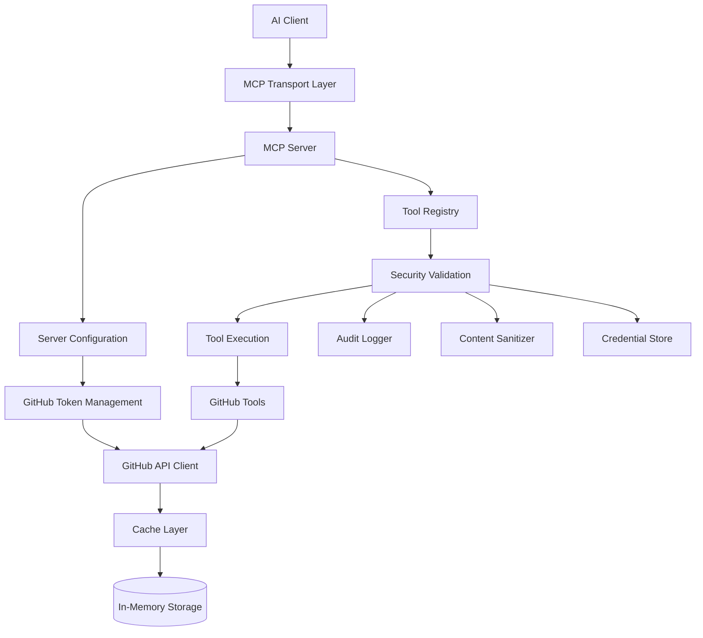
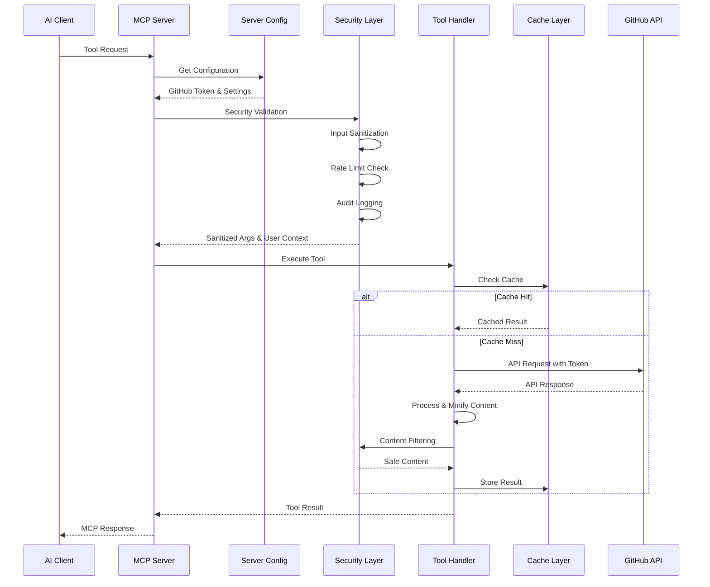
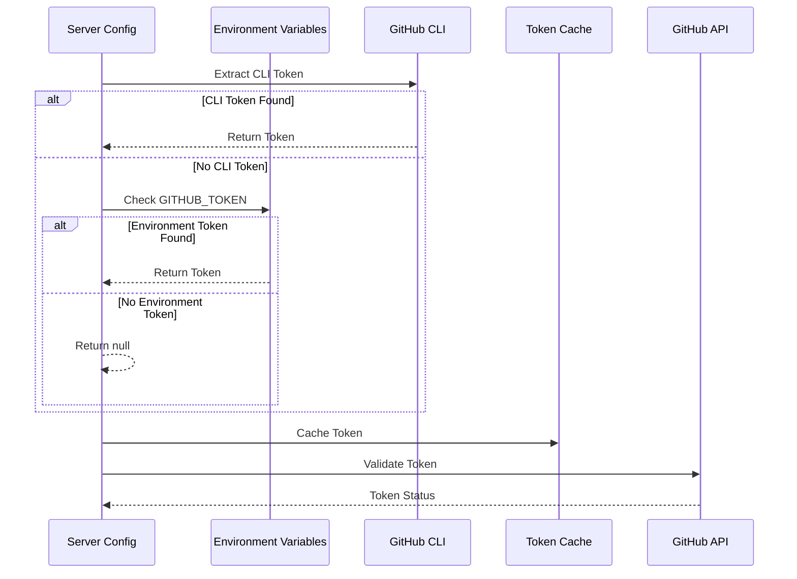

# Octocode-MCP Architecture Summary

**Octocode-MCP** is a Model Context Protocol (MCP) server that provides AI assistants with advanced GitHub repository analysis and code discovery capabilities. This document provides a comprehensive overview of the system architecture based on the actual codebase structure.

## Table of Contents

- [System Overview](#system-overview)
- [Core Architecture](#core-architecture)
- [Component Details](#component-details)
  - [Entry Points & Server](#entry-points--server)
  - [Configuration Management](#configuration-management)  
  - [GitHub API Integration](#github-api-integration)
  - [MCP Tools](#mcp-tools)
  - [Schema Validation](#schema-validation)
  - [Security Layer](#security-layer)
  - [Utility Services](#utility-services)
  - [MCP Protocol Integration](#mcp-protocol-integration)
- [Data Flow](#data-flow)
- [Security Architecture](#security-architecture)
- [Performance & Scalability](#performance--scalability)
- [Tool Ecosystem](#tool-ecosystem)

## System Overview

Octocode-MCP is built on five core engineering pillars:

1. **🔒 Security First**: Input validation, secret detection, content sanitization
2. **⚡ High Performance**: Intelligent caching, smart minification, parallel operations
3. **🛡️ Reliability**: Multi-layer error handling, smart fallbacks, graceful degradation
4. **✨ Code Quality**: TypeScript + Zod validation, comprehensive testing, coding standards
5. **🔧 Maintainability**: Modular design, clean abstractions, consistent patterns

## Core Architecture



## Component Details

### Entry Points & Server

The system supports two deployment modes:

1. **Standalone MCP Server**: Standard MCP protocol over stdio
2. **HTTP Server**: Express.js server with HTTP endpoints (Beta)

**Key Features**:
- Graceful shutdown handling with cleanup timeout
- Tool registration and capability management  
- Beta feature toggling (sampling)
- Cache cleanup on shutdown

**HTTP Server Features**:
- Express.js HTTP endpoints for MCP over HTTP
- CORS support for cross-origin requests
- JSON-RPC 2.0 over HTTP transport
- Same tool registration as stdio mode

### Configuration Management

**ServerConfig Interface**:
```typescript
export interface ServerConfig {
  version: string;
  toolsToRun?: string[];
  enableTools?: string[];
  disableTools?: string[];
  enableLogging: boolean;
  betaEnabled: boolean;
  timeout: number;
  maxRetries: number;
}
```

**Key Functions**:
- **Environment Variable Resolution**: GitHub token from `GITHUB_TOKEN` or `GH_TOKEN`
- **Feature Toggles**: Beta and sampling feature control
- **Tool Configuration**: Enable/disable specific tools
- **Timeout Management**: API request timeout configuration

**Configuration Sources**:
```
GitHub CLI Token → Environment Variables → Cached Token → Server Config
```

### GitHub API Integration

Comprehensive GitHub API abstraction layer:

#### Core Client
- **Octokit Integration**: Official GitHub SDK with throttling plugin
- **Authentication**: Unified token resolution via serverConfig
- **Rate Limiting**: Built-in GitHub API rate limit handling  
- **Connection Management**: Cached Octokit instances with token rotation

#### Specialized Search Modules
- **Code Search**: Optimized search result processing with content minification
- **Repository Search**: Repository discovery with quality filtering
- **Pull Request Search**: PR analysis with file changes support

#### File Operations
- **Content Fetching**: File content retrieval with partial access via line ranges
- **Repository Structure**: Directory tree exploration with smart filtering
- **Binary Detection**: Safe handling of binary files
- **Content Processing**: Integration with minification and sanitization

#### Query Builders
- **Search Query Construction**: GitHub search syntax generation
- **Quality Boosting**: Automated filters for better results (stars, activity, etc.)
- **Language Mapping**: Common language identifiers to GitHub API values
- **Parameter Validation**: Input sanitization and transformation

#### User Info & Rate Limits
- **Authentication Status**: User information and token validation
- **Rate Limit Monitoring**: Real-time rate limit status checking
- **API Throttling**: Intelligent request pacing
- **Context Management**: User session and organization tracking

#### Error Handling
- **Comprehensive Error Mapping**: GitHub API error categorization
- **Recovery Suggestions**: Actionable hints for common issues
- **Scope Analysis**: OAuth scope validation and recommendations
- **File Access Hints**: Context-aware suggestions for file/branch issues

### MCP Tools

The tool system follows a modular architecture with comprehensive GitHub capabilities:

#### Core GitHub Tools
1. **GitHub Code Search**
   - GitHub search API with bulk queries for comprehensive technique discovery
   - Simple queryTerms approach: Use up to 3 focused terms per query for best results
   - Progressive refinement workflows with separate queries for different aspects
   - Quality boosting and relevance optimization based on content and path

2. **GitHub File Content**
   - Fetching types: fullContent, specific line range (startLine+endLine), pattern-based extraction (matchString+matchStringContextLines)
   - Bulk queries for comparative analysis across files
   - Token efficient content retrieval with smart context extraction
   - Beta: Automatic code explanation via MCP sampling

3. **GitHub Repository Search**
   - Two complementary search approaches: queryTerms AND topics
   - queryTerms for specific keyword searches, topics for GitHub topic exploration
   - Bulk queries with mandatory mixing of both approaches for comprehensive coverage
   - Preference for popular and updated repositories in results

4. **GitHub Repository Structure**
   - GitHub API structure exploration with bulk queries
   - Depth control for performance (max 2 levels)
   - File/folder filtering options with clean results
   - Start with root path, use specific paths for focused exploration

5. **GitHub Pull Request Search**
   - PR search by state/author/labels with bulk queries
   - Direct PR fetching by number (prNumber + owner/repo) - most efficient
   - Optional comments/diffs (WARNING: token expensive)
   - Filter by state/review status for targeted results

#### Tool Infrastructure

**Tool Configuration**:
- Tool registry and configuration management
- Feature toggling and tool enabling/disabling
- Tool categorization (search, content, history)

**Tool Names**:
- `githubSearchCode` - GitHub Code Search
- `githubGetFileContent` - GitHub File Content
- `githubSearchRepositories` - GitHub Repository Search
- `githubViewRepoStructure` - GitHub Repository Structure
- `githubSearchPullRequests` - GitHub Pull Request Search

**Tool Manager**:
- Dynamic tool registration
- Error handling during tool initialization
- Success/failure tracking for tool loading

**Hint Generation**:
- Context-aware guidance generation
- Research goal-based recommendations
- Error recovery suggestions with actionable steps
- Tool navigation and workflow suggestions

**Type Definitions**:
- GitHub API response types
- Tool query parameter definitions
- Bulk operation interfaces
- Enhanced result structures

### Schema Validation

Comprehensive Zod-based schema validation for all tool parameters:

#### Base Schema Framework
- **Common Patterns**: Research goals, query IDs, bulk operations
- **Extension Utilities**: Schema composition and reusability
- **Validation Helpers**: Type guards and parameter validation
- **Error Handling**: Structured validation error responses

#### Tool-Specific Schemas
- **GitHub Code Search**: Query terms, language filters, repository targeting
- **GitHub File Content**: File paths, line ranges, match strings
- **GitHub PR Search**: State filters, review status, file changes
- **GitHub Repository Search**: Topics, languages, quality filters
- **Repository Structure**: Path exploration, depth control

### Security Layer

Multi-layered security architecture with comprehensive protection:

#### Content Sanitizer
- **Secret Detection**: Extensive pattern library for API keys, tokens, credentials
- **Content Filtering**: Malicious pattern removal and prompt injection detection
- **Length Limits**: 1MB max content, 10K max line length
- **Parameter Validation**: Input sanitization with detailed warnings
- **Security Result Structure**: Comprehensive sanitization reporting

#### Security Validation Wrapper
- **Universal Tool Protection**: Applied to all tools for consistent security
- **User Context Extraction**: Enterprise mode support with organization tracking
- **Input Sanitization**: Parameter validation and cleaning
- **Audit Integration**: Comprehensive event logging


#### Audit Logger
- **Event Tracking**: Authentication, API calls, tool execution logging
- **Structured Events**: Event ID, timestamp, action, outcome tracking
- **Buffer Management**: In-memory buffering with periodic disk flush
- **Enterprise Ready**: Configurable retention and cleanup policies
- **Statistics**: Usage tracking and audit trail analysis

#### Credential Store
- **Secure Encryption**: AES-256-GCM encryption for credential storage
- **Memory-Based Storage**: Secure in-memory credential caching
- **Automatic Cleanup**: Time-based credential expiration (24 hours)
- **Token Management**: Specialized GitHub token storage and retrieval
- **Security Features**: Secure key derivation and IV generation

#### Sensitive Data Masking
- **Pattern Detection**: Comprehensive sensitive data pattern library
- **Smart Masking**: Context-aware data redaction strategies
- **High-Accuracy Patterns**: API keys, tokens, secrets, credentials
- **File Context Awareness**: Different patterns for different file types

#### Regex Patterns
- **Comprehensive Pattern Library**: 50+ patterns for various secret types
- **Accuracy Classification**: High and medium accuracy pattern matching
- **File Context Support**: Context-specific pattern matching
- **Extensible Design**: Easy addition of new pattern types

### Utility Services

Core utility services supporting the entire system:

#### Caching System
- **Multi-layer Caching**: Tool results and data caching with different TTL strategies
- **24-hour TTL**: Balances freshness with performance for GitHub data
- **1000 key limit**: Prevents unbounded memory growth with LRU-style cleanup
- **MD5 key generation**: Efficient, collision-resistant cache key creation
- **Success-only caching**: Only cache successful responses to avoid error propagation
- **Periodic cleanup**: Automatic expired entry removal with statistics tracking

**Cache Integration**:
```typescript
// Tool Result Caching
export async function withCache(
  cacheKey: string,
  operation: () => Promise<CallToolResult>,
  options?: CacheOptions
): Promise<CallToolResult>

// Data Caching
export async function withDataCache<T>(
  cacheKey: string,
  operation: () => Promise<T>,
  options?: CacheOptions
): Promise<T>
```

#### Command Execution
- **Secure Command Execution**: Whitelist-based command validation
- **Argument Escaping**: Shell injection prevention
- **Timeout Management**: Configurable command timeouts
- **Error Handling**: Structured command result parsing
- **GitHub CLI Integration**: Token extraction from GitHub CLI

#### Bulk Operations
- **Parallel Query Processing**: Concurrent execution with error isolation
- **Query ID Management**: Automatic unique ID generation for tracking
- **Error Recovery**: Graceful handling of partial failures
- **Aggregated Context**: Cross-query result analysis and insights
- **Response Optimization**: Structured bulk response formatting

#### Promise Utilities
- **Error Isolation**: Parallel execution with individual error handling
- **Concurrency Control**: Configurable parallel processing limits
- **Timeout Management**: Operation-level timeout enforcement
- **Retry Logic**: Exponential backoff with custom retry strategies
- **Batch Processing**: Efficient processing of large item collections

#### File Filtering
- **Smart Filtering**: Intelligent exclusion of build artifacts and media files
- **Context-Aware**: Different filtering rules for different scenarios
- **Performance Optimization**: Efficient filtering for large directory structures
- **Customizable Rules**: Configurable inclusion/exclusion patterns

### MCP Protocol Integration

Integration with Model Context Protocol specifications:

#### Response Handling
- **Structured Response Format**: Consistent `CallToolResult` structure across all tools
- **Error Standardization**: Unified error response format with hints and metadata
- **Data Optimization**: Content wrapping and JSON optimization for token efficiency
- **Utility Functions**: Date formatting, URL simplification, text optimization helpers

#### Sampling Integration
- **Beta Feature**: MCP sampling protocol support for code explanation
- **Request/Response Types**: Proper TypeScript interfaces for sampling operations
- **Text Analysis**: Automatic code explanation generation
- **Token Usage Tracking**: Prompt and completion token monitoring

#### Resource Management
- **MCP Resource Registration**: Resource discovery and capability advertisement
- **Resource Handlers**: Structured resource content delivery
- **Metadata Support**: Resource descriptions and type information

#### Prompt Templates
- **MCP Prompt Registration**: Prompt template discovery and management
- **Template Handlers**: Dynamic prompt generation with parameter substitution
- **Context Integration**: Tool-aware prompt generation

#### System Integration
- **System-level Prompts**: Core system behavior and instruction templates
- **Tool Guidance**: AI assistant guidance for tool usage optimization

#### Constants
- **Research Goals**: Enumeration of supported research goal types
- **Tool Names**: Centralized tool name constants for consistency
- **Configuration Values**: System-wide constant definitions

## Data Flow

### Request Processing Flow



### Token Resolution Flow



## Security Architecture

### Defense in Depth

The security architecture is built on multiple protective layers:

1. **Input Validation Layer**
   - **Zod Schema Validation**: Comprehensive parameter validation for all tools
   - **Parameter Sanitization**: Content sanitizer removes secrets and malicious patterns
   - **Length Limits**: 1MB content limit, 10K line length limits
   - **Type Safety**: TypeScript + runtime validation prevents injection attacks

2. **Authentication & Authorization Layer**
   - **Token-Based Authentication**: GitHub personal access tokens or GitHub CLI tokens
   - **User Context Tracking**: Session-based user identification and tracking
   - **Enterprise Mode**: Organization and user context for enterprise deployments

3. **Content Security Layer**
   - **Secret Detection**: 50+ patterns for API keys, tokens, credentials
   - **Content Filtering**: Malicious pattern removal and prompt injection prevention
   - **Data Masking**: Context-aware sensitive data redaction
   - **Safe Processing**: Content minification with security preservation

4. **Execution Security Layer**
   - **API Request Validation**: Secure GitHub API request handling
   - **Argument Escaping**: Shell injection prevention for CLI commands
   - **Timeout Management**: Prevents resource exhaustion attacks
   - **Credential Isolation**: Secure in-memory credential storage with encryption

5. **Audit & Monitoring Layer**
   - **Comprehensive Logging**: All authentication, API calls, and tool executions
   - **Event Tracking**: Structured audit events with timestamps and outcomes
   - **Usage Statistics**: Rate limit tracking and system usage monitoring
   - **Security Incident Detection**: Automatic detection of suspicious patterns

### Security Features

- **Secure Credential Storage**: AES-256-GCM encryption for token storage
- **Content Sanitization**: Real-time secret detection and removal
- **Audit Trail**: Complete event logging for compliance and debugging
- **Error Isolation**: Security failures don't compromise other operations
- **Memory Safety**: Automatic cleanup of sensitive data and expired credentials

## Performance & Scalability

### Optimization Strategies

1. **Intelligent Caching**
   - **Multi-TTL Strategy**: Different cache lifespans for different data types
   - **24-hour GitHub Data**: Balances API freshness with performance
   - **Success-Only Caching**: Prevents error propagation through cache
   - **Memory Management**: 1000-key limit with automatic cleanup
   - **Cache Statistics**: Hit/miss tracking for optimization

2. **Bulk Operations & Parallelization** 
   - **Multi-Query Support**: Up to 5-10 queries per tool call
   - **Parallel Execution**: Concurrent processing with error isolation
   - **Reduced API Round-trips**: Batch operations minimize latency
   - **Promise Utilities**: Advanced concurrency control and error handling
   - **Query Deduplication**: Intelligent duplicate detection and optimization

3. **Content Optimization**
   - **Multi-Strategy Minification**: File-type-aware compression (via `octocode-utils`)
   - **Partial File Access**: Line range support reduces transfer sizes
   - **Token-Efficient Responses**: Optimized JSON structures for AI consumption
   - **Binary Detection**: Prevents processing of non-text files
   - **Content Streaming**: Efficient handling of large responses

4. **Rate Limit Management**
   - **Built-in Throttling**: Octokit plugin handles GitHub API rate limits
   - **Proactive Monitoring**: Real-time rate limit status checking  
   - **Intelligent Backoff**: Exponential retry strategies
   - **Multi-tier Limits**: Different limits for different operation types

5. **Memory & Resource Management**
   - **Garbage Collection**: Automatic cleanup of expired cache entries
   - **Credential Cleanup**: 24-hour automatic credential expiration
   - **Connection Pooling**: Efficient Octokit instance management
   - **Timeout Controls**: Prevents resource exhaustion from long operations

### Scalability Considerations

- **Stateless Architecture**: No server-side session persistence
- **Horizontal Scaling**: Multiple MCP server instances supported
- **Resource Boundaries**: Configurable memory and processing limits  
- **Graceful Degradation**: Partial failure handling with continued operation
- **Auto-Cleanup**: Automatic resource management and memory reclamation
- **Load Distribution**: Client-side load balancing support

## Tool Ecosystem

### Tool Categories

The system provides 5 comprehensive tools organized by functionality:

#### Default Tools (Enabled by Default)
1. **Repository Discovery Tools**
   - **GitHub Repository Search**: Topic-based discovery, quality filtering, language targeting
   - **GitHub Repository Structure**: Directory exploration, file organization analysis

2. **Code Analysis Tools**  
   - **GitHub Code Search**: Semantic and technical code pattern discovery
   - **GitHub File Content**: Content examination with line ranges and context matching

#### Optional Tools (Disabled by Default)
3. **History Analysis Tools**
   - **GitHub Pull Request Search**: PR workflow analysis, review status, file changes

### Research Methodology

The system implements a **progressive refinement** approach optimized for AI assistants:

1. **Discovery Phase**: 
   - Broad repository/code searches with quality filters
   - Topic and language-based exploration
   - Repository structure and organization analysis

2. **Analysis Phase**: 
   - Deep-dive into specific repositories and files
   - Commit history and change analysis
   - Pull request and collaboration pattern review

3. **Synthesis Phase**: 
   - Cross-tool result correlation
   - Context-aware hint generation
   - Research goal-based recommendations

### Tool Relationships & Workflows

Tools are designed for **strategic integration** with intelligent chaining:

```
Repository Search → Repository Structure
      ↓                    ↓
Code Search ←→ File Content ←→ PR Search
      ↓                 ↓                    ↓
   Research Synthesis & Hint Generation
```

**Common Workflows**:
- **Architecture Exploration**: Repository Search → Structure → File Content → Code Search
- **Change Analysis**: PR Search → File Content (with diff context)
- **Implementation Discovery**: Code Search → File Content → Repository Structure
- **Code Pattern Analysis**: Repository Search → Code Search → File Content

### Intelligent Hint System

**Context-Aware Guidance**:
- **Error Recovery**: Actionable suggestions based on error type analysis
- **Research Flow**: Next-step recommendations based on current results
- **Tool Navigation**: Strategic tool chaining suggestions
- **Quality Improvement**: Search refinement and optimization tips
- **Workflow Optimization**: Research goal-based tool selection guidance

**Hint Categories**:
- **Recovery Hints**: Authentication, rate limits, access issues
- **Navigation Hints**: Tool relationships and next steps
- **Optimization Hints**: Query refinement and search improvement
- **Research Hints**: Goal-specific methodology recommendations

---

## Summary

Octocode-MCP represents a comprehensive, production-ready MCP server that bridges AI assistants with GitHub's vast code ecosystem. Built with a focus on security, performance, and intelligent research workflows, it provides a robust foundation for AI-powered development tools.

### Key Strengths

**🏗️ Clean Architecture**: 
- Modular design with clear separation between GitHub API, security, and tools
- Comprehensive schema validation and type safety throughout
- Extensible tool system with consistent patterns and interfaces

**🔒 Security Excellence**:
- Multi-layered security with content sanitization, rate limiting, and audit logging
- Secure credential management with AES-256-GCM encryption
- Real-time secret detection with 50+ pattern types

**⚡ Performance Optimization**:
- Intelligent caching with multi-TTL strategies and automatic cleanup  
- Bulk operations with parallel processing and error isolation
- Content minification and token-efficient response formats

**🤖 AI-Optimized Design**:
- Progressive refinement methodology for systematic code research
- Context-aware hint generation for improved AI assistant guidance
- Research goal-based tool orchestration and workflow optimization

**🛠️ Enterprise Ready**:
- GitHub token authentication with multiple fallback sources
- Comprehensive audit logging and usage tracking  
- Rate limiting and resource management for production deployments
- Both stdio and HTTP deployment modes

The system's strength lies in its **research-driven approach**: combining intelligent tool chaining, bulk operations, and context-aware guidance to deliver a superior code analysis experience for AI-powered development workflows. Its modular architecture ensures maintainability while its security-first design provides confidence for enterprise deployments.
