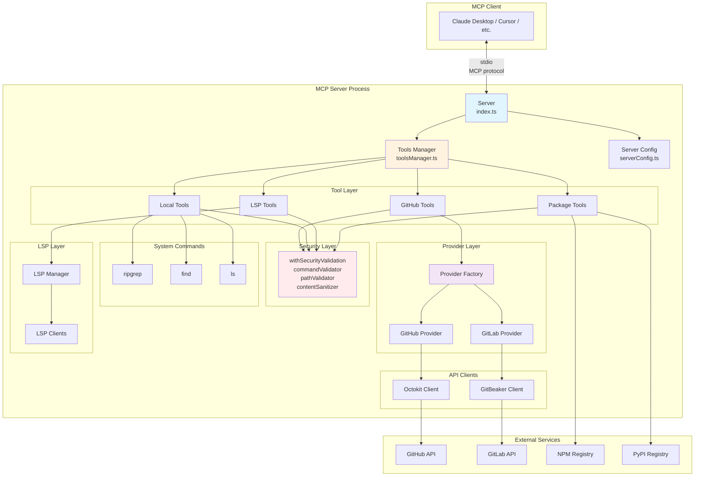
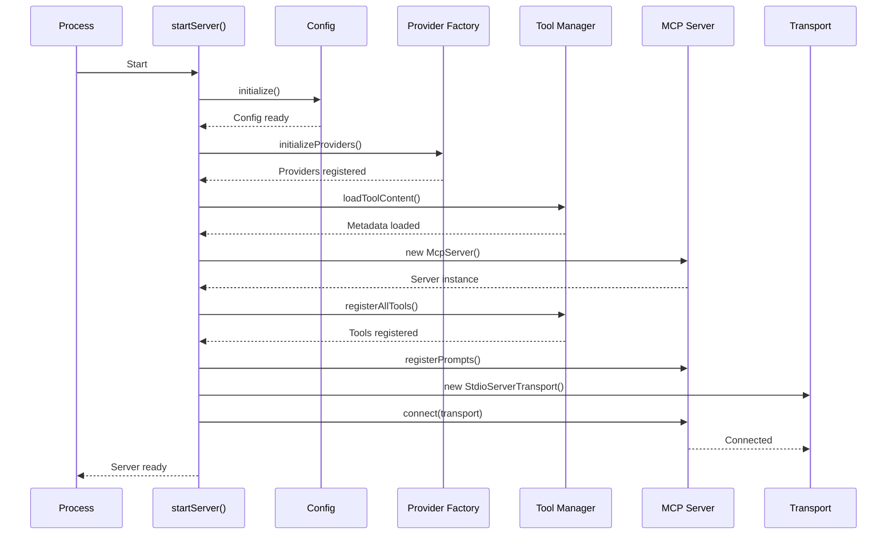
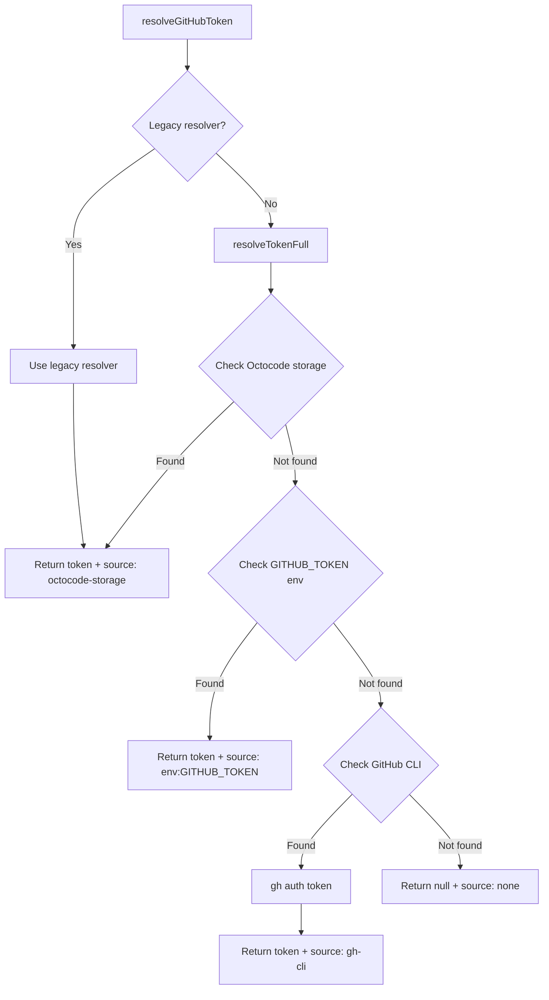
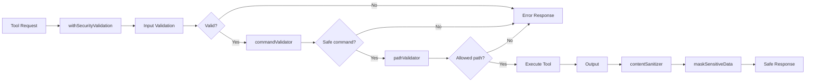
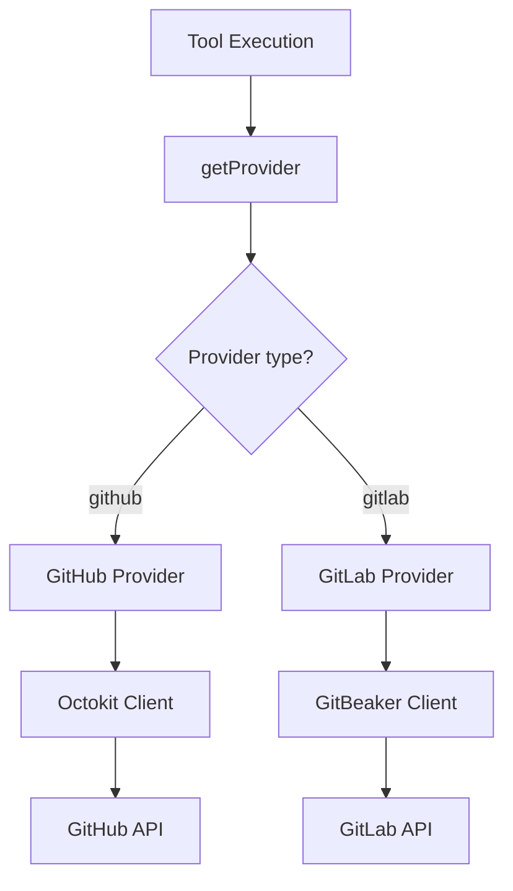
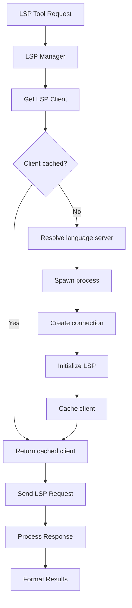
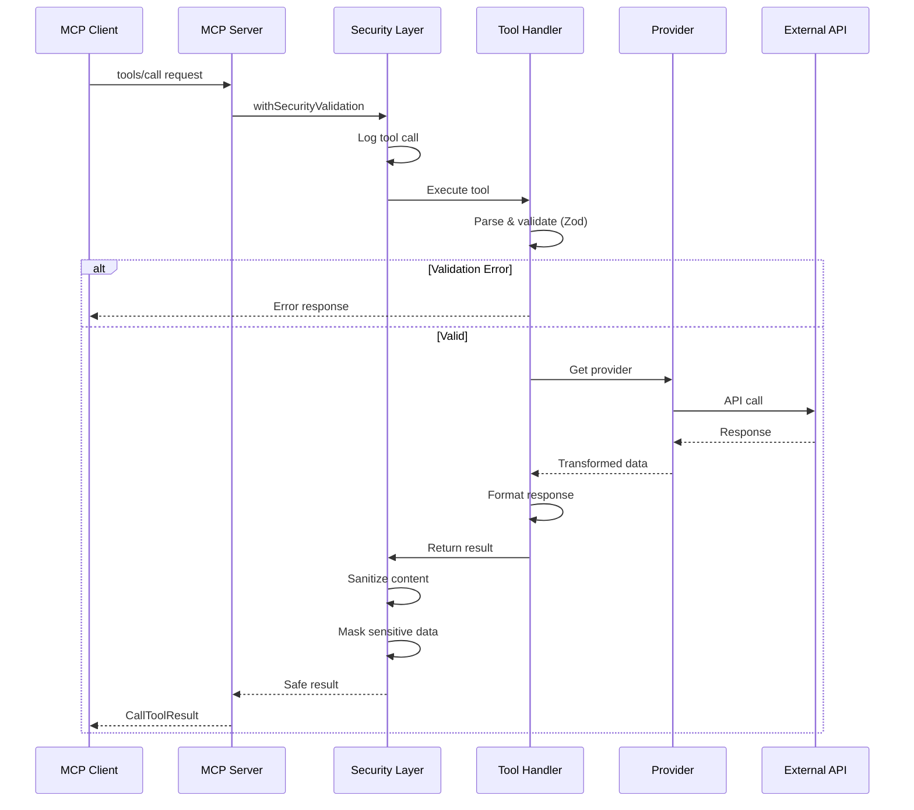
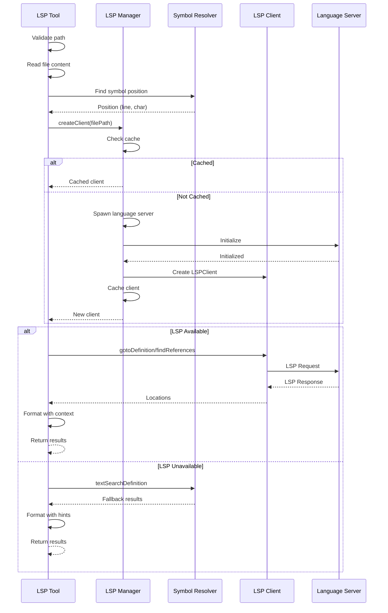
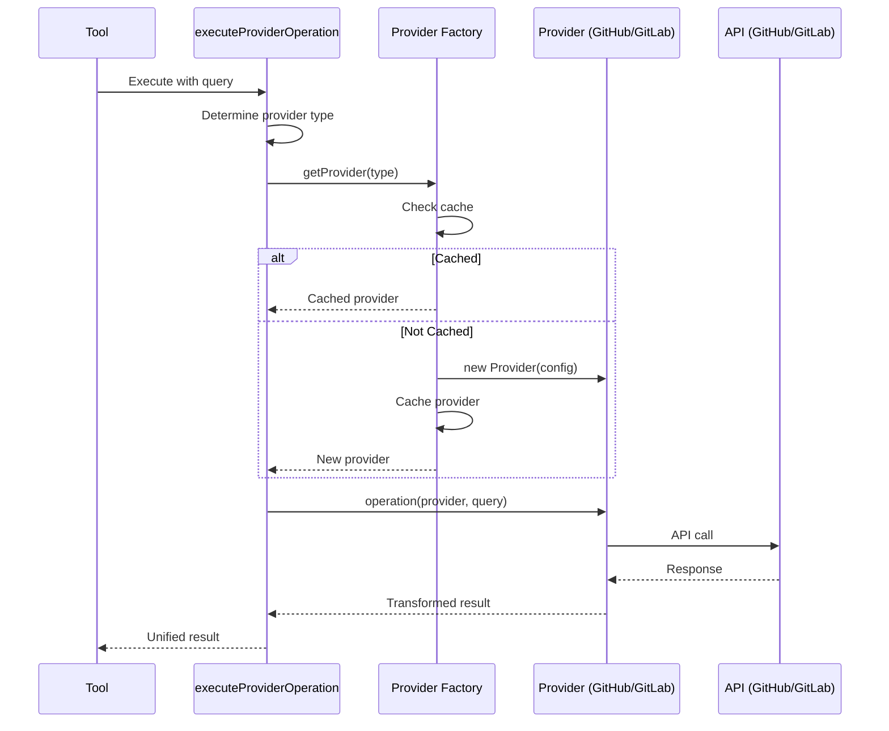

# Architecture

## Overview

Octocode MCP follows a **layered architecture** with clear separation of concerns. The system is designed around the Model Context Protocol (MCP) server pattern, with specialized layers for security, providers, tools, and utilities.

```
┌─────────────────────────────────────────────────────────────┐
│                      MCP Client Layer                        │
│            (Claude Desktop, Cursor IDE, etc.)                │
└─────────────────────────────┬───────────────────────────────┘
                              │ stdio transport (MCP protocol)
┌─────────────────────────────▼───────────────────────────────┐
│                    MCP Server (index.ts)                     │
│  - Server initialization                                     │
│  - Tool registration                                         │
│  - Request routing                                           │
│  - Graceful shutdown                                         │
└─────────────────────────────┬───────────────────────────────┘
                              │
        ┌─────────────────────┼─────────────────────┐
        │                     │                     │
┌───────▼────────┐  ┌─────────▼────────┐  ┌────────▼────────┐
│  Tool Layer    │  │  Security Layer  │  │  Provider Layer │
│  - 13 MCP tools│  │  - Validation    │  │  - GitHub       │
│  - Schemas     │  │  - Sanitization  │  │  - GitLab       │
│  - Execution   │  │  - Masking       │  │  - Factory      │
└───────┬────────┘  └─────────┬────────┘  └────────┬────────┘
        │                     │                     │
        └─────────────────────┼─────────────────────┘
                              │
        ┌─────────────────────┼─────────────────────────────┐
        │                     │                             │
┌───────▼───────┐  ┌──────────▼────────┐  ┌────────────────▼────┐
│  GitHub API   │  │   GitLab API      │  │  Local File System  │
│  (Octokit)    │  │  (GitBeaker)      │  │  - ripgrep          │
│  - Code       │  │  - Code           │  │  - find             │
│  - Repos      │  │  - Projects       │  │  - ls               │
│  - PRs        │  │  - MRs            │  │  - LSP servers      │
└───────────────┘  └───────────────────┘  └─────────────────────┘
```

---

## High-Level Architecture

### Core Principles

1. **Separation of Concerns**
   - Each layer has a single, well-defined responsibility
   - Layers communicate through clean interfaces
   - No cross-layer dependencies (except through interfaces)

2. **Provider Abstraction**
   - Tools don't know about GitHub/GitLab specifics
   - Providers implement a unified interface (ICodeHostProvider)
   - Easy to add new providers (Bitbucket, Azure DevOps, etc.)

3. **Security First**
   - All inputs validated before processing
   - All outputs sanitized before returning
   - Sensitive data masked in logs and errors

4. **Type Safety**
   - Runtime validation with Zod schemas
   - Compile-time safety with TypeScript
   - Schema-driven tool definitions

5. **Performance Optimization**
   - Multi-tier caching strategy
   - Request deduplication
   - Lazy loading of providers and LSP clients

---

## Component Diagram



---

## Detailed Architecture

### 1. MCP Server Layer (Entry Point)

**File:** `src/index.ts`

**Responsibilities:**
- Create and configure McpServer instance
- Register all tools with the server
- Setup stdio transport for MCP communication
- Handle graceful shutdown
- Initialize session tracking
- Setup process signal handlers

**Key Components:**

```typescript
// Server configuration
const SERVER_CONFIG: Implementation = {
  name: `octocode-mcp_${version}`,
  title: 'Octocode MCP',
  version,
};

// Server creation
async function createServer(content: CompleteMetadata): Promise<McpServer> {
  return new McpServer(SERVER_CONFIG, {
    capabilities: {
      prompts: {},   // Prompt template support
      tools: {},     // Tool execution support
      logging: {},   // Structured logging support
    },
    instructions: content.instructions,
  });
}

// Startup sequence
async function startServer() {
  // 1. Initialize configuration
  await initialize();

  // 2. Initialize providers (GitHub, GitLab)
  await initializeProviders();

  // 3. Load tool metadata
  const content = await loadToolContent();

  // 4. Initialize session
  const session = initializeSession();

  // 5. Create MCP server
  const server = await createServer(content);
  const logger = createLogger(server, 'server');

  // 6. Register tools and prompts
  await registerAllTools(server, content);
  registerPrompts(server, content);

  // 7. Setup shutdown handling
  const gracefulShutdown = createShutdownHandler(server, logger, state);
  setupProcessHandlers(gracefulShutdown, logger);

  // 8. Connect stdio transport
  const transport = new StdioServerTransport();
  await server.connect(transport);

  // 9. Server ready
  await logger.info('Server ready');
}
```

**Startup Flow Diagram:**



**Graceful Shutdown:**

```typescript
function createShutdownHandler(
  server: McpServer,
  logger: Logger | null,
  state: ShutdownState
) {
  return async (signal?: string) => {
    if (state.inProgress) return;
    state.inProgress = true;

    try {
      await logger?.info('Shutting down', { signal });

      // 5-second timeout for cleanup
      state.timeout = setTimeout(() => process.exit(1), 5000);

      // Log memory usage
      const memUsage = process.memoryUsage();
      await logger?.info('Memory at shutdown', {
        heapUsed: Math.round(memUsage.heapUsed / 1024 / 1024) + 'MB',
        heapTotal: Math.round(memUsage.heapTotal / 1024 / 1024) + 'MB',
        rss: Math.round(memUsage.rss / 1024 / 1024) + 'MB',
      });

      // Cleanup resources
      clearAllCache();           // Clear HTTP cache
      clearOctokitInstances();   // Close GitHub clients
      cleanup();                 // Cleanup config

      // Close server
      await server.close();

      // Clear timeout and exit cleanly
      if (state.timeout) {
        clearTimeout(state.timeout);
      }
      await logger?.info('Shutdown complete');
      process.exit(0);
    } catch {
      process.exit(1);
    }
  };
}
```

**Signal Handlers:**

```typescript
function setupProcessHandlers(
  gracefulShutdown: (signal?: string) => Promise<void>,
  logger: Logger | null
) {
  // Ctrl+C
  process.once('SIGINT', () => gracefulShutdown('SIGINT'));

  // Kill signal
  process.once('SIGTERM', () => gracefulShutdown('SIGTERM'));

  // Stdin closed (client disconnected)
  process.stdin.once('close', () => gracefulShutdown('STDIN_CLOSE'));

  // Uncaught exceptions
  process.once('uncaughtException', error => {
    logger?.error('Uncaught exception', { error: error.message });
    gracefulShutdown('UNCAUGHT_EXCEPTION');
  });

  // Unhandled promise rejections
  process.once('unhandledRejection', reason => {
    logger?.error('Unhandled rejection', { reason: String(reason) });
    gracefulShutdown('UNHANDLED_REJECTION');
  });
}
```

---

### 2. Configuration Layer

**File:** `src/serverConfig.ts`

**Responsibilities:**
- Load environment variables
- Resolve GitHub/GitLab authentication
- Configure tool enablement
- Manage allowed paths for security
- Provide configuration to other layers

**Configuration Structure:**

```typescript
interface ServerConfig {
  github: {
    token: string | null;
    tokenSource: TokenSourceType;
    apiUrl: string;
    isConfigured: boolean;
  };
  gitlab: {
    host: string;
    token: string | null;
    tokenSource: TokenSourceType;
    isConfigured: boolean;
  };
  tools: {
    toolsToRun: string[] | null;      // TOOLS_TO_RUN (exclusive)
    enableTools: string[] | null;      // ENABLE_TOOLS (additive)
    disableTools: string[] | null;     // DISABLE_TOOLS (subtractive)
  };
  local: {
    enabled: boolean;                  // ENABLE_LOCAL
  };
  network: {
    timeout: number;                   // REQUEST_TIMEOUT
    maxRetries: number;                // MAX_RETRIES
  };
  telemetry: {
    enabled: boolean;                  // !OCTOCODE_TELEMETRY_DISABLED
    logging: boolean;                  // LOG
  };
  security: {
    allowedPaths: string[];            // ALLOWED_PATHS
  };
}
```

**Token Resolution Flow:**



**Environment Variable Priority:**

1. **Tool Configuration:**
   - `TOOLS_TO_RUN` (exclusive mode) - Only these tools enabled
   - `ENABLE_TOOLS` (additive mode) - Add to default enabled tools
   - `DISABLE_TOOLS` (subtractive mode) - Remove from enabled tools
   - `ENABLE_LOCAL` / `LOCAL` - Enable/disable all local tools

2. **Authentication:**
   - Octocode storage (OAuth tokens from octocode-cli)
   - `GITHUB_TOKEN` / `GITLAB_TOKEN` environment variables
   - GitHub CLI (`gh auth login`)

3. **Network:**
   - `GITHUB_API_URL` - Custom GitHub API endpoint
   - `GITLAB_HOST` - GitLab instance URL
   - `REQUEST_TIMEOUT` - HTTP timeout (5s to 5min)
   - `MAX_RETRIES` - Retry attempts (0 to 10)

4. **Security:**
   - `ALLOWED_PATHS` - Additional allowed root paths

5. **Debugging:**
   - `OCTOCODE_DEBUG` - Enable debug logging
   - `DEBUG=octocode:*` - Alternative debug flag

**Initialization Process:**

```typescript
export async function initialize(): Promise<void> {
  if (_initialized) return;

  // Load global config from octocode-shared
  const globalConfig = await loadGlobalConfig();

  // Resolve GitHub token
  const githubToken = await resolveGitHubToken();

  // Resolve GitLab token
  const gitlabToken = getGitLabToken();

  // Parse tool configuration
  const toolsToRun = parseStringArray(process.env.TOOLS_TO_RUN);
  const enableTools = parseStringArray(process.env.ENABLE_TOOLS);
  const disableTools = parseStringArray(process.env.DISABLE_TOOLS);

  // Parse local tools flag
  const enableLocal = parseBooleanEnv(process.env.ENABLE_LOCAL) ??
                      parseBooleanEnv(process.env.LOCAL) ??
                      globalConfig.local.enabled;

  // Build config object
  _config = {
    github: {
      token: githubToken.token,
      tokenSource: githubToken.source,
      apiUrl: process.env.GITHUB_API_URL || 'https://api.github.com',
      isConfigured: githubToken.token !== null,
    },
    gitlab: {
      host: process.env.GITLAB_HOST || 'https://gitlab.com',
      token: gitlabToken,
      tokenSource: gitlabToken ? 'env:GITLAB_TOKEN' : 'none',
      isConfigured: gitlabToken !== null,
    },
    tools: {
      toolsToRun,
      enableTools,
      disableTools,
    },
    local: {
      enabled: enableLocal,
    },
    network: {
      timeout: parseTimeout(process.env.REQUEST_TIMEOUT) ?? 30000,
      maxRetries: parseMaxRetries(process.env.MAX_RETRIES) ?? 3,
    },
    telemetry: {
      enabled: !parseBooleanEnv(process.env.OCTOCODE_TELEMETRY_DISABLED),
      logging: parseLoggingEnv(process.env.LOG) ?? true,
    },
    security: {
      allowedPaths: parseAllowedPaths(process.env.ALLOWED_PATHS),
    },
  };

  _initialized = true;
}
```

---

### 3. Tool Layer

**Files:** `src/tools/`, tool-specific directories

**Responsibilities:**
- Define tool schemas (Zod)
- Implement tool execution logic
- Register tools with MCP server
- Provide tool metadata and hints

**Tool Structure:**

Each tool follows a consistent pattern:

```
src/tools/github/codeSearch/
├── scheme.ts           # Zod schemas for input validation
├── types.ts            # TypeScript types
├── execute.ts          # Tool execution logic
└── hints.ts            # Dynamic hints for tool usage
```

**Tool Registration:**

```typescript
// src/tools/toolsManager.ts
export async function registerTools(
  server: McpServer
): Promise<{ successCount: number; failedCount: number }> {
  const config = getServerConfig();
  let successCount = 0;
  let failedCount = 0;

  for (const tool of ALL_TOOLS) {
    try {
      // Check if tool is enabled
      if (!isToolEnabled(tool.name, config)) {
        continue;
      }

      // Register tool with MCP server
      server.setRequestHandler('tools/call', async (request) => {
        if (request.params.name === tool.name) {
          // Execute tool with security validation
          return await withSecurityValidation(
            tool.execute,
            tool.name
          )(request.params.arguments);
        }
      });

      successCount++;
    } catch (error) {
      failedCount++;
      console.error(`Failed to register tool ${tool.name}:`, error);
    }
  }

  return { successCount, failedCount };
}
```

**Tool Definition:**

```typescript
// src/tools/toolConfig.ts
interface ToolDefinition {
  name: string;
  description: string;
  inputSchema: AnySchema;
  execute: (args: unknown) => Promise<CallToolResult>;
  metadata: ToolMetadata;
}

export const ALL_TOOLS: ToolDefinition[] = [
  {
    name: 'githubSearchCode',
    description: 'Search code across GitHub repositories',
    inputSchema: GitHubCodeSearchBulkQuerySchema,
    execute: executeGitHubSearchCode,
    metadata: {
      category: 'github',
      requiresAuth: true,
      isLocal: false,
    },
  },
  // ... 12 more tools
];
```

**Tool Execution Pattern:**

```typescript
// Tool execution with security validation
export async function executeGitHubSearchCode(
  args: unknown
): Promise<CallToolResult> {
  // 1. Parse and validate input
  const parsed = GitHubCodeSearchBulkQuerySchema.safeParse(args);
  if (!parsed.success) {
    return {
      content: [{
        type: 'text',
        text: `Validation error: ${parsed.error.message}`,
      }],
      isError: true,
    };
  }

  // 2. Execute bulk operation (process multiple queries)
  const result = await executeBulkOperation({
    queries: parsed.data.queries,
    operation: async (query) => {
      // Get provider (GitHub or GitLab)
      const provider = await getProvider(query.provider || 'github');

      // Execute search
      const results = await provider.searchCode(query);

      // Format response
      return formatSearchResults(results);
    },
    formatResponse: (results, stats) => {
      return {
        content: [{
          type: 'text',
          text: results.join('\n\n'),
        }],
      };
    },
  });

  return result;
}
```

---

### 4. Security Layer

**Files:** `src/security/`

**Responsibilities:**
- Validate all tool inputs
- Sanitize all tool outputs
- Mask sensitive data in logs and errors
- Prevent command injection
- Restrict file system access

**Security Components:**



**withSecurityValidation (Higher-Order Function):**

```typescript
// src/security/withSecurityValidation.ts
export function withSecurityValidation<TArgs, TResult>(
  handler: (args: TArgs) => Promise<TResult>,
  toolName: string
): (args: TArgs) => Promise<TResult> {
  return async (args: TArgs): Promise<TResult> => {
    const session = getSession();

    try {
      // Log tool invocation
      await session?.logToolCall(toolName, args);

      // Execute handler
      const result = await handler(args);

      // Log success
      await session?.logToolSuccess(toolName);

      return result;
    } catch (error) {
      // Log error
      await session?.logToolError(toolName, error);

      // Mask sensitive data in error message
      const maskedError = error instanceof Error
        ? new Error(maskSensitiveData(error.message))
        : error;

      throw maskedError;
    }
  };
}
```

**Command Validation:**

```typescript
// src/security/commandValidator.ts
const ALLOWED_COMMANDS = new Set([
  'find',
  'rg',
  'ripgrep',
  'ls',
  // Language servers
  'typescript-language-server',
  'pylsp',
  'gopls',
  'rust-analyzer',
  // ... more allowed commands
]);

const BLOCKED_COMMANDS = new Set([
  'rm',
  'mv',
  'dd',
  'mkfs',
  'eval',
  'exec',
  'sudo',
  'su',
]);

export function validateCommand(command: string, args: string[]): void {
  // Check if command is allowed
  if (!ALLOWED_COMMANDS.has(command)) {
    throw new Error(`Command not allowed: ${command}`);
  }

  // Check if command is blocked
  if (BLOCKED_COMMANDS.has(command)) {
    throw new Error(`Command blocked for security: ${command}`);
  }

  // Validate arguments (no shell metacharacters)
  const dangerousPattern = /[;&|`$(){}[\]<>]/;
  for (const arg of args) {
    if (dangerousPattern.test(arg)) {
      throw new Error(`Dangerous argument detected: ${arg}`);
    }
  }
}
```

**Path Validation:**

```typescript
// src/security/pathValidator.ts
export function validateToolPath(path: string): void {
  const config = getServerConfig();
  const allowedPaths = config.security.allowedPaths;

  // Resolve to absolute path
  const absolutePath = resolvePath(path);

  // Check if path is within allowed directories
  const isAllowed = allowedPaths.some(allowed => {
    return absolutePath.startsWith(resolvePath(allowed));
  });

  if (!isAllowed) {
    throw new Error(`Path not allowed: ${path}`);
  }

  // Check for path traversal attempts
  if (path.includes('..') || path.includes('//')) {
    throw new Error(`Path traversal detected: ${path}`);
  }

  // Check for symlink attacks
  const stats = fs.lstatSync(absolutePath);
  if (stats.isSymbolicLink()) {
    const target = fs.readlinkSync(absolutePath);
    validateToolPath(target); // Recursively validate symlink target
  }
}
```

**Sensitive Data Masking:**

```typescript
// src/security/mask.ts
const PATTERNS = [
  // GitHub tokens
  /\b(ghp|gho|ghu|ghs|ghr)_[a-zA-Z0-9]{36,255}\b/g,
  // GitLab tokens
  /\bglpat-[a-zA-Z0-9_-]{20,}\b/g,
  // AWS keys
  /\b(AKIA|ASIA)[0-9A-Z]{16}\b/g,
  // API keys
  /\b[a-zA-Z0-9_-]{32,}\b/g,
  // JWT tokens
  /\beyJ[a-zA-Z0-9_-]+\.[a-zA-Z0-9_-]+\.[a-zA-Z0-9_-]+\b/g,
  // Private keys
  /-----BEGIN .+ PRIVATE KEY-----[\s\S]+?-----END .+ PRIVATE KEY-----/g,
  // Passwords in URLs
  /(:\/\/[^:]+:)([^@]+)(@)/g,
];

export function maskSensitiveData(text: string): string {
  if (!text) return text;

  let masked = text;
  for (const pattern of PATTERNS) {
    masked = masked.replace(pattern, match => {
      // Mask every other character
      return match
        .split('')
        .map((char, i) => (i % 2 === 0 ? '*' : char))
        .join('');
    });
  }

  return masked;
}
```

**Content Sanitization:**

```typescript
// src/security/contentSanitizer.ts
export function sanitizeContent(content: string): string {
  let sanitized = content;

  // Remove sensitive data patterns
  sanitized = maskSensitiveData(sanitized);

  // Remove potentially sensitive file paths
  sanitized = sanitized.replace(/\/home\/[^/]+/g, '/home/***');
  sanitized = sanitized.replace(/\/Users\/[^/]+/g, '/Users/***');

  // Remove IP addresses
  sanitized = sanitized.replace(
    /\b\d{1,3}\.\d{1,3}\.\d{1,3}\.\d{1,3}\b/g,
    '***.***.***.***'
  );

  return sanitized;
}
```

---

### 5. Provider Layer

**Files:** `src/providers/`

**Responsibilities:**
- Abstract platform differences (GitHub vs GitLab)
- Provide unified interface for code hosting operations
- Manage provider instances and caching
- Route requests to appropriate provider

**Provider Pattern:**



**ICodeHostProvider Interface:**

```typescript
// src/providers/types.ts
export interface ICodeHostProvider {
  // Platform identification
  readonly type: 'github' | 'gitlab';
  readonly baseURL: string;
  readonly tokenHash: string;

  // Code search
  searchCode(query: CodeSearchQuery): Promise<CodeSearchResult[]>;

  // File operations
  getFileContent(query: FileContentQuery): Promise<FileContentResult>;
  getRepoStructure(query: RepoStructureQuery): Promise<RepoStructureResult>;

  // Repository operations
  searchRepositories(query: RepoSearchQuery): Promise<RepoSearchResult[]>;

  // Pull/Merge requests
  searchPullRequests(query: PRSearchQuery): Promise<PRSearchResult[]>;

  // Health check
  isAuthenticated(): Promise<boolean>;
}
```

**Provider Factory:**

```typescript
// src/providers/factory.ts
const providerCache = new Map<string, ICodeHostProvider>();

export async function getProvider(
  type: 'github' | 'gitlab' = 'github',
  config?: ProviderConfig
): Promise<ICodeHostProvider> {
  // Generate cache key
  const cacheKey = `${type}:${config?.baseURL || 'default'}:${
    hashToken(config?.token || '')
  }`;

  // Check cache
  if (providerCache.has(cacheKey)) {
    return providerCache.get(cacheKey)!;
  }

  // Create provider
  let provider: ICodeHostProvider;
  if (type === 'github') {
    provider = new GitHubProvider(config || await getGitHubConfig());
  } else {
    provider = new GitLabProvider(config || await getGitLabConfig());
  }

  // Cache provider
  providerCache.set(cacheKey, provider);

  return provider;
}

export async function initializeProviders(): Promise<void> {
  // Pre-create default providers
  await getProvider('github');

  const gitlabConfig = getServerConfig().gitlab;
  if (gitlabConfig.isConfigured) {
    await getProvider('gitlab');
  }
}
```

**GitHub Provider Implementation:**

```typescript
// src/providers/github/GitHubProvider.ts
export class GitHubProvider implements ICodeHostProvider {
  readonly type = 'github' as const;
  readonly baseURL: string;
  readonly tokenHash: string;
  private client: Octokit;

  constructor(config: GitHubConfig) {
    this.baseURL = config.apiUrl;
    this.tokenHash = hashToken(config.token);
    this.client = createOctokitClient(config);
  }

  async searchCode(query: CodeSearchQuery): Promise<CodeSearchResult[]> {
    // Build GitHub search query string
    const q = buildGitHubCodeSearchQuery(query);

    // Execute search via Octokit
    const { data } = await this.client.rest.search.code({
      q,
      per_page: query.limit || 30,
      page: query.page || 1,
    });

    // Transform to unified format
    return data.items.map(item => ({
      path: item.path,
      repository: {
        owner: item.repository.owner.login,
        name: item.repository.name,
        url: item.repository.html_url,
      },
      matches: item.text_matches,
      url: item.html_url,
    }));
  }

  async getFileContent(query: FileContentQuery): Promise<FileContentResult> {
    const { data } = await this.client.rest.repos.getContent({
      owner: query.owner,
      repo: query.repo,
      path: query.path,
      ref: query.branch || 'main',
    });

    // Decode base64 content
    if ('content' in data) {
      const content = Buffer.from(data.content, 'base64').toString('utf-8');
      return {
        content,
        path: data.path,
        sha: data.sha,
        size: data.size,
      };
    }

    throw new Error('File content not available');
  }

  // ... other methods
}
```

**GitLab Provider Implementation:**

```typescript
// src/providers/gitlab/GitLabProvider.ts
export class GitLabProvider implements ICodeHostProvider {
  readonly type = 'gitlab' as const;
  readonly baseURL: string;
  readonly tokenHash: string;
  private client: Gitlab;

  constructor(config: GitLabConfig) {
    this.baseURL = config.host;
    this.tokenHash = hashToken(config.token);
    this.client = new Gitlab({
      host: config.host,
      token: config.token,
    });
  }

  async searchCode(query: CodeSearchQuery): Promise<CodeSearchResult[]> {
    // Execute GitLab search
    const results = await this.client.Search.all('global', query.keywords.join(' '), {
      scope: 'blobs',
    });

    // Transform to unified format
    return results.map(result => ({
      path: result.path,
      repository: {
        owner: result.project_id.toString(),
        name: result.project_name,
        url: result.project_web_url,
      },
      matches: [],
      url: result.web_url,
    }));
  }

  // ... other methods
}
```

**Provider Execution Flow:**

```typescript
// src/providers/execute.ts
export async function executeProviderOperation<TQuery, TResult>(
  query: TQuery & { provider?: 'github' | 'gitlab' },
  operation: (provider: ICodeHostProvider, query: TQuery) => Promise<TResult>
): Promise<TResult> {
  // Determine provider type
  const providerType = query.provider || 'github';

  // Get provider instance
  const provider = await getProvider(providerType);

  // Execute operation
  try {
    return await operation(provider, query);
  } catch (error) {
    // Transform provider-specific error to unified format
    throw transformProviderError(error, providerType);
  }
}
```

---

### 6. LSP Layer

**Files:** `src/lsp/`

**Responsibilities:**
- Manage language server processes
- Provide LSP client abstraction
- Handle symbol resolution
- Support 40+ programming languages

**LSP Architecture:**



**LSP Manager:**

```typescript
// src/lsp/manager.ts
const clientCache = new Map<string, LSPClient>();

export async function createClient(
  filePath: string
): Promise<LSPClient | null> {
  // Determine file extension
  const ext = path.extname(filePath);

  // Get language server config
  const serverConfig = getLanguageServerConfig(ext);
  if (!serverConfig) {
    return null; // No LSP for this language
  }

  // Check cache
  const cacheKey = `${ext}:${filePath}`;
  if (clientCache.has(cacheKey)) {
    return clientCache.get(cacheKey)!;
  }

  // Resolve language server path
  const serverPath = resolveLanguageServerPath(serverConfig);
  if (!serverPath) {
    return null; // Language server not installed
  }

  // Spawn language server process
  const serverProcess = spawn(serverPath, serverConfig.args, {
    stdio: ['pipe', 'pipe', 'pipe'],
  });

  // Create JSON-RPC connection
  const connection = createProtocolConnection(
    new StreamMessageReader(serverProcess.stdout),
    new StreamMessageWriter(serverProcess.stdin),
    logger
  );

  // Initialize LSP
  await connection.sendRequest(InitializeRequest.type, {
    processId: process.pid,
    rootUri: toFileUri(path.dirname(filePath)),
    capabilities: {},
  });

  // Create client wrapper
  const client = new LSPClient(connection, serverProcess, serverConfig);

  // Cache client
  clientCache.set(cacheKey, client);

  return client;
}
```

**LSP Client Wrapper:**

```typescript
// src/lsp/client.ts
export class LSPClient {
  constructor(
    private connection: ProtocolConnection,
    private process: ChildProcess,
    private config: LanguageServerCommand
  ) {}

  async gotoDefinition(
    uri: string,
    position: Position
  ): Promise<Location[]> {
    const result = await this.connection.sendRequest(
      DefinitionRequest.type,
      {
        textDocument: { uri },
        position,
      }
    );

    return Array.isArray(result) ? result : [result];
  }

  async findReferences(
    uri: string,
    position: Position,
    includeDeclaration: boolean
  ): Promise<Location[]> {
    const result = await this.connection.sendRequest(
      ReferencesRequest.type,
      {
        textDocument: { uri },
        position,
        context: { includeDeclaration },
      }
    );

    return result || [];
  }

  async callHierarchy(
    uri: string,
    position: Position,
    direction: 'incoming' | 'outgoing'
  ): Promise<CallHierarchyCall[]> {
    // Prepare call hierarchy
    const items = await this.connection.sendRequest(
      CallHierarchyPrepareRequest.type,
      {
        textDocument: { uri },
        position,
      }
    );

    if (!items || items.length === 0) {
      return [];
    }

    // Get calls
    const RequestType =
      direction === 'incoming'
        ? CallHierarchyIncomingCallsRequest.type
        : CallHierarchyOutgoingCallsRequest.type;

    const calls = await this.connection.sendRequest(RequestType, {
      item: items[0],
    });

    return calls || [];
  }

  async shutdown(): Promise<void> {
    await this.connection.sendRequest('shutdown', null);
    await this.connection.sendNotification('exit', null);
    this.process.kill();
  }
}
```

**Symbol Resolution:**

```typescript
// src/lsp/symbols.ts
export class SymbolResolver {
  constructor(private fileContent: string) {}

  findSymbolPosition(
    symbolName: string,
    lineHint: number,
    orderHint: number = 0
  ): Position | null {
    const lines = this.fileContent.split('\n');

    // Find all occurrences of symbol
    const occurrences: Position[] = [];
    for (let i = 0; i < lines.length; i++) {
      const line = lines[i];
      let index = 0;
      while ((index = line.indexOf(symbolName, index)) !== -1) {
        occurrences.push({ line: i, character: index });
        index += symbolName.length;
      }
    }

    if (occurrences.length === 0) {
      return null;
    }

    // Find closest occurrence to lineHint
    const sorted = occurrences.sort((a, b) => {
      const distA = Math.abs(a.line - lineHint);
      const distB = Math.abs(b.line - lineHint);
      return distA - distB;
    });

    // Return occurrence at orderHint (0-indexed)
    return sorted[orderHint] || sorted[0];
  }

  // Fallback text search when LSP unavailable
  textSearchDefinition(symbolName: string): Location[] {
    const lines = this.fileContent.split('\n');
    const locations: Location[] = [];

    // Search for definition patterns
    const patterns = [
      new RegExp(`(class|interface|type|function|const|let|var)\\s+${symbolName}\\b`),
      new RegExp(`${symbolName}\\s*[:=]`),
    ];

    for (let i = 0; i < lines.length; i++) {
      const line = lines[i];
      for (const pattern of patterns) {
        if (pattern.test(line)) {
          locations.push({
            uri: '',
            range: {
              start: { line: i, character: 0 },
              end: { line: i, character: line.length },
            },
          });
        }
      }
    }

    return locations;
  }
}
```

**Language Server Configuration:**

```typescript
// src/lsp/config.ts
export const LANGUAGE_SERVER_COMMANDS: Record<string, LanguageServerCommand> = {
  '.ts': {
    command: 'typescript-language-server',
    args: ['--stdio'],
    languageId: 'typescript',
    envVar: 'OCTOCODE_TS_SERVER_PATH',
  },
  '.tsx': {
    command: 'typescript-language-server',
    args: ['--stdio'],
    languageId: 'typescriptreact',
    envVar: 'OCTOCODE_TS_SERVER_PATH',
  },
  '.py': {
    command: 'pylsp',
    args: [],
    languageId: 'python',
    envVar: 'OCTOCODE_PYTHON_SERVER_PATH',
  },
  '.go': {
    command: 'gopls',
    args: ['serve'],
    languageId: 'go',
    envVar: 'OCTOCODE_GO_SERVER_PATH',
  },
  '.rs': {
    command: 'rust-analyzer',
    args: [],
    languageId: 'rust',
    envVar: 'OCTOCODE_RUST_SERVER_PATH',
  },
  // ... 35+ more languages
};

export function getLanguageServerConfig(
  ext: string
): LanguageServerCommand | null {
  // Check environment variable override
  const config = LANGUAGE_SERVER_COMMANDS[ext];
  if (!config) return null;

  if (config.envVar && process.env[config.envVar]) {
    return {
      ...config,
      command: process.env[config.envVar]!,
    };
  }

  // Check user config file
  const userConfig = loadUserLSPConfig();
  if (userConfig?.languageServers?.[ext]) {
    return userConfig.languageServers[ext];
  }

  return config;
}
```

---

### 7. Utility Layer

**Files:** `src/utils/`

**Key Utilities:**

**HTTP Cache:**
```typescript
// src/utils/http/cache.ts
- Version-prefixed cache keys
- Per-prefix custom TTLs
- Request deduplication
- Statistics tracking
```

**Command Builders:**
```typescript
// src/commands/
- BaseCommandBuilder (abstract class)
- RipgrepCommandBuilder (extends Base)
- FindCommandBuilder (extends Base)
- LsCommandBuilder (extends Base)
- GrepCommandBuilder (extends Base)
```

**Bulk Operations:**
```typescript
// src/utils/response/bulk.ts
export async function executeBulkOperation<TQuery, TResult>({
  queries,
  operation,
  formatResponse,
}: BulkOperationConfig<TQuery, TResult>): Promise<CallToolResult> {
  const results: TResult[] = [];
  const errors: string[] = [];

  // Execute all queries
  for (const query of queries) {
    try {
      const result = await operation(query);
      results.push(result);
    } catch (error) {
      errors.push(error instanceof Error ? error.message : String(error));
    }
  }

  // Format response
  return formatResponse(results, {
    totalQueries: queries.length,
    successfulQueries: results.length,
    failedQueries: errors.length,
    errors,
  });
}
```

**Minification:**
```typescript
// src/utils/minifier/
- minifyJavaScript (Terser)
- minifyCSS (CleanCSS)
- minifyHTML (html-minifier-terser)
- Auto-detection based on file extension
```

**Pagination:**
```typescript
// src/utils/pagination/
- paginate(items, page, perPage)
- paginateContent(content, charOffset, charLength)
- generatePaginationMetadata(total, page, perPage)
```

---

## Request Flow Diagrams

### Tool Execution Flow



### LSP Tool Flow



### Provider Routing Flow



---

## Data Flow

### Configuration Data Flow

```
Environment Variables → serverConfig.ts → Initialize
                                              ↓
                                     ServerConfig object
                                              ↓
        ┌─────────────────────────────────────┼─────────────────────┐
        ↓                                     ↓                     ↓
  Tool Layer                            Provider Layer        Security Layer
  - Tool enablement                     - Auth tokens         - Allowed paths
  - Local tools flag                    - API URLs            - Timeouts
```

### Request Data Flow

```
MCP Client Request
        ↓
MCP Server (stdio transport)
        ↓
Tool Router
        ↓
Security Validation
        ↓
Tool Handler
        ↓
Provider/Command Execution
        ↓
External API/System Command
        ↓
Response Transformation
        ↓
Content Sanitization
        ↓
MCP Client Response
```

---

## Caching Strategy

### Cache Layers

```
┌─────────────────────────────────────────┐
│  Layer 1: Provider Instance Cache       │
│  - Lifetime: Process lifetime           │
│  - Key: type:baseURL:tokenHash          │
│  - Purpose: Reuse API clients           │
└─────────────────────────────────────────┘
                 ↓
┌─────────────────────────────────────────┐
│  Layer 2: LSP Client Cache              │
│  - Lifetime: Process lifetime           │
│  - Key: fileExtension:filePath          │
│  - Purpose: Reuse language servers      │
└─────────────────────────────────────────┘
                 ↓
┌─────────────────────────────────────────┐
│  Layer 3: HTTP Response Cache           │
│  - Lifetime: TTL-based (15min - 24h)    │
│  - Key: version-prefix:sha256(params)   │
│  - Purpose: Reduce API calls            │
└─────────────────────────────────────────┘
```

### Cache TTL Strategy

```typescript
const CACHE_TTL_CONFIG = {
  // Frequently changing data
  'gh-api-prs': 1800,          // 30 minutes

  // Moderately changing data
  'gh-api-code': 3600,         // 1 hour
  'gh-api-file-content': 3600, // 1 hour

  // Stable data
  'gh-api-repos': 7200,        // 2 hours
  'gh-repo-structure': 7200,   // 2 hours
  'npm-search': 14400,         // 4 hours
  'pypi-search': 14400,        // 4 hours

  // Default
  'default': 86400,            // 24 hours
};
```

---

## Error Handling Strategy

### Error Flow

```
Error Occurs
    ↓
Error Caught by Handler
    ↓
Mask Sensitive Data (maskSensitiveData)
    ↓
Log Error (session logging)
    ↓
Transform to CallToolResult
    ↓
Return to Client (isError: true)
```

### Error Types

1. **Validation Errors** (4xx-like)
   - Schema validation failures
   - Invalid parameters
   - Missing required fields

2. **Authentication Errors** (401)
   - Invalid tokens
   - Expired credentials
   - Insufficient permissions

3. **Rate Limit Errors** (429)
   - GitHub: 5000/hour, Search: 30/min
   - Automatic retry after cooldown

4. **Server Errors** (5xx)
   - API failures
   - Network timeouts
   - Unexpected responses

5. **System Errors**
   - Command execution failures
   - LSP process crashes
   - File system errors

---

## Performance Optimizations

1. **Request Deduplication**
   - Pending requests tracked in Map
   - Duplicate requests wait for original
   - Reduces API load

2. **Lazy Loading**
   - Providers created on-demand
   - LSP clients spawned when needed
   - Metadata loaded asynchronously

3. **Bulk Operations**
   - Multiple queries in single tool call
   - Parallel execution where possible
   - Reduced round-trip latency

4. **Minification**
   - JavaScript/CSS/HTML compressed
   - 40-60% token reduction
   - Faster AI processing

5. **Pagination**
   - Configurable page sizes
   - Character-based pagination
   - Prevents memory overflow

---

## Conclusion

Octocode MCP's architecture is designed for:

- **Modularity** - Clear layer separation
- **Extensibility** - Easy to add providers/tools
- **Security** - Validation at every layer
- **Performance** - Multi-tier caching and optimization
- **Reliability** - Error handling and graceful degradation
- **Maintainability** - Type safety and clean abstractions

The architecture enables the system to handle diverse use cases (GitHub, GitLab, local files, LSP) through a unified MCP interface while maintaining high performance, security, and code quality.
