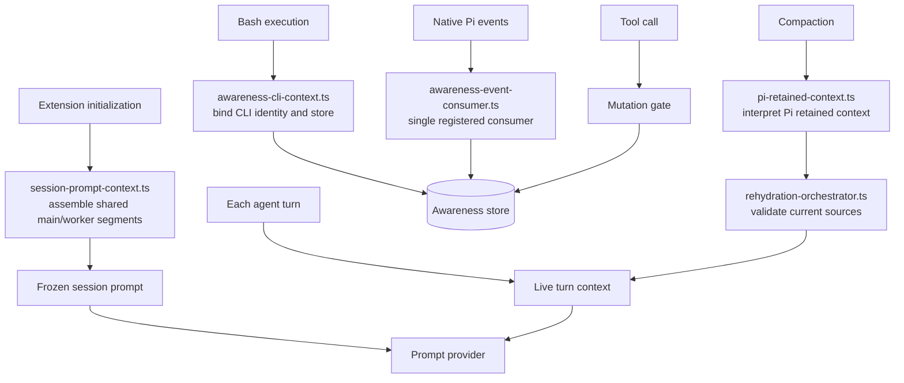

# @octocodeai/pi-extension — Architecture

This document describes the Octocode Pi Extension (`packages/octocode-pi-extension`): system prompt assembly, tool registration, skill discovery, session data layout, plan lifecycle, and the HTML/Markdown plan surface. Source contracts remain authoritative. Prompt and discovery sections checked 2026-09-05.

---

## 1. Ownership

| Area | Source contract |
|---|---|
| Main-agent policy | [`src/prompts/system-prompt.ts`](src/prompts/system-prompt.ts): concise host facts plus canonical Awareness operating instructions; the requester determines workflow and response format |
| Awareness CLI bindings | [`src/tools/awareness-cli-context.ts`](src/tools/awareness-cli-context.ts): installed runner, shared database/workspace and stable agent identity |
| Runtime physiology | [`src/adapters/pi-physiology.ts`](src/adapters/pi-physiology.ts): headless native measurements and session fences; [`src/adapters/pi-physiology-regulation.ts`](src/adapters/pi-physiology-regulation.ts): bounded projection of canonical Awareness advice |
| Context assembly and lifecycle | [`src/index.ts`](src/index.ts), [`src/tools/session-prompt-context.ts`](src/tools/session-prompt-context.ts), and [`src/tools/context-segments.ts`](src/tools/context-segments.ts) |
| Direct tool names | [`src/constants.ts`](src/constants.ts); registration in `registerSupportToolPhase` |
| MCP discovery and execution | [`src/tools/mcp-tool.ts`](src/tools/mcp-tool.ts) and [`src/tools/mcp-config.ts`](src/tools/mcp-config.ts) |
| Skill discovery | [`src/tools/skill-discovery.ts`](src/tools/skill-discovery.ts); the `skill` tool consumes that inventory from [`src/tools/skill-tool.ts`](src/tools/skill-tool.ts) |
| Worker spawning and waits | [`src/tools/unified-agent-tool.ts`](src/tools/unified-agent-tool.ts) and [`src/tools/agent-tools.ts`](src/tools/agent-tools.ts) |
| Pi retained-context evidence | [`src/adapters/pi-retained-context.ts`](src/adapters/pi-retained-context.ts) |
| Plan projection | [`src/tools/plan-read-model.ts`](src/tools/plan-read-model.ts) |

This reference does not assign quality grades or claim token savings without a measured baseline.

---

## 2. System prompt assembly

### 2.1 Composition

The extension adds a short `<octocode>` block describing host capabilities, the
user’s ownership of workflow, trust boundaries, and `/configuration`, followed by
the compact canonical `EXTERNAL_AGENT_AWARENESS_PROMPT` from Awareness, including
cooperation, communication, verification and a generated capability summary. Full
recipes and command details remain available through the skill, `guide` and schemas. It does not
inject repository-state snapshots, regex-triggered instructions, or a mandatory
engineering workflow. Tool catalogs and explicitly selected skills provide their
own capability descriptions.

Source: `src/prompts/system-prompt.ts` → `SYSTEM_PROMPT`.
Bundled artifact: `dist/system/SYSTEM_PROMPT.md`.

### 2.2 Frozen policy and live turn context

On the first main-agent or worker turn, `before_agent_start` discovers only the
capabilities allowed by that process, passes the same seven segment bodies through
`assembleSessionPromptContext`, and freezes the composed system prompt for the
session. Later turns reuse those exact bytes; they do not rediscover the skill
catalog or rebuild the system prompt. Session initialization resets the frozen prompt.

| Segment key | Content | Budget |
|---|---|---|
| `octocode-product-policy` | Bundled `SYSTEM_PROMPT.md` | 20k tokens |
| `awareness-cli-runtime` | Installed CLI runner and current host database/workspace/identity bindings | 2k tokens |
| `mcp-tool-contracts` | `<mcp_catalog_index>` (compact, default) or `<mcp_catalog>` (full, `OCTOCODE_COMPACT_MCP=0`) | 30k tokens |
| `runtime-tool-contracts` | `<runtime_capabilities>` — inline image flags | 10k tokens |
| `dynamic-tool-contracts` | Dynamic skill addendum (excludes installed skill names already in catalog) | 20k tokens |
| `available-skills` | `<available_skills>` — discovered skill list | 20k tokens |
| `session-artifact-contract` | Session memory and audit paths | 1k tokens |

Workers receive only segments supported by their active tool allowlist. Their role
prompt remains caller-owned, while MCP contracts, enabled skills, session artifacts,
and Awareness CLI bindings use the same attribution and token-budget contract as the
main session.

The active plan is a separate attributed turn-context segment, budgeted at 15k
tokens. Runtime physiology is another turn segment, limited to 128 estimated
tokens and never rehydrated as current state. It carries changed advisory actions
from fresh host receipts; unavailable sensors do not establish recovery. The
shared Zod observation contract belongs to `agent-contracts`, thresholds belong to
Awareness, and actual compaction/retry control remains with Pi. The observer uses
the same hook composer as output-budget and prompt middleware, retains only a
bounded numeric tool-outcome window, and exposes `readPiPhysiology(ctx)` to trusted
integrations. It adds no model-facing tool or shared SQLite state.

The plan hook recomputes its projection every turn and delivers it when first available,
changed, or cleared. Session memory is delivered initially and registered as a
current recovery source. Compaction recovery validates current sources; it does
not copy the frozen policy segments into the recovery ledger. During recovery,
`collectPiRetainedContentDigests` delegates branch and compaction interpretation to
Pi's public `buildSessionContext` adapter. Reprojection is skipped only for exact
content that Pi retained, including validated Octocode segment entries; full session
history is never treated as retained model context.

MCP execution can refresh independently of the frozen routing prompt. When its
catalog changes, the runtime marks context stale and announces that `/new`
exposes the updated catalog. The `skill` tool rediscovers enabled skills on each
load or list call; the initial prompt inventory stays frozen.

### 2.3 Sub-prompts

| File | Content |
|---|---|
| `src/prompts/system-prompt.ts` | `SYSTEM_PROMPT` constant (host facts plus canonical full Awareness guide) |
| `src/prompts/plan-prompt.ts` | Describes current plan state using shared goal length and truncation constants |
| `@octocodeai/agent-contracts/prompts` | Local owner: `packages/octocode-agent-contracts/src/prompts/`. Pi build selects `coordination:"worker-only"`; runtime injects the canonical Awareness guide once, preserving shared worker restrictions without parallel ledger instructions |

---

## 3. Tool registration

### 3.1 Pi builtin disposition

```ts
// src/constants.ts
DISABLED_BUILTIN_TOOL_NAMES = ['read', 'edit', 'write', 'grep', 'find', 'ls']
// Replaced by MCPTool → octocode-mcp (localGetFileContent, localSearch)

OVERRIDDEN_BUILTIN_TOOL_NAMES = ['bash']
// Octocode owns the implementation (path guard, write-target guard)
```

### 3.2 Direct Pi tools (14)

Registered in `registerSupportToolPhase` in [`src/index.ts`](src/index.ts):

| Tool | Source file | Purpose |
|---|---|---|
| `file` | `file-tool.ts` | Guarded file mutations (edit/write/delete) |
| `bash` | `bash-tool.ts` | Shell tasks (overrides Pi weak builtin) |
| `readMedia` | `read-media-tool.ts` | Inspect image/video/audio |
| `media` | `create-media-tool.ts` | Create/transform media |
| `runFfmpeg` | `run-ffmpeg-tool.ts` | Raw ffmpeg argv |
| `web` | `web-tool.ts` | Web search and fetch |
| `chromeDebug` | `chrome-debug-tool.ts` | CDP browser automation |
| `agent` | `unified-agent-tool.ts` | Spawn/manage subagents |
| `callTool` | `call-tool.ts` | Dynamic reusable tool registry |
| `skill` | `skill-tool.ts` | Load installed skills + manage dynamic skills |
| `plan` | `plan-tool.ts` | Compaction-safe task checklist |
| `localServer` | `local-server-tool.ts` | Local static server |
| `askUser` | `ask-user-tool.ts` | Interactive user input |
| `MCPTool` | `mcp-tool.ts` | MCP 2026-07-28 client → all research tools |

The 13 support tools and guarded `bash` override form the direct palette. Awareness
signals, locks, durable memory and maintenance use its installed CLI through `bash`.
Native Pi registry, event delivery/policy, mutation guards and plan UI remain active.
External CLI agents can participate through the same physical SQLite file and
normalized workspace, using distinct stable IDs. See [the agent flow](docs/AWARENESS_AGENT_FLOW.md).

### 3.3 MCP research tools (10 via MCPTool → octocode-mcp server)

These are served through `MCPTool` with `server:"octocode"`. Their schemas are
discovered through the gateway instead of registered individually in Pi's direct
tool palette. Measure the live contracts before estimating context savings.

| Tool | Field gotcha |
|---|---|
| `localSearch` | `searchText` for text search (not `query`) |
| `localGetFileContent` | Standard |
| `localAnalyzeGraph` | Standard |
| `lspGetSemantics` | `type` field for operation (not `operation`) |
| `ghSearch` | Standard |
| `ghGetFileContent` | Standard |
| `ghSearchHistory` | Standard |
| `ghGetHistoryItem` | Standard |
| `ghCloneRepo` | Standard |
| `npmSearch` | Standard |

**Protocol**: Always call `MCPTool(action:"describe", server:"octocode", tool:"<name>")` before the first call to an unfamiliar tool.

### 3.4 MCP binary resolution (`mcp-config.ts`)

```
resolveLocalOctocodeMcpBin():
  1. import.meta.resolve('octocode-mcp')  → fileURLToPath → local binary
     (requires ESM context; package.json: "type":"module" ✓)
  2. fallback: npx -y octocode-mcp@<fallback-version-range>

buildDefaultOctocodeMcpServer():
  { command: process.execPath, args: [localBin] }  ← preferred
  { command: 'npx', args: ['-y', `octocode-mcp@${OCTOCODE_MCP_FALLBACK_VERSION}`] }
```

The fallback range is owned by `OCTOCODE_MCP_FALLBACK_VERSION` in
[`src/tools/mcp-config.ts`](src/tools/mcp-config.ts); it is not `latest` or an exact version pin.

### 3.5 Discovery ownership

`@octocodeai/agent-contracts/agent-skills` owns vendor source discovery,
JSON/TOML normalization, provenance, naming collisions, and configuration-file
admission. Pi's `mcp-discovery.ts` only selects `extensionWorkspaceRoot`; its
workspace configuration paths remain under the extension namespace. Both
foreign discovery and active configuration loading reject nonregular files,
symlinks, and files larger than 1 MiB through the shared admission helper.
Foreign definitions, including `.pi/mcp.json` and `.pi/agent/mcp.json`, remain
disabled by default. `mcp-config.ts` applies SQLite enablement and project trust;
a project definition cannot enter the runtime catalog before the project is trusted.

### 3.6 Discovery timing

```
session_start
  └── warmMcpCatalog(ctx, signal)  ← fire-and-forget
  └── initializationTasks.push(mcpCatalogReady(ctx))  ← awaited in Promise.allSettled

first main-agent before_agent_start
  └── await mcpCatalogReady(ctx)  ← bounded wait for startup discovery
  └── getCachedMcpCatalogAddendum(ctx)  ← compact or full catalog text
  └── discoverSkills(cwd, latestPiSkills)  ← effective enabled inventory
  └── assembleSessionPromptContext(...)  ← freeze stable session segments

first worker before_agent_start
  └── inspect the worker's active allowlist
  └── await MCP discovery only when MCPTool is active
  └── discover skills only when skill is active
  └── assembleSessionPromptContext(...)  ← same segment ownership and budgets as main
```

### 3.7 Worker capability and cancellation boundary

Typed research, planning, architecture, and browser workers load the Octocode
extension with explicit tool allowlists. Browser workers retain `chromeDebug`; all
four profiles also receive `MCPTool`, `skill`, and `bash`, so Octocode research and
the harness-provided Awareness CLI are reachable. Custom workers default to the same
research-capable host path. An explicit `tools: []` keeps the allowlist empty, and an
explicit `resourceMode: "lean"` disables extension and skill loading for isolated
smith workers. `agent-tools.ts` serializes an explicit empty allowlist as Pi's
`--no-tools` flag and always denies the recursive `agent` tool. Worker-process
registration also omits the tool and skill smith surfaces.

`waitForAgent` owns abort listeners, silence timers, absolute timers, liveness
probes, and cleanup. `waitForAgentTurn` carries the caller's `AbortSignal` through every
progress-aware wait iteration. Tool and skill generation pass their execution signal
through this boundary and terminate the spawned smith in `finally`.

### 3.8 Session, Awareness, and recovery flow



The shell environment and native event consumer resolve the same Awareness identity
and durable store through [`awareness-cli-context.ts`](src/tools/awareness-cli-context.ts),
[`awareness-event-consumer.ts`](src/tools/awareness-event-consumer.ts), and
[`storage-policy.ts`](src/tools/storage-policy.ts). The adapter in
[`pi-retained-context.ts`](src/adapters/pi-retained-context.ts) is the sole boundary
that interprets Pi's retained branch context before
[`rehydration-orchestrator.ts`](src/tools/rehydration-orchestrator.ts) validates and
reprojects current sources.

---

## 4. Skill System

### 4.1 Bundled skills

The build places bundled skills in `dist/skills/`. See the
[README inventory](README.md#bundled-skills-15) for names. The inventory is checked
by `tests/docs-consistency.test.ts`; `tests/package.test.ts` checks bundled artifacts.

### 4.2 Discovery sources

```
discoverAllSkills(cwd, piSkills, home)  ← src/tools/skill-discovery.ts

1. piSkills concrete (path provided)    ← never overwritten; piConcrete guard
2. defaultAgentSkillSources(cwd, home)  ← shared platform roots
3. ~/.octocode/skills                   ← user scope
4. <cwd>/.octocode/skills               ← workspace scope
5. dist/skills (getAssetPaths())        ← warns if asset path resolution fails
6. piSkills SKILL.md runtime paths      ← unique roots not already in sources
```

`skill-discovery.ts` is the sole Pi-extension owner of skill source assembly,
precedence, enablement, and the effective inventory. Main prompts, worker spawn
arguments, autocomplete, discovery artifacts, configuration UI, and `skill` loading
consume this owner rather than maintaining named-skill lists or compatibility exports.

### 4.3 Skill tool schema

```ts
skill({ queries: [{
  reasoning: "...",
  type: 'load' | 'call',          // default: 'load'
  // type:load fields:
  action: 'load' | 'list',        // default: 'load'
  name: string,                   // skill name (from <available_skills>)
  reason: string,                 // why this skill matches (required for load)
  // type:call fields:
  skillType: string,              // skill workflow id
  mode: 'auto' | 'use' | 'create' | 'enhance' | 'fix' | 'list' | 'delete',
  intent: string,                 // what the workflow does
  approveCreate: boolean,
  force: boolean,
}] })
```

---

## 5. Session data layout

### 5.1 Current structure

```
$OCTOCODE_HOME/extension/
  workspaces/
    {workspaceKey}/              ← workspace-only config/state
      discovery.json
      mcp/
      lsp/
  sessions/
    {sessionKey}/                ← safe slug + workspace-bound hash
      manifest.json              ← shared version + identity/producer registry
      session.json               ← sessionId/backlogId + artifact links
      memory.md                  ← bounded agent-maintained session notes
      audit.md                   ← system-written lifecycle history
      plan/
        index.json               ← current planId + task IDs
        plan.html                ← live plan page when a plan exists
        plan.md                  ← shareable plan when a plan exists
        state.json               ← canonical session plan projection
        branches/                ← immutable plan branch snapshots
      tasks/
        index.json               ← task projections using existing step IDs
      backlog/
        index.json               ← session backlogId + unfinished task IDs
      compaction/
      logs/
      workers/
  tmp/
    plan/{scope-hash}/           ← fallback when session is not initialized
    tool-results/                ← ephemeral heavy tool output artifacts
```

Local file history belongs to the shared Awareness store, outside the session artifact tree. The native `file` boundary captures explicit targets before and after mutation. Awareness packages its private Git object implementation and exposes bounded timeline, read, preview, and apply operations through the same CLI and skill used by other hosts. Pi's `/octocode-rewind` command previews file changes and applies only the reviewed preview; session input and conversation navigation do not create or restore file history.

### 5.2 Identity and authority

`sessionKey` remains the filesystem-safe directory name. A real Pi `sessionId` is stored
inside `manifest.json` and `session.json`; session-file/process fallbacks use an opaque,
deterministic `pi-session-*` ID so private paths are never copied. IDs are not path segments.
`planId` and `taskId` reuse the active plan's stable IDs. `backlogId` is deterministic for
the session and identifies the local backlog projection; it is not a new Awareness table.

The manifest and four JSON index files share `SESSION_ARTIFACT_VERSION = 2`; earlier
versions fail fast and are never upgraded or mixed. These files are inspectable snapshots.
Active plan state and Awareness SQLite remain authoritative for plan/task coordination,
locks, messages, and durable memory.

### 5.3 Path builder API

| Function | File | Returns |
|---|---|---|
| `extensionHome(octocodeHome?)` | `extension-paths.ts` | `$OCTOCODE_HOME/extension` |
| `extensionWorkspaceRoot(cwd, home?)` | `extension-paths.ts` | `...extension/workspaces/{workspaceKey}` |
| `sessionArtifactRoot(input)` | `session-artifacts.ts` | `...extension/sessions/{sessionKey}` |
| `initializeSessionIndexes(ctx)` | `session-index.ts` | Required session/plan/task/backlog index projections |
| `projectSessionPlan(ctx, model)` | `session-index.ts` | Coherent plan/task/backlog ID snapshots |
| `planArtifactsDir(scope)` | `plan-html.ts` | `...sessions/{sessionKey}/plan/` |
| `createSessionArtifactContext(input)` | `session-artifacts.ts` | Contained artifact context with atomic writes and producer registration |
---

## 6. Plan lifecycle

### 6.1 Plan identity

Every plan has a stable **plan ID** (`planId`) derived from `coordination.sourcePlanKey`.
Format: `pi-plan-{uuid4}`. Generated once in `freshCoordination()` and preserved across
all mutations, compactions, and reloads. Available in `PlanReadModelV1.planId` (added 2026-09-03).

### 6.2 Plan phases

```
researching → needs_answers → draft → in_review ── Start ─→ executing → verifying → complete
                                        │                        ↓
                                        └→ abandoned          abandoned
```

`Start` is the single user decision: it binds the displayed RFC revision and begins the first runnable step in one transaction. `accepted` remains an internal/recovery phase if projection cannot finish after revision acceptance; it is not a second normal UI gate. `Request changes` returns review to `draft`.

### 6.3 Storage

Plan steps are held in memory (an in-process Map keyed by scope), snapshotted as branch-aware Pi CustomEntries, and projected to `plan/state.json` in the session artifact tree. The manifest records that projection; it is not the plan-state authority.
The scope key = `{cwd}\0id:{sessionId}` when a session ID is available.

### 6.4 Stored version

Active plan snapshots use version 4, including stable step IDs, review state,
coordination, RFC path, `cleared`, and `outcomeReason`. Both branch CustomEntries
and session plan projections reject other versions; version 3 is not restored or
migrated. See [`active-plan.ts`](src/tools/active-plan.ts).

### 6.5 HTML page data flow

```
 plan(set/propose/start/complete/add/remove)
       ↓
 active-plan.ts (in-memory state mutation)
       ↓
 syncCurrentPlanHtmlIfEnabled(ctx, scope)     ← called after every mutation
       ↓
 writeCurrentPlanArtifacts(ctx, scope, opts)
       ↓
 getCurrentPlanReadModel(ctx, scope)          ← loads PlanReadModelV1 (now has planId)
       ↓
 writeProjectedPlanArtifacts(scope, model)   ← builds HTML + Markdown + writes to session dir
       ↓
 renderOctocodePage(title, bodyHtml)          ← title: "Octocode plan · {shortId}"
       ↓
 artifactCtx.writeText('plan/plan.html')     ← session artifact dir
 artifactCtx.writeText('plan/plan.md')
       ↓
 meta-refresh (every 3s)                     ← browser picks up changes
```

### 6.6 HTML page structure

[`src/tools/plan-html.ts`](src/tools/plan-html.ts) renders the canonical read
model as a flat, left-aligned document. During review, the decision controls
precede the task list. During execution, tasks precede feedback. Planning
workflow, dependency diagram, and raw Markdown remain collapsible so the next
action stays visible. Each task retains its ID and expandable verification,
acceptance, and path details.

### 6.7 Presentation ownership

The plan renderer and [`src/tui/html-page.ts`](src/tui/html-page.ts) own
markup and styling. Keep presentation changes there instead of copying HTML or
color values into this reference. See [docs/UI.md](docs/UI.md) for the interaction
flow and `tests/plan-html.test.ts` for rendering checks.

---

## 7. Discovery phase detail

### 7.1 Session initialization sequence

```
pi: extension loaded
  ↓
  → register support tools and lifecycle hooks

session_start
  → initializeOctocodeSession(ctx, reason)
  → reset prompt, skill inventory, and plan-delivery state
  → dispose the previous runtime
  → await environment propagation before starting config/process consumers
  → initialize session artifacts and recovery sources
  → warmMcpCatalog(ctx, runtime.signal)
  → Promise.allSettled(initializationTasks)

first main-agent before_agent_start
  → await mcpCatalogReady(ctx)               (bounded wait)
  → discoverSkills(cwd, piSkills)
  → assembleSessionPromptContext(...)       (stable session segments)
  → cache composed systemPrompt and return it from the hook

later main-agent before_agent_start
  → recompute live plan; validate pending recovery
  → return frozen systemPrompt plus changed turn context

first worker before_agent_start
  → inspect active worker tools
  → discover only reachable MCP and skill capabilities
  → assembleSessionPromptContext(...) and freeze the worker prompt
```

### 7.2 Config loading

All config/env flows through `@octocodeai/config`:

| Function | Source |
|---|---|
| `getOctocodeHome()` | `OCTOCODE_HOME` env → platform default |
| `propagateOctocodeEnv({ cwd, trusted, env })` | global + project `.env` → `process.env` |
| `loadOctocoderc(home?)` | `.octocoderc` config file |
| `PROTECTED_KEYS` | Keys never propagated |

Never reimplement — import from `@octocodeai/config`.

---

## 8. Known gaps

| Gap | Severity | Workaround / Fix |
|---|---|---|
| Frozen routing catalogs can differ from live execution discovery | Operational constraint | Use `skill` list for enabled skill changes; start `/new` for an updated MCP routing prompt |
| Skill loading returns a bounded first page and supporting-file preview | Recovery contract | `src/tools/skill-tool.ts` reports typed partial reasons and executable `MCPTool` continuations. Follow content pages before acting; merge file discovery results with the preview and follow their continuations. |
| Schema field name surprises (`searchText`, `type` for lsp) | Medium | `MCPTool action:"describe"` exposes the current schema before execution |
| Plan HTML uses meta-refresh (3s) | Transport constraint | Refresh behavior is separate from the plan state and review transaction |
