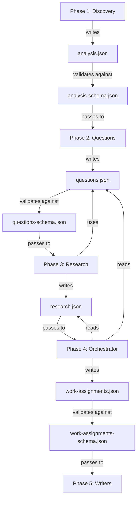

# Documentation Writer Schemas

This document describes the JSON schema structures used in the documentation generation pipeline. These schemas define the data contracts between pipeline phases and ensure type safety and validation throughout the process.

## Overview

The documentation writer pipeline uses three primary JSON schemas to pass data between phases:

1. **analysis.json** - Phase 1 output containing repository discovery and analysis
2. **questions.json** - Phase 2 output containing generated documentation questions
3. **work-assignments.json** - Phase 4 output containing file ownership assignments

All schemas follow JSON Schema Draft 07 specification and include comprehensive validation rules.

---

## 1. analysis.json Schema

**Purpose**: Output from Phase 1 (Discovery+Analysis) containing comprehensive repository analysis.

**Location**: `octocode-documentaion-writer/schemas/analysis-schema.json`

**Schema ID**: `https://octocode-documentaion-writer.v3/analysis.json`

### Required Top-Level Properties

```typescript
{
  metadata: object;      // Pipeline metadata
  discovery: object;     // Repository discovery findings
  architecture: object;  // Architecture analysis
  flows: object;        // Execution flows
  apis: object;         // API documentation
}
```

### 1.1 metadata

**Required fields:**
- `version`: String constant "3.0"
- `generated_at`: ISO 8601 timestamp (date-time format)
- `repository_path`: String path to analyzed repository

**Optional fields:**
- `agent`: Agent name that generated the analysis

**Example:**
```json
{
  "version": "3.0",
  "generated_at": "2026-01-23T00:00:00.000Z",
  "repository_path": "/Users/guybary/Documents/octocode-mcp/skills",
  "agent": "discovery-analysis"
}
```

**Reference**: `octocode-documentaion-writer/schemas/analysis-schema.json:14-35`

### 1.2 discovery

**Required fields:**
- `primary_language`: String (e.g., "typescript", "python", "go", "rust", "java")
- `is_monorepo`: Boolean indicating monorepo structure
- `project_type`: String describing project type
- `components`: Array of component objects

**Component structure:**
```typescript
{
  path: string;        // Component directory path
  name: string;        // Component name
  type: string;        // Component type (service, library, cli, etc.)
  file_count: number;  // Number of source files
}
```

**Example:**
```json
{
  "primary_language": "typescript",
  "is_monorepo": true,
  "project_type": "HTTP server + AI agent pipeline",
  "components": [
    {
      "path": "octocode-research/",
      "name": "octocode-research",
      "type": "service",
      "file_count": 37
    }
  ]
}
```

**Reference**: `octocode-documentaion-writer/schemas/analysis-schema.json:40-125`

### 1.3 architecture

**Required fields:**
- `layers`: Object with arrays per architectural layer
- `dependencies`: Object containing internal and external dependencies

**Dependency structure:**

**Internal dependencies:**
```typescript
{
  from: string;         // Source module
  to: string;          // Target module
  import_count?: number; // Optional import count
}
```

**External dependencies:**
```typescript
{
  name: string;        // Package name
  version?: string;    // Package version
  purpose?: string;    // Usage description
}
```

**Optional fields:**
- `tech_stack`: Object with runtime, framework, database, testing arrays

**Example:**
```json
{
  "layers": {
    "presentation": ["src/routes/"],
    "business": ["src/utils/"],
    "data": ["src/middleware/"]
  },
  "dependencies": {
    "internal": [
      {
        "from": "src/routes/tools.ts",
        "to": "src/utils/resilience.ts",
        "import_count": 3
      }
    ],
    "external": [
      {
        "name": "express",
        "version": "^4.21.2",
        "purpose": "HTTP server framework"
      }
    ]
  }
}
```

**Reference**: `octocode-documentaion-writer/schemas/analysis-schema.json:126-205`

### 1.4 flows

**Required fields:**
- `strategy`: String describing flow discovery strategy
- `flows`: Array of flow objects

**Flow structure:**
```typescript
{
  id: string;           // Unique flow identifier
  name: string;         // Flow name
  type?: string;        // Flow type
  entry_point: {        // Flow entry point
    file: string;       // Entry file path
    line?: number;      // Line number
    function?: string;  // Function name
  };
  steps: Array<{        // Flow execution steps
    step: number;       // Step number
    file: string;       // Step file
    line?: number;      // Line number
    function?: string;  // Function name
    action?: string;    // Action description
    calls?: string[];   // Called functions
  }>;
  diagram?: string;     // Optional Mermaid diagram
}
```

**Example:**
```json
{
  "strategy": "trace-from-entry-points",
  "flows": [
    {
      "id": "tool-execution-flow",
      "name": "Tool Execution Flow",
      "type": "request-response",
      "entry_point": {
        "file": "src/routes/tools.ts",
        "line": 42,
        "function": "createRouteHandler"
      },
      "steps": [
        {
          "step": 1,
          "file": "src/routes/tools.ts",
          "line": 45,
          "function": "parseAndValidate",
          "action": "Validate request body",
          "calls": ["schema.safeParse"]
        }
      ]
    }
  ]
}
```

**Reference**: `octocode-documentaion-writer/schemas/analysis-schema.json:206-307`

### 1.5 apis

**Required fields:**
- `components`: Array of component API objects

**Optional fields:**
- `total_apis`: Integer count of total APIs

**API structure:**
```typescript
{
  component: string;    // Component name
  apis: Array<{
    name: string;       // API name
    signature: string;  // Function signature
    type: "function" | "class" | "method" | "route" | "cli";
    file: string;       // Source file
    line: number;       // Line number
    description?: string; // API description
    params?: Array<{   // Parameters
      name: string;
      type: string;
      description?: string;
    }>;
    returns?: {        // Return value
      type: string;
      description?: string;
    };
    example?: string;  // Usage example
  }>;
}
```

**Example:**
```json
{
  "total_apis": 12,
  "components": [
    {
      "component": "tools",
      "apis": [
        {
          "name": "createRouteHandler",
          "signature": "createRouteHandler<T>(config: RouteConfig<T>)",
          "type": "function",
          "file": "src/utils/routeFactory.ts",
          "line": 15,
          "description": "Creates Express route handler with validation",
          "params": [
            {
              "name": "config",
              "type": "RouteConfig<T>",
              "description": "Route configuration object"
            }
          ],
          "returns": {
            "type": "RequestHandler",
            "description": "Express request handler"
          }
        }
      ]
    }
  ]
}
```

**Reference**: `octocode-documentaion-writer/schemas/analysis-schema.json:308-440`

### 1.6 Optional Sections

The schema supports extensive optional sections for comprehensive documentation:

**devops_infrastructure**: Containerization (Docker, base images), CI/CD (platform, pipeline files, stages), orchestration (Kubernetes, Helm), infrastructure (Terraform, CloudFormation)

**data_models**: ORM configuration, migrations, API schemas (GraphQL, Protobuf, OpenAPI), validation libraries

**observability**: Logging, monitoring, tracing, health endpoints, error tracking, alerting

**testing**: Test frameworks, test file counts (unit/integration/e2e), coverage tools, mocking libraries, quality tools (linter, formatter, type checking)

**patterns**: Dependency injection, design patterns (factory, repository, singleton), caching, event-driven architecture

**state_management**: State library, store files, state machines

**security**: Authentication, authorization, security middleware, input validation, encryption, secret management, compliance (GDPR, SOC2, PCI)

**contributing**: Documentation, Git workflow, commit conventions, Git hooks, code style, versioning

**errors**: Array of error objects with phase, message, severity

**Reference**: `octocode-documentaion-writer/schemas/analysis-schema.json:441-939`

---

## 2. questions.json Schema

**Purpose**: Output from Phase 2 (Engineer Questions) containing comprehensive documentation questions.

**Location**: `octocode-documentaion-writer/schemas/questions-schema.json`

**Schema ID**: `https://octocode-documentaion-writer.v3/questions.json`

### Required Top-Level Properties

```typescript
{
  metadata: object;   // Pipeline metadata
  summary: object;    // Question statistics
  questions: array;   // Question array
}
```

### 2.1 metadata

**Required fields:**
- `version`: String constant "3.0"
- `generated_at`: ISO 8601 timestamp
- `repository_path`: String path to repository

**Optional fields:**
- `agent`: String constant "engineer-questions"

**Reference**: `octocode-documentaion-writer/schemas/questions-schema.json:12-35`

### 2.2 summary

**Required fields:**
- `total_questions`: Integer count of total questions
- `by_category`: Object with question counts per category
- `by_priority`: Object with counts for each priority level

**Priority structure:**
```typescript
{
  critical: number;  // Critical priority count
  high: number;      // High priority count
  medium: number;    // Medium priority count
  low: number;       // Low priority count
}
```

**Example:**
```json
{
  "total_questions": 40,
  "by_category": {
    "overview": 2,
    "architecture": 2,
    "getting-started": 3,
    "api": 5
  },
  "by_priority": {
    "critical": 7,
    "high": 18,
    "medium": 12,
    "low": 3
  }
}
```

**Reference**: `octocode-documentaion-writer/schemas/questions-schema.json:37-78`

### 2.3 questions

Array of question objects with the following structure:

**Required fields:**
- `id`: Unique identifier (pattern: `^[a-zA-Z0-9_-]+$`)
- `question`: Question text to be answered
- `category`: Category enum (see categories below)
- `priority`: Priority enum ("critical" | "high" | "medium" | "low")
- `research_goal`: What should be discovered
- `files_to_examine`: Array of file paths or patterns
- `reason`: Why this question is important
- `documentation_target`: Target documentation file

**Optional fields:**
- `research_strategy`: Research approach guidance
  - `approach`: High-level research approach
  - `tools_to_use`: Array of tool names
  - `expected_findings`: Expected information
  - `documentation_target`: What should be documented
- `dependencies`: Array of question IDs that should be answered first
- `related_components`: Array of related component names
- `related_flows`: Array of related flow IDs

**Categories** (enum with 30+ values):
- `component-overview`, `component-responsibility`, `component-exports`, `component-internal`, `component-dependencies`
- `flow-trigger`, `flow-execution`, `flow-error-handling`, `flow-data-transformation`, `flow-complexity`
- `architecture-overview`, `architecture-patterns`, `architecture-layers`, `architecture-decisions`
- `api-documentation`, `api-usage`, `api-parameters`, `api-examples`
- `integrations`, `configuration`, `deployment`, `edge-cases`, `performance`, `security`, `testing`
- `overview`, `technical-stack`, `development-setup`, `data-models`, `monitoring`, `design-decisions`
- `feature`, `component`, `flow`

**Example:**
```json
{
  "id": "q37",
  "question": "What middleware is used in the Express server (logging, query parsing, readiness)?",
  "category": "middleware",
  "priority": "medium",
  "research_goal": "Document all middleware components and their purposes",
  "files_to_examine": [
    "octocode-research/src/middleware/logger.ts",
    "octocode-research/src/middleware/queryParser.ts",
    "octocode-research/src/middleware/readiness.ts"
  ],
  "reason": "Understanding middleware is essential for comprehending request processing pipeline",
  "documentation_target": "documentation/13-MIDDLEWARE.md",
  "research_strategy": {
    "approach": "Examine middleware directory and trace middleware chain in server.ts",
    "tools_to_use": ["localFindFiles", "localGetFileContent", "lspFindReferences"],
    "expected_findings": "List of middleware functions with purposes and execution order",
    "documentation_target": "Complete middleware reference with usage examples"
  }
}
```

**Reference**: `octocode-documentaion-writer/schemas/questions-schema.json:80-210`

---

## 3. work-assignments.json Schema

**Purpose**: Output from Phase 4 (Orchestrator) defining exclusive file ownership for parallel writers.

**Location**: `octocode-documentaion-writer/schemas/work-assignments-schema.json`

**Schema ID**: `https://octocode-documentaion-writer.v3/work-assignments.json`

### Required Top-Level Properties

```typescript
{
  metadata: object;      // Pipeline metadata
  strategy: object;      // Execution strategy
  file_groups: array;    // File grouping by target
  assignments: array;    // Agent assignments
}
```

### 3.1 metadata

**Required fields:**
- `version`: String constant "3.0"
- `generated_at`: ISO 8601 timestamp
- `repository_path`: String path to repository

**Optional fields:**
- `agent`: String constant "orchestrator"

**Reference**: `octocode-documentaion-writer/schemas/work-assignments-schema.json:8-17`

### 3.2 strategy

**Required fields:**
- `name`: Strategy enum ("sequential" | "parallel-core" | "parallel-all")
- `agent_count`: Integer 1-8 (number of parallel writers)
- `total_questions`: Integer count of questions to document

**Optional fields:**
- `reasoning`: String explaining strategy choice

**Strategy selection rules:**
- `sequential`: total_questions < 20, agent_count = 1
- `parallel-core`: total_questions < 100, agent_count = 2-4
- `parallel-all`: total_questions >= 100, agent_count = 4-8 (formula: `min(8, ceil(total_questions / 25))`)

**Example:**
```json
{
  "name": "parallel-core",
  "agent_count": 3,
  "total_questions": 40,
  "reasoning": "40 questions across 14 documentation files, distributed among 3 writers for balanced workload"
}
```

**Reference**: `octocode-documentaion-writer/schemas/work-assignments-schema.json:18-30`

### 3.3 file_groups

Array of file grouping objects showing how questions are organized by documentation target.

**Required fields:**
- `target_file`: String path to documentation file
- `question_count`: Integer count of questions for this file

**Optional fields:**
- `question_ids`: Array of question ID strings (must be validated against questions.json)

**Example:**
```json
{
  "target_file": "documentation/13-MIDDLEWARE.md",
  "question_count": 2,
  "question_ids": ["q37", "q38"]
}
```

**Reference**: `octocode-documentaion-writer/schemas/work-assignments-schema.json:31-46`

### 3.4 assignments

Array of agent assignment objects defining exclusive file ownership.

**Required fields:**
- `agent_id`: Integer >= 0 (unique agent identifier)
- `files`: Array of strings (files exclusively owned by this agent)
- `question_count`: Integer count of questions assigned
- `question_ids`: Array of strings (question IDs assigned to this agent, must be validated against questions.json)

**Critical validation rules:**
1. Each file must appear in exactly ONE agent's files array (no duplicates)
2. Each question_id must appear in exactly ONE agent's question_ids array
3. All questions from questions.json must be assigned
4. agent_count in strategy must match the number of assignment objects

**Example:**
```json
{
  "agent_id": 2,
  "files": [
    "documentation/12-DOCWRITER-SCHEMAS.md",
    "documentation/13-MIDDLEWARE.md",
    "documentation/14-INTEGRATIONS.md"
  ],
  "question_count": 7,
  "question_ids": ["q34", "q35", "q36", "q37", "q38", "q39", "q40"]
}
```

**Reference**: `octocode-documentaion-writer/schemas/work-assignments-schema.json:47-66`

### 3.5 Validation Requirements

The orchestrator must validate assignments before writing work-assignments.json:

**File uniqueness validation:**
```typescript
const all_files = assignments.flatMap(a => a.files);
const unique_files = new Set(all_files);
if (all_files.length !== unique_files.size) {
  throw new Error("Duplicate file assignments detected!");
}
```

**Question uniqueness validation:**
```typescript
const all_question_ids = assignments.flatMap(a => a.question_ids);
const unique_questions = new Set(all_question_ids);
if (all_question_ids.length !== unique_questions.size) {
  throw new Error("Duplicate question assignments detected!");
}
```

**Completeness validation:**
```typescript
// Verify all questions from questions.json are assigned
const questions_json = loadQuestionsJson();
const assigned_ids = new Set(all_question_ids);
for (const q of questions_json.questions) {
  if (!assigned_ids.has(q.id)) {
    throw new Error(`Question ${q.id} not assigned to any agent!`);
  }
}
```

This validation ensures conflict-free parallel execution by guaranteeing exclusive file ownership per writer.

---

## Schema Validation Flow

The schemas are used throughout the pipeline to ensure data integrity:



Each schema includes comprehensive validation rules to catch errors early and prevent invalid data from propagating through the pipeline.

---

## Related Documentation

- [11-DOCWRITER-PIPELINE.md](./11-DOCWRITER-PIPELINE.md) - Complete pipeline overview
- [13-MIDDLEWARE.md](./13-MIDDLEWARE.md) - Express middleware components
- [14-INTEGRATIONS.md](./14-INTEGRATIONS.md) - External integrations
