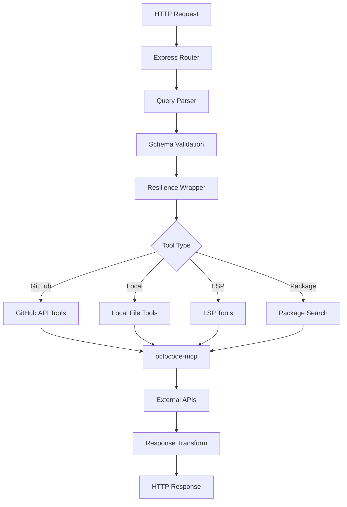

# External Integrations

This document describes how the octocode-research skill integrates with external systems, MCP tools, and third-party APIs. The integration architecture enables code research across local codebases, GitHub repositories, and package registries.

## Overview

The research skill integrates with:

1. **MCP Tools** - Core tool suite via `octocode-mcp` package
2. **GitHub API** - Code search, file content, repository exploration, pull request search
3. **NPM API** - Node.js package search and metadata
4. **PyPI API** - Python package search and metadata

All integrations use resilience patterns (circuit breaker, retry, timeout) to ensure robustness against API failures and rate limiting.

---

## 1. MCP Tool Integration

**Package**: `octocode-mcp` (workspace dependency)

**Purpose**: Provides the core tool suite for local file operations, GitHub API interactions, LSP semantic navigation, and package searches.

### 1.1 Dependency Declaration

**File**: `octocode-research/package.json:30`

```json
{
  "dependencies": {
    "express": "^4.21.2",
    "js-yaml": "^4.1.1",
    "octocode-mcp": "workspace:^",
    "octocode-shared": "workspace:^",
    "zod": "^3.24.1",
    "zod-to-json-schema": "^3.25.1"
  }
}
```

The `octocode-mcp` package is a **workspace dependency**, meaning it's part of the same monorepo and uses the latest workspace version.

### 1.2 Re-Export Architecture

**File**: `octocode-research/src/index.ts`

**Purpose**: Serves as a centralized re-export hub for all MCP tools and types.

The research skill imports all tools from `octocode-mcp/public` and re-exports them with consistent naming:

```typescript
// GitHub Tools
export {
  fetchMultipleGitHubFileContents as githubGetFileContent,
  searchMultipleGitHubCode as githubSearchCode,
  searchMultipleGitHubPullRequests as githubSearchPullRequests,
  searchMultipleGitHubRepos as githubSearchRepositories,
  exploreMultipleRepositoryStructures as githubViewRepoStructure,
} from 'octocode-mcp/public';

// Local File Tools
export {
  executeFetchContent as localGetFileContent,
  executeFindFiles as localFindFiles,
  executeRipgrepSearch as localSearchCode,
  executeViewStructure as localViewStructure,
} from 'octocode-mcp/public';

// LSP Semantic Tools
export {
  executeGotoDefinition as lspGotoDefinition,
  executeFindReferences as lspFindReferences,
  executeCallHierarchy as lspCallHierarchy,
} from 'octocode-mcp/public';

// Package Search Tools
export {
  searchPackages as packageSearch
} from 'octocode-mcp/public';
```

**Reference**: `octocode-research/src/index.ts:1-60`

### 1.3 Tool Categories

**GitHub Tools** (5 tools):
- `githubGetFileContent` - Fetch file content with line ranges and partial content
- `githubSearchCode` - Search code with text_matches extraction
- `githubSearchPullRequests` - Search PRs with metadata and optional file content
- `githubSearchRepositories` - Search repositories by stars, owner, description
- `githubViewRepoStructure` - Explore repository directory structure

**Local File Tools** (4 tools):
- `localGetFileContent` - Read file content with match strings and context
- `localFindFiles` - Find files by name, size, modification time, permissions
- `localSearchCode` - Fast ripgrep-based code search
- `localViewStructure` - View directory structure with depth control

**LSP Semantic Tools** (3 tools):
- `lspGotoDefinition` - Navigate to symbol definitions
- `lspFindReferences` - Find all references to a symbol
- `lspCallHierarchy` - Analyze incoming/outgoing call relationships

**Package Search Tools** (1 tool):
- `packageSearch` - Search NPM and PyPI registries

### 1.4 Type Re-Exports

All query and result types are re-exported for type safety:

```typescript
// GitHub Types
export type {
  FileContentQuery,
  ContentResult,
  GitHubCodeSearchQuery,
  SearchResult,
  GitHubPullRequestSearchQuery,
  PullRequestSearchResult,
  GitHubReposSearchQuery,
  RepoSearchResult,
  GitHubViewRepoStructureQuery,
  RepoStructureResult,
} from 'octocode-mcp/public';

// Local File Types
export type {
  FetchContentQuery,
  FetchContentResult,
  FindFilesQuery,
  FindFilesResult,
  RipgrepSearchQuery,
  SearchContentResult,
  ViewStructureQuery,
  ViewStructureResult,
} from 'octocode-mcp/public';

// LSP Types
export type {
  LSPGotoDefinitionQuery,
  GotoDefinitionResult,
  LSPFindReferencesQuery,
  FindReferencesResult,
  LSPCallHierarchyQuery,
  CallHierarchyResult,
} from 'octocode-mcp/public';

// Package Search Types
export type {
  PackageSearchQuery,
  PackageSearchResult,
  NpmPackageSearchQuery,
  PythonPackageSearchQuery,
} from 'octocode-mcp/public';
```

**Reference**: `octocode-research/src/index.ts:1-60`

### 1.5 Utility Re-Exports

**Response Builders:**
```typescript
export {
  createResult,
  createResponseFormat,
  createRoleBasedResult,
  ContentBuilder,
  QuickResult,
  StatusEmoji,
  StatusEmojis,
} from 'octocode-mcp/public';
```

**Tool Metadata:**
```typescript
export {
  TOOL_NAMES,
  DESCRIPTIONS,
  getToolHintsSync,
  getGenericErrorHintsSync,
} from 'octocode-mcp/public';
```

**Security Validation:**
```typescript
export {
  withBasicSecurityValidation
} from 'octocode-mcp/public';
```

**Authentication:**
```typescript
export {
  initialize,
  initializeProviders,
  getGitHubToken,
  getToken,
  getTokenSource,
} from 'octocode-mcp/public';
```

**Session Management:**
```typescript
export {
  initializeSession,
  getSessionManager,
  logSessionInit,
  logToolCall,
  logPromptCall,
  logSessionError,
  logRateLimit,
  resetSessionManager,
} from 'octocode-mcp/public';
```

**Reference**: `octocode-research/src/index.ts:61-110`

### 1.6 Integration Benefits

**Type Safety**: All tools are strongly typed with TypeScript interfaces

**Consistent Naming**: Tools use descriptive names that match their HTTP endpoints

**Centralized Updates**: Changes to `octocode-mcp` automatically propagate to the research skill

**Workspace Integration**: Uses latest workspace version without version pinning

**Full Feature Access**: All MCP capabilities available through a single import

---

## 2. GitHub API Integration

**Purpose**: Enables code exploration, repository analysis, and pull request research on GitHub.

**Location**: `octocode-research/src/routes/github.ts`

### 2.1 GitHub Tools

The research skill exposes 5 GitHub API tools through HTTP endpoints:

#### Tool 1: githubSearchCode

**Endpoint**: `GET /githubSearchCode`

**Purpose**: Search code across GitHub repositories with advanced filtering.

**Implementation:**
```typescript
githubRoutes.get(
  '/githubSearchCode',
  createRouteHandler({
    schema: githubSearchSchema,
    toParams: toQueryParams,
    toolFn: githubSearchCode,
    toolName: 'githubSearchCode',
    resilience: withGitHubResilience,
    transform: (parsed, queries) => {
      // Transform results...
    }
  })
);
```

**Features:**
- Search by keywords with match type (file content or path)
- Filter by owner, repository, extension, filename, path
- Extract text_matches with highlighted snippets
- Pagination support

**Reference**: `octocode-research/src/routes/github.ts:23-60`

#### Tool 2: githubGetFileContent

**Endpoint**: `GET /githubGetFileContent`

**Purpose**: Fetch file content from GitHub repositories.

**Implementation:**
```typescript
githubRoutes.get(
  '/githubGetFileContent',
  createRouteHandler({
    schema: githubContentSchema,
    toParams: toQueryParams,
    toolFn: githubGetFileContent,
    toolName: 'githubGetFileContent',
    resilience: withGitHubResilience,
    transform: (parsed, queries) => {
      // Transform results...
    }
  })
);
```

**Features:**
- Fetch full file content or partial ranges
- Support for line numbers (startLine/endLine)
- Match string search with context lines
- Branch/commit selection
- Character offset pagination for large files

**Reference**: `octocode-research/src/routes/github.ts:62-91`

#### Tool 3: githubSearchRepositories

**Endpoint**: `GET /githubSearchRepositories`

**Purpose**: Search GitHub repositories by various criteria.

**Features:**
- Search by keywords and topics
- Filter by owner, stars, creation date, update date
- Sort by stars, forks, updated, best-match
- Repository metadata (stars, forks, description, language)

**Reference**: `octocode-research/src/routes/github.ts:93-121`

#### Tool 4: githubViewRepoStructure

**Endpoint**: `GET /githubViewRepoStructure`

**Purpose**: Explore repository directory structure.

**Features:**
- Depth control (1-2 levels)
- Path-based navigation
- Entry pagination
- File/directory metadata (size, type, path)

**Reference**: `octocode-research/src/routes/github.ts:123-161`

#### Tool 5: githubSearchPullRequests

**Endpoint**: `GET /githubSearchPullRequests`

**Purpose**: Search pull requests with optional file content.

**Features:**
- Search by PR number, author, state (open/closed), merged status
- Filter by labels, assignee, reviewers
- Optional full content or partial file content
- Comments and commits inclusion
- Date range filtering

**Reference**: `octocode-research/src/routes/github.ts:163-200`

### 2.2 Resilience Wrapper

All GitHub routes use `withGitHubResilience` for robust API interaction:

```typescript
resilience: withGitHubResilience
```

**Features:**
- Circuit breaker to prevent cascading failures
- Retry logic with exponential backoff
- Timeout handling
- Rate limit detection and backoff

**Reference**: See `07-PATTERNS.md` for resilience pattern details

### 2.3 Response Transformation

GitHub routes transform MCP tool responses into HTTP-friendly formats:

**Example transformation:**
```typescript
transform: (parsed, queries) => {
  return {
    queries: queries.map((q, i) => ({
      query: q,
      result: parsed.results[i],
      text_matches: extractTextMatches(parsed.results[i]),
    })),
    total_count: parsed.total_count,
  };
}
```

Transformations extract relevant data, add metadata, and format for client consumption.

---

## 3. NPM API Integration

**Purpose**: Search Node.js packages in the NPM registry.

**Location**: `octocode-research/src/routes/package.ts`

### 3.1 Package Search Endpoint

**Endpoint**: `GET /packageSearch`

**Ecosystem**: `npm`

**Implementation:**
```typescript
packageRoutes.get(
  '/packageSearch',
  async (req: Request, res: Response, next: NextFunction) => {
    try {
      const queries = parseAndValidate(
        req.query as Record<string, unknown>,
        packageSearchSchema
      );

      const rawResult = await withPackageResilience(
        () => packageSearch(toQueryParams(queries)),
        'packageSearch'
      );

      const { data, isError, hints, research } = parseToolResponse(rawResult);
      const packages = extractPackages(data);
      const query = queries[0] as Record<string, unknown>;
      const registry = query.ecosystem === 'python' ? 'pypi' : 'npm';

      sendToolResult(
        res,
        ResearchResponse.packageSearch(packages, registry, safeString(query, 'name')),
        rawResult
      );
    } catch (error) {
      next(error);
    }
  }
);
```

**Reference**: `octocode-research/src/routes/package.ts:14-40`

### 3.2 NPM Result Extraction

**Function**: `extractPackages(data)`

Extracts package information from NPM API results:

```typescript
// Handle npm results
if (hasProperty(data, 'npmResults') && Array.isArray(data.npmResults)) {
  return data.npmResults.map((pkg: unknown) => {
    if (!isObject(pkg)) return { name: '' };
    return {
      name: safeString(pkg, 'name'),
      version: hasStringProperty(pkg, 'version') ? pkg.version : undefined,
      description: hasStringProperty(pkg, 'description') ? pkg.description : undefined,
      repository: extractRepositoryUrl(pkg),
    };
  });
}
```

**Extracted fields:**
- `name`: Package name
- `version`: Latest version
- `description`: Package description
- `repository`: Repository URL (extracted via `extractRepositoryUrl` helper)

**Reference**: `octocode-research/src/routes/package.ts:58-70`

### 3.3 NPM Query Format

**Query parameters:**
```typescript
{
  name: string;           // Package name to search
  ecosystem: 'npm';       // NPM ecosystem identifier
  searchLimit?: number;   // Max results (default 1)
}
```

**Example request:**
```
GET /packageSearch?name=express&ecosystem=npm&searchLimit=5
```

### 3.4 NPM Response Format

```json
{
  "success": true,
  "data": {
    "packages": [
      {
        "name": "express",
        "version": "4.21.2",
        "description": "Fast, unopinionated, minimalist web framework",
        "repository": "https://github.com/expressjs/express"
      }
    ],
    "registry": "npm",
    "query": "express"
  }
}
```

---

## 4. PyPI API Integration

**Purpose**: Search Python packages in the PyPI registry.

**Location**: `octocode-research/src/routes/package.ts` (shared with NPM)

### 4.1 PyPI Query Format

**Query parameters:**
```typescript
{
  name: string;           // Package name to search
  ecosystem: 'python';    // Python ecosystem identifier
  searchLimit?: number;   // Max results (default 1)
}
```

**Example request:**
```
GET /packageSearch?name=requests&ecosystem=python
```

### 4.2 PyPI Result Processing

The same `extractPackages` function handles PyPI results:

```typescript
const registry = query.ecosystem === 'python' ? 'pypi' : 'npm';
```

**Registry selection:**
- `ecosystem='npm'` → `registry='npm'`
- `ecosystem='python'` → `registry='pypi'`

**Reference**: `octocode-research/src/routes/package.ts:14-40`

### 4.3 PyPI Response Format

```json
{
  "success": true,
  "data": {
    "packages": [
      {
        "name": "requests",
        "version": "2.31.0",
        "description": "Python HTTP for Humans.",
        "repository": "https://github.com/psf/requests"
      }
    ],
    "registry": "pypi",
    "query": "requests"
  }
}
```

### 4.4 PyPI Limitations

**Note**: Python package search always returns 1 result due to PyPI API limitations. The `searchLimit` parameter is accepted but has no effect for `ecosystem='python'`.

---

## 5. Resilience Patterns

All external API integrations use resilience wrappers to handle failures gracefully.

### 5.1 GitHub Resilience

**Wrapper**: `withGitHubResilience`

**Configuration:**
- Circuit breaker with failure threshold
- Retry with exponential backoff
- Timeout handling
- Rate limit detection

**Applied to:**
- `/githubSearchCode`
- `/githubGetFileContent`
- `/githubSearchRepositories`
- `/githubViewRepoStructure`
- `/githubSearchPullRequests`

### 5.2 Package Search Resilience

**Wrapper**: `withPackageResilience`

**Configuration:**
- Circuit breaker for NPM/PyPI APIs
- Retry logic for transient failures
- Timeout handling

**Applied to:**
- `/packageSearch` (both NPM and PyPI)

### 5.3 Error Handling

All integrations use consistent error handling:

```typescript
try {
  const rawResult = await withGitHubResilience(
    () => toolFunction(params),
    'toolName'
  );
  // Process result...
} catch (error) {
  next(error);  // Pass to error handler middleware
}
```

The error handler middleware (`src/middleware/errorHandler.ts`) provides centralized error response formatting.

---

## 6. Authentication

### 6.1 GitHub Token

GitHub API integration requires authentication for higher rate limits.

**Token sources:**
- Environment variable: `GITHUB_TOKEN`
- GitHub CLI (`gh auth token`)
- OAuth flow (if configured)

**Token initialization:**
```typescript
import { initialize, getGitHubToken } from 'octocode-mcp/public';

await initialize();
const token = getGitHubToken();
```

**Reference**: See `octocode-mcp` package for authentication implementation

### 6.2 NPM/PyPI Authentication

NPM and PyPI searches use public APIs and do not require authentication for basic package searches.

---

## 7. Integration Architecture



**Flow:**
1. HTTP request received by Express
2. Query parser extracts and validates parameters
3. Schema validation ensures type correctness
4. Resilience wrapper applies circuit breaker and retry
5. Tool function routes to appropriate MCP tool
6. MCP tool calls external API (GitHub, NPM, PyPI, or local system)
7. Response transformed to HTTP-friendly format
8. JSON response sent to client

---

## 8. Rate Limiting

### 8.1 GitHub Rate Limits

**Unauthenticated**: 60 requests/hour

**Authenticated**: 5,000 requests/hour

**Handling:**
- Circuit breaker opens on rate limit errors
- Exponential backoff delays retries
- Rate limit headers checked and logged

### 8.2 NPM/PyPI Rate Limits

**NPM**: No strict public rate limits (best-effort)

**PyPI**: No strict public rate limits (best-effort)

**Handling:**
- Retry logic handles transient failures
- Circuit breaker prevents cascading failures

---

## 9. Integration Testing

Integration tests verify external API connectivity:

**Test file**: `octocode-research/src/__tests__/integration/routes.test.ts`

**Test coverage:**
- GitHub API endpoints
- Package search (NPM/PyPI)
- Error handling
- Response formatting

**Note**: Integration tests may be skipped in CI if API tokens are not available.

---

## Related Documentation

- [04-API-REFERENCE.md](./04-API-REFERENCE.md) - HTTP endpoint details
- [07-PATTERNS.md](./07-PATTERNS.md) - Resilience patterns (circuit breaker, retry)
- [13-MIDDLEWARE.md](./13-MIDDLEWARE.md) - Middleware components
- [12-DOCWRITER-SCHEMAS.md](./12-DOCWRITER-SCHEMAS.md) - Schema definitions
