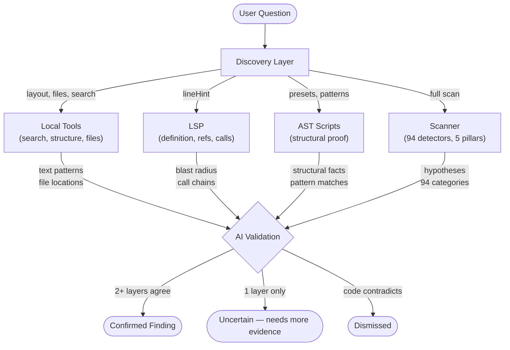

# Octocode Code Engineer

Detectors produce hypotheses. AI validates, reasons, and prioritizes. Never present raw findings as facts. Always tell user what you found with evidence, ask before acting on M/L changes.

`<SKILL_DIR>` = directory containing this SKILL.md.

## Core Principle: Multi-Angle Investigation

Every question about code MUST be investigated from multiple angles. No single tool gives a complete answer. Cross-validate using **at least 2 tool families** before presenting findings.



| Tool Family | What it proves | Unique strength |
|-------------|---------------|-----------------|
| **Local tools** (search, structure, files, content) | Where things are, what the code says | Scope, layout, text patterns, `lineHint` for LSP |
| **LSP** (definition, references, call hierarchy) | Semantic relationships between symbols | Blast radius, call chains, dead code proof |
| **AST** (search.js, tree-search.js) | Structural code patterns | Empty catches, `any` types, nested ternaries — things regex can't prove |
| **Scanner** (run.js) | Cross-cutting analysis across 5 pillars | 94 finding categories, dependency graph, per-function metrics |

**Confidence levels:**
- `confirmed` — 2+ tool families agree
- `uncertain` — partial evidence from 1 family
- `dismissed` — code contradicts the finding

### Why Cross-Validated Investigation Matters

Most regressions come from hidden context: complex control flow, high fan-in, dependency cycles, duplicated logic, and weak test coverage. Multi-angle checks prevent local optimizations from causing system-level failures.

Use one source for each claim type: Local tools for scope/text evidence, LSP for semantic blast radius, AST for structural proof, and scanner findings for codebase-wide prioritization.

## Tools

### Local Tools (Octocode MCP)

MCP check: run `localSearchCode`. If unavailable → CLI-only mode (AST scripts only), reduce confidence on semantic claims.

**`localViewStructure`** — Maps codebase shape: directories, file counts, extensions, nesting. Tells you *where to look* — large folders, test gaps, naming patterns. Use `directoriesOnly=true` for layout, `filesOnly=true` + `extension` for source spread.

**`localFindFiles`** — Finds files by size, modification time, name pattern. Surfaces god files (`sortBy=size`), recent churn (`modifiedWithin=7d`), naming anomalies. Feeds candidate lists to every other tool.

**`localSearchCode`** — Text search across the codebase. Critical output: `lineHint` — the exact line number that **every LSP tool requires**. Without this, LSP tools cannot be called. Also reveals how symbols spread across files. Use `filesOnly=true` for fast file-level discovery first.

**`localGetFileContent`** — Reads actual source code. The final verification step: after other tools identify *where* and *what*, this lets AI *read and reason about* the real code. Use `matchString` to jump to the right section in large files.

### LSP Tools (Semantic Analysis)

All LSP tools REQUIRE `lineHint` from `localSearchCode`. Never guess it.

**`lspGotoDefinition(lineHint=N)`** — Jumps from usage to definition. Answers "what is this symbol actually?" Resolves ambiguity when search returns multiple candidates.

**`lspFindReferences(lineHint=N)`** — Counts all consumers of a symbol (types, vars, exports, functions). This is **blast radius** — the most important metric for risk. 0 refs = dead code. 50 refs = plan carefully. Use `includeDeclaration=false` for clean consumer counts.

**`lspCallHierarchy(lineHint=N, direction)`** — Traces function call chains. `incoming` = who calls this? `outgoing` = what does it call? **Functions only** — do NOT use on types/vars/constants.

| Symbol type | Use this | NOT this |
|-------------|----------|----------|
| Function/method | `lspCallHierarchy` | — |
| Type/interface/class | `lspFindReferences` | `lspCallHierarchy` (will fail) |
| Variable/constant/export | `lspFindReferences` | `lspCallHierarchy` (will fail) |

### AST Scripts (Structural Proof)

Text search finds strings. AST search proves **structure**. AST matches are facts.

**`ast/search.js`** — Parses live source files. Matches structural patterns that regex cannot reliably detect.

```bash
node <SKILL_DIR>/scripts/ast/search.js --preset empty-catch --root <target> --json
node <SKILL_DIR>/scripts/ast/search.js -p 'console.$METHOD($$$ARGS)' --root <target> --json
node <SKILL_DIR>/scripts/ast/search.js --kind function_declaration --root <target> --json
```

22 presets: `empty-catch`, `console-log`, `console-any`, `debugger`, `todo-fixme`, `any-type`, `type-assertion`, `non-null-assertion`, `fat-arrow-body`, `nested-ternary`, `throw-string`, `switch-no-default`, `class-declaration`, `async-function`, `export-default`, `import-star`, `catch-rethrow` (catch blocks containing a throw — simplification candidates), `promise-all`, `boolean-param` (boolean type annotations in function signatures), `magic-number`, `deep-callback`, `unused-var`.

**TypeScript pattern best practices** — patterns must match the full AST structure including type annotations:

| Goal | Wrong (misses TS types) | Right |
|------|------------------------|-------|
| Find all functions | `-p 'function $NAME($$$P)'` | `-k function_declaration` or `--preset async-function` |
| Find specific calls | (works fine) | `-p 'JSON.parse($X)'` or `-p 'console.$M($$$A)'` |
| Match typed params | `-p 'function $N($P)'` | `-p 'function $N($P: string): string { $$$B }'` |
| Structural smells | (use presets) | `--preset empty-catch`, `--preset any-type`, etc. |

**Rule of thumb:** Use `--kind` or `--preset` for declarations (functions, classes, exports). Use `-p` pattern for call expressions and specific code shapes where types aren't involved.

See [AST reference](./references/ast-reference.md) for pattern wildcards (`$X`, `$$$X`), kind matching, and rule mode.

**`ast/tree-search.js`** — Queries cached `ast-trees.txt` from a prior scan. Fast triage to narrow targets before deeper investigation.

```bash
node <SKILL_DIR>/scripts/ast/tree-search.js -i .octocode/scan -k function_declaration --limit 25
node <SKILL_DIR>/scripts/ast/tree-search.js -i .octocode/scan -p 'async' --json
node <SKILL_DIR>/scripts/ast/tree-search.js -i .octocode/scan -k arrow_function --file src/utils.ts --section functions
```

Additional options: `-p <pattern>` (text pattern), `--json` (JSON output), `--file <path>` (filter by file), `--section <name>` (filter by tree section), `-C N` (context lines), `--ignore-case`.

**Triage** with `tree-search.js` (fast, cached). **Prove** with `search.js` (live source, authoritative).

### Scanner (`run.js`) — Full Deterministic Analysis

Heaviest tool. Runs TypeScript Compiler + tree-sitter across the codebase. Produces hypotheses across 5 analysis pillars with 94 finding categories.

```bash
node <SKILL_DIR>/scripts/run.js [flags]
```

**5 pillars:**
- **Architecture** (28 categories): dependency cycles, coupling, god modules, SDP violations, chokepoints, critical paths, layer violations, barrel explosions
- **Code quality** (34 categories): complexity, duplicates, halstead effort, maintainability, unsafe `any`, empty catch, promise misuse, memory leaks, god functions, deep nesting, multiple returns, catch-rethrow, magic strings, boolean param clusters, unhandled promise combinators, export surface density, change risk
- **Dead code** (12 categories): dead exports/files, unused deps, barrel explosions, orphan implementations
- **Security** (12 categories): secrets, eval, injection, XSS, prototype pollution, path traversal, command injection
- **Test quality** (8 categories): assertion density, excessive mocking, cleanup, focused tests

**Additional capabilities:**
- `--semantic`: 12 of the 94 finding categories require this flag — TypeChecker-powered analysis (over-abstraction, shotgun surgery, unused params, circular types, and more)
- `--graph` / `--graph-advanced`: dependency graph with Mermaid, chokepoints, SCC clusters
- `--flow`: flow enrichment for richer evidence metadata
- `--scope=path` or `--scope=file:functionName`: focus on specific areas
- `--parser auto|typescript|tree-sitter`: engine selection (`auto` = TypeScript primary + tree-sitter for node-count metadata; `tree-sitter` = tree-sitter primary + TypeScript for dependencies)
- `--layer-order ui,service,repository`: automatic layer violation detection
- `--similarity-threshold 0.8`: near-clone / duplicate function detection
- `--features` / `--exclude`: select or skip pillars and individual categories (mutually exclusive)
- `--findings-limit N`: cap total findings; `--no-diversify` for pure severity ordering (default interleaves categories)
- `--all`: enable everything (`--include-tests --semantic`)
- Incremental caching (use `--no-cache` to force full re-scan, `--clear-cache` to wipe)
- `--affected [revision]`: scope to git-changed files + their transitive dependents (default: HEAD)
- `--save-baseline` / `--ignore-known [file]`: progressive adoption — save current findings, suppress known ones
- `--reporter default|compact|github-actions`: CI-friendly output (one-line or `::warning`/`::error` annotations)
- `--focus <module>` + `--focus-depth N`: graph neighborhood exploration (show module + N hops)
- `--collapse N`: fold graph nodes to folder depth for high-level architecture view
- `--at-least N`: fail if gate score below threshold (CI quality gate; uses count-based `100/(1+(findings/files)/10)`, distinct from severity-weighted feature scores in `summary.md`)
- `--config <file>`: explicit config; auto-discovers `.octocode-scan.json`, `.octocode-scan.jsonc`, or `package.json#octocode`
- Additional flags (`--root`, `--out`, `--json`, `--emit-tree`/`--no-tree`, `--deep-link-topn`, `--tree-depth`): see `node <SKILL_DIR>/scripts/run.js --help`

**Key thresholds** (tune for stricter or looser analysis):

| Area | Flag | Default | What it controls |
|------|------|---------|-----------------|
| Complexity | `--critical-complexity-threshold` | 30 | Cyclomatic complexity for HIGH findings |
| Complexity | `--cognitive-complexity-threshold` | 15 | Cognitive complexity threshold |
| Coupling | `--coupling-threshold` | 15 | Ca+Ce for high-coupling |
| Coupling | `--fan-in-threshold` / `--fan-out-threshold` | 20/15 | God-module coupling |
| Type safety | `--any-threshold` | 5 | Max `any` usages per file |
| Maintainability | `--maintainability-index-threshold` | 20 | MI below this = high-risk |
| God module | `--god-module-statements` / `--god-module-exports` | 500/20 | Size thresholds |
| God function | `--god-function-statements` | 100 | Statement count threshold |
| God function | `--god-function-mi-threshold` | 10 | MI threshold (fires when MI < N and LOC > 30) |
| Parameters | `--parameter-threshold` | 5 | Max function parameters before flagging |
| Halstead | `--halstead-effort-threshold` | 500000 | Halstead effort threshold |
| Duplicates | `--similarity-threshold` | 0.85 | Jaccard similarity for near-clones |
| Duplicates | `--min-function-statements` | 6 | Min function body statements for duplicate matching |
| Duplicates | `--min-flow-statements` | 6 | Min control-flow statements for duplicate matching |
| Duplicates | `--flow-dup-threshold` | 3 | Min occurrences for a repeated flow to become a finding |
| Nesting | `--deep-nesting-threshold` | 5 | Max branch/loop nesting depth |
| Returns | `--multiple-return-threshold` | 6 | Max return/throw paths per function |
| Magic strings | `--magic-string-min-occurrences` | 3 | Min repetitions to flag a string literal |
| Boolean params | `--boolean-param-threshold` | 3 | Min boolean params to flag a function |
| Architecture | `--barrel-symbol-threshold` | 30 | Re-export count for barrel-explosion |
| Architecture | `--sdp-min-delta` | 0.15 | Min instability delta for SDP violations |
| Architecture | `--sdp-max-source-instability` | 0.6 | Max source instability to report SDP |
| Semantic | `--override-chain-threshold` | 3 | Max method override depth (requires `--semantic`) |
| Semantic | `--shotgun-threshold` | 8 | Unique-file threshold for shotgun-surgery (requires `--semantic`) |
| Security | `--secret-entropy-threshold` | 4.5 | Shannon entropy for secret detection |
| Security | `--secret-min-length` | 20 | Min string length for entropy-based secret detection |
| Tests | `--mock-threshold` | 10 | Max mock/spy calls per test file |

**Common profiles:**

| Goal | Flags |
|------|-------|
| General audit | `--graph --flow` |
| Architecture deep-dive | `--features=architecture --graph --graph-advanced` |
| Code quality | `--features=code-quality --flow` |
| Dead code cleanup | `--features=dead-code` |
| Security audit | `--features=security --flow` |
| Test quality | `--features=test-quality --include-tests` |
| Focused deep-dive | `--scope=<path> --graph --flow --semantic` |
| Full everything | `--all --graph --graph-advanced --flow` |
| Post-change verify | `--scope=<changed-paths> --no-cache` |
| Strict type safety | `--any-threshold 0` |
| Layer enforcement | `--layer-order ui,service,repository --features=architecture` |
| Detect near-clones | `--similarity-threshold 0.8 --features=code-quality` |
| CI gate | `--reporter github-actions --at-least 60` |
| PR diff check | `--affected HEAD~1 --reporter compact` |
| Progressive adoption | `--save-baseline` then `--ignore-known --at-least 60` |
| Module zoom | `--graph --focus=src/session.ts --focus-depth 2` |
| High-level arch | `--graph --collapse 2` |

**Drill-down workflow** — progressive narrowing from broad to surgical:

```
1. Full scan                     → identify hotspots from summary.md
2. --scope=critical/area         → deep-dive into the worst package/directory
3. --scope=file.ts               → investigate a single file's findings
4. --scope=file.ts:functionName  → drill into a specific function
5. Fix → re-scan with scope      → verify finding count drops
```

**Scope sanity checks** — low/zero findings may mean clean code OR a bad scope:
- Confirm the scope has `.ts`/`.js` files — `--scope=docs/` yields 0 findings
- `--features=test-quality` without `--include-tests` yields 0 findings — test files are excluded by default
- Scoped scans affect `ast-trees.txt` — `tree-search.js` picks the latest scan, which may be the narrow one. Point to a full-scan timestamp explicitly if needed.
- When in doubt, compare against a broad baseline: `run.js --graph --flow` with no scope

Output: `.octocode/scan/<timestamp>/` — `summary.json`, `summary.md`, `findings.json`, `architecture.json`, `code-quality.json`, `dead-code.json`, `file-inventory.json`. Conditional: `security.json` and `test-quality.json` (only when findings exist), `ast-trees.txt` (unless `--no-tree`), `graph.md` (requires `--graph`).

See [CLI reference](./references/cli-reference.md) for all flags and thresholds. See [output files](./references/output-files.md) for JSON schemas and read order.

## How to Investigate

For any user request, reason beyond the literal question and check adjacent risk areas.

### 21 Investigation Workflows

The skill includes ready-made workflows for every common scenario. Pick the right one based on the task:

| # | Workflow | When to use |
|---|---------|-------------|
| 1 | **Full Scan → Triage → Validate** | New codebase or broad audit |
| 2 | **Symbol Deep Dive** | Trace a function: definition → callers → callees |
| 3 | **Impact Analysis (Pre-Refactor)** | Assess blast radius before changing a symbol |
| 4 | **Dead Export Validation** | Confirm/dismiss dead code findings |
| 5 | **Code Smell Sweep** | Batch AST preset checks for structural smells |
| 6 | **Dependency Cycle Tracing** | Validate and trace cycles from architecture.json |
| 7 | **Security Sink Validation** | Taint-trace data flow from source to sink |
| 8 | **Scoped Deep-Dive** | Drill into a specific flagged file or function |
| 9 | **Coupling Hotspot Analysis** | Quantify coupling for architecture findings |
| 10 | **Fix Verification Loop** | Confirm fixes reduced finding count after every batch |
| 11 | **Pre-Implementation Check** | Where should new code live? Avoid hotspots |
| 12 | **Refactoring Plan** | Multi-file refactor with full blast radius awareness |
| 13 | **Codebase Exploration** | New repo orientation — layout, scale, conventions |
| 14 | **Test Strategy Analysis** | Map test coverage gaps and test quality issues |
| 15 | **Code Review Support** | Assess architectural impact of changed files |
| 16 | **Code Quality Review** | Focused quality review of a module or file |
| 17 | **Full Architecture Analysis** | Complete architecture health assessment |
| 18 | **Smart Coding** | Impact-aware before/during/after code changes |
| 19 | **CLI Change Safety** | Safe changes to commands, flags, output, exit behavior |
| 20 | **API Contract Safety** | Safe changes to endpoints, schemas, DTOs, responses |
| 21 | **Docs & Rollout Sync** | Post-change docs, migration notes, rollback plan |

Full step-by-step details: [tool workflows](./references/tool-workflows.md).

### Smart Coding Workflow (Before / During / After)

The most important workflow for any code change. Ensures blast-radius awareness and post-change verification.

**BEFORE coding:**
1. Define behavior contract — current behavior, desired behavior, invariants, non-goals
2. Understand the target area — explore module layout, read current code, jump to definitions
3. Check blast radius — `localSearchCode` → `lspFindReferences` (total, production-only, test-only) → `lspCallHierarchy(incoming)`
4. Check architecture safety — scoped scan with architecture + graph → check if change creates new cycles
5. Follow existing patterns — AST search for similar patterns nearby, text search for analogous implementations

**MAKE the change:**
6. Implement edits

**AFTER coding:**
7. Run project tests
8. Verify no new issues — scoped scan of changed files + AST preset sweep (`any-type`, `empty-catch`)
9. Verify references intact — `lspFindReferences` for moved/renamed symbols, `lspCallHierarchy(incoming)` for callers
10. Run project toolchain — lint (with auto-fix), build

**Decision gates:**
- Step 3: >20 production consumers = high-risk → consider feature flag or incremental migration
- Step 4: change touches cycle member or hotfile = extra caution → re-scan after
- Step 8: new findings = fix before committing
- Step 10: any failure = investigate before proceeding

### Decision: What tool(s) to reach for?

| I need to know... | Use these (parallel when possible) |
|-------------------|------------------------------------|
| Codebase layout / where to look | `localViewStructure` + `localFindFiles` |
| Where a symbol lives | `localSearchCode` → `lspGotoDefinition(lineHint)` |
| Who uses a symbol | `localSearchCode` → `lspFindReferences(lineHint)` |
| Who calls a function | `localSearchCode` → `lspCallHierarchy(incoming, lineHint)` |
| What a function calls | `localSearchCode` → `lspCallHierarchy(outgoing, lineHint)` |
| If a structural pattern exists | `ast/search.js --preset` or `-p` pattern |
| If an export is dead | `lspFindReferences` (0 refs?) + `ast/search.js` (import check) + `localSearchCode` (dynamic refs?) |
| Module/file health | `run.js --scope=<path>` + `ast/search.js` presets + `lspFindReferences` per export |
| Full codebase health | `run.js --graph --flow` → validate top findings with LSP + AST |
| If a fix worked | `run.js --scope=<changed> --no-cache` + `ast/search.js` on changed dirs + lint/test/build |

### Think broader than the question

| User asks about... | Also investigate... |
|--------------------|---------------------|
| A function | Callers, tests, sibling functions, error handling |
| A module | Dependency cycles, consumers, barrel re-exports, test coverage |
| Security | Input sources, data flows, output sinks, guard functions |
| Tests | Untested production code, mock quality, assertion density |
| A bug fix | Blast radius, related callers, regression risk |
| A refactor | Fan-in, cycles, test coverage of affected symbols |
| Architecture | Hotspots, coupling, critical paths, layer violations |

### Cross-validate findings

Every finding should be checked from multiple angles:

**"Is this catch block a problem?"**
1. `ast/search.js --preset empty-catch` → proves the catch IS empty (structural fact)
2. `localSearchCode` for the function → get `lineHint`
3. `lspFindReferences(lineHint)` → 15 callers (high blast radius)
4. `localGetFileContent` → read the actual code, understand context
5. AI: "confirmed — silent error swallowing in high-traffic function"

**"Is this export dead?"**
1. `localSearchCode` for the export → get `lineHint` + see file spread
2. `lspFindReferences(lineHint, includeDeclaration=false)` → 0 refs
3. `ast/search.js -p 'import { exportName }'` → 0 structural imports
4. AI: "confirmed dead — zero consumers across semantic + structural checks"

**"Is this function too complex?"**
1. `run.js --scope=file:functionName` → complexity metrics
2. `ast/tree-search.js` → function span and nesting depth
3. `lspCallHierarchy(outgoing)` → how many things it orchestrates
4. `lspCallHierarchy(incoming)` → how many callers depend on it
5. `localGetFileContent` → read the body, count concerns
6. AI: "uncertain — high complexity but may be intentional orchestration. Flag for review."

**Per-category validation quick-reference:**

| Category | How to validate | Typical fix |
|----------|----------------|-------------|
| Dead export | `lspFindReferences(includeDeclaration=false)` → 0 refs = dead | Remove export or wire real usage |
| Coupling hotspot | Fan-in (`lspFindReferences`) + fan-out (`lspCallHierarchy(outgoing)`) | Split module by responsibility/consumer group |
| Dependency cycle | Trace imports through cycle path from `architecture.json` | Break edge via shared contract/inversion |
| Security sink | Trace data sources via `lspCallHierarchy(incoming)` → check for guards | Add/centralize validation before sink |
| God function | Read body + map outgoing calls → count concerns and side effects | Extract focused helpers, keep orchestration thin |
| Performance (await-in-loop) | Check if iterations are independent (no data dependency between N and N-1) | Collect with `Promise.all()`; keep sequential only when dependent |
| Test gap | `lspFindReferences` filtered to test dirs → 0 test refs = gap | Add tests around public contract and edge paths |

Use TDD for behavioral fixes when practical: failing test → fix → pass → full suite.

More cross-validation patterns: [validation playbooks](./references/validation-playbooks.md).

### External tools — ask user before running

`npx` only. Scanner already covers duplicates, unused deps, dead exports — no external tool needed for those.

| Tool | When | Command |
|------|------|---------|
| eslint | Lint & auto-fix | `npx eslint --fix <path>` |
| tsc | Type check | `npx tsc --noEmit` |
| stylelint | CSS/SCSS | `npx stylelint "**/*.css"` |
| knip | Framework-aware dead code | `npx knip --exports` |
| type-coverage | Type safety % | `npx type-coverage --strict --detail` |
| dep-cruiser | Custom arch rules | `npx depcruise --no-config -T err <path>` |

Details: [external tools](./references/externals.md).

### Architecture interpretation signals

When raw architecture findings are noisy, use these structural signals to prioritize:

| Signal | What it means | Action |
|--------|--------------|--------|
| **SCC cluster** | Overlapping dependency cycles forming a strongly connected component | Treat entire cluster as one refactor unit — breaking one edge may not help |
| **Broker/chokepoint** | High fan-in + high fan-out — dependency pressure node | Decompose by splitting read vs write consumers, or extract interface |
| **Bridge module** | Articulation-style file connecting two subsystems | Fragile — breaking it disconnects the graph. Stabilize or duplicate at boundary |
| **Package chatter** | Excessive cross-package imports | Boundary erosion — consolidate shared types or redraw package lines |

Prioritize fixes where **hotspots and critical paths overlap** — those are the highest-leverage changes.

### Metrics reference

| Metric | Formula / Scale | What it means | Threshold signal |
|--------|----------------|---------------|------------------|
| Instability | `I = Ce / (Ca + Ce)` | How change-prone vs depended-on (0 = stable, 1 = unstable) | Stable module depending on unstable one = SDP violation |
| Cognitive complexity | Incremental per branch/nesting | Mental load to understand a function | >15 = decomposition candidate |
| Maintainability index | 0-100 composite (volume, complexity, LOC) | Overall maintainability score | <20 = high-risk |
| Halstead effort | Operators × operands formula | Estimated comprehension effort | Very high = split or refactor |
| Fan-in | Count of incoming dependencies | How many modules depend on this | >20 = god module risk |
| Fan-out | Count of outgoing dependencies | How many modules this depends on | >15 = coupling risk |

Use thresholds as heuristics, not absolute truth. Context matters — a config module with fan-in=45 may be fine if it's read-only.

### Working with scanner output

Read scan results in this order:
1. `summary.md` → health scores, severity breakdown, top recommendations
2. `summary.json` → `featureScores[]`, `investigationPrompts[]`, `recommendedValidation`
3. `findings.json` → per-finding detail with `evidence.location`, `correlatedSignals[]`, `lspHints[]`
4. Pillar files as needed

Per finding, use:
- `recommendedValidation.tools[]` → which tools to run for confirmation
- `evidence.location` → exact `file:line` to inspect
- `correlatedSignals[]` → related findings to check together
- `suggestedFix.strategy` + `suggestedFix.steps` → actionable fix path

Follow `investigationPrompts[]` from `summary.json` — ready-made next steps.

**Scoring model** — the scanner produces two complementary scores:

*Feature scores* (`featureScores[]`): per-category scores using severity weights (`critical=25, high=10, medium=3, low=1`). Formula: `100 / (1 + (weightedFindingsPerFile / 10))`. Guardrails: critical findings cap at 95, high at 98. Hotspot overlap applies context penalties.

*Quality rating* (`qualityRating`): hybrid AI + structural rating across 6 weighted aspects:
- Architecture & Structure (30%) — dependency health, modularity, coupling
- Folder Topology (15%) — directory depth, naming coherence, layout clarity
- Naming Quality (15%) — consistent conventions, descriptive identifiers
- Common/Shared Layer Health (15%) — utility modules, shared abstractions
- Maintainability & Evolvability (15%) — change readiness, encapsulation
- Codebase Consistency (10%) — uniform patterns across modules

Use `featureScores[]` to rank worst categories. Use `qualityRating.aspects[]` for soft-signal scoring.

**Finding correlation patterns** — findings that appear together often signal deeper issues:

| Combination | Likely root cause |
|-------------|-------------------|
| `feature-envy` + `low-cohesion` | Boundary error — logic in the wrong module |
| `layer-violation` + `feature-envy` | Dependency leak across architecture layers |
| `import-side-effect-risk` + hotspot tags | Startup risk — initialization on import |
| `dependency-critical-path` + complexity tags | Change chokepoint — high-risk modification path |

**File inventory deep fields** (`file-inventory.json`) — per-file AST lens for targeted investigation:
- `functions[]` — shape, complexity, span per function
- `flows[]` — repeated control-flow structures
- `dependencyProfile` — exports, imports, re-exports, internal/external deps
- `topLevelEffects[]` — hidden initialization / import-time side effects
- `effectProfile` — summarized import-time risk
- `symbolUsageSummary` — compact import/export shape for boundary follow-up
- `boundaryRoleHints[]` — lightweight role inference (entrypoint, utility, config, etc.)
- `cfgFlags` — flow clues for validation, cleanup, exit behavior, async boundaries (with `--flow`)

If `architecture.json` names a hotspot, use `file-inventory.json` to explain *why* it's structurally hard to change.

## Task Sizing & Planning

| Size | Scope | Approach |
|------|-------|----------|
| S | Single-file, low-risk | Investigate → implement → verify (lint + tests) |
| M | Multi-file with consumers | Multi-angle investigation → present plan → implement → verify (lint + tests + build) |
| L | Cross-cutting / architectural | Full investigation → present improvement plan → implement → verify (lint + tests + build + re-scan) |

Upgrade to L if: fan-in >20, cycle/hotspot involvement, or unclear contract risk.

**M/L improvement plan** — per item:
- **Target**: file:symbol
- **Issue**: what's wrong + evidence (tool + file:line)
- **Impact**: consumer count, severity
- **Fix**: strategy + steps
- **Test**: what to add/update
- **Risk**: low/medium/high + mitigation
- **Order**: dependency-aware (foundations first)

Present plan to user. Ask before proceeding.

## Hard Rules

- Never present unvalidated findings as facts
- Never guess `lineHint` — always get it from `localSearchCode`
- Never use `lspCallHierarchy` on non-function symbols
- Never skip blast-radius checks on shared symbols (M/L)
- Never implement M/L changes without presenting plan to user first
- Always cross-validate with 2+ tool families before confirming a finding

## Error Recovery

| Problem | Recovery |
|---------|----------|
| 0 findings from scan | Relax scope/features; check `parseErrors` in `summary.json`; verify scope has `.ts`/`.js` files |
| LSP unavailable | CLI-only mode (AST scripts); reduce confidence claims |
| AST no matches | Widen `--root`/pattern or switch kind/preset |
| Scan vs LSP mismatch | Report both; treat as uncertain |
| Huge findings count | Triage via `featureScores[]` grades first, filter by severity |

## References
- [Tool workflows](./references/tool-workflows.md) — 21 scenario-specific workflows
- [CLI reference](./references/cli-reference.md) — all flags, thresholds, scope details
- [Output files](./references/output-files.md) — JSON schemas, read order, key reference
- [AST reference](./references/ast-reference.md) — presets, patterns, tree-search
- [Validation playbooks](./references/validation-playbooks.md) — per-category validation with worked examples
- [External Tools](./references/externals.md) — `npx` cross-validation: eslint, tsc, stylelint, knip, type-coverage, dep-cruiser
- [Quality Indicators](./references/quality-indicators.md) — complete catalog of 34 code quality detectors, 22 AST presets, metrics, algorithms, thresholds
