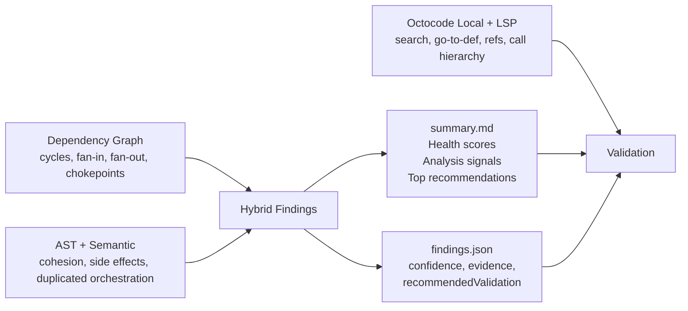

<div align="center">
  

  <h1>Octocode Local Code Quality</h1>

  <p><strong>AI agent skill — AST + semantic code quality scanner for TypeScript/JavaScript</strong></p>
  <p>Architecture · Code Quality · Performance · Security · Dead Code · Test Quality</p>

  [](https://agentskills.io/what-are-skills)
  [](https://github.com/bgauryy/octocode-mcp/blob/main/LICENSE)

</div>

---

## What Is This

An AI agent skill that scans TypeScript/JavaScript codebases for architecture rot, code quality issues, security risks, dead code, performance patterns, and test quality problems.

Unlike `tsc`, ESLint, or tests that check local correctness, this skill answers: **where is the codebase getting weak, risky, or hard to change?**

It combines **dependency graph analysis**, **AST + semantic analysis**, and **Octocode MCP local tool validation** to produce prioritized, evidence-backed findings with `file:line` locations, confidence levels, and suggested fixes.

Just ask your AI agent to review your code quality, audit architecture, find dead code, check security, or any related question — the agent uses this skill automatically.

---

## Setup

### Octocode MCP (recommended)

For full hybrid validation — the agent scans your code with the CLI, then confirms findings with LSP-powered semantic tools — configure Octocode MCP with local tools enabled:

```json
{
  "mcpServers": {
    "octocode": {
      "command": "npx",
      "type": "stdio",
      "args": [
        "octocode-mcp@latest"
      ],
      "env": {
        "ENABLE_LOCAL": "true"
      }
    }
  }
}
```

`ENABLE_LOCAL: true` unlocks local search, file content, directory structure, and LSP tools (go-to-definition, find-references, call-hierarchy) that the agent uses to validate findings against live code before presenting them.

> **Without Octocode MCP**, the skill still works — the agent uses CLI-only mode with structural AST search for validation. Octocode MCP adds semantic precision on top.

---

## What It Detects

**76+ detection categories** across 7 pillars. The agent picks the right ones based on your question.

### Architecture (22 categories)

| Category | What it catches |
|----------|----------------|
| `dependency-cycle` | Circular import chains |
| `dependency-critical-path` | High-weight transitive dependency chains |
| `dependency-test-only` | Production modules imported only from tests |
| `architecture-sdp-violation` | Stable module depends on unstable module |
| `high-coupling` | Excessive afferent + efferent connections |
| `god-module-coupling` | High fan-in (bottleneck) or fan-out (sprawl) |
| `orphan-module` | Zero inbound and zero outbound dependencies |
| `unreachable-module` | Not reachable from any entrypoint |
| `layer-violation` | Import backwards in configured layer order |
| `low-cohesion` | Exports serve unrelated purposes (LCOM > 1) |
| `distance-from-main-sequence` | Module far from ideal abstractness/instability balance |
| `feature-envy` | Module imports 60%+ symbols from single external module |
| `untested-critical-code` | Hot/critical-path file with zero test imports |
| `cycle-cluster` | Strongly connected component large enough to be tangled |
| `broker-module` | Module concentrating graph pressure |
| `bridge-module` | Structural articulation point between subsystems |
| `package-boundary-chatter` | Excessive cross-package dependency edges |
| `startup-risk-hub` | Import-time side effects on high fan-in hub |
| `import-side-effect-risk` | Risky work at import time (sync I/O, exec, eval, timers) |
| `namespace-import` | `import * as X` pulling entire module surface |
| `commonjs-in-esm` | CommonJS `require()` in ESM codebase |
| `export-star-leak` / `mixed-module-format` | Leaking internals via `export *` or mixed CJS/ESM |

With `--semantic`: `over-abstraction`, `concrete-dependency` (DIP violation), `circular-type-dependency`, `shotgun-surgery`.

### Code Quality (21 categories)

| Category | What it catches |
|----------|----------------|
| `duplicate-function-body` | Identical function implementations across files |
| `duplicate-flow-structure` | Repeated control-flow patterns |
| `similar-function-body` | Near-clone functions (renamed vars, different literals) |
| `function-optimization` | High complexity, deep nesting, oversized functions |
| `cognitive-complexity` | Nesting-aware complexity score |
| `god-module` / `god-function` | Files or functions with excessive size |
| `halstead-effort` | Halstead effort or estimated bugs above threshold |
| `low-maintainability` | Maintainability Index below threshold |
| `excessive-parameters` | Function exceeds parameter threshold |
| `unsafe-any` | Excessive `any` types |
| `empty-catch` | Empty catch blocks |
| `switch-no-default` | Switch without default case |
| `type-assertion-escape` | `as any`, `as unknown as T`, non-null `!` assertions |
| `missing-error-boundary` | Async function with awaits but no error handling |
| `promise-misuse` | `async` function that never uses `await` |

With `--semantic`: `unused-parameter`, `deep-override-chain`, `interface-compliance`, `narrowable-type`.

### Performance (5 categories)

| Category | What it catches |
|----------|----------------|
| `await-in-loop` | Sequential async in loops (N+1 latency) |
| `sync-io` | Synchronous I/O calls (`readFileSync`, `execSync`) |
| `uncleared-timer` | `setInterval` without `clearInterval` |
| `listener-leak-risk` | Event listeners without removal |
| `unbounded-collection` | Collection growth in nested loops without size guard |

### Security (9 categories)

| Category | What it catches |
|----------|----------------|
| `hardcoded-secret` | Strings matching secret patterns or high-entropy literals |
| `eval-usage` | `eval()`, `new Function()`, string-based timers |
| `unsafe-html` | `innerHTML`, `dangerouslySetInnerHTML`, `document.write` |
| `sql-injection-risk` | Template literals with SQL keywords and interpolation |
| `unsafe-regex` | Nested quantifiers (ReDoS risk) |
| `prototype-pollution-risk` | Unsafe `Object.assign`, deep merge, computed bracket writes |
| `unvalidated-input-sink` | External input reaching dangerous sinks without validation |
| `path-traversal-risk` | External input flowing into `fs.*` / `path.*` unvalidated |
| `command-injection-risk` | External input flowing into `exec` / `spawn` |

Especially strong for **agentic/MCP repos**: catches prompt-to-path, prompt-to-command, tool boundary leaks, and import-time orchestration risks.

### Dead Code & Hygiene (11 categories)

| Category | What it catches |
|----------|----------------|
| `dead-export` | Exported symbol with no consumers |
| `dead-re-export` | Barrel re-export with no consumers |
| `re-export-duplication` / `re-export-shadowed` | Duplicate or shadowed re-exports |
| `unused-npm-dependency` | package.json dep not imported anywhere |
| `package-boundary-violation` | Cross-package import bypassing public API |
| `barrel-explosion` | Barrel with excessive re-exports or chain depth |

With `--semantic`: `unused-import`, `orphan-implementation`, `move-to-caller`, `semantic-dead-export`.

### Test Quality (8 categories)

| Category | What it catches |
|----------|----------------|
| `low-assertion-density` | Average < 1 assertion per test block |
| `test-no-assertion` | Test block with zero assertions |
| `excessive-mocking` | Too many mocks per test file |
| `shared-mutable-state` | `let`/`var` at describe scope |
| `missing-test-cleanup` | `beforeAll`/`beforeEach` without corresponding teardown |
| `focused-test` | Committed `.only`, `.skip`, or `.todo` |
| `fake-timer-no-restore` | Fake timers without restore |
| `missing-mock-restoration` | Spies/stubs without restore cleanup |

---

## What You Get

The agent produces structured output that helps you decide **what to fix first**:

- **Health scores** per pillar (architecture, code quality, etc.) with letter grades
- **Analysis signals** — the strongest graph signal, strongest AST signal, and combined interpretation
- **Prioritized findings** with severity, confidence, `file:line` evidence, impact explanation, and suggested fixes
- **Dependency graph** visualization (Mermaid)
- **Validation hooks** — each finding includes `lspHints` so the agent can confirm it with Octocode MCP before presenting it as fact

### Smart Output

- **Category-diverse truncation** — capped finding lists represent all detected issue types, not just the noisiest category
- **Chain deduplication** — overlapping dependency-chain findings are merged
- **Computed remediation** — architecture chains point to the most useful break location
- **Architecture heuristics** — signal combinations like `dependency-cycle` + `critical-path` + high `fanIn` are flagged as chokepoint modules

---

## How It Works



1. **Scan** — the agent runs the CLI scanner on your codebase (graph analysis + AST + optional semantic)
2. **Triage** — reads health scores and analysis signals, identifies what matters most
3. **Validate** — uses Octocode MCP local tools to confirm findings against live code
4. **Present** — shows you validated findings with evidence, impact, and suggested fixes
5. **Plan** — asks if you want a prioritized improvement plan, then helps you fix

---

## Performance

| Metric | Value |
|--------|-------|
| Cold scan (400-file monorepo) | ~3s |
| Cold scan + `--semantic` | ~5-8s |
| Cached scan (no changes) | <1s |

Incremental caching stores per-file AST results. Unchanged files are served from cache. Schema version changes auto-invalidate stale caches.

---

## When to Use / When Not

**Use when:**
- A repo feels fragile or slow to change
- You need architecture, maintainability, or security review
- You want to find dead code, unused exports, or dependency hygiene issues
- You want prioritized findings, not a flat list of warnings

**Don't use for:**
- Syntax errors → `tsc`
- Style enforcement → ESLint / Prettier
- Runtime debugging → tests / debugger
- Deep taint analysis / SCA → Semgrep or dedicated security tools

---

## License

MIT License © 2026 Octocode — see [LICENSE](https://github.com/bgauryy/octocode-mcp/blob/main/LICENSE).
