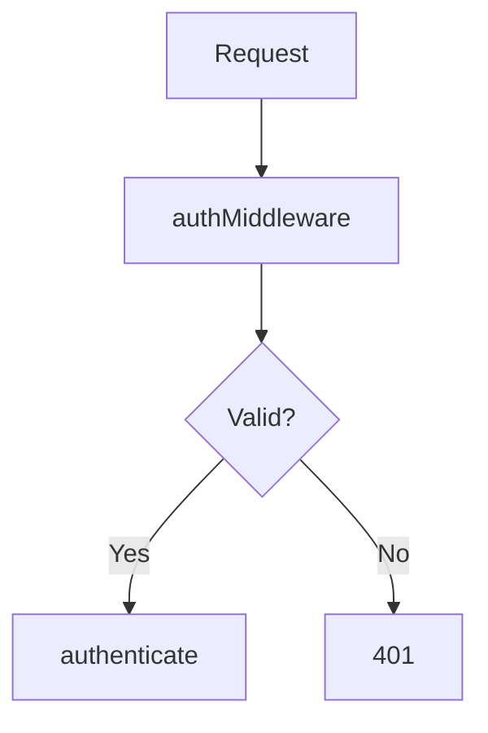
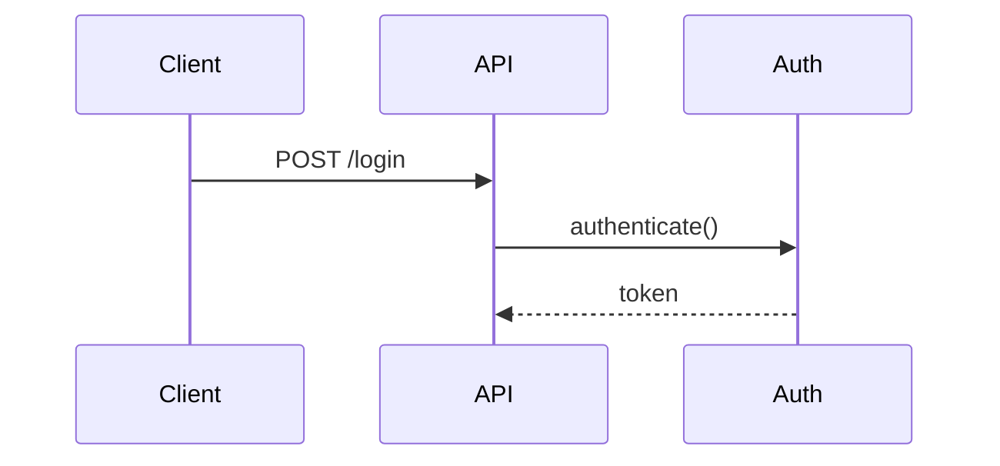

# Octocode Research Skill

HTTP API server for code research at `http://localhost:1987`

> **Local Server**: Runs on user's machine with direct filesystem and LSP access.

---

## ⚠️ CRITICAL: Health Check First

**BEFORE ANY request**, verify server is running:

```bash
# Check health (ALWAYS first!)
curl -s http://localhost:1987/health || echo "NOT_RUNNING"

# Start if needed
cd /path/to/octocode-research && ./install.sh start

# View logs if issues
./install.sh logs
```

**Why**: Server runs locally, may not be started. Connection errors (exit 7) mean server is down.

---

## Endpoints

**Base URL**: `http://localhost:1987`

| Category | Endpoint | Description | Docs |
|----------|----------|-------------|------|
| **Local** | `/local/search` | Search code (ripgrep) | [ref](./references/localSearchCode.md) |
| | `/local/content` | Read file | [ref](./references/localGetFileContent.md) |
| | `/local/structure` | Directory tree | [ref](./references/localViewStructure.md) |
| | `/local/find` | Find by metadata | [ref](./references/localFindFiles.md) |
| **LSP** | `/lsp/definition` | Go to definition | [ref](./references/lspGotoDefinition.md) |
| | `/lsp/references` | Find usages | [ref](./references/lspFindReferences.md) |
| | `/lsp/calls` | Call hierarchy | [ref](./references/lspCallHierarchy.md) |
| **GitHub** | `/github/search` | Search code | [ref](./references/githubSearchCode.md) |
| | `/github/content` | Read file | [ref](./references/githubGetFileContent.md) |
| | `/github/structure` | Repo tree | [ref](./references/githubViewRepoStructure.md) |
| | `/github/repos` | Search repos | [ref](./references/githubSearchRepositories.md) |
| | `/github/prs` | Search PRs | [ref](./references/githubSearchPullRequests.md) |
| **Package** | `/package/search` | npm/PyPI search | [ref](./references/packageSearch.md) |

All tools are **read-only**, **idempotent**, **safe to retry**. GitHub endpoints rate-limited (5000/hr with token).

---

## Decision Tree & Trigger Words

```
Is it LOCAL codebase?
├── YES → /local/* + /lsp/*
│   └── Flow question? → /lsp/calls REQUIRED
└── NO  → /github/* or /package/*
```

| User Says... | REQUIRED Tool | FORBIDDEN |
|--------------|---------------|-----------|
| "flow", "trace", "calls", "chain" | `/lsp/calls` | `/local/content` alone |
| "who uses X", "callers" | `/lsp/calls` (incoming) | search alone |
| "what does X call" | `/lsp/calls` (outgoing) | file reading alone |
| "where is X defined" | `/lsp/definition` | grep alone |
| "show me file Y" | `/local/content` | - |
| "find files named X" | `/local/find` | - |
| "external repo/package" | `/github/*` or `/package/*` | local tools |

**COMMON MISTAKE**: Using `/local/content` to understand flows. File reading shows text. LSP shows semantic relationships.

---

## Research Flows

### Local Flow
```
/local/structure → /local/search → /lsp/calls → /local/content (LAST) → OUTPUT
```

### External Flow
```
/package/search → /github/structure → /github/search → /github/content → OUTPUT
```

**Detailed guides**: [Local](./references/research_local_prompt.md) | [External](./references/research_external_prompt.md)

---

## Critical Rules

| Rule | Why |
|------|-----|
| ⚠️ Health check FIRST | Server may not be running |
| Search → lineHint → LSP | LSP needs accurate line numbers |
| `/lsp/calls` for flow tracing | File reading misses call relationships |
| Parallel calls for speed | 3x faster with concurrent requests |
| Never guess line numbers | Always get lineHint from search |

---

## Research Planning (REQUIRED)

**ALWAYS plan BEFORE making API calls!**

EXAMPLE:

```markdown
## Research Plan
**Main Question**: [User's question]
**Type**: [ ] Local  [ ] External

**Steps**:
1. [ ] Understand structure
2. [ ] Find entry points (search)
3. [ ] Trace relationships (LSP)
4. [ ] Read implementations
5. [ ] Synthesize output

**Deliverables**: Flow diagram, code snippets, summary
```

### Example Breakdown

**Question**: "How does authentication work?"

```
Phase 1: Discovery (Parallel)
  1. [ ] /local/search?pattern=auth|login
  2. [ ] /local/structure?path=/src

Phase 2: Entry Points (Sequential)
  3. [ ] /local/search?pattern=authenticate → get lineHint
  4. [ ] /lsp/definition?symbolName=authenticate&lineHint=N

Phase 3: Flow Tracing (Parallel)
  5. [ ] /lsp/calls?direction=incoming
  6. [ ] /lsp/calls?direction=outgoing

Phase 4: Deep Dive
  7. [ ] /local/content (specific files)

Phase 5: Output
  8. [ ] Create diagram + summary
```

**Track progress**: `[✓]` done, `[→]` in progress, `[ ]` pending

**CRITICAL**: Don't skip to output until ALL steps complete!

### Spawn Agents for Complex Research

**For multi-axis research, spawn parallel agents and use  Task tool**

**When to spawn agents:**
- Research has 3+ independent topics
- Each axis requires its own search → LSP → read flow
- Results can be combined at the end

**Combine results**: After all agents complete, synthesize findings into single output document.

---

## Parallel API Calls

**Make independent calls in parallel for 3x speed!**

```bash
# ✅ GOOD: Parallel
curl "http://localhost:1987/lsp/calls?...&direction=incoming" &
curl "http://localhost:1987/lsp/calls?...&direction=outgoing" &
wait

# ❌ BAD: Sequential when could be parallel
```

**Parallelize**: Multiple files, incoming+outgoing calls, multiple directories
**Don't parallelize**: When next call needs previous result (search → lineHint → LSP)

---

## Response Structure

```json
{
  "success": true,
  "data": "YAML-formatted result",
  "raw": { "content": [...], "isError": false }
}
```

**Status hints**: `hasResultsStatusHints` (next steps) or `emptyStatusHints` (alternatives)

**Validation errors**:
```json
{ "success": false, "error": { "message": "...", "code": "VALIDATION_ERROR" } }
```

**Follow hints**: Each response tells you what to do next!

---

## Required Parameters

All endpoints require:

| Parameter | Purpose |
|-----------|---------|
| `mainResearchGoal` | Overall objective (constant) |
| `researchGoal` | This query's goal |
| `reasoning` | Why this approach helps |

---

## Pre-Action Checkpoints

| Before... | Check... | If NO → |
|-----------|----------|---------|
| ANY API call | Server running? (`/health`) | Start server |
| `/lsp/*` call | Have `lineHint` from search? | Search first |
| `/local/content` | Traced with `/lsp/calls`? | Trace first |
| Concluding | Have 3+ evidence points? | Continue |

---

## Error Recovery

| Error | Recovery |
|-------|----------|
| `Symbol not found` | Re-run `/local/search` for correct lineHint |
| `Empty results` | Try variants (auth→login→credentials) |
| `Too many results` | Add `path`, `type`, `excludeDir` filters |
| `Timeout` | Reduce `depth`, use `matchString` |
| `Connection refused` | Run `./install.sh start` |
| `Rate limited` | Wait or use authenticated token |

**Flow**: Error → Check hints in response → Follow recovery → If blocked, ask user

---

## Output Document (REQUIRED)

**Every research session MUST produce structured output!**

### Template - EXAMPLE (ALL SECTION OPTIONAL - ADD ONLY IF REQUIRED)

```markdown
# Research: [Topic]

## TL;DR
[2-3 sentences answering the question]

## Flow Diagram
[Mermaid diagram]

## 🔍 Findings

### 1. [Title]
**Location**: `path/file.ts:L42-58`

\`\`\`typescript:42:58:path/file.ts
// Key code (max 15 lines)
\`\`\`

**Analysis**: [Why it matters]

## 📚 References
| File | Lines | Purpose |
|------|-------|---------|
| `file.ts` | 42-58 | Main impl |
```

### Mermaid Examples





### Quality Checklist

| Check | Required |
|-------|----------|
| TL;DR | 2-3 sentence answer |
| Flow Diagram | Mermaid (if flow question) |
| Code Snippets | 2-3 with `file:line` refs |
| Analysis | WHY each finding matters |

### Quality Levels

| Level | When |
|-------|------|
| **Quick**: TL;DR + 1 ref | "where is X" |
| **Standard**: + diagram + 3 refs | Most questions |
| **Deep**: Full doc + diagrams | "how does X work" |

**Protocol**: Research → Output → Present → Ask user → Save if requested

---

## Integration Patterns

| Pattern | When |
|---------|------|
| Direct Skill | Simple questions |
| Task + Explore | Complex exploration |
| Parallel Tasks | Multi-axis research |

**Use Claude Code `Task()` tool for complex exploration.**


---

## Logging

Logs: `~/.octocode/logs/`

```bash
tail -50 ~/.octocode/logs/tools.log   # Recent calls
cat ~/.octocode/logs/errors.log       # Errors
```

---

## Quick Example

```bash
# 0. Health check
curl -s http://localhost:1987/health || ./install.sh start

# 1. Search → get lineHint
curl "http://localhost:1987/local/search?pattern=authenticate&path=/project/src"

# 2. Trace flow (parallel)
curl "http://localhost:1987/lsp/calls?...&lineHint=15&direction=incoming" &
curl "http://localhost:1987/lsp/calls?...&lineHint=15&direction=outgoing" &

# 3. Read (after flow understood)
curl "http://localhost:1987/local/content?path=...&startLine=10&endLine=30"

# 4. Output → Present → Save
```

---

## References

| Guide | Purpose |
|-------|---------|
| [research_local_prompt.md](./references/research_local_prompt.md) | Local research |
| [research_external_prompt.md](./references/research_external_prompt.md) | GitHub/package |
| [output_protocol.md](./references/output_protocol.md) | Output format |
