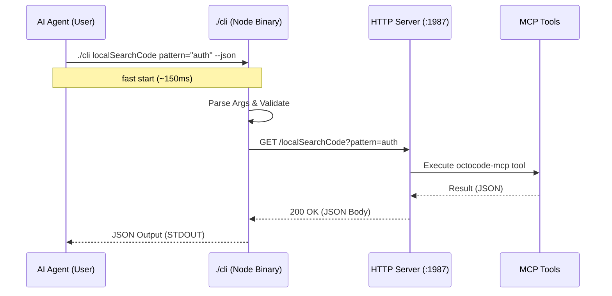

# Octocode Research CLI Architecture

The CLI (`./cli`) provides a high-performance, type-safe bridge between AI Agents and the Research Server.

## Communication Flow



## Why this Architecture?

1.  **Speed**: 
    - `npx` (TS compilation) = ~1.5s startup
    - `./cli` (Compiled JS) = ~0.15s startup
    - **10x Faster** for repetitive agent queries.

2.  **Reliability**:
    - `curl` requires perfect JSON escaping (hard for LLMs).
    - `./cli` accepts standard shell arguments: `key="value with spaces"`.

3.  **Isolation**:
    - The Server maintains state (context, logs).
    - The CLI is stateless and ephemeral.

## Build Process

The CLI is written in TypeScript (`src/cli.ts`) and compiled alongside the server.

1.  **Source**: `src/cli.ts`
2.  **Build**: `tsc` -> `dist/cli.js`
3.  **Wrapper**: `./cli` (Shell script) detects `dist/cli.js` or falls back to `npx tsx` for dev.

## Tool Support

**All 13 MCP tools are accessible via CLI** with full schema support:

```bash
# Direct tool call: ./cli {toolName} param1=value1 param2=value2
./cli localSearchCode pattern="auth" path="/src" type="ts"
./cli githubSearchCode keywordsToSearch="hook" owner="facebook" repo="react"
./cli lspGotoDefinition uri="/src/index.ts" symbolName="main" lineHint=10
```

The CLI translates this to: `GET /{toolName}?param1=value1&param2=value2`

📖 **Full Reference**: See [CLI_TOOL_REFERENCE.md](./CLI_TOOL_REFERENCE.md) for:
- All 13 tools with complete parameter documentation
- Working examples for each tool
- Common workflow patterns
